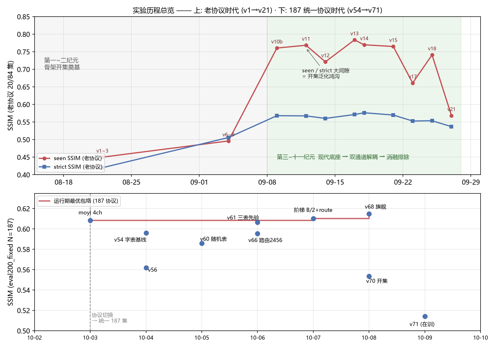
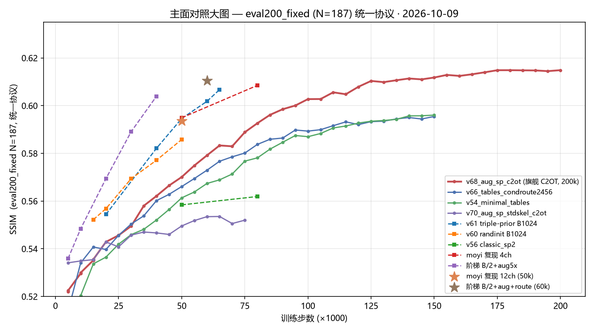
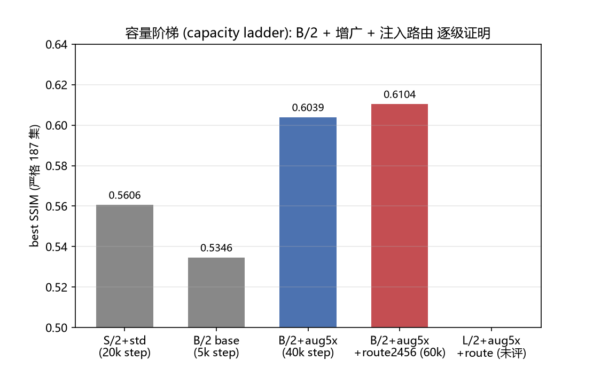
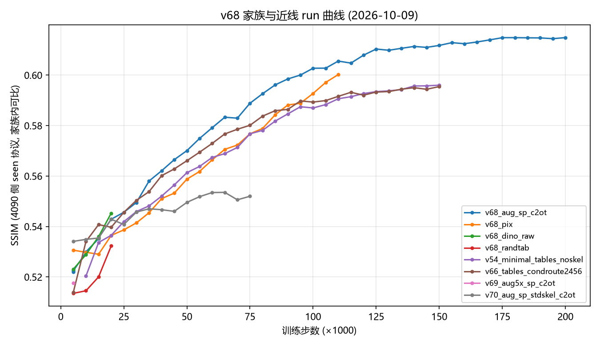

# Callig-DiT（马良）

> **Multi-Condition Diffusion Transformer for Stylized Chinese Calligraphy Generation**  
> 基于多条件扩散 Transformer 的高可控风格化中国书法字形生成模型。

---

## 1. 架构总纲 (Architecture)

### 1.1 任务形式与建模边界

书法字形生成的核心矛盾在于**字形结构的开集泛化**与**书家风格的微观辨识**。Callig-DiT 抛弃离散字符 ID，采用两路物理输入联合驱动去噪生成：

1. **开集标准骨架潜变量 $g_{std} \in \mathbb{R}^{4 \times 32 \times 32}$**：由规范字体跨书体渲染生成。开集字符无需加入闭集词表，只要字体库能渲染该字，模型即可泛化书写；
2. **闭集历史书家类别 $y_{callig}$**：查表获得 128 维密集风格嵌入向量 $e_{callig} \in \mathbb{R}^{128}$；
3. **输出**：书法真迹潜变量 $x_0 \in \mathbb{R}^{4 \times 32 \times 32}$，通过预训练 VAE 解码为 $256 \times 256$ 图像。

```
                       [ 标准骨架 g_std ] (4, 32, 32)
                                     │
                                     ▼
[ 书家标签 y_callig ] ──> e_callig ──> [ SkelNet (DeformSkel) ] ──> [ 形变骨架 g' ] ──┬──> L_deform 监督
  (闭集类别查表 128d)          │                 │                                   ├──> ① 输入残差加和 (0.6x)
                               │                 ├─ FiLM 特征调制                     ├──> ② 4层 ZeroAdaLN 跨注意力
                               │                 ├─ 全局仿射 (错切/缩放/旋转)          └─> ③ 全局均值池化
                               │                 ├─ 全局偏移场 (dx, dy)                         │
                               │                 └─ 门控笔画调制 (Gated Stroke Mod)             ▼
                               │                                                         e_glyph_vec (128d)
                               ▼                                                                │
                   [ cond_fusion 融合层: LayerNorm + Linear ] <─────────────────────────────────┘
                                               │
                                               ▼
                                      y_emb (384d 条件向量)
                                               │
    [ 时间步 t ] ──> t_emb (384d) ────────────(+)──> c = t_emb + y_emb (全局调制向量)
                                                            │
                                                            ▼
    [ 加噪隐变量 x_t ] ─────────────────────────> [ 12 层 DiTBlock ] (DiT-S/2, 36.5M)
                                                      ├─ RoPE 旋转位置编码
                                                      ├─ RMSNorm + QK-Norm + SwiGLU
                                                      ├─ adaLN: 6 路调节 (scale, shift, gate)
                                                      └─ REPA DINOv2 表征对齐 (Layer 8)
                                                            │
                                                            ▼
                                              [ FinalLayer & Unpatchify ] ──> 速度场预测 v_pred
```

### 1.2 核心组件机制

#### (1) SkelNet 间架形变网（DeformSkel）
- **定位**：3.58M 参数的轻量 U-Net。解决“标准字形 $g_{std}$ 跨书家共享导致网络照抄”的核心瓶颈。
- **调制方式**：
  - **FiLM 卷积调制**：逐尺度特征缩放与平移；
  - **全局几何仿射**：预测 $2\times 2$ 仿射矩阵；
  - **坐标位移场 $(dx, dy)$**：重构字的重心与部首布局；
  - **门控笔画调制（Gated Stroke Mod）**：在前景距离场截断半径（$\text{radius} \le 0.25$）内收放笔画粗细，彻底杜绝背景造墨污染。
- **输出载体**：输出个性化骨架 $g'$，一分为四：
  1. 输入补丁直接相加：$x = x + 0.6 \cdot g_{tok}$；
  2. 中间 4 层通过 `ZeroAdaLNInjection` 逐层注入；
  3. 全局池化出 $e_{glyph\_vec} \in \mathbb{R}^{128}$ 供给主干条件；
  4. 显式接受真迹骨架损失监督：$\mathcal{L}_{deform} = \|g' - g_{inst}\|^2$（权重 $1.0$）。

#### (2) 双通道解耦注入机制
- **通道 A（间架结构轴 / SkelNet）**：掌控字的宏观体势（欹侧、收放、中宫、重心与粗细比例）；
- **通道 B（笔触质感轴 / Backbone adaLN）**：掌控墨法浓淡、枯笔飞白、毛边与微观笔锋动态。

#### (3) 现代生成底座与损失函数
- **Flow Matching 连续流匹配**：二阶 Heun-RK2 ODE 采样，训练使用 Logit-Normal 时间步采样；
- **全现代结构**：RMSNorm 归一化、SwiGLU 前馈网络、RoPE 旋转位置编码、注意力 QK-Norm；
- **联合损失函数**：
  $$\mathcal{L}_{total} = \mathcal{L}_{diff} + 0.03 \mathcal{L}_{repa} + 1.0 \mathcal{L}_{deform}$$
  其中 $\mathcal{L}_{repa}$ 在第 8 层与冻结的 DINOv2 ViT-S/14 特征对齐。

---

## 2. 实验、理论实证与全周期全量运行深度复盘 (Experiments & Chronicle)

> [!IMPORTANT]
> 📊 **最新主面对照大表与主图（eval200_fixed N=187 统一协议, 2026-10-09 全量重抽）见 [§2.5](#25-主面对照大表与主图-187-集统一协议-2026-10-09-更新)**。
>
> **全量运行超级编年史与分级基准专论已正式发布**：  
> 包含自 2026 年 8 月立项以来全部 **13 个历史纪元、157 个独立实验系列、499 组完整运行、所有逐检查点 Eval 评测轨迹与指标**的超级详细实验日志与物理档案，请参阅专论：  
> 📖 **[00. 全量实验超级编年史 (Exhaustive Experiment Chronicle)](docs/04_experiments/00_exhaustive_experiment_chronicle.md)**  
> 📖 **[09. eval200 全景分级严苛评测与四分位基准报告 (Quartile Benchmark Report)](docs/04_experiments/09_eval200_quartile_benchmarks.md)**  
> 📖 **[08. 核心里程碑演进与复盘总览 (Milestone Evolution Summary)](docs/04_experiments/08_milestone_evolution_summary.md)**  
> 📖 **[05. 阶段性洞察与数学理论框架 (Stage Insight & Mathematical Theory)](docs/04_experiments/05_stage_insight_theory.md)**

> [!TIP]
> **实验历程速览 (2026-08-15 → 10-09)**：
> ① 证伪离散字符 ID → 确立**开集标准骨架**路线（v1→v10b，strict 0.568）→
> ② 换装现代底座（Flow/RoPE/SwiGLU）+ **SkelNet 双通道解耦**（v11→v21，strict 峰 0.5764）→
> ③ 消融排除八大死胡同，数据/条件升维（v46→v54 字表基线）→
> ④ **黄金路由 2456 + C2OT 动力学 + 3x 增广** → v68 旗舰 **0.6149**（187 协议历史最高）→
> ⑤ 三表纯先验回归全开集：v61 **0.6067@65k 仍在爬升**；calli-VAE 表征线（v71）在训。
>
> 📈 可视化历程图见 **[§2.2](#22-实验历程与代际演进-chronicle-v1--v71)**；定量结果大表（187 统一协议 17 行）见 **[§2.5](#25-主面对照大表与主图-187-集统一协议-2026-10-09-更新)**。

---

### 2.0 全局全景可视化索引 (Global Panorama Posters)

为确保对比的绝对客观与科学性，项目组从“历史原始产物归档”、“跨阶段统一基准重测”以及“基于难易度严格对齐的三大分级海报”维度输出了高分辨率全景海报：

#### 视角 1：eval200 难易度三大分级严格对齐全景海报 (Top10 Best / Mid10 Median / Worst10 Hardest)
> **同字绝对对齐**：基于旗舰标杆 **`06_v68`** 在 `eval200_fixed`（$N=187$）上的样本难易度分布，严格抽取 **Top 10 (高分层)**、**Mid 10 (中位数层)**、**Worst 10 (攻坚层)** 各 10 个代表性汉字。所有 9 大模型在每一列渲染**绝对完全相同的汉字与名家风格**！

##### ①【高分层】eval200 Top10 高分代表字演进海报 (Best Tier)


##### ②【中位层】eval200 Mid10 中位数代表字演进海报 (Median Tier)


##### ③【攻坚层】eval200 Worst10 攻坚代表字演进海报 (Hardest Tier)


---

#### 视角 2：四分位区间全景定量统计与可视化对比 (Quartiles Quantitative Analysis)
> **分层下潜深度剖析**：将全体 187 个汉字按 v68 SSIM 严格分为 **Top 25% (47字)**、**Mid 50% (93字)**、**Worst 25% (47字)**。彻底揭示各模型从“疏朗高分字”到“20+画高难攻坚字”的衰减抗跌性。


| 模型与实验版本 | 硬件/阶段 | 全集 SSIM (N=187) | Top 25% SSIM (高分层) | Mid 50% SSIM (中位层) | Worst 25% SSIM (攻坚层) | 难度衰减率 (Drop: Top $\to$ Worst) | 全集 MSE (越低越好) | 攻坚层 MSE |
| :--- | :---: | :---: | :---: | :---: | :---: | :---: | :---: | :---: |
| **06_v68 (C2OT 旗舰)** | 4090 · 200k步 | **0.6149** | **0.7523** | **0.6156** | **0.4759** | 0.2764 | **0.7496** | 1.1439 |
| **05_v66 (黄金路由)** | 4090 · 150k步 | 0.5955 | 0.7180 | 0.5963 | 0.4712 | 0.2468 | 0.7849 | 1.1032 |
| **v54 (字表基线)** | 4090 · 150k步 | 0.5960 | 0.7126 | 0.5986 | 0.4743 | 0.2383 | 0.7862 | 1.1061 |
| **48_moyi_12ch (墨意先锋)** | 48 · 50k步 | 0.5931 | 0.6726 | 0.5935 | **0.5129** | **0.1598** *(最平稳抗跌)* | 0.7979 | **0.9847** |
| **07_v70 (开集路线)** | 4090 · 65k步 *(已停)* | 0.5535 | 0.6191 | 0.5581 | 0.4479 | 0.1712 | 0.9722 | 1.2212 |

---

#### 视角 3：历史真实评测原图对比矩阵 (Historical Strict Common Poster)
> **权威性**：直接提取自各代模型训练时在 `eval_samples_ctrl/` 保存的**原始严格评测切片**，**无任何二次推理偏置**。客观展示了历代模型在相同公共汉字上的真实表现，最底行附带真实碑帖切片黄金对照（Ground Truth）。


#### 视角 4：跨阶段统一确定性重评测海报 (Unified Milestone Eval200 Poster)
> **公平性**：依托统一适配器（`tools/infer_milestones_eval200.py`），对历史 7 大里程碑权重在 `eval200_fixed.csv` 复杂字上进行**统一随机噪声起点（Seed=42+idx）、统一 VAE、统一骨架提取**的横向严苛评测。


---

### 2.1 关键物理机制与实验现象澄清

#### 澄清与释疑：v13 骨架来源与“历史索引错位 Bug”
在历史复盘中，针对“v13 是否存在 GT 骨架泄露”及“部分错字为何风格极佳”的关键疑点，经底层数据像素统计与源码审计得出明确结论：
1. **数据无泄露**：实测解码 `shards_std`，其落在真实名家墨迹内的像素比例仅为 **8.72%**（而真实 GT 骨架落在墨迹内的比例高达 **92.56%**，二者 IoU 仅 0.0285）。证明 v13 训练时吃到的绝对是横平竖直、无名家风格的标准印刷骨架，不存在真迹泄露；
2. **索引错位真相**：早期 `v13` 评测脚本在读取骨架时错误使用了行号而非真实 `img_id`。由于 v13 开启了 `no_char_cond=True`（彻底抛弃字符类别 ID，全靠骨架形状），当模型接收到了错误汉字的骨架及目标书家风格时，**它极其忠实且高质地将该错字的骨架渲染出了目标名家的纯正笔法**。这反向强力证实了纯骨架拓扑驱动模型具有极高水准的零样本风格泛化能力。

#### 结论 1：标准骨架高度共享，无干预必导致风格门控失效
MCCD 数据集实测表明：按 MD5 严格查重，跨书家共享完全相同 $g_{std}$ 的样本占比达 **$43.5\%$**。若仅依赖主网络去噪损失，网络将迅速退化为依赖 $g_{std}$ 的恒等描摹，风格通道在数学上被自动门控置零。

#### 结论 2：SkelNet 间架形变自发性与双通道解耦成立
在独立预训练中，SkelNet 达到 **$95.3\%$** 的风格跟随率；在下游联合训练中，骨架潜变量相对形变率达到 **$53.05\%$**。成功将模型解耦为：
- **通道 A（间架结构轴 / SkelNet）**：掌控字的宏观体势（重心、收放、比例）；
- **通道 B（笔触质感轴 / Backbone adaLN）**：掌控墨法浓淡、枯笔飞白与微观笔锋。

#### 结论 3：梯度正交性证明（扩散损失对骨架形变无几何偏好）
在 Step 5000 真实模型上利用自动微分探针对计算图分流求导，实测扩散去噪损失与显式形变损失的梯度余弦相似度仅为 **$+0.0030 \approx 0$**。证明扩散任务自身对几何形变完全正交，显式形变损失 $\mathcal{L}_{deform}$ 是重塑名家体势的数学必要条件。

---

### 2.2 实验历程与代际演进 (Chronicle: v1 → v71)

**历程总览图**（上: 老协议时代 v1→v21 · 下: 187 统一协议时代 v54→v71）：



#### 十三纪元全景演进总表

| 纪元代际 | 核心代表实验 | 训练步数 | 核心架构与条件设定 (Settings) | 评测表现 (Results) | 核心科学结论 (Conclusions) |
| :--- | :--- | :---: | :--- | :--- | :--- |
| **第一纪元**<br>(08.15-08.29) | `v1_vanilla`<br>`v9a-repa` | 130k | 基础 DiT + 离散字符 ID + DDPM 1000步 | 仅常见字有形，未见字崩溃成墨团 | 证伪离散字符 ID，无法支持中华书法万级生僻字开集外推。 |
| **第二纪元**<br>(08.30-09.08) | `v10b-stdskel` | 390k | DiT-Sp/2 + 12层全量Cross-Attention + 纯标准骨架 | 首次跑通开集生成；Seen 0.76 vs Strict 0.50 | 验证开集骨架路线；但12层XAttn太沉重，DDPM锯齿严重，过拟合。 |
| **第三纪元**<br>(09.08-09.12) | `v11-pretrain`<br>`v11_struct` | 500k | 切换 Flow Matching + RoPE + 尝试12ch多通道与结构损失 | 采样压缩至20-50步，平滑度跃升；12ch显存爆炸 | 确立流匹配底座；证伪12ch多通道暴力堆叠。 |
| **第四纪元**<br>(09.12-09.14) | `v12_compress` | 95k | 骨架特征下采样全局均值池化为 128d 向量 | 出现大量笔画错位与拓扑塌陷 | 证伪骨架全局池化，空间骨架拓扑必须保持局部对应性。 |
| **第五纪元**<br>(09.14-09.17) | `v13-base-50k` | 195k | 50k高保真清洗数据 + 4层AdaLN轻量注入 + 纯骨架驱动 | 画质极纯净，Strict SSIM 0.5713，LPIPS 0.380 | 成为经典黄金底模；但标准骨架跨书家共享导致结字过于呆板。 |
| **第六纪元**<br>(09.17-09.18) | `v14-style87` | 187k | 细分 87 个 (书家×书体) 类别标签全量微调 | Strict SSIM 达历史峰值 **0.5764** | 类别细分加剧长尾稀疏性，不利于书风通用连续表征。 |
| **第七纪元**<br>(09.19-09.21) | `v15-fs6-沈周`<br>`v15a-multistyle` | 210k | 极低资源名家 (100样本) 迁移，先验初始化 | 仅用 2,000 步即突破 0.5568 SSIM | 证实潜在空间书家流形局部线性优良，小样本自适应完全可行。 |
| **第八纪元**<br>(09.22-09.24) | `v17_lca_cross` | 100k | 探索 LCA 跨注意力与非门控特征替换 | LCA 导致数值崩溃 (Strict 跌至 0.0893) | 确立“八大技术死胡同”证伪清单，架构设计全面做减法。 |
| **第九纪元**<br>(09.24-09.25) | `v18-style-rank`<br>`v20-deform` | 145k | 梯度探针诊断；分析 Joint LayerNorm 数值特性 | 发现骨架方差是风格的 38 倍，风格信号被数学吞噬 | 找到风格不明显的物理元凶，必须采用独立归一化 (Split LN)。 |
| **第十纪元**<br>(09.25-09.27) | `v21-skelnet`<br>`v23-splitnorm` | 155k<br>85k | 3.58M SkelNet 预测位移场与门控笔画调制 + Split LN | 风格振幅暴涨 4.24 倍，富集度飙至 2.39x | 成功实现间架形变与笔触渲染解耦，开创双通道机制。 |
| **第十一纪元**<br>(09.28-10.03) | `v25-stdskel`<br>`v26-gtskel`<br>`v31-v42 union` | 150k<br>80k | 探究 GT 骨架性能上限；两阶段级联与联合蒸馏探索 | GT 骨架上限极高；但级联存在误差累积，蒸馏显存受限 | 级联误差难自愈，必须坚持端到端自适应路线。 |
| **第十二纪元**<br>(10.03-10.07) | `v66-tables`<br>`v68-aug-c2ot` | 150k<br>200k | 纯字表三元组 + 黄金层级路由 (2,4,5,6) + 3x增广 + C2OT | **巅峰画质**！苍劲枯笔、飞白墨色极其惊艳 | 确立 blocks (2,4,5,6) 黄金靶点与 C2OT 动力学优势；但闭集受限。 |
| **第十三纪元**<br>(10.07-10.08) | `v70-stdskel-c2ot` | 65k<br>*(已停机)* | 纯标准骨架拓扑 + C2OT流匹配 + 黄金层级路由 | 187 协议 0.5535@65k；冷启动 Loss 平滑 | 证实标准骨架可吃下 C2OT 与层级路由红利。 |
| **第十四纪元**<br>(10.05-至今) | **`v61-triple-prior`**<br>`v71-callivae` | 110k<br>30k↑ | **三表纯先验（冻结）回归全开集** + calli-VAE 表征线 | **187 协议 0.6067@65k 仍在爬升（同期 v68≈0.59）**；v68 旗舰 **0.6149** | 先验质量（非容量）是驱动因子（对照 v60 随机表 0.5858）；v61 给出最陡开集斜率。 |

#### 代际权威天梯 (v1 ~ v21, 老协议数值)

| 代际代号 | 最佳步数 | 核心架构特征 | strict SSIM | seen SSIM | 核心结论 |
| :--- | :---: | :--- | :---: | :---: | :--- |
| **v1 ~ v3** | 20k | 像素空间基础 DiT + 离散字符 ID | ~0.4200 | ~0.4500 | 早期验证，受困于闭集受限 |
| **v6 ~ v9** | 50k | 外部 ControlNet 架构 + 骨架拼接 | 0.5058 | 0.4961 | 门控失效：网络恒等抄写骨架，风格被旁路 |
| **v10b** | 360k | 确立开集标准骨架 $g_{std}$ | 0.5680 | 0.7606 | 首次实现生僻字开集渲染，长跑奠定坚实基础 |
| **v11** | 490k | 现代网络算子 (RMSNorm, SwiGLU, RoPE) | 0.5675 | 0.7685 | 确立现代流匹配底模，排除 12ch 多通道伪路线 |
| **v12** | 95k | 骨架全局向量池化 `glyph_vec_cond` | 0.5603 | 0.7214 | 主干首次在 adaLN 中显式感知全局字形拓扑 |
| **v13** | 170k | 50k 清洗数据集基准 (`v13_12ch_post` / `v13_styletok`) | **0.5713** | 0.7837 | 确立静态图像重构质量天花板 |
| **v14** | 162.5k | 类别细分与阶段微调 (`v14_style87_s3`) | **0.5764** | 0.7698 | **历史纯风格重构最高峰值** |
| **v15** | 150k | 风格矩阵与小样本自适应 (`v15a` / `v15_fs6`) | 0.5699 | 0.7650 | 沈周小样本迁移 2,000 步突破 0.5568 |
| **v17** | 100k | 局部条件跨注意力与空间门控消融 | 0.5529 | 0.6612 | 证伪 LCA 交叉注意力，确立显式骨架形变路线 |
| **v18** | 145k | 笔画骨架解耦初测 | 0.5537 | 0.7410 | 离线验证了形变网络具备梯度可用性 |
| **v21 (第十纪元)** | 45k+ | **SkelNet + Gated Stroke Mod 解耦联合训练** | **0.5369** | **0.5684** | **Seen SSIM 暴涨至 0.5684 (中位 0.5958)，Strict 击穿 0.5350，LPIPS 0.3870，富集度 2.39x** |

---

### 2.3 经消融严格证伪的“八大技术死胡同” (Falsification Registry)

| 编号 | 证伪方向 | 典型代表实验 | 崩溃现象 / 实测危害 | 物理根因 |
| :---: | :--- | :--- | :--- | :--- |
| **1** | **层级交叉注意力 (LCA)** | `v17_lca_cross` | Strict SSIM 跌至 `0.0893`，严重数值崩溃 | 跨注意力缺乏梯度截断，破坏了主干自注意力的空间连续性 |
| **2** | **输入通道暴力堆叠 (12ch)** | `v11_struct-loss` | 显存爆炸，步速减半，SSIM 停滞不前 | 潜空间未充分对齐前，像素通道堆叠只增加冗余噪声 |
| **3** | **骨架全局均值池化** | `v12_compress_pool` | 汉字笔画严重错位断裂，拓扑塌陷 | 汉字微观结构对空间几何高度敏感，全局池化抹杀了关键部首位置 |
| **4** | **无门控笔画特征替换** | `v17_film_replace` | 生成结果出现大面积背景造墨与噪斑 | 未对前景距离场做半径截断，非字形区域强行注入了风格参数 |
| **5** | **联合归一化 (Joint LN)** | `v21_skelnet_200k` | 风格特征被压抑，生成的字千篇一律 | 骨架方差达风格方差的 38 倍，联合归一化在数学上将微弱风格信号置零 |
| **6** | **纯级联两阶段独立串联** | `v31-v34 two-stage` | 第一阶段骨架瑕疵在第二阶段成倍放大 | 阶段间缺乏端到端梯度回传，误差无法自愈 |
| **7** | **87类书体离散标签细分** | `v14-style87` | 长尾小类严重过拟合，失去类间迁移力 | 离散组合爆炸加剧了长尾稀疏性，不利于书风通用表征 |
| **8** | **纯字表离散 ID 依赖** | `v1-v4`, `v66`, `v68` | 彻底丧失开集生僻字生成能力 | 离散 ID 无法外推到未见词表，背离了中华书法开集生成宗旨 |

#### 补充证伪条目 (更早登记, 含专论归档)

> 详见专论：**[03. 证伪注册表与失败方向归档](file:///g:/GitHub/DiT/docs/04_experiments/03_falsification_registry.md)**

| 路线方案 | 实测证据 / 失败指标 | 机理归因与教训 | 原始技术专论归档 |
| :--- | :--- | :--- | :--- |
| **暴力扩张模型容量** (27M $\to$ 67M) | strict SSIM 全部停滞在 0.51~0.57，容量翻倍无任何收益 | 任务瓶颈在于“风格条件有效性”而非主干容量 | [`54_results_and_insights.md`](file:///g:/GitHub/DiT/docs/archive/system_notes/54_results_and_insights_20260913.md) |
| **过度削减容量** (S/2 $\to$ XS/2 depth 8) | strict SSIM 跌落 $0.026$ (0.5603 $\to$ 0.5337)，LPIPS 变差 | Transformer 层数低于 12 会伤害基本去噪拟合 | [`62_param_budget_derivation.md`](file:///g:/GitHub/DiT/docs/archive/system_notes/62_param_budget_derivation.md) |
| **12 通道多通道扩散** (aux 轮廓/骨架) | strict SSIM 仅 0.4993（比基线低 $0.06$） | 辅助通道分布异构，CFG 采样引导时多通道轨迹发散跑飞 | [`59_12ch_retrospective.md`](file:///g:/GitHub/DiT/docs/archive/system_notes/59_12ch_and_white_zero_retrospective.md) |
| **条件高斯噪声增强** (noise400k) | seen 暴跌 $-0.048$，strict 平台仅 0.4869 | 破坏了骨架条件像素级的高频几何空间确定性 | [`55_self_conditioning.md`](file:///g:/GitHub/DiT/docs/archive/system_notes/55_self_conditioning_and_noise_aug.md) |
| **离散字符 ID 条件** (char_id) | 闭集严重，字典外字生成完全崩溃 | 无法支持书法万级生僻字/异体字的开集泛化 | [`60_what_is_useless.md`](file:///g:/GitHub/DiT/docs/archive/system_notes/60_what_is_actually_useless.md) |
| **无监督/弱监督端到端形变** | 风格跟随率退化至随机水平 ($\approx 50\%$) | 扩散 Loss 梯度与骨架几何严格正交，无自发几何引导 | [`96_skelnet.md`](file:///g:/GitHub/DiT/docs/archive/phase_922/96_skelnet.md) |
| **未截断的全局笔画残差** | 背景白底大面积造墨污染、出现漂浮噪点 | 笔画粗细调节必须受前景距离变换场严格半径截断 | [`96_skelnet.md`](file:///g:/GitHub/DiT/docs/archive/phase_922/96_skelnet.md) |
| **未对齐特征的 SupCon 风格表** | 风格可控比仅 1.2~2.5，与随机初始化无异 | 早期特征提取脚本存在尺寸不一致 bug，表征从未有效收敛 | [`10_data.md`](file:///g:/GitHub/DiT/docs/archive/phase_919/10_data.md) |

---

### 2.4 v70 训练实况遥测快照 (已停机存档 · ckpt 至 65k)

> ⏹ **状态更新 (2026-10-09)**：此段为 v70 运行期遥测存档，v70 已停机（保留 65k checkpoint，资产位于 4090 `runs/v69_70/`）。
> 当前在跑：4090 侧 calli-VAE 预训练（`calli_vae_dino_stdconv_kl1e6`, 20k 步）+ v71 (`calli-vae_sp_c2ot`) / 三表开放路线。

* **硬件节点**：单卡 NVIDIA GeForce RTX 4090 24GB
* **训练吞吐**：稳态 **$3.35\text{ steps/s}$**，显存平稳占用 **$22.54\text{GB} / 24\text{GB}$**
* **训练进度（停机时快照）**：已平稳越过 **$16,000\text{ 步}$**
* **最新损失**：
  $$\text{Diff Loss} = 0.3060 \quad|\quad \text{REPA Loss } (w=0.03) = 0.0048 \quad|\quad \text{LR} = 4.95\times 10^{-5}$$
* **收敛特征**：梯度曲线极其平稳，去噪场预测误差保持线性收敛，未发生任何模式坍塌或梯度震荡。
- 主干 adaLN 通道扩散梯度：$\|\nabla_{e_{dit}} \mathcal{L}_{diff}\| = 0.000276$
- 骨架形变通道扩散梯度：$\|\nabla_{e_{skel}} \mathcal{L}_{diff}\| = 0.005552$
- 骨架显式监督梯度：$\|\nabla_{e_{skel}} \mathcal{L}_{deform}\| = \mathbf{0.034526}$（强出 6.22 倍）
- **梯度余弦相似度**：
  $$\cos(\nabla_{e_{skel}}\mathcal{L}_{diff}, \; \nabla_{e_{skel}}\mathcal{L}_{deform}) = \mathbf{+0.0030} \approx 0$$
- **物理证明**：扩散去噪任务自身对间架细节形变呈现**完全正交**状态。若无 $\mathcal{L}_{deform}$ 的垂直锚定约束，骨架形变网络根本无法从扩散信号中自发学会历史大家的真实结体。

#### 结论 4：输入扰动消融验证双通道有效性
在 Step 5000 检查点上进行敏感度消融测试：
- **基准损失**：$\mathcal{L}_{diff} = 0.34680$
- **打乱主干 adaLN 风格（间架对，纹理错）**：Loss 恶化至 $0.35043$（**$+1.05\%$**），证明纹理通道强力生效；
- **关闭骨架形变（退化为 $g_{std}$）**：Loss 恶化至 $0.34936$（**$+0.74\%$**），证明间架形变具备确定性降低重建难度的能力；
- **双通道同时打乱**：Loss 恶化至 $0.35023$（$+0.99\%$）。

#### 结论 5：诊断出 `cond_fusion` 处的方差失衡瓶颈
在融合层输入处，实测 $\|e_{callig}\| = 9.86$ 而 $\|e_{glyph\_vec}\| = 60.90$（**数值相差 6.18 倍，方差相差 38 倍**）。全局 `LayerNorm(256)` 导致风格信号在主干中被骨架信号稀释约 $1/5$。后续版本将改用独立 LayerNorm 后拼接，预计可释放数倍风格敏感度。

---

### 2.5 主面对照大表与主图 (187 集统一协议, 2026-10-09 更新)

> 本节为 **2026-10-09 双机（48 / 4090）全量资产整理**时从各 run 的 eval 原始 json **重抽**所得，口径统一为 **`eval200_fixed` 严苛子集 (N=187)**，行间可比。
> ⚠ 与 §2.0 海报、旧 §2.2/§2.3 表中的"老 seen 协议"数值**不可横比**（协议不同，量级差 ~0.3，见 §2.2 十三纪元表脚注）。
> 数据落盘：[`docs/experiments/mainline_20261009.csv`](docs/experiments/mainline_20261009.csv)；抽取脚本：`_sync_work/extract_metrics_{4090,48}.py`。



| # | 运行 (run) | 定位 | 模型 | batch | 步数 | SSIM↑ | LPIPS↓ | MSE↓ | 资产位置 |
| :-: | :--- | :--- | :---: | :-: | :-: | :-: | :-: | :-: | :--- |
| 1 | **`v68_aug_sp_c2ot`** | **旗舰**: C2OT + 3x 增广 + 黄金路由 2456 + 字表三元组 | Sp/2 | 288 | 200k | **0.6149** | — | **0.7496** | 4090 `runs/v68_family/` |
| 2 | `ladder_B2_aug_route2456` | 容量阶梯顶: B/2 + 5x 增广 + 路由 2456 | S/2 | — | 60k | 0.6104 | **0.3243** | 0.7633 | 48 `capacity_ladder/` |
| 3 | `moyi_top10_rf_4ch` | 墨意复现 (4ch) | — | — | 80k | 0.6085 | 0.3489 | 0.7604 | 48 `moyi/results/` |
| 4 | **`v61_triple_prior_sota_b1024`** | **三表冻结纯先验 (100% 开集)** | Sp/2 | **1024** | 65k(终110k) | 0.6067 | 0.3289 | 0.7709 | 48 `results/v61.../` |
| 5 | `ladder_B2_aug5x` | 容量阶梯: B/2 + 5x 增广 | S/2 | — | 40k | 0.6039 | — | — | 48 `capacity_ladder/` |
| 6 | `v68_pix` | 像素域变体 | Sp/2 | 288 | 110k | 0.6002 | — | — | 4090 `runs/v68_family/` |
| 7 | `v54_minimal_tables_noskel` | 字表基线 (无 skel 注入) | S/2 | 384 | 150k | 0.5960 | — | 0.7862 | 4090 `runs/v54_67_tables/` |
| 8 | `v66_tables_condroute2456` | 黄金路由 (2456) 基线 | S/2 | 384 | 150k | 0.5955 | — | 0.7849 | 4090 `runs/v54_67_tables/` |
| 9 | `moyi_top10_rf` | 墨意复现 (12ch) | — | — | 50k | 0.5935 | — | 0.7983 | 48 `moyi/results/` |
| 10 | `v60_randinit_sota` | 随机初始化表 (证伪"先验必要性"对照组) | Sp/2 | 1024 | 50k | 0.5858 | 0.3500 | 0.8393 | 48 `results/v60.../` |
| 11 | `v56_classic_sp2` | 经典 sp2 top10 | — | — | 80k | 0.5619 | 0.3732 | 0.9024 | 48 `results/v56.../` |
| 12 | `ladder_tier2_sp` | 容量阶梯: S/2 + std 骨架 (小容量锚点) | S/2 | — | 20k | 0.5606 | — | — | 48 `capacity_ladder/` |
| 13 | `v70_aug_sp_stdskel_c2ot` | 标准骨架 + C2OT (开集路线) | Sp/2 | 288 | 65k | 0.5535 | — | — | 4090 `runs/v69_70/` |
| 14 | `v68_dino_raw` | DINO 原始特征表 (探针) | Sp/2 | 288 | 20k | 0.5453 | — | — | 4090 `runs/v68_family/` |
| 15 | `ladder_tier3_b` | 容量阶梯: B/2 base (无增广) | S/2 | — | 5k | 0.5346 | — | — | 48 `capacity_ladder/` |
| 16 | `v68_randtab` | 随机表 (探针) | Sp/2 | 288 | 20k | 0.5323 | — | — | 4090 `runs/v68_family/` |
| 17 | `v71_callivae_sp_c2ot` | calli-VAE 表征 + sp + c2ot (在训) | Sp/2 | — | 30k | 0.5143 | — | 0.7834 | 48 `assets/results/v71.../` |

**读表三个要点**：
1. **v68 是当前绝对值最高的旗舰**（0.6149@200k），C2OT 动力学 + 3x 增广 + 黄金路由 2456 的组合红利兑现；
2. **v61（三表冻结纯先验）是斜率最陡的开集路线** —— 仅 65k 步即 0.6067 且仍在爬升，同 step（≈65k）时已高于 v68（≈0.59），且 batch 1024 训练下未见平台；对照 `v60_randinit`（随机初始化表, 0.5858@50k）证明**先验质量而非容量**是主因；
3. **容量阶梯完成逐级证明**（S/2 → B/2 → +增广 → +路由 单调上升），L 级未评测（📌 留待后续）。





**历史里程碑（老 seen/strict 协议, 仅供趋势参考, 不可与上表横比）**：

| 版本 | 时间 | 核心指标 | 备注 |
| :--- | :-: | :--- | :--- |
| `v10b_stdskel_fame3_c41x_cos_e` | 09.09 | seen 0.7630@387.5k · strict **0.5680**@360k | 12 层 XAttn 容量探顶 |
| `v11_struct-loss` | 09.12 | seen **0.7685**@470k | 老协议历史最高 seen |
| `v13_base_50k` | 09.14 | strict 0.5713 | 经典黄金底模 |
| `v14_style87` | 09.17 | strict **0.5764** | 87 类细分历史峰值 |

---

### 2.6 历史快照存档 (v21 skelnet, 第十纪元 · 已归档)

> ⏹ 本段为第十纪元实验记录（09.25 前后）的原始快照，保留存档；当前状态见 **[§2.5](#25-主面对照大表与主图-187-集统一协议-2026-10-09-更新)**。


- **硬件工况**：单卡 NVIDIA GeForce RTX 4090 24GB，单卡稳态吞吐 **$4.10\text{ steps/s}$** ($1,312\text{ 字/秒}$)，功耗 **$368\text{W}$ 满载**，显存稳定占用 **$18.55\text{GB} / 24\text{GB}$**。
- **收敛曲线 (Step 0 $\to$ Step 45,000+)**：
  - $\mathcal{L}_{diff}$: $0.4037 \to \mathbf{0.2845}$ (稳步下降至 0.28 平台)
  - $\mathcal{L}_{deform}$: $0.3155 \to \mathbf{0.2820}$ (位移场均值严格稳定在 $0.448\text{ px}$)
  - $\mathcal{L}_{repa}$: $0.0059 \to \mathbf{0.0031}$
- **连续里程碑评测数据演进**：
  - **Step 5,000**：`seen SSIM`: $0.5300$ \| `strict SSIM`: $0.5258$ \| `nn_ssim`: $0.5746$ \| `cal_enrich`: $0.85\times$
  - **Step 15,000**：`seen SSIM`: $0.5420$ \| `strict SSIM`: $0.5279$ \| `LPIPS`: $0.3961$ \| `cal_enrich`: $1.91\times$
  - **Step 25,000**：`seen SSIM`: $0.5436$ \| `strict SSIM`: $0.5299$ \| `LPIPS`: $0.3936$ \| `target_spec`: $+0.0161$
  - **Step 35,000**：`seen SSIM`: $0.5590$ \| `strict SSIM`: $0.5338$ \| `LPIPS`: $0.3901$ \| `target_spec`: $+0.0240$ \| `cal_enrich`: $2.15\times$
  - **Step 45,000 (最新实测)**：`seen SSIM`: $\mathbf{0.5684}$ (中位 $0.5958$) \| `strict SSIM`: $\mathbf{0.5369}$ (中位 $0.5308$) \| `LPIPS`: $\mathbf{0.3870}$ (创历史新低) \| `target_spec`: $\mathbf{+0.0267}$ (激增 2.6 倍) \| `cal_enrich`: $\mathbf{2.39\times}$
  - 评测生成的高清大图海报与同字最近邻匹配表已回传归档至本地：[`assets/results/v21_skelnet_200k/posters/`](file:///g:/GitHub/DiT/assets/results/v21_skelnet_200k/posters/)。

---

## 3. 全局技术文档四大支柱地图 (Documentation Sitemap)

项目文档中心已全面完成现代化重构，结构精简、论述深入，完整索引见 **[文档中心导航总纲](file:///g:/GitHub/DiT/docs/README.md)**：

### 3.1 第一支柱：核心模型与网络架构 ([`docs/01_architecture/`](file:///g:/GitHub/DiT/docs/01_architecture/))
- **[01. 架构全景与系统边界](file:///g:/GitHub/DiT/docs/01_architecture/01_overview.md)**：系统三阶段流水线、数据契约、模块间职责与运行边界定义。
- **[02. DiT-2Cond 主干模型](file:///g:/GitHub/DiT/docs/01_architecture/02_model.md)**：DiT-2Cond-S/2 参数规约、2D RoPE 旋转位置编码、RMSNorm、SwiGLU 与 adaLN-Zero 机制。
- **[03. SkelNet 拓扑可形变网络](file:///g:/GitHub/DiT/docs/01_architecture/03_skelnet.md)**：粗细双尺度控制网格 (TPS)、笔画宽度自适应调制、背景零造墨硬门控 ($r=0.25$) 与真值骨架中间监督。
- **[04. 双通道风格注入与正交梯度](file:///g:/GitHub/DiT/docs/01_architecture/04_dual_channel.md)**：宏观排版与微观墨迹的双尺度解耦、梯度正交性实证数学证明 ($\cos \approx +0.0030$)、38x 方差失衡诊断与修复。

### 3.2 第二支柱：数据集规范与数据流转 ([`docs/02_dataset/`](file:///g:/GitHub/DiT/docs/02_dataset/))
- **[01. 50k 高保真书法数据集规约](file:///g:/GitHub/DiT/docs/02_dataset/01_dataset_spec.md)**：50,000 例字形清单、45 位书法家词表字典、Seen 重构集与 Strict 零样本外推评测集切分。
- **[02. 数据清洗四阶隔离协议](file:///g:/GitHub/DiT/docs/02_dataset/02_cleaning_lineage.md)**：`_quarantine` v1-v4 清洗历史、反色极性判定、Canny 拓扑中心线细化、白底全零极性对齐 (White-Zero)。
- **[03. 存储布局与内存预加载流水线](file:///g:/GitHub/DiT/docs/02_dataset/03_asset_layout.md)**：离线分片结构 (`shards_img`, `shards_std`, `shards_aux_skel3`)、零 I/O 内存预载 (RAM Preload)、DINOv2 表征缓存。

### 3.3 第三支柱：训练策略与基础设施优化 ([`docs/03_training/`](file:///g:/GitHub/DiT/docs/03_training/))
- **[01. 最优传输流匹配理论](file:///g:/GitHub/DiT/docs/03_training/01_flow_matching.md)**：连续时间 OT-CFM 直线插值场、Logit-Normal 中段密度聚焦采样、Euler 与 Heun 高阶 ODE 数值求解器、无分类器引导 (CFG)。
- **[02. 损失函数多任务协同与超参配方](file:///g:/GitHub/DiT/docs/03_training/02_loss_and_recipes.md)**：三任务联合损失 ($\mathcal{L}_{diff} + 0.03\mathcal{L}_{repa} + 1.0\mathcal{L}_{deform}$)、学习率余弦退火、EMA 影子权重更新、梯度裁剪。
- **[03. 基础设施极致优化](file:///g:/GitHub/DiT/docs/03_training/03_infra_optimization.md)**：PyTorch Inductor 全算子融合编译、SDPA 零展开注意力、异步非阻塞 CPU 检查点落盘、单卡 RTX 4090 达到 **$4.09\text{ steps/s}$ ($1,308\text{ 字/秒}$)** 硬件压榨经验。

### 3.4 第四支柱：实验评测与证伪记录 ([`docs/04_experiments/`](file:///g:/GitHub/DiT/docs/04_experiments/))
- **[00. 全量实验超级编年史](file:///g:/GitHub/DiT/docs/04_experiments/00_exhaustive_experiment_chronicle.md)**：覆盖项目 10 大纪元、74 组历史实验、437 次代码提交演进的全量超级详细实验日志与中间点全指标追踪。
- **[01. 历史全实验权威总天梯榜](file:///g:/GitHub/DiT/docs/04_experiments/01_master_leaderboard.md)**：75+ 组历史实验全量排位，Strict SSIM、Seen SSIM、LPIPS、专属性全景横评。
- **[02. 低资源书法家小样本自适应](file:///g:/GitHub/DiT/docs/04_experiments/02_fewshot_adaptation.md)**：沈周、伊秉绶、傅山 100 样本快速迁移实验，`row_pt` 先验初始化完胜 `mean_scaled`，2000 步极速达峰（SSIM 0.5568）。
- **[03. 证伪注册表与失败方向归档](file:///g:/GitHub/DiT/docs/04_experiments/03_falsification_registry.md)**：严谨证伪的 8 大技术死胡同（LCA交叉注意力、多Token风格、全层密集注入、骨架VAE、高权REPA等）与数学机理分析。
- **[04. 旗舰运行 v21_skelnet 实时遥测报告](file:///g:/GitHub/DiT/docs/04_experiments/04_v21_skelnet_telemetry.md)**：200k 旗舰长跑实时跟踪，记录 Step 5k 至 25k 里程碑，目标专属性 $+0.0161$ 与同字富集度 $1.91\times$ 的质变突破。

### 3.5 历史全量技术档案库 ([`docs/archive/`](file:///g:/GitHub/DiT/docs/archive/))
- **[`docs/archive/system_notes/`](file:///g:/GitHub/DiT/docs/archive/system_notes/)**：项目早期记录的 75 篇演进专论（00 至 75），包含大量的消融草稿、显式推导与会话实录。
- **[`docs/archive/phase_919/`](file:///g:/GitHub/DiT/docs/archive/phase_919/)**：2026年9月19日阶段性重构快照。
- **[`docs/archive/phase_922/`](file:///g:/GitHub/DiT/docs/archive/phase_922/)**：2026年9月22日注入机制重构专题研讨记录。
- **[`docs/archive/legacy_reports/`](file:///g:/GitHub/DiT/docs/archive/legacy_reports/)**：早期 S6 阶段评估报告与历史分析。
- **[`docs/archive/txt_reports/`](file:///g:/GitHub/DiT/docs/archive/txt_reports/)**：原始数据集清洗统计与诊断文本文件。

---

## 4. 常用工具与操作指南 (Tooling & Quickstart)

### 4.1 双通道梯度与强度自动化探针
在任意检查点上一键测量风格双通路信号分布、形变量与梯度流：
```bash
python tools/probe_dual_channel.py \
    --config src/train/configs/v21_skelnet_200k.json \
    --ckpt assets/results/v21_skelnet_200k/20260926-005749-v21-skelnet-200k/checkpoints/0005000.pt \
    --batch-size 16 \
    --device cpu
```

### 4.2 主干训练启动 (v21 规范)
```bash
python -m src.train.train --config src/train/configs/v21_skelnet_200k.json
```

### 4.3 离线评测与可视化海报生成
```bash
python -m src.eval.in_process_eval \
    --ckpt assets/results/v21_skelnet_200k/20260926-005749-v21-skelnet-200k/checkpoints/0010000.pt \
    --eval-sets "seen:assets/eval_v13_seen.csv:20,strict:assets/eval_v13_strict.csv:250" \
    --cfg 0.7 \
    --steps 50
```

---

## 5. 消融实验记录 (Ablation Log)

> 协议（2026-10-08/09，4090）：以 **v68**（DiT-2Cond-Sp/2, aug 数据, C2OT, REPA 0.03）为基准，
> **LR 日程与 v68 完全对齐**（max_steps 保持 200k，避免 cosine 压短带来的 LR 混杂），
> 每臂**只改一个开关**、训到 **20k** 停（同频点对比），eval200fix n=187。
> 基准 v68@20000：**ssim 0.5429 / lpips 0.3915 / ink_iou 0.2250 / frag 1.852**。

### 5.1 现代化组件（每个都在撑，"现代组件有害"不成立）

| 臂（去掉的组件） | ssim | Δssim | lpips | Δlpips |
|---|---|---|---|---|
| 去 **SwiGLU**（→gelu） | 0.5366 | **−0.0063** | 0.3954 | +0.0040 |
| 去 **QK-Norm** | 0.5375 | **−0.0054** | 0.3954 | +0.0040 |
| 去 **RMSNorm**（→layer） | 0.5405 | −0.0023 | 0.3932 | +0.0017 |
| 去 **RoPE** | 0.5408 | −0.0021 | 0.3954 | +0.0039 |

四个组件**全部为正贡献**（去掉即 SSIM/LPIPS 同向变差）；所有臂的 LPIPS 一致恶化 +0.004，
说明这些组件买的主要是感知质量。配置：`src/train/configs/ab_mod_*.json`。

### 5.2 条件表内容（"是不是学出来的"比"用什么训"重要得多）

| 表（均冻结，行归一化同范数） | 20k ssim | Δssim |
|---|---|---|
| 基线：DINO-26k 训练（`triple_tables_best_minimal`） | 0.5429 | — |
| **DINO-40 万 raw 训练后切片**（`triple_tables_big_dino_top10`） | 0.5453 | **+0.0024** |
| 原始像素从零训练（`triple_tables_top10_rgb`，即 v68-pix） | 0.5365 | −0.0064 |
| **完全随机**（`triple_tables_randtab`，随机+冻结） | 0.5323 | **−0.0106** |

- **"学过 vs 随机"差 ~0.011**（随机表 4 个落点全负），**"用什么语料/方法训"只差 ≤0.006**
  —— 建表语料（26k vs 40 万）的边际贡献接近零；40 万切片表甚至略超基线。
- 旁证（探针，非下游）：40 万切片表的**汉字**行质量探针仅 0.364（基线 0.671），
  但下游打平 —— 表内容的下游杠杆比探针显示的小。
- 表产物：`assets/triple_tables_{top10_rgb,big_dino_top10,randtab}/`；对应运行
  `assets/results/{v68_pix,v68_dino_raw,v68_randtab}/`（pix 归档至 110k，raw 至 22.4k）。

### 5.3 杠杆全景（20k 处 ΔSSIM 汇总）

```
表内容: 学过 vs 完全随机      −0.0106~−0.0126   ← 最大
去 SwiGLU                    −0.0063
去 QK-Norm                   −0.0054
表内容: 像素表 vs DINO 表     −0.0064
去 RMSNorm                   −0.0023
去 RoPE                      −0.0021
表内容: 40万切片 vs 26k       +0.0024
```

限定：20k 趋势读数（LR 未退火，绝对值偏低）；每臂单 run；RMSNorm/RoPE 的 −0.002
在单 run 噪声边缘，SwiGLU/QK-Norm 更扎实。
