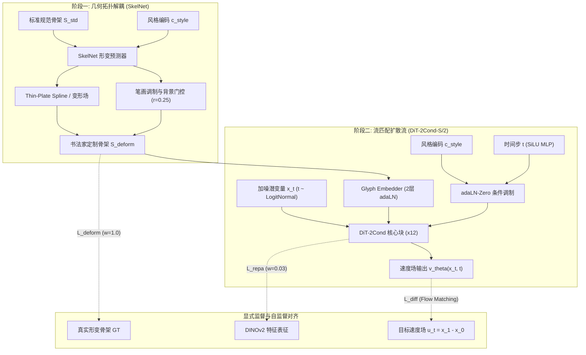

# Callig-DiT (马良) 架构全景与系统边界

## 1. 核心问题与物理约束

汉字书法生成任务具有极高的结构敏感性：
1. **拓扑不可破坏性**：笔画连通性、间架结构容错率极低（微米级错位即成错别字）。
2. **风格的高阶非线性**：不同书法家（如王羲之、米芾、颜真卿、赵孟頫）不仅在笔画粗细、枯润（微观纹理）上存在风格差异，更在字形欹正、开合、中宫收紧（宏观骨架）上存在强烈的拓扑形变。
3. **风格与字形的正交性**：同一个字（如“之”）在 45 位书法家笔下呈现出完全不同的骨架形变；同一个书法家笔下的所有汉字具有统一的运笔动力学规律。

传统的单通道条件扩散模型（将标准骨架或字体作为通道级拼接，或者仅通过全局 Cross-Attention / adaLN 注入风格）在实验中遭遇了不可逾越的**风格-结构跷跷板困境**：
- 强行提升风格权重 $\implies$ 笔画断裂、字形崩塌、背景飞墨；
- 强行锁定骨架约束 $\implies$ 风格退化为标准印刷体描边，失去书法神韵。

Callig-DiT（马良）通过**二阶显式解耦流匹配架构（Two-Stage Explicitly Decoupled Flow Matching）**彻底解决了这一对偶矛盾。

---

## 2. 系统整体架构

系统主要由三大子系统构成：
1. **SkelNet 显式可形变骨架网络**：负责宏观字形结构的拓扑形变动力学建模。
2. **DiT-2Cond 主干流匹配网络**：基于 Transformer 的扩散速度场回归器。
3. **双通道正交风格注入系统（Dual-Channel Style Injection）**：adaLN-Zero 宏观骨架导引与局部笔画调制的正交协同。

---

## 3. 系统边界与数据流动协议

为确保各模块职责分明、训练梯度不发生退化漂移，系统设定了严格的运行边界：

| 模块 | 输入 | 输出 | 关键约束与边界 |
| :--- | :--- | :--- | :--- |
| **SkelNet** | 标准骨架 $S_{std} \in \mathbb{R}^{1 \times H \times W}$，风格向量 $c_{style} \in \mathbb{R}^{128}$ | 形变骨架 $S_{def} \in \mathbb{R}^{1 \times H \times W}$ | 最大位移偏置 $\le 6.0\text{ px}$；背景硬门控半径 $r=0.25$（严禁在背景零墨区域造墨）；预训练形变头 $0.1\times$ 低学习率微调。 |
| **Glyph Embedder** | 形变骨架潜变量 $z_{skel} \in \mathbb{R}^{4 \times 32 \times 32}$ | 结构 Patch Token 序列 $T_{skel} \in \mathbb{R}^{256 \times 384}$ | 深度 2 层，前 4 个 DiT Block 执行 adaLN 注入，初始化缩放系数 $\alpha=0.6$。 |
| **DiT-2Cond 主干** | 图像潜变量 $z_t \in \mathbb{R}^{4 \times 32 \times 32}$，时间 $t$，风格 $c_{style}$ | 速度场预测 $\hat{v} \in \mathbb{R}^{4 \times 32 \times 32}$ | 12 层 Transformer，隐层维度 384，6 注意力头，全 RoPE 2D 旋转位置编码，SwiGLU 激活，RMSNorm 归一化。 |
| **REPA 表征对齐** | 第 8 层 Transformer 中间特征 | DINOv2 ViT-B/14 投影对齐 | 投影维度 768，自监督余弦距离损失，权重固定为 $0.03$（高权重被证明会破坏几何保真度）。 |

---

## 4. 核心文件索引

- **模型定义**：
  - 主干网络：[`src/models/dit.py`](file:///g:/GitHub/DiT/src/models/dit.py)
  - 可形变骨架网络：[`src/models/deform_skel.py`](file:///g:/GitHub/DiT/src/models/deform_skel.py)
  - 条件融合层：[`src/models/condition_fusion.py`](file:///g:/GitHub/DiT/src/models/condition_fusion.py)
  - 骨架特征提取器：[`src/models/glyph_embedder.py`](file:///g:/GitHub/DiT/src/models/glyph_embedder.py)
- **训练入口**：
  - 训练驱动脚本：[`src/train/train.py`](file:///g:/GitHub/DiT/src/train/train.py)
  - 当前主配置：[`src/train/configs/v21_skelnet_200k.json`](file:///g:/GitHub/DiT/src/train/configs/v21_skelnet_200k.json)
- **评估与诊断**：
  - 内存内无损采样评估：[`src/eval/in_mem_eval.py`](file:///g:/GitHub/DiT/src/eval/in_mem_eval.py)
  - 双通道梯度正交诊断：[`tools/probe_dual_channel.py`](file:///g:/GitHub/DiT/tools/probe_dual_channel.py)
