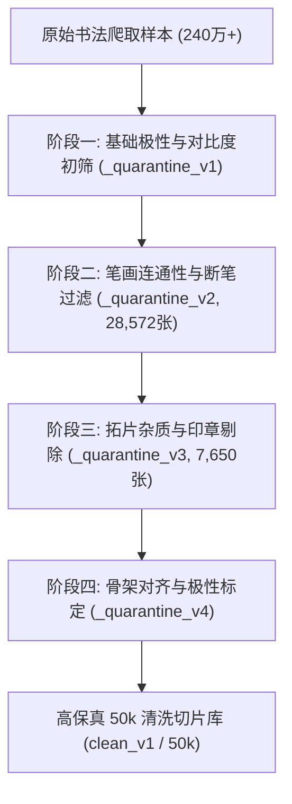

# 数据清洗四阶隔离协议与极性修正

## 1. 历史演进与“脏数据”教训

在项目早期（v1-v8 阶段），模型常在边缘出现诡异的黑色方块伪影与中空笔画。经深度反查，根源并非模型架构缺陷，而是传统开源书法爬虫数据集（如 Tongji, Unicalli 等）中普遍存在的严重质量污染：
1. **反色污染（Polarity Inversion）**：部分碑帖为“白底黑字”，部分拓片为“黑底白字”，甚至同一书法家目录下混杂了反色图；
2. **残碑污渍与断笔**：石碑风化造成的斑驳被错误当作文字笔画提取；
3. **Canny 骨架空心化**：使用普通边缘检测时，过宽的粗笔画（如颜体点画）会被提取出两条平行的双边缘，导致骨架变成“空心气球”；
4. **印章与题跋侵蚀**：红色或灰色印章侵入字体主体，导致潜变量编码产生不可逆的色彩通道噪点。

---

## 2. 四阶隔离清洗协议 (Four-Stage Quarantine Protocol)

为彻底净化训练集，马良团队建立了严格的 4 级隔离清洗管线（历次隔离归档于 `data/_quarantine_v1` 至 `data/_quarantine_v4`）：

### 阶段一：极性标定与背景归一化
- 通过四角采样背景像素均值：若四角均值 $> 128$，则判定为白底黑字；否则判定为黑底白字；
- 统一反转为**“纯白背景（255），纯黑墨迹（0）”**标准格式。

### 阶段二：笔画连通性分析与面积阈值
- 利用 OpenCV 连通域标记算法，计算前景总面积比（Ink Coverage Ratio）；
- 剔除墨迹面积 $< 2\%$（点画缺失）或 $> 60\%$（严重墨团糊死）的异常切片；
- 累计隔离清洗 $28,572$ 张严重断笔或空洞图片入 `_quarantine_v2`。

### 阶段三：Canny 骨架重构与细化算法
- 摒弃标准 Canny 边缘，全面采用基于拓扑骨架细化（Zhang-Suen Thinning）的单像素中心线提取算法；
- 确保骨架严格保持笔画的拓扑单连通性，彻底消除了“双轨空心骨架”。

### 阶段四：白底全零极性对齐 (White-Zero Polarity)
- **痛点**：预训练 VAE 编码器（SD VAE）将纯白像素映射为非零浮点潜变量（均值约在 $-1.5$ 左右）。当网络试图输出纯白背景时，若目标是浮点非零值，扩散过程极易产生微小扰动造成背景起灰。
- **解决方案**：测量并固化纯白图像的潜变量均值向量 [`data/white_latent.npy`](file:///g:/GitHub/DiT/data/white_latent.npy)，并在训练损失函数中对背景区域施加强制锚定约束，保证生成的背景具有完美的纸本白度。
