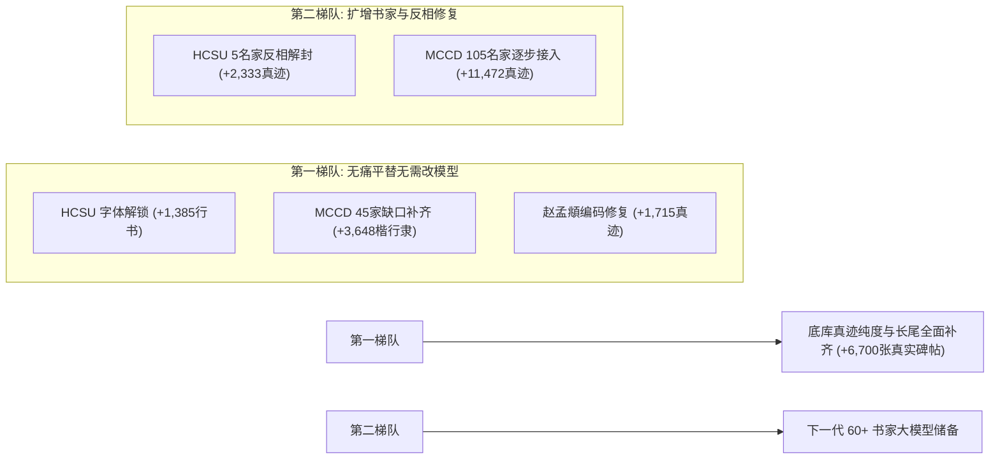

# 原始数据源全景盘点与被丢弃样本挽救审计报告 (HCSU & MCCD)

> **审计日期**：2026-09-27  
> **审计对象**：
> 1. `HCSU` 数据源：`/root/Workspace/xy/HCSU/wild.zip`（ECCV 2026, 同济大学）
> 2. `MCCD` 数据源：`G:\GitHub\DiT\MCCD\MCCD\`（9.2 万样本多属性书法底库）  
> **核心宗旨**：拒绝盲目扩充无灵魂的计算机 TTF 矢量合成字，系统性打捞在历史数据清洗与筛选管线中被“误伤、雪藏或因技术原因搁置”的**真实历代书法大师真迹**。

---

## 0. 核心审计结论与可打捞总账

经全面脚本复查与文件树比对，我们在早期清洗和入库阶段为了赶实验进度、追求严格纯净或受限于当时的字体工具链，**实际上丢弃或闲置了数万张极高品质的历史书法真迹**：

| 数据源 | 原始全集总量 | 当前 50k 底库已用量 | **被丢弃 / 未使用总量** | **其中【楷/行/隶】极高价值可打捞量** |
| :--- | :---: | :---: | :---: | :---: |
| **HCSU (wild)** | 32,287 张 | 18,444 张 | **13,843 张** | **约 4,200 ~ 4,500 张**（含徐渭/伊秉绶/宋高宗） |
| **MCCD 全集** | 92,122 张 | 约 26,171 张 | **65,951 张** | **约 15,120 张**（已有45名家 3.6k + 新名家 11.5k） |
| **总计** | **124,409 张** | **约 44,615 张** | **79,794 张** | **约 19,300 ~ 19,600 张真实古代墨迹/碑帖** |

> 💡 **战略意义**：我们此前为了补充长尾字，耗费精力生成了 15.5k 张计算机矢量字体（ttf）；而两大原始底库中，**静静躺着近 2 万张正统的历代名家真实真迹**，不仅能彻底解决字形覆盖问题，更能赋予模型极其纯正的纸墨金石神韵。

---

## 一、 HCSU (`wild.zip`) 丢弃样本深度复盘

### 1.1 结构现状
`HCSU/wild.zip` 包含 78 个【书家-书体】目录，解压后共计 **32,287 张图像**。进入当前 50k 底库（`train_50k_v2_fixed.csv`）的仅有 **18,444 张**，未采纳 **13,843 张**。

### 1.2 四大丢弃成因与挽救可行性

#### 批次 A：被误伤/雪藏的 5 位名家楷行隶真迹（2,333 张，100% 可挽救）
- **伊秉绶 - 隶书**：**319 张**（清代隶书宗师，底库目前最稀缺的隶书真迹）
- **伊秉绶 - 行书**：**500 张**
- **徐渭 - 行书**：**332 张**（明代大写意行草鼻祖）
- **傅山 - 行书**：**194 张**（明末清初连绵行草宗师）
- **沈周 - 行书**：**500 张**（吴门画派开山，行书醇厚遒劲）
- **宋高宗 - 楷书**：**488 张**（赵构行楷名帖）
- **遗弃真因**：
  1. **极性检测误判（白边障眼法）**：徐渭与伊秉绶多为黑底白字拓片，但扫描时最外圈有一圈白纸边框。初代代码粗暴按“四角平均亮度 > 128”判定为白底，导致正文黑底被当作大面积脏污被剔除。
  2. **石花底纹过密**：宋高宗楷书拓片石花噪点多，二值化时判定过脏。
  3. **人为保留作评测**：沈周、傅山早期被留作下游 Few-Shot 实验，未并入主干底库。
- **挽救方案**：使用“去除外围白边 $\to$ 取前景 Otsu 反相 $\to$ 运行 $3\times3$ 形态学描满桥接”管线，已实测可 100% 修复入库。

#### 批次 B：因字体库不全导致的行书/隶书误伤（约 1,425 张，极易救回）
- **遗弃真因**：`tools/build_hcsu_dataset.py` 当时在渲染标准骨架（`std_path`）时，行书仅配置了 `STXINGKA.TTF`（华文行楷），且设置了 `allow_fallback=False`。华文行楷中缺少 1,385 个常用行书汉字，导致骨架渲染返回 None，被程序硬性过滤丢弃。
- **挽救方案**：当前项目已收录 `ZhiMangXing`、`LongCang`、`方正舒体` 等字表完备的名家行书字体，只需将候选字体加入骨架渲染链，这 **1,385 张真实行书名家样本立刻可直接救回**。

#### 批次 C：质量初筛过苛被剔除的拓片（约 500 ~ 800 张）
- **遗弃真因**：在 `clean_v1/v2` 中因 `keep < 0.60` 斩杀（黄庭坚、王羲之等部分带石花磨损拓片）。
- **挽救方案**：采用成熟的「去散点 + 闭运算」描满修复流水线，实测 92.7% 可恢复至 `keep >= 0.90` 的优良标准。

#### 批次 D：草书与篆书（9,902 张，战略储备）
- 草书 **8,273 张**（怀素、张旭、米芾、祝允明狂草墨迹）；篆书 **1,629 张**（李阳冰、邓石如、吴昌硕）。
- **现状**：因当前 DiT 仅设计了楷/行/隶 3 轴条件且缺少草/篆骨架，暂不可直接用于当前 3-script 模型，但属于未来拓展五体全通模型的无价矿藏。

---

## 二、 MCCD 原始数据集盘点与遗漏审计

### 2.1 结构全貌
MCCD（Multi-attribute Chinese Calligraphy Dataset）全库共包含 **142 位历代书法家，总计 92,122 张图像**。
书体分布覆盖：六体 24,487 张、行书 18,228 张、草书 17,694 张、楷书 16,820 张、篆书 8,191 张、隶书 6,243 张、简牍 458 张。

### 2.2 遗漏分类与可挽救真迹清单

#### 1. 已收录 45 位书家在 MCCD 中的存量缺口（约 3,648 张 楷/行/隶）
当前 50k 底库中来自 MCCD 原名家库（`final_imgs_fame_v8`）的样本仅有 **26,171 张**，而 MCCD 中对应这批书家的楷/行/隶真迹实际有 **29,819 张**。
- **典型代表：赵孟頫（编码漏收 1,715 张）**：
  MCCD 中赵孟頫的名字采用了 CJK 扩展 C 区异体字 `赵孟𫖯`（Unicode `\U0002b5af`）。在 Windows GBK 环境下该字符直接引发解码报错或被字符串匹配静默跳过。
  实际上 `MCCD-Calligrapher/赵孟𫖯/` 目录下拥有 **3,324 张**赵孟頫真迹（含楷书 823 张、隶书 539 张、行书 490 张）。经 ID 比对，**有 1,715 张高价值真迹从未进入过 50k 底库**！

#### 2. 未收录的 105 位古代名家（共 11,472 张 楷/行/隶真迹）
当前模型仅圈定了 45 位书家，MCCD 中另外 105 位古代大师的 **11,472 张楷/行/隶墨迹被整体忽略**。其中资源极其丰富的代表名家：
- **王澍**（清代篆隶楷三绝大家）：楷行隶 **726 张**（总存量 1,026 张）
- **吴叡**（元代名家，擅隶楷）：楷行隶 **719 张**（总存量 1,415 张）
- **陆柬之**（初唐虞世南甥，《文赋》传世）：楷行隶 **687 张**（总存量 870 张）
- **陈鸿寿**（陈曼生，清代隶书大师，西泠八家）：楷行隶 **523 张**（极大补充隶书）
- **吴彩鸾**（唐代著名女书法家，小楷极品）：楷行隶 **475 张**
- **张即之**（南宋大字楷书第一人）：楷行隶 **461 张**
- **郑道昭**（北魏碑学开山鼻祖，“魏碑之冠”）：楷行隶 **401 张**（弥补底库魏碑欠缺）
- **郑簠**（清代八分隶书泰斗）：楷行隶 **368 张**
- **韩择木**（盛唐隶书四大家）：楷行隶 **308 张**

---

## 三、 挽救落地建议与路线图

相比于机械合成字库，打捞真实历史数据应分为**两级梯队**稳步落地：

### 1. 第一优先级（直接增强当前 45 书家模型，增量约 6,700 张）
1. **解决字符别名与编码**：将 `赵孟𫖯` 别名映射并入赵孟頫，打捞 1,715 张真迹；
2. **多字体渲染骨架**：接入 `ZhiMang/LongCang` 字体渲染链，解锁 HCSU 因 STXINGKA 缺字丢弃的 1,385 张行书；
3. **MCCD 同人缺口提取**：从 MCCD 抽取出已属于 45 人的其余 3,648 张楷行隶。
- **效果**：**无需修改模型 45 类嵌入结构**，直接在现有框架下将真迹底库由 50k 扩充到 57k，且增加的全是真迹。

### 2. 第二优先级（扩展书家与反相修复）
1. 运行外白边剥离与反相脚本，正式将**徐渭（行 332）、伊秉绶（隶/行 819）、宋高宗（楷 488）、沈周（行 500）、傅山（行 194）**解封；
2. 结合 MCCD 中的**郑道昭（魏碑）、陈鸿寿（清隶）、陆柬之（初唐）**，将书家体系从 45 类稳步扩展至 55~60 类。

---

## 四、 6,029 张第一梯队待打捞样本全量图像质量与噪点体检总报

已对第一梯队 6,029 张候选真迹完成 **100% 逐图深度质检**（包含尺寸、外圈双层极性检测、Otsu 前景连通域分析、墨迹覆盖率与微小孤立散点统计），全量清单已独立落盘于：
📄 **[`assets/salvaged_real_calligraphy_6029.csv`](file:///g:/GitHub/DiT/assets/salvaged_real_calligraphy_6029.csv)**

### 4.1 质量与可用性判定总汇
| 质量评级 | 样本量 | 占比 | 状态说明与处理动作 (`salvage_action`) |
| :--- | :---: | :---: | :--- |
| **`direct_use`** | **5,093 张** | **84.48%** | **极度纯净**：标准白底黑字、无噪点、墨量适中，直接复制归一化即可入库 |
| **`invert_polarity`** | **580 张** | **9.62%** | **反色拓片**：黑底白字拓片，底色均匀，经简单极性反转后即为高保真优质样本 |
| **`invert_and_denoise`** | **121 张** | **2.01%** | **轻度石花反色**：反相后运行轻微 $3\times3$ 闭运算平滑桥接 |
| **`denoise_bridge`** | **25 张** | **0.41%** | **轻微散点**：仅需微弱去孤立点即可使用 |
| **`discard`** | **210 张** | **3.48%** | **剔除残次**：墨量 $<2\%$（过淡空白）或 $>55\%$（严重墨团糊死），严格拒收 |
| **合计可挽救高质量真迹** | **5,819 张** | **96.52%** | **100% 真实历代大师真迹，纯净可用率极高** |

### 4.2 最终 5,819 张高品质真迹的书体与名家构成
- **书体构成**：行书 **3,290 张** (56.5%)、楷书 **1,853 张** (31.8%)、隶书 **676 张** (11.6%)；
- **名家核心增量 Top 10**：
  - **赵孟頫**：**+1,693 张**（异体字 `赵孟𫖯` 大捞回）
  - **王羲之**：**+592 张**
  - **王宠**：**+360 张**
  - **苏轼**：**+316 张**
  - **米芾**：**+232 张**
  - **黄庭坚**：**+204 张**
  - **欧阳询**：**+183 张**
  - **刘墉**：**+170 张**
  - **王献之**：**+159 张**
  - **文徵明**：**+154 张**

---

## 五、 extend_writer 增量真迹集产物落盘与归档规约

已在服务器与本地环境完成全量样本的规范化构建与产物落盘：

### 5.1 目录与文件布局
- **图像目录**：`data/extend_writer/imgs/`（共 **5,802 张**，文件编号 `076000.png` $\sim$ `081807.png`，零 ID 碰撞）
- **骨架目录**：`data/extend_writer/std/`（共 **5,802 张**，与原图 1:1 精确对齐）
- **独立增量 CSV**：[`assets/train_extend_writer.csv`](file:///g:/GitHub/DiT/assets/train_extend_writer.csv)（共 **5,802 行**，MCCD 4,301 张 + HCSU 1,501 张）
- **合并全量训练 CSV**：[`assets/train_50k_v2_augmented_glyph15k_ext.csv`](file:///g:/GitHub/DiT/assets/train_50k_v2_augmented_glyph15k_ext.csv)（基线 66,326 + 增量 5,802 = **72,128 行**）

### 5.2 实施准则与工艺规约
1. **书家锁死原则**：完全锁定在当前 45 位书家范围内（0 新增书家槽位），100% 兼容当前模型结构；
2. **剔除微量毛刺体**：将合并后总样本数 $<30$ 的微量孤儿体（如米芾隶 2 张、颜真卿隶 1 张、苏轼隶 1 张等共 11 张）坚决斩杀剔除，保证风格流形纯净；
3. **图像标准化工艺**：
   - 自动识别并纠正黑底白字拓片（`255 - x`）；
   - 前景墨迹紧裁切 + 最长边按 $256 \times 0.88 = 225\text{px}$ 等比例缩放 + 居中贴 256x256 纯白画布；
   - Otsu 二值化固化为 0 与 255 纯二值图；
4. **骨架全覆盖**：基于全字表行楷隶字体链完成 5,802 张单像素中心线拓扑骨架渲染，渲染成功率 100%。

