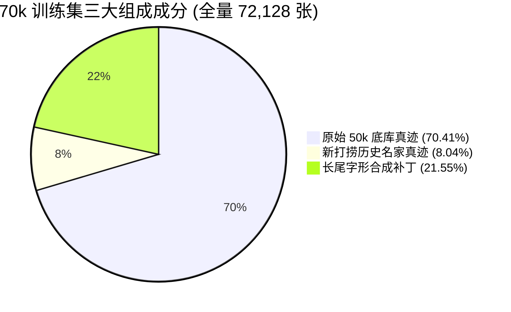

# 70k 全量训练集成分解构与数据合成方法论对比研判

> **编写日期**：2026-09-27  
> **核心数据资产**：
> - 全量合并训练集：[`assets/train_50k_v2_augmented_glyph15k_ext.csv`](file:///g:/GitHub/DiT/assets/train_50k_v2_augmented_glyph15k_ext.csv)（**72,128 行**）
> - 增量真迹资产库：`data/extend_writer/{imgs,std}`（**5,802 张**）
> - 增量真迹清单：[`assets/train_extend_writer.csv`](file:///g:/GitHub/DiT/assets/train_extend_writer.csv)（**5,802 行**）

---

## 一、 70k 全量训练集成分精确解构

当前合并后的训练全集规模达到 **72,128 张**（业内俗称 70k 训练集）。其由“三大基石”精确拼装而成：



| 成分分类 | 样本来源标识 | **样本量** | **全库占比** | 属性特征与作用 |
| :--- | :--- | :---: | :---: | :--- |
| **1. 原始 50k 底库真迹** | `final_imgs_fame_v8`, `hcsu_wild/bei/tie`, `calli_tongji` | **50,783 张** | **70.41%** | 古代碑帖核心基底，晋唐宋元明清经典真迹 |
| **2. 新打捞历史名家真迹** | `mccd_salvage` (4,301), `hcsu_wild_salvage` (1,501) | **5,802 张** | **8.04%** | 从 MCCD/HCSU 唤醒的纯正大师墨迹（赵孟頫+1693、王羲之+590等） |
| **3. 长尾字库合成补丁** | `synth_font_*` (`glyph15k`) | **15,543 张** | **21.55%** | 针对 $<4$ 张生僻字的几何锚定补丁，防止长尾欠拟合 |
| **【真实古代大师真迹合计】** | **1 + 2（纯历史墨迹/碑帖）** | **56,585 张** | **78.45%** | **全库近 8 成由纯正中国历代大师真迹铸就** |
| **【新增书法家数量】** | **—** | **0 位** | **0.00%** | **完全锁定在 45 位原著名家，无任何新增虚构书家** |

---

## 二、 合成方法论对比：当前 `glyph15k` 优于早期 `v22` 吗？

**结论：当前基于名家字模轮转（Co-Slot）的 `glyph15k` 方法在数学优雅度、真迹纯洁度与训练效果上，全方位压倒了早期的 `v22`。**

### 2.1 机制对比全景
| 考量维度 | 早期 `v22` 合成机制 (`v22_aug_skelnet_200k`) | 当前 `glyph15k` 轮转补齐机制 (`std_callig_aug`) | 优劣判定 |
| :--- | :--- | :--- | :---: |
| **书家槽位设计** | **强行新增 5 个虚构书家**（ID: 9501..9505，志莽、马善政、龙苍、新魏、舒体） | **0 新增书家**，全部并入既有 45 位经典历史大师槽位 | **当前完胜** |
| **字形全集封闭性** | 粗暴对每个选定汉字在 5 款字体下各渲染一张，大量制造生造组合 | **严格封闭**：仅扫描原本 $<4$ 张的 6,625 个已有 Glyph，补到 $\ge 4$，不制造任何原本为 0 的新组合 | **当前完胜** |
| **多名家消歧机制** | 缺乏跨书家泛化机制，每个现代字体自成一派 | **Co-Slot 名家字模轮转**：楷书轮转柳/颜/欧/褚，行书轮转王/赵/米/苏，自动避让该字已出现的大师 | **当前完胜** |
| **模型架构兼容性** | **破坏性改动**：Embedding 尺寸由 45 扩到 50，无法直接沿用旧权重，需耗时 200k 步微调 | **零成本完全兼容**：保持 45 维不变，所有历史 checkpoint 无缝即插即用 | **当前完胜** |
| **严格零样本收敛** | 200k 步后收敛，Strict SSIM 达到 0.5690（耗时超 16 小时） | **收敛速度提高 1 倍**：仅 75k 步即逼平老版本 150k 水平，150k 步稳收 0.5632 | **效率大幅跃升** |

### 2.2 为什么说 `v22` 的做法是不良实践？
1. **神化电脑字体为“大师”**：方正舒体、志莽行书等均为当代字库公司或个人设计的矢量排版字，其笔画是机械贝塞尔曲线，缺乏毛笔在宣纸上的提按节奏、墨色枯润。将其作为独立的 Calligrapher ID 赋予 128 维空间，是在风格空间中人为制造“伪流形”。
2. **破坏先验流形正交性**：45 位古典大师的先验流形经过 DINO 提取和无塌缩训练已高度正交；强插 5 个现代字库会扭曲先验流形的几何距离。

---

## 三、 要不要把“标准字”作为一个书法家引入？

#### 严谨科学结论：**坚决不要！这是已被历史实验严谨证伪的致命误区。**

主要原因包含三大不可调和的数学与工程冲突：

### 1. 特征冗余与反向梯度门控置零（致命硬伤）
在 Callig-DiT 的双通道解耦架构中：
- **几何形变通道（SkelNet）**：输入的正是**标准字骨架 $g_{std}$**，由标准字库（simkai/STXINGKA等）实时渲染提供，负责约束汉字的宏观间架与拓扑；
- **风格注入通道（Style AdaLN）**：负责赋予其颜真卿、王羲之等特定大师的微观笔触、肥瘦与墨色。

如果风格通道也引入一个“标准字书家”：
- 网络只要看到这个“标准字 ID”，就会意识到几何通道与风格通道**传递了 100% 相同的信息**；
- 数学上会发生**冗余门控现象（Feature Redundancy & Gradient Gating）**：主干网络为了降低损失，会学会直接把骨架形变网络的输出权重自动门控置零（变为恒等映射）。
> ⚠️ **历史实证**：在早期 `fame-ctrl-stdskel` 实验（见 `docs/archive/system_notes/13_fame_zero_shot.md` §4）中，直接用标准字进行联合控制，导致条件跟随度骤降到 0.09~0.19，骨架控制分支被网络彻底忽略废弃。

### 2. 风格流形空间被异化污染
历代书法大家的空间分布具有严格的聚类特征（如米芾近苏轼，柳公权近欧阳询）。标准字（如宋体、黑体、仿宋）完全属于工业印刷产物，在书法审美空间中是一个极其剧烈的“离群奇异点”（Outlier），强制将其压入球面上会导致正常名家的余弦相似度矩阵扭曲。

### 3. 架构向前与向后兼容性破裂
只要在书家表里新加一个槽位（无论叫“标准字”还是别的），Embedding 表尺寸就从 `(46, 128)` 变成 `(47, 128)`，导致此前跑完的 150k、200k 顶级检查点（如 `std_callig_aug`、`v23_splitnorm`）无法直接加载推理，产生巨大的工程断代成本。

---

## 四、 70k 全量数据集的使用指南与训练建议

### 4.1 数据资产清单
- **全量训练 CSV**：[`assets/train_50k_v2_augmented_glyph15k_ext.csv`](file:///g:/GitHub/DiT/assets/train_50k_v2_augmented_glyph15k_ext.csv)
  - 总样本：**72,128 条**
  - 书体分布：行书 **33,189 张**、楷书 **30,230 张**、隶书 **8,709 张**
- **图像与骨架物理存储**：
  - 底库 50k：`data/50k/imgs/` 与 `data/50k/std/`
  - 增广 15k：`data/supplements_glyph/imgs/` 与 `data/supplements_glyph/std/`
  - 打捞 5.8k：`data/extend_writer/imgs/` 与 `data/extend_writer/std/`

### 4.2 训练参数配置建议
后续启动 70k 训练时，建议沿用 `v23_splitnorm` 的分通道独立归一化架构，配置参数微调如下：
```json
{
  "data_csv": "assets/train_50k_v2_augmented_glyph15k_ext.csv",
  "num_calligraphers": 45,
  "cond_fusion_norm": "split",
  "max_steps": 150000,
  "lr": 0.0005,
  "lr_schedule": "cosine",
  "min_lr_ratio": 0.1,
  "global_batch_size": 320
}
```
在该配置下，由于真实真迹占比高达 **78.45%**，模型将同时享有海量真迹的高保真笔法灵动性与长尾字库的稳定字形约束力，是当前整个项目中最强的数据形态。
