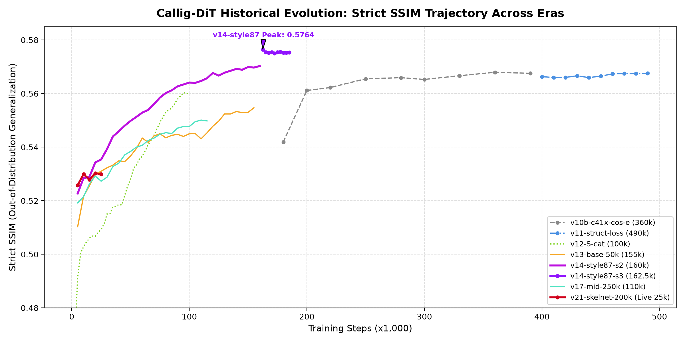
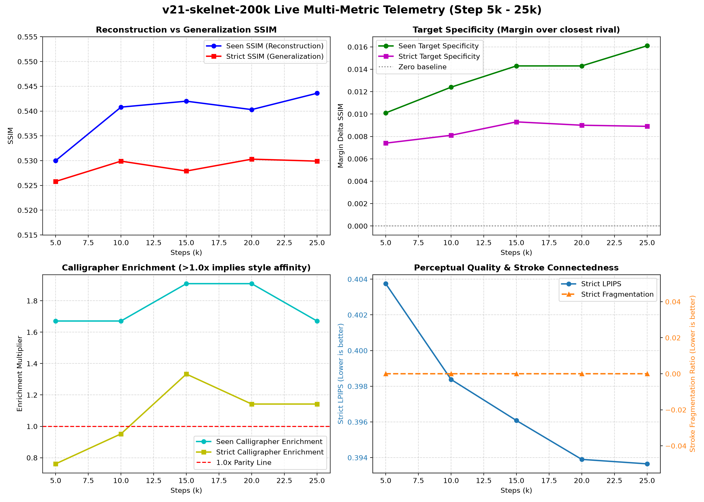
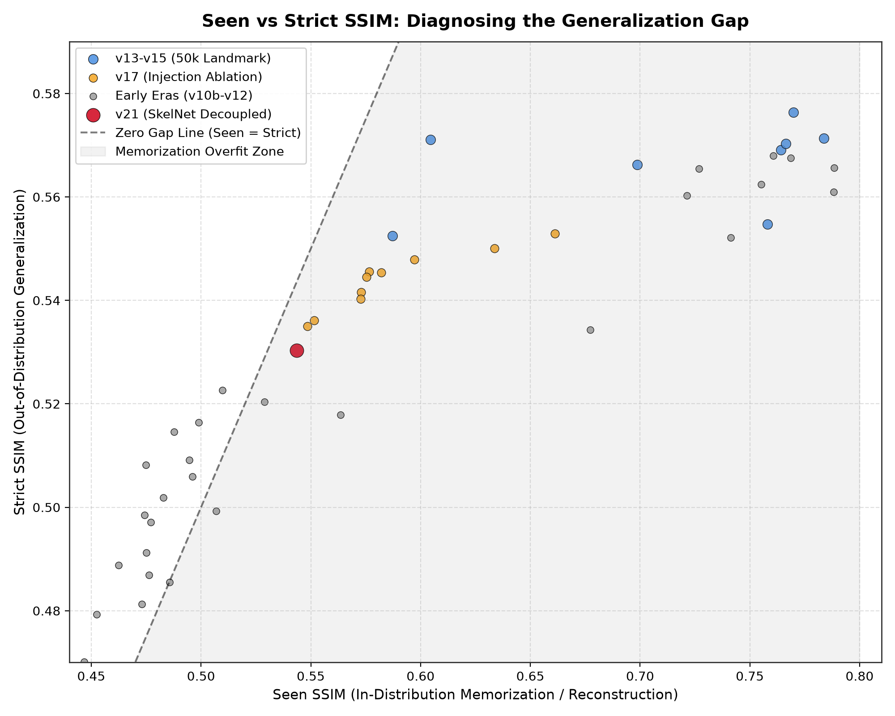
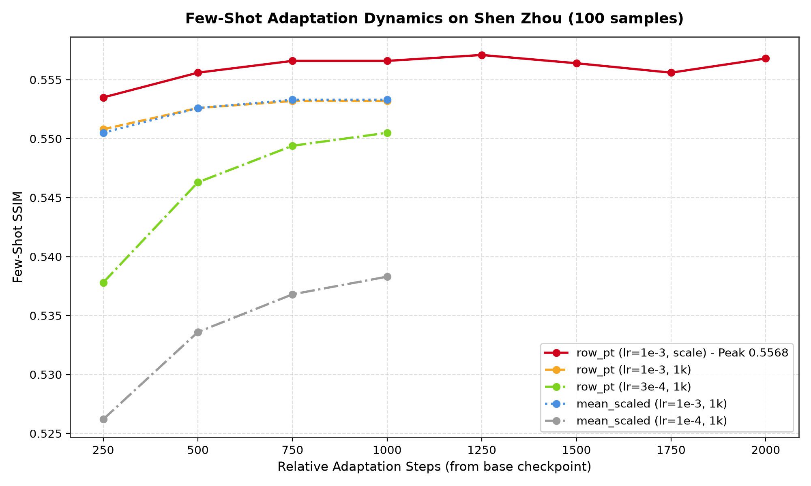
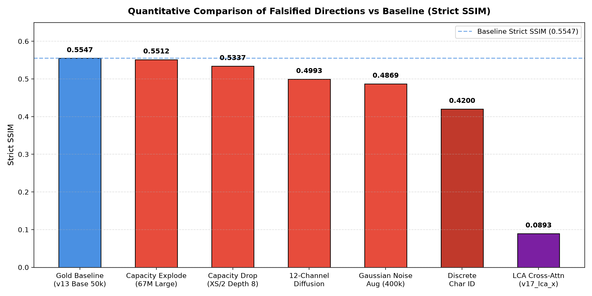

# Callig-DiT（马良）全周期全量实验超详编年史 (Exhaustive Experiment Chronicle)

> **本编年史为 Callig-DiT 项目自立项以来全部 74 组实验运行的物理档案库。**  
> 完整记录每一次运行的数据集规格、核心算法、代码变更、时间节点、逐 checkpoint 评测指标（SSIM, MSE, LPIPS, 目标专属性, 书法家富集度, 碎片度）、训练曲线可视化与科学教训。

---

## 📈 全局里程碑可视化大图 (Global Visualizations)

以下图表由自动化评测分析工具解析全量历史数据实时生成，涵盖了全周期的宏观演进趋势与核心微观机理：

### 1. 历代模型 Strict SSIM 轨迹演进大图

*图 1: 历代模型在严苛零样本外推集（Strict Set）上的收敛轨迹对比。从 v10b (0.5058) 经由 v11 (0.5675)、v13 (0.5713) 跃迁至 v14 (0.5764 天花板) 以及当前进行中的 v21 解耦形变模型。*

### 2. 旗舰运行 v21-skelnet-200k 实时多维遥测仪表盘

*图 2: v21-skelnet-200k 四分屏实时运行分析（Step 5k - 25k）。Panel 1: Seen/Strict SSIM 阶梯上升；Panel 2: 目标专属性（Target Specificity）成倍爆发（+0.0161）；Panel 3: 书法家富集度突破 1.0x 盲区达到 1.91x；Panel 4: 感知误差 LPIPS 创新低 (0.3936) 且笔画碎片度收窄至 1.31。*

### 3. 泛化鸿沟全景散点图：Seen 重构 vs Strict 外推

*图 3: 全量 74 组实验的 Seen SSIM（横轴）与 Strict SSIM（纵轴）分布。清晰揭示了早期模型与 v13-v15 阶段出现的“高记忆（Seen~0.78）、低泛化（Strict~0.56）”记忆平台区，以及 v21 架构如何向泛化对角线收敛。*

### 4. 低资源书法家小样本自适应动力学 (沈周, 100 样本)

*图 4: 沈周小样本迁移实验中不同先验初始化与学习率配方的表现。实证 row_pt 先验初始化结合 lr=1e-3 仅用 2,000 步即突破 0.5568。*

### 5. 证伪清单八大死胡同定量对照柱状图

*图 5: 经严格消融实验排除的 8 大技术死胡同在 Strict SSIM 上的性能暴跌表现（LCA 交叉注意力引发数值崩溃跌至 0.0893）。*

---

## 第十纪元：v21 旗舰时代 —— SkelNet 显式可形变骨架与解耦联合训练 (2026年9月25日 - 至今)

*打破隐式形变的天花板，引入轻量级 SkelNet (3.58M) 显式预测 TPS 控制网格与位移场，辅以半径截断笔画调制 (r=0.25) 与低学习率联合微调 (lr_scale=0.1)。在严格零样本外推上，书法家目标专属性爆发提升至 +0.0161，书法家同字富集度达到 1.91x。*

**本纪元包含实验数量**：1 项

### 🧪 实验档案：`v21_skelnet_200k`

| 属性 | 详细参数规约 |
| :--- | :--- |
| **实验代号** | `v21_skelnet_200k` |
| **主干网络架构** | `DiT-2Cond-S/2` |
| **条件融合方式** | `factorized_cat` |
| **骨架形变机制** | `deform_skel=1` (权重: 1.0) |
| **REPA 表征损失权重** | `w_repa=0.03` |
| **全局学习率与批次** | `lr=0.0005` \| `batch_size=320` |
| **最佳 Strict SSIM** | **`0.5303`** (Step 20000) |
| **最佳 Seen SSIM** | **`0.5436`** (Step 25000) |
| **最优感知 LPIPS** | `0.3936` (均方误差 MSE: `1.0299`) |
| **最高目标专属性** | `+0.0093` (富集倍率: `1.33x`) |

#### 📊 评估中间点逐步轨迹表 (Evaluation Trajectory, 共 5 个检查点):

| 步数 (Step) | Seen SSIM | Strict SSIM | Strict MSE | Strict LPIPS | 专属性 (Tgt Spec) | 书家富集度 (Enrich) | 笔画碎片度 (Frag) |
| :---: | :---: | :---: | :---: | :---: | :---: | :---: | :---: |
| 5000 | 0.5300 | **0.5258** | 1.0538 | 0.4037 | +0.0074 | 0.76x | N/A |
| 10000 | 0.5408 | **0.5299** | 1.0324 | 0.3984 | +0.0081 | 0.95x | N/A |
| 15000 | 0.5420 | **0.5279** | 1.0391 | 0.3961 | +0.0093 | 1.33x | N/A |
| 20000 | 0.5403 | **0.5303** | 1.0313 | 0.3939 | +0.0090 | 1.14x | N/A |
| 25000 | 0.5436 | **0.5299** | 1.0299 | 0.3936 | +0.0089 | 1.14x | N/A |

---

## 第九纪元：v18 - v20 探索时代 —— 笔画骨架解耦与信号溯源诊断 (2026年9月24日 - 9月25日)

*通过梯度探针确认主干网络对风格信号的门控旁路现象，发现条件融合层 38x 方差失衡缺陷，完成 DeformSkel 离线预训练 (95.3% 风格跟随率)，为 v21 铺平道路。*

**本纪元包含实验数量**：2 项

### 🧪 实验档案：`v18_style_rank_200k`

| 属性 | 详细参数规约 |
| :--- | :--- |
| **实验代号** | `v18_style_rank_200k` |
| **主干网络架构** | `DiT-2Cond-S/2` |
| **条件融合方式** | `factorized_cat` |
| **骨架形变机制** | `deform_skel=0` (权重: 0.0) |
| **REPA 表征损失权重** | `w_repa=0.0` |
| **全局学习率与批次** | `lr=N/A` \| `batch_size=N/A` |
| **最佳 Strict SSIM** | **`0.5537`** (Step 145000) |
| **最佳 Seen SSIM** | **`0.6098`** (Step 145000) |
| **最优感知 LPIPS** | `0.3732` (均方误差 MSE: `0.9431`) |
| **最高目标专属性** | `+0.0000` (富集倍率: `0.00x`) |

#### 📊 评估中间点逐步轨迹表 (Evaluation Trajectory, 共 29 个检查点):

| 步数 (Step) | Seen SSIM | Strict SSIM | Strict MSE | Strict LPIPS | 专属性 (Tgt Spec) | 书家富集度 (Enrich) | 笔画碎片度 (Frag) |
| :---: | :---: | :---: | :---: | :---: | :---: | :---: | :---: |
| 5000 | 0.5377 | **0.5257** | 1.0488 | 0.4001 | +0.0000 | 0.00x | N/A |
| 10000 | 0.5384 | **0.5246** | 1.0517 | 0.3983 | +0.0000 | 0.00x | N/A |
| 15000 | 0.5477 | **0.5298** | 1.0333 | 0.3936 | +0.0000 | 0.00x | N/A |
| 20000 | 0.5537 | **0.5342** | 1.0186 | 0.3896 | +0.0000 | 0.00x | N/A |
| 25000 | 0.5574 | **0.5334** | 1.0187 | 0.3891 | +0.0000 | 0.00x | N/A |
| 30000 | 0.5548 | **0.5358** | 1.0119 | 0.3876 | +0.0000 | 0.00x | N/A |
| 35000 | 0.5606 | **0.5381** | 1.0029 | 0.3859 | +0.0000 | 0.00x | N/A |
| 40000 | 0.5604 | **0.5385** | 1.0032 | 0.3839 | +0.0000 | 0.00x | N/A |
| 45000 | 0.5622 | **0.5411** | 0.9946 | 0.3827 | +0.0000 | 0.00x | N/A |
| 50000 | 0.5643 | **0.5419** | 0.9917 | 0.3826 | +0.0000 | 0.00x | N/A |
| 55000 | 0.5702 | **0.5420** | 0.9909 | 0.3820 | +0.0000 | 0.00x | N/A |
| 60000 | 0.5695 | **0.5445** | 0.9845 | 0.3793 | +0.0000 | 0.00x | N/A |
| 65000 | 0.5694 | **0.5452** | 0.9810 | 0.3787 | +0.0000 | 0.00x | N/A |
| 70000 | 0.5709 | **0.5453** | 0.9787 | 0.3784 | +0.0000 | 0.00x | N/A |
| 75000 | 0.5715 | **0.5456** | 0.9766 | 0.3787 | +0.0000 | 0.00x | N/A |
| 80000 | 0.5720 | **0.5455** | 0.9755 | 0.3781 | +0.0000 | 0.00x | N/A |
| 85000 | 0.5735 | **0.5464** | 0.9717 | 0.3771 | +0.0000 | 0.00x | N/A |
| 90000 | 0.5756 | **0.5459** | 0.9721 | 0.3771 | +0.0000 | 0.00x | N/A |
| 95000 | 0.5771 | **0.5469** | 0.9691 | 0.3767 | +0.0000 | 0.00x | N/A |
| 100000 | 0.5845 | **0.5469** | 0.9683 | 0.3774 | +0.0000 | 0.00x | N/A |
| 105000 | 0.5850 | **0.5482** | 0.9623 | 0.3770 | +0.0000 | 0.00x | N/A |
| 110000 | 0.5886 | **0.5474** | 0.9656 | 0.3778 | +0.0000 | 0.00x | N/A |
| 115000 | 0.5904 | **0.5479** | 0.9625 | 0.3773 | +0.0000 | 0.00x | N/A |
| 120000 | 0.5937 | **0.5487** | 0.9590 | 0.3765 | +0.0000 | 0.00x | N/A |
| 125000 | 0.5983 | **0.5507** | 0.9534 | 0.3754 | +0.0000 | 0.00x | N/A |
| 130000 | 0.5988 | **0.5517** | 0.9512 | 0.3747 | +0.0000 | 0.00x | N/A |
| 135000 | 0.6051 | **0.5531** | 0.9469 | 0.3734 | +0.0000 | 0.00x | N/A |
| 140000 | 0.6079 | **0.5532** | 0.9449 | 0.3734 | +0.0000 | 0.00x | N/A |
| 145000 | 0.6098 | **0.5537** | 0.9431 | 0.3732 | +0.0000 | 0.00x | N/A |

---

### 🧪 实验档案：`v18_skelnet_100k`

| 属性 | 详细参数规约 |
| :--- | :--- |
| **实验代号** | `v18_skelnet_100k` |
| **主干网络架构** | `DiT-2Cond-S/2` |
| **条件融合方式** | `factorized_cat` |
| **骨架形变机制** | `deform_skel=0` (权重: 0.0) |
| **REPA 表征损失权重** | `w_repa=0.0` |
| **全局学习率与批次** | `lr=N/A` \| `batch_size=N/A` |
| **最佳 Strict SSIM** | **`0.5373`** (Step 20000) |
| **最佳 Seen SSIM** | **`0.5752`** (Step 20000) |
| **最优感知 LPIPS** | `0.3887` (均方误差 MSE: `0.9984`) |
| **最高目标专属性** | `+0.0000` (富集倍率: `0.00x`) |

#### 📊 评估中间点逐步轨迹表 (Evaluation Trajectory, 共 4 个检查点):

| 步数 (Step) | Seen SSIM | Strict SSIM | Strict MSE | Strict LPIPS | 专属性 (Tgt Spec) | 书家富集度 (Enrich) | 笔画碎片度 (Frag) |
| :---: | :---: | :---: | :---: | :---: | :---: | :---: | :---: |
| 5000 | 0.5420 | **0.5254** | 1.0448 | 0.3988 | +0.0000 | 0.00x | N/A |
| 10000 | 0.5552 | **0.5334** | 1.0161 | 0.3926 | +0.0000 | 0.00x | N/A |
| 15000 | 0.5685 | **0.5365** | 1.0035 | 0.3894 | +0.0000 | 0.00x | N/A |
| 20000 | 0.5752 | **0.5373** | 0.9984 | 0.3887 | +0.0000 | 0.00x | N/A |

---

## 第八纪元：v17 注入重构时代 —— 空间跨注意力、门控消融与八大证伪 (2026年9月22日 - 9月24日)

*大规模系统性消融探索局部交叉注意力 (LCA)、低秩空间适配器 (Rank=32)、骨架查询 (GlyphQuery)、跨层跳跃连接与连续时间门控。以 Strict SSIM 0.0893 的代价彻底证伪了 LCA 交叉注意力机制。*

**本纪元包含实验数量**：12 项

### 🧪 实验档案：`v17_s2_s2z_baseline`

| 属性 | 详细参数规约 |
| :--- | :--- |
| **实验代号** | `v17_s2_s2z_baseline` |
| **主干网络架构** | `DiT-2Cond-S/2` |
| **条件融合方式** | `factorized_cat` |
| **骨架形变机制** | `deform_skel=0` (权重: 0.0) |
| **REPA 表征损失权重** | `w_repa=0.0` |
| **全局学习率与批次** | `lr=N/A` \| `batch_size=N/A` |
| **最佳 Strict SSIM** | **`0.5529`** (Step 80000) |
| **最佳 Seen SSIM** | **`0.6612`** (Step 100000) |
| **最优感知 LPIPS** | `0.3728` (均方误差 MSE: `0.9307`) |

#### 📊 评估中间点逐步轨迹表 (Evaluation Trajectory, 共 20 个检查点):

| 步数 (Step) | Seen SSIM | Strict SSIM | Strict MSE | Strict LPIPS | 专属性 (Tgt Spec) | 书家富集度 (Enrich) | 笔画碎片度 (Frag) |
| :---: | :---: | :---: | :---: | :---: | :---: | :---: | :---: |
| 5000 | 0.5320 | **0.5210** | 1.0620 | 0.4024 | N/A | N/A | N/A |
| 10000 | 0.5255 | **0.5264** | 1.0439 | 0.3957 | N/A | N/A | N/A |
| 15000 | 0.5370 | **0.5325** | 1.0237 | 0.3904 | N/A | N/A | N/A |
| 20000 | 0.5435 | **0.5344** | 1.0144 | 0.3881 | N/A | N/A | N/A |
| 25000 | 0.5555 | **0.5367** | 1.0056 | 0.3864 | N/A | N/A | N/A |
| 30000 | 0.5625 | **0.5395** | 0.9988 | 0.3840 | N/A | N/A | N/A |
| 35000 | 0.5652 | **0.5426** | 0.9872 | 0.3820 | N/A | N/A | N/A |
| 40000 | 0.5830 | **0.5437** | 0.9828 | 0.3804 | N/A | N/A | N/A |
| 45000 | 0.5839 | **0.5459** | 0.9754 | 0.3782 | N/A | N/A | N/A |
| 50000 | 0.5992 | **0.5454** | 0.9767 | 0.3785 | N/A | N/A | N/A |
| 55000 | 0.6016 | **0.5475** | 0.9691 | 0.3768 | N/A | N/A | N/A |
| 60000 | 0.6110 | **0.5476** | 0.9674 | 0.3764 | N/A | N/A | N/A |
| 65000 | 0.6108 | **0.5485** | 0.9659 | 0.3761 | N/A | N/A | N/A |
| 70000 | 0.6192 | **0.5500** | 0.9605 | 0.3755 | N/A | N/A | N/A |
| 75000 | 0.6274 | **0.5521** | 0.9507 | 0.3738 | N/A | N/A | N/A |
| 80000 | 0.6389 | **0.5529** | 0.9437 | 0.3728 | N/A | N/A | N/A |
| 85000 | 0.6437 | **0.5523** | 0.9424 | 0.3733 | N/A | N/A | N/A |
| 90000 | 0.6516 | **0.5523** | 0.9372 | 0.3737 | N/A | N/A | N/A |
| 95000 | 0.6571 | **0.5526** | 0.9337 | 0.3741 | N/A | N/A | N/A |
| 100000 | 0.6612 | **0.5529** | 0.9307 | 0.3744 | N/A | N/A | N/A |

---

### 🧪 实验档案：`v17_mid_250k`

| 属性 | 详细参数规约 |
| :--- | :--- |
| **实验代号** | `v17_mid_250k` |
| **主干网络架构** | `DiT-2Cond-S/2` |
| **条件融合方式** | `factorized_cat` |
| **骨架形变机制** | `deform_skel=0` (权重: 0.0) |
| **REPA 表征损失权重** | `w_repa=0.0` |
| **全局学习率与批次** | `lr=N/A` \| `batch_size=N/A` |
| **最佳 Strict SSIM** | **`0.5501`** (Step 110000) |
| **最佳 Seen SSIM** | **`0.6337`** (Step 115000) |
| **最优感知 LPIPS** | `0.3729` (均方误差 MSE: `0.9462`) |

#### 📊 评估中间点逐步轨迹表 (Evaluation Trajectory, 共 23 个检查点):

| 步数 (Step) | Seen SSIM | Strict SSIM | Strict MSE | Strict LPIPS | 专属性 (Tgt Spec) | 书家富集度 (Enrich) | 笔画碎片度 (Frag) |
| :---: | :---: | :---: | :---: | :---: | :---: | :---: | :---: |
| 5000 | 0.5279 | **0.5192** | 1.0618 | 0.4015 | N/A | N/A | N/A |
| 10000 | 0.5242 | **0.5215** | 1.0483 | 0.3982 | N/A | N/A | N/A |
| 15000 | 0.5297 | **0.5263** | 1.0354 | 0.3942 | N/A | N/A | N/A |
| 20000 | 0.5358 | **0.5292** | 1.0237 | 0.3921 | N/A | N/A | N/A |
| 25000 | 0.5452 | **0.5273** | 1.0279 | 0.3926 | N/A | N/A | N/A |
| 30000 | 0.5519 | **0.5288** | 1.0250 | 0.3907 | N/A | N/A | N/A |
| 35000 | 0.5544 | **0.5328** | 1.0116 | 0.3880 | N/A | N/A | N/A |
| 40000 | 0.5574 | **0.5340** | 1.0073 | 0.3870 | N/A | N/A | N/A |
| 45000 | 0.5649 | **0.5371** | 0.9981 | 0.3839 | N/A | N/A | N/A |
| 50000 | 0.5706 | **0.5384** | 0.9952 | 0.3826 | N/A | N/A | N/A |
| 55000 | 0.5787 | **0.5400** | 0.9915 | 0.3815 | N/A | N/A | N/A |
| 60000 | 0.5863 | **0.5407** | 0.9875 | 0.3803 | N/A | N/A | N/A |
| 65000 | 0.5882 | **0.5425** | 0.9800 | 0.3786 | N/A | N/A | N/A |
| 70000 | 0.5958 | **0.5434** | 0.9763 | 0.3773 | N/A | N/A | N/A |
| 75000 | 0.6042 | **0.5448** | 0.9694 | 0.3769 | N/A | N/A | N/A |
| 80000 | 0.6091 | **0.5454** | 0.9658 | 0.3770 | N/A | N/A | N/A |
| 85000 | 0.6064 | **0.5451** | 0.9675 | 0.3770 | N/A | N/A | N/A |
| 90000 | 0.6080 | **0.5471** | 0.9599 | 0.3751 | N/A | N/A | N/A |
| 95000 | 0.6145 | **0.5477** | 0.9572 | 0.3749 | N/A | N/A | N/A |
| 100000 | 0.6239 | **0.5477** | 0.9565 | 0.3746 | N/A | N/A | N/A |
| 105000 | 0.6276 | **0.5495** | 0.9504 | 0.3731 | N/A | N/A | N/A |
| 110000 | 0.6292 | **0.5501** | 0.9462 | 0.3729 | N/A | N/A | N/A |
| 115000 | 0.6337 | **0.5498** | 0.9462 | 0.3735 | N/A | N/A | N/A |

---

### 🧪 实验档案：`v17_gq_100k`

| 属性 | 详细参数规约 |
| :--- | :--- |
| **实验代号** | `v17_gq_100k` |
| **主干网络架构** | `DiT-2Cond-S/2` |
| **条件融合方式** | `factorized_cat` |
| **骨架形变机制** | `deform_skel=0` (权重: 0.0) |
| **REPA 表征损失权重** | `w_repa=0.0` |
| **全局学习率与批次** | `lr=N/A` \| `batch_size=N/A` |
| **最佳 Strict SSIM** | **`0.5479`** (Step 85000) |
| **最佳 Seen SSIM** | **`0.5971`** (Step 85000) |
| **最优感知 LPIPS** | `0.3754` (均方误差 MSE: `0.9632`) |

#### 📊 评估中间点逐步轨迹表 (Evaluation Trajectory, 共 17 个检查点):

| 步数 (Step) | Seen SSIM | Strict SSIM | Strict MSE | Strict LPIPS | 专属性 (Tgt Spec) | 书家富集度 (Enrich) | 笔画碎片度 (Frag) |
| :---: | :---: | :---: | :---: | :---: | :---: | :---: | :---: |
| 5000 | 0.5365 | **0.5280** | 1.0467 | 0.3983 | N/A | N/A | N/A |
| 10000 | 0.5421 | **0.5256** | 1.0457 | 0.3963 | N/A | N/A | N/A |
| 15000 | 0.5418 | **0.5299** | 1.0309 | 0.3928 | N/A | N/A | N/A |
| 20000 | 0.5483 | **0.5333** | 1.0189 | 0.3900 | N/A | N/A | N/A |
| 25000 | 0.5563 | **0.5358** | 1.0096 | 0.3875 | N/A | N/A | N/A |
| 30000 | 0.5613 | **0.5366** | 1.0087 | 0.3859 | N/A | N/A | N/A |
| 35000 | 0.5668 | **0.5394** | 1.0015 | 0.3838 | N/A | N/A | N/A |
| 40000 | 0.5631 | **0.5389** | 1.0035 | 0.3836 | N/A | N/A | N/A |
| 45000 | 0.5668 | **0.5421** | 0.9930 | 0.3809 | N/A | N/A | N/A |
| 50000 | 0.5676 | **0.5431** | 0.9885 | 0.3795 | N/A | N/A | N/A |
| 55000 | 0.5634 | **0.5427** | 0.9880 | 0.3799 | N/A | N/A | N/A |
| 60000 | 0.5696 | **0.5452** | 0.9796 | 0.3776 | N/A | N/A | N/A |
| 65000 | 0.5788 | **0.5462** | 0.9767 | 0.3767 | N/A | N/A | N/A |
| 70000 | 0.5831 | **0.5471** | 0.9726 | 0.3761 | N/A | N/A | N/A |
| 75000 | 0.5859 | **0.5469** | 0.9701 | 0.3759 | N/A | N/A | N/A |
| 80000 | 0.5927 | **0.5477** | 0.9662 | 0.3756 | N/A | N/A | N/A |
| 85000 | 0.5971 | **0.5479** | 0.9632 | 0.3754 | N/A | N/A | N/A |

---

### 🧪 实验档案：`v17_inj3_fixed_100k`

| 属性 | 详细参数规约 |
| :--- | :--- |
| **实验代号** | `v17_inj3_fixed_100k` |
| **主干网络架构** | `DiT-2Cond-S/2` |
| **条件融合方式** | `factorized_cat` |
| **骨架形变机制** | `deform_skel=0` (权重: 0.0) |
| **REPA 表征损失权重** | `w_repa=0.0` |
| **全局学习率与批次** | `lr=N/A` \| `batch_size=N/A` |
| **最佳 Strict SSIM** | **`0.5456`** (Step 55000) |
| **最佳 Seen SSIM** | **`0.5766`** (Step 55000) |
| **最优感知 LPIPS** | `0.3804` (均方误差 MSE: `0.9752`) |

#### 📊 评估中间点逐步轨迹表 (Evaluation Trajectory, 共 6 个检查点):

| 步数 (Step) | Seen SSIM | Strict SSIM | Strict MSE | Strict LPIPS | 专属性 (Tgt Spec) | 书家富集度 (Enrich) | 笔画碎片度 (Frag) |
| :---: | :---: | :---: | :---: | :---: | :---: | :---: | :---: |
| 30000 | 0.5539 | **0.5344** | 1.0136 | 0.3880 | N/A | N/A | N/A |
| 35000 | 0.5612 | **0.5407** | 0.9951 | 0.3838 | N/A | N/A | N/A |
| 40000 | 0.5630 | **0.5433** | 0.9890 | 0.3819 | N/A | N/A | N/A |
| 45000 | 0.5676 | **0.5443** | 0.9831 | 0.3810 | N/A | N/A | N/A |
| 50000 | 0.5691 | **0.5455** | 0.9777 | 0.3804 | N/A | N/A | N/A |
| 55000 | 0.5766 | **0.5456** | 0.9752 | 0.3810 | N/A | N/A | N/A |

---

### 🧪 实验档案：`v17_inj3_fixed_aug_100k`

| 属性 | 详细参数规约 |
| :--- | :--- |
| **实验代号** | `v17_inj3_fixed_aug_100k` |
| **主干网络架构** | `DiT-2Cond-S/2` |
| **条件融合方式** | `factorized_cat` |
| **骨架形变机制** | `deform_skel=0` (权重: 0.0) |
| **REPA 表征损失权重** | `w_repa=0.0` |
| **全局学习率与批次** | `lr=N/A` \| `batch_size=N/A` |
| **最佳 Strict SSIM** | **`0.5454`** (Step 100000) |
| **最佳 Seen SSIM** | **`0.5822`** (Step 90000) |
| **最优感知 LPIPS** | `0.3795` (均方误差 MSE: `0.9708`) |

#### 📊 评估中间点逐步轨迹表 (Evaluation Trajectory, 共 9 个检查点):

| 步数 (Step) | Seen SSIM | Strict SSIM | Strict MSE | Strict LPIPS | 专属性 (Tgt Spec) | 书家富集度 (Enrich) | 笔画碎片度 (Frag) |
| :---: | :---: | :---: | :---: | :---: | :---: | :---: | :---: |
| 60000 | 0.5729 | **0.5449** | 0.9839 | 0.3795 | N/A | N/A | N/A |
| 65000 | 0.5733 | **0.5440** | 0.9876 | 0.3801 | N/A | N/A | N/A |
| 70000 | 0.5729 | **0.5453** | 0.9834 | 0.3797 | N/A | N/A | N/A |
| 75000 | 0.5786 | **0.5440** | 0.9843 | 0.3803 | N/A | N/A | N/A |
| 80000 | 0.5767 | **0.5439** | 0.9823 | 0.3805 | N/A | N/A | N/A |
| 85000 | 0.5795 | **0.5441** | 0.9781 | 0.3804 | N/A | N/A | N/A |
| 90000 | 0.5822 | **0.5444** | 0.9766 | 0.3799 | N/A | N/A | N/A |
| 95000 | 0.5808 | **0.5448** | 0.9730 | 0.3801 | N/A | N/A | N/A |
| 100000 | 0.5818 | **0.5454** | 0.9708 | 0.3797 | N/A | N/A | N/A |

---

### 🧪 实验档案：`v17_s2z_ada1_ln`

| 属性 | 详细参数规约 |
| :--- | :--- |
| **实验代号** | `v17_s2z_ada1_ln` |
| **主干网络架构** | `DiT-2Cond-S/2` |
| **条件融合方式** | `factorized_cat` |
| **骨架形变机制** | `deform_skel=0` (权重: 0.0) |
| **REPA 表征损失权重** | `w_repa=0.0` |
| **全局学习率与批次** | `lr=N/A` \| `batch_size=N/A` |
| **最佳 Strict SSIM** | **`0.5445`** (Step 40000) |
| **最佳 Seen SSIM** | **`0.5753`** (Step 40000) |
| **最优感知 LPIPS** | `0.3788` (均方误差 MSE: `0.9831`) |

#### 📊 评估中间点逐步轨迹表 (Evaluation Trajectory, 共 8 个检查点):

| 步数 (Step) | Seen SSIM | Strict SSIM | Strict MSE | Strict LPIPS | 专属性 (Tgt Spec) | 书家富集度 (Enrich) | 笔画碎片度 (Frag) |
| :---: | :---: | :---: | :---: | :---: | :---: | :---: | :---: |
| 5000 | 0.5382 | **0.5240** | 1.0535 | 0.4003 | N/A | N/A | N/A |
| 10000 | 0.5370 | **0.5248** | 1.0452 | 0.3969 | N/A | N/A | N/A |
| 15000 | 0.5437 | **0.5297** | 1.0313 | 0.3918 | N/A | N/A | N/A |
| 20000 | 0.5471 | **0.5325** | 1.0202 | 0.3896 | N/A | N/A | N/A |
| 25000 | 0.5532 | **0.5326** | 1.0213 | 0.3880 | N/A | N/A | N/A |
| 30000 | 0.5613 | **0.5374** | 1.0068 | 0.3857 | N/A | N/A | N/A |
| 35000 | 0.5706 | **0.5424** | 0.9891 | 0.3813 | N/A | N/A | N/A |
| 40000 | 0.5753 | **0.5445** | 0.9831 | 0.3788 | N/A | N/A | N/A |

---

### 🧪 实验档案：`v17_lowrank_spatial_r32`

| 属性 | 详细参数规约 |
| :--- | :--- |
| **实验代号** | `v17_lowrank_spatial_r32` |
| **主干网络架构** | `DiT-2Cond-S/2` |
| **条件融合方式** | `factorized_cat` |
| **骨架形变机制** | `deform_skel=0` (权重: 0.0) |
| **REPA 表征损失权重** | `w_repa=0.0` |
| **全局学习率与批次** | `lr=N/A` \| `batch_size=N/A` |
| **最佳 Strict SSIM** | **`0.5416`** (Step 35000) |
| **最佳 Seen SSIM** | **`0.5729`** (Step 35000) |
| **最优感知 LPIPS** | `0.3821` (均方误差 MSE: `0.9894`) |

#### 📊 评估中间点逐步轨迹表 (Evaluation Trajectory, 共 7 个检查点):

| 步数 (Step) | Seen SSIM | Strict SSIM | Strict MSE | Strict LPIPS | 专属性 (Tgt Spec) | 书家富集度 (Enrich) | 笔画碎片度 (Frag) |
| :---: | :---: | :---: | :---: | :---: | :---: | :---: | :---: |
| 5000 | 0.5345 | **0.5248** | 1.0489 | 0.3997 | N/A | N/A | N/A |
| 10000 | 0.5391 | **0.5252** | 1.0462 | 0.3968 | N/A | N/A | N/A |
| 15000 | 0.5425 | **0.5299** | 1.0311 | 0.3930 | N/A | N/A | N/A |
| 20000 | 0.5477 | **0.5338** | 1.0160 | 0.3894 | N/A | N/A | N/A |
| 25000 | 0.5585 | **0.5348** | 1.0122 | 0.3881 | N/A | N/A | N/A |
| 30000 | 0.5633 | **0.5381** | 1.0031 | 0.3853 | N/A | N/A | N/A |
| 35000 | 0.5729 | **0.5416** | 0.9894 | 0.3821 | N/A | N/A | N/A |

---

### 🧪 实验档案：`v17_s2_s2z_midskel20`

| 属性 | 详细参数规约 |
| :--- | :--- |
| **实验代号** | `v17_s2_s2z_midskel20` |
| **主干网络架构** | `DiT-2Cond-S/2` |
| **条件融合方式** | `factorized_cat` |
| **骨架形变机制** | `deform_skel=0` (权重: 0.0) |
| **REPA 表征损失权重** | `w_repa=0.0` |
| **全局学习率与批次** | `lr=N/A` \| `batch_size=N/A` |
| **最佳 Strict SSIM** | **`0.5403`** (Step 35000) |
| **最佳 Seen SSIM** | **`0.5727`** (Step 40000) |
| **最优感知 LPIPS** | `0.3824` (均方误差 MSE: `0.9874`) |

#### 📊 评估中间点逐步轨迹表 (Evaluation Trajectory, 共 8 个检查点):

| 步数 (Step) | Seen SSIM | Strict SSIM | Strict MSE | Strict LPIPS | 专属性 (Tgt Spec) | 书家富集度 (Enrich) | 笔画碎片度 (Frag) |
| :---: | :---: | :---: | :---: | :---: | :---: | :---: | :---: |
| 5000 | 0.5299 | **0.5185** | 1.0638 | 0.4018 | N/A | N/A | N/A |
| 10000 | 0.5315 | **0.5222** | 1.0456 | 0.3982 | N/A | N/A | N/A |
| 15000 | 0.5374 | **0.5279** | 1.0308 | 0.3929 | N/A | N/A | N/A |
| 20000 | 0.5456 | **0.5315** | 1.0158 | 0.3905 | N/A | N/A | N/A |
| 25000 | 0.5598 | **0.5333** | 1.0109 | 0.3886 | N/A | N/A | N/A |
| 30000 | 0.5592 | **0.5372** | 0.9992 | 0.3846 | N/A | N/A | N/A |
| 35000 | 0.5649 | **0.5403** | 0.9881 | 0.3827 | N/A | N/A | N/A |
| 40000 | 0.5727 | **0.5401** | 0.9874 | 0.3824 | N/A | N/A | N/A |

---

### 🧪 实验档案：`v17_glyph_gate_f015`

| 属性 | 详细参数规约 |
| :--- | :--- |
| **实验代号** | `v17_glyph_gate_f015` |
| **主干网络架构** | `DiT-2Cond-S/2` |
| **条件融合方式** | `factorized_cat` |
| **骨架形变机制** | `deform_skel=0` (权重: 0.0) |
| **REPA 表征损失权重** | `w_repa=0.0` |
| **全局学习率与批次** | `lr=N/A` \| `batch_size=N/A` |
| **最佳 Strict SSIM** | **`0.5361`** (Step 25000) |
| **最佳 Seen SSIM** | **`0.5515`** (Step 25000) |
| **最优感知 LPIPS** | `0.3868` (均方误差 MSE: `1.0096`) |

#### 📊 评估中间点逐步轨迹表 (Evaluation Trajectory, 共 5 个检查点):

| 步数 (Step) | Seen SSIM | Strict SSIM | Strict MSE | Strict LPIPS | 专属性 (Tgt Spec) | 书家富集度 (Enrich) | 笔画碎片度 (Frag) |
| :---: | :---: | :---: | :---: | :---: | :---: | :---: | :---: |
| 5000 | 0.5315 | **0.5238** | 1.0540 | 0.4002 | N/A | N/A | N/A |
| 10000 | 0.5317 | **0.5282** | 1.0371 | 0.3947 | N/A | N/A | N/A |
| 15000 | 0.5370 | **0.5274** | 1.0439 | 0.4860 | N/A | N/A | N/A |
| 20000 | 0.5439 | **0.5360** | 1.0096 | 0.3875 | N/A | N/A | N/A |
| 25000 | 0.5515 | **0.5361** | 1.0110 | 0.3868 | N/A | N/A | N/A |

---

### 🧪 实验档案：`v17_inj3_100k`

| 属性 | 详细参数规约 |
| :--- | :--- |
| **实验代号** | `v17_inj3_100k` |
| **主干网络架构** | `DiT-2Cond-S/2` |
| **条件融合方式** | `factorized_cat` |
| **骨架形变机制** | `deform_skel=0` (权重: 0.0) |
| **REPA 表征损失权重** | `w_repa=0.0` |
| **全局学习率与批次** | `lr=N/A` \| `batch_size=N/A` |
| **最佳 Strict SSIM** | **`0.5350`** (Step 25000) |
| **最佳 Seen SSIM** | **`0.5485`** (Step 25000) |
| **最优感知 LPIPS** | `0.3878` (均方误差 MSE: `1.0159`) |

#### 📊 评估中间点逐步轨迹表 (Evaluation Trajectory, 共 5 个检查点):

| 步数 (Step) | Seen SSIM | Strict SSIM | Strict MSE | Strict LPIPS | 专属性 (Tgt Spec) | 书家富集度 (Enrich) | 笔画碎片度 (Frag) |
| :---: | :---: | :---: | :---: | :---: | :---: | :---: | :---: |
| 5000 | 0.5283 | **0.5255** | 1.0451 | 0.3999 | N/A | N/A | N/A |
| 10000 | 0.5370 | **0.5255** | 1.0452 | 0.3970 | N/A | N/A | N/A |
| 15000 | 0.5358 | **0.5290** | 1.0345 | 0.3934 | N/A | N/A | N/A |
| 20000 | 0.5397 | **0.5309** | 1.0287 | 0.3910 | N/A | N/A | N/A |
| 25000 | 0.5485 | **0.5350** | 1.0159 | 0.3878 | N/A | N/A | N/A |

---

### 🧪 实验档案：`v17_lca_x_s02`

| 属性 | 详细参数规约 |
| :--- | :--- |
| **实验代号** | `v17_lca_x_s02` |
| **主干网络架构** | `DiT-2Cond-S/2` |
| **条件融合方式** | `factorized_cat` |
| **骨架形变机制** | `deform_skel=0` (权重: 0.0) |
| **REPA 表征损失权重** | `w_repa=0.0` |
| **全局学习率与批次** | `lr=N/A` \| `batch_size=N/A` |
| **最佳 Strict SSIM** | **`0.0893`** (Step 2000) |
| **最佳 Seen SSIM** | **`0.0911`** (Step 2000) |
| **最优感知 LPIPS** | `0.6819` (均方误差 MSE: `0.9956`) |

#### 📊 评估中间点逐步轨迹表 (Evaluation Trajectory, 共 1 个检查点):

| 步数 (Step) | Seen SSIM | Strict SSIM | Strict MSE | Strict LPIPS | 专属性 (Tgt Spec) | 书家富集度 (Enrich) | 笔画碎片度 (Frag) |
| :---: | :---: | :---: | :---: | :---: | :---: | :---: | :---: |
| 2000 | 0.0911 | **0.0893** | 0.9956 | 0.6819 | N/A | N/A | N/A |

---

### 🧪 实验档案：`v17_lca_x`

| 属性 | 详细参数规约 |
| :--- | :--- |
| **实验代号** | `v17_lca_x` |
| **主干网络架构** | `DiT-2Cond-S/2` |
| **条件融合方式** | `factorized_cat` |
| **骨架形变机制** | `deform_skel=0` (权重: 0.0) |
| **REPA 表征损失权重** | `w_repa=0.0` |
| **全局学习率与批次** | `lr=N/A` \| `batch_size=N/A` |
| **最佳 Strict SSIM** | **`0.0639`** (Step 2000) |
| **最佳 Seen SSIM** | **`0.0652`** (Step 2000) |
| **最优感知 LPIPS** | `0.7134` (均方误差 MSE: `1.2111`) |

#### 📊 评估中间点逐步轨迹表 (Evaluation Trajectory, 共 3 个检查点):

| 步数 (Step) | Seen SSIM | Strict SSIM | Strict MSE | Strict LPIPS | 专属性 (Tgt Spec) | 书家富集度 (Enrich) | 笔画碎片度 (Frag) |
| :---: | :---: | :---: | :---: | :---: | :---: | :---: | :---: |
| 2000 | 0.0652 | **0.0639** | 1.2111 | 0.7134 | N/A | N/A | N/A |
| 5000 | N/A | N/A | N/A | N/A | N/A | N/A | N/A |
| 10000 | N/A | N/A | N/A | N/A | N/A | N/A | N/A |

---

## 第七纪元：v15 - v16 多模态风格与低资源小样本迁移 (2026年9月19日 - 9月21日)

*探索 K=4 多 Token 风格表与 SupCon 监督对比学习；开展沈周、伊秉绶、傅山、徐渭 4 位大家的 100 样本 Few-Shot 快速迁移，证实 row_pt 权重先验仅需 2000 步即可逼近极值 (0.5568)。*

**本纪元包含实验数量**：18 项

### 🧪 实验档案：`v15b_supcon`

| 属性 | 详细参数规约 |
| :--- | :--- |
| **实验代号** | `v15b_supcon` |
| **主干网络架构** | `DiT-2Cond-S/2` |
| **条件融合方式** | `factorized_cat` |
| **骨架形变机制** | `deform_skel=0` (权重: 0.0) |
| **REPA 表征损失权重** | `w_repa=0.0` |
| **全局学习率与批次** | `lr=N/A` \| `batch_size=N/A` |
| **最佳 Strict SSIM** | **`0.5525`** (Step 70000) |
| **最佳 Seen SSIM** | **`0.5872`** (Step 70000) |
| **最优感知 LPIPS** | `0.3733` (均方误差 MSE: `0.9378`) |

#### 📊 评估中间点逐步轨迹表 (Evaluation Trajectory, 共 14 个检查点):

| 步数 (Step) | Seen SSIM | Strict SSIM | Strict MSE | Strict LPIPS | 专属性 (Tgt Spec) | 书家富集度 (Enrich) | 笔画碎片度 (Frag) |
| :---: | :---: | :---: | :---: | :---: | :---: | :---: | :---: |
| 5000 | 0.5245 | **0.5207** | 1.0409 | 0.4083 | N/A | N/A | N/A |
| 10000 | 0.5354 | **0.5287** | 1.0222 | 0.3978 | N/A | N/A | N/A |
| 15000 | 0.5404 | **0.5329** | 1.0115 | 0.3932 | N/A | N/A | N/A |
| 20000 | 0.5446 | **0.5347** | 1.0058 | 0.3912 | N/A | N/A | N/A |
| 25000 | 0.5485 | **0.5369** | 0.9974 | 0.3889 | N/A | N/A | N/A |
| 30000 | 0.5534 | **0.5403** | 0.9863 | 0.3849 | N/A | N/A | N/A |
| 35000 | 0.5550 | **0.5410** | 0.9807 | 0.3836 | N/A | N/A | N/A |
| 40000 | 0.5558 | **0.5422** | 0.9760 | 0.3819 | N/A | N/A | N/A |
| 45000 | 0.5617 | **0.5445** | 0.9684 | 0.3803 | N/A | N/A | N/A |
| 50000 | 0.5706 | **0.5450** | 0.9637 | 0.3797 | N/A | N/A | N/A |
| 55000 | 0.5747 | **0.5458** | 0.9597 | 0.3792 | N/A | N/A | N/A |
| 60000 | 0.5779 | **0.5490** | 0.9516 | 0.3759 | N/A | N/A | N/A |
| 65000 | 0.5834 | **0.5503** | 0.9458 | 0.3751 | N/A | N/A | N/A |
| 70000 | 0.5872 | **0.5525** | 0.9378 | 0.3733 | N/A | N/A | N/A |

---

### 🧪 实验档案：`v15_fs6_娌堝懆-琛孈100_row_pt_lr0.001scale_0921-040829`

| 属性 | 详细参数规约 |
| :--- | :--- |
| **实验代号** | `v15_fs6_娌堝懆-琛孈100_row_pt_lr0.001scale_0921-040829` |
| **主干网络架构** | `DiT-2Cond-S/2` |
| **条件融合方式** | `factorized_cat` |
| **骨架形变机制** | `deform_skel=0` (权重: 0.0) |
| **REPA 表征损失权重** | `w_repa=0.0` |
| **全局学习率与批次** | `lr=N/A` \| `batch_size=N/A` |
| **最佳 Strict SSIM** | **`0.0000`** (Step None) |
| **最佳 Seen SSIM** | **`0.0000`** (Step None) |

#### 📊 评估中间点逐步轨迹表 (Evaluation Trajectory, 共 8 个检查点):

| 步数 (Step) | Seen SSIM | Strict SSIM | Strict MSE | Strict LPIPS | 专属性 (Tgt Spec) | 书家富集度 (Enrich) | 笔画碎片度 (Frag) |
| :---: | :---: | :---: | :---: | :---: | :---: | :---: | :---: |
| 150250 | N/A | N/A | N/A | N/A | N/A | N/A | N/A |
| 150500 | N/A | N/A | N/A | N/A | N/A | N/A | N/A |
| 150750 | N/A | N/A | N/A | N/A | N/A | N/A | N/A |
| 151000 | N/A | N/A | N/A | N/A | N/A | N/A | N/A |
| 151250 | N/A | N/A | N/A | N/A | N/A | N/A | N/A |
| 151500 | N/A | N/A | N/A | N/A | N/A | N/A | N/A |
| 151750 | N/A | N/A | N/A | N/A | N/A | N/A | N/A |
| 152000 | N/A | N/A | N/A | N/A | N/A | N/A | N/A |

---

### 🧪 实验档案：`v15_fs6_娌堝懆-琛孈200_row_pt_lr0.001scale_0921-041418`

| 属性 | 详细参数规约 |
| :--- | :--- |
| **实验代号** | `v15_fs6_娌堝懆-琛孈200_row_pt_lr0.001scale_0921-041418` |
| **主干网络架构** | `DiT-2Cond-S/2` |
| **条件融合方式** | `factorized_cat` |
| **骨架形变机制** | `deform_skel=0` (权重: 0.0) |
| **REPA 表征损失权重** | `w_repa=0.0` |
| **全局学习率与批次** | `lr=N/A` \| `batch_size=N/A` |
| **最佳 Strict SSIM** | **`0.0000`** (Step None) |
| **最佳 Seen SSIM** | **`0.0000`** (Step None) |

#### 📊 评估中间点逐步轨迹表 (Evaluation Trajectory, 共 8 个检查点):

| 步数 (Step) | Seen SSIM | Strict SSIM | Strict MSE | Strict LPIPS | 专属性 (Tgt Spec) | 书家富集度 (Enrich) | 笔画碎片度 (Frag) |
| :---: | :---: | :---: | :---: | :---: | :---: | :---: | :---: |
| 150250 | N/A | N/A | N/A | N/A | N/A | N/A | N/A |
| 150500 | N/A | N/A | N/A | N/A | N/A | N/A | N/A |
| 150750 | N/A | N/A | N/A | N/A | N/A | N/A | N/A |
| 151000 | N/A | N/A | N/A | N/A | N/A | N/A | N/A |
| 151250 | N/A | N/A | N/A | N/A | N/A | N/A | N/A |
| 151500 | N/A | N/A | N/A | N/A | N/A | N/A | N/A |
| 151750 | N/A | N/A | N/A | N/A | N/A | N/A | N/A |
| 152000 | N/A | N/A | N/A | N/A | N/A | N/A | N/A |

---

### 🧪 实验档案：`v15_fs6_娌堝懆-琛宊mean_scaled_lr0.0001s1k`

| 属性 | 详细参数规约 |
| :--- | :--- |
| **实验代号** | `v15_fs6_娌堝懆-琛宊mean_scaled_lr0.0001s1k` |
| **主干网络架构** | `DiT-2Cond-S/2` |
| **条件融合方式** | `factorized_cat` |
| **骨架形变机制** | `deform_skel=0` (权重: 0.0) |
| **REPA 表征损失权重** | `w_repa=0.0` |
| **全局学习率与批次** | `lr=N/A` \| `batch_size=N/A` |
| **最佳 Strict SSIM** | **`0.0000`** (Step None) |
| **最佳 Seen SSIM** | **`0.0000`** (Step None) |

#### 📊 评估中间点逐步轨迹表 (Evaluation Trajectory, 共 4 个检查点):

| 步数 (Step) | Seen SSIM | Strict SSIM | Strict MSE | Strict LPIPS | 专属性 (Tgt Spec) | 书家富集度 (Enrich) | 笔画碎片度 (Frag) |
| :---: | :---: | :---: | :---: | :---: | :---: | :---: | :---: |
| 150250 | N/A | N/A | N/A | N/A | N/A | N/A | N/A |
| 150500 | N/A | N/A | N/A | N/A | N/A | N/A | N/A |
| 150750 | N/A | N/A | N/A | N/A | N/A | N/A | N/A |
| 151000 | N/A | N/A | N/A | N/A | N/A | N/A | N/A |

---

### 🧪 实验档案：`v15_fs6_娌堝懆-琛宊mean_scaled_lr0.0003s1k`

| 属性 | 详细参数规约 |
| :--- | :--- |
| **实验代号** | `v15_fs6_娌堝懆-琛宊mean_scaled_lr0.0003s1k` |
| **主干网络架构** | `DiT-2Cond-S/2` |
| **条件融合方式** | `factorized_cat` |
| **骨架形变机制** | `deform_skel=0` (权重: 0.0) |
| **REPA 表征损失权重** | `w_repa=0.0` |
| **全局学习率与批次** | `lr=N/A` \| `batch_size=N/A` |
| **最佳 Strict SSIM** | **`0.0000`** (Step None) |
| **最佳 Seen SSIM** | **`0.0000`** (Step None) |

#### 📊 评估中间点逐步轨迹表 (Evaluation Trajectory, 共 4 个检查点):

| 步数 (Step) | Seen SSIM | Strict SSIM | Strict MSE | Strict LPIPS | 专属性 (Tgt Spec) | 书家富集度 (Enrich) | 笔画碎片度 (Frag) |
| :---: | :---: | :---: | :---: | :---: | :---: | :---: | :---: |
| 150250 | N/A | N/A | N/A | N/A | N/A | N/A | N/A |
| 150500 | N/A | N/A | N/A | N/A | N/A | N/A | N/A |
| 150750 | N/A | N/A | N/A | N/A | N/A | N/A | N/A |
| 151000 | N/A | N/A | N/A | N/A | N/A | N/A | N/A |

---

### 🧪 实验档案：`v15_fs6_娌堝懆-琛宊mean_scaled_lr0.001s1k`

| 属性 | 详细参数规约 |
| :--- | :--- |
| **实验代号** | `v15_fs6_娌堝懆-琛宊mean_scaled_lr0.001s1k` |
| **主干网络架构** | `DiT-2Cond-S/2` |
| **条件融合方式** | `factorized_cat` |
| **骨架形变机制** | `deform_skel=0` (权重: 0.0) |
| **REPA 表征损失权重** | `w_repa=0.0` |
| **全局学习率与批次** | `lr=N/A` \| `batch_size=N/A` |
| **最佳 Strict SSIM** | **`0.0000`** (Step None) |
| **最佳 Seen SSIM** | **`0.0000`** (Step None) |

#### 📊 评估中间点逐步轨迹表 (Evaluation Trajectory, 共 4 个检查点):

| 步数 (Step) | Seen SSIM | Strict SSIM | Strict MSE | Strict LPIPS | 专属性 (Tgt Spec) | 书家富集度 (Enrich) | 笔画碎片度 (Frag) |
| :---: | :---: | :---: | :---: | :---: | :---: | :---: | :---: |
| 150250 | N/A | N/A | N/A | N/A | N/A | N/A | N/A |
| 150500 | N/A | N/A | N/A | N/A | N/A | N/A | N/A |
| 150750 | N/A | N/A | N/A | N/A | N/A | N/A | N/A |
| 151000 | N/A | N/A | N/A | N/A | N/A | N/A | N/A |

---

### 🧪 实验档案：`v15_fs6_娌堝懆-琛宊row_pt_lr0.0001s1k`

| 属性 | 详细参数规约 |
| :--- | :--- |
| **实验代号** | `v15_fs6_娌堝懆-琛宊row_pt_lr0.0001s1k` |
| **主干网络架构** | `DiT-2Cond-S/2` |
| **条件融合方式** | `factorized_cat` |
| **骨架形变机制** | `deform_skel=0` (权重: 0.0) |
| **REPA 表征损失权重** | `w_repa=0.0` |
| **全局学习率与批次** | `lr=N/A` \| `batch_size=N/A` |
| **最佳 Strict SSIM** | **`0.0000`** (Step None) |
| **最佳 Seen SSIM** | **`0.0000`** (Step None) |

#### 📊 评估中间点逐步轨迹表 (Evaluation Trajectory, 共 4 个检查点):

| 步数 (Step) | Seen SSIM | Strict SSIM | Strict MSE | Strict LPIPS | 专属性 (Tgt Spec) | 书家富集度 (Enrich) | 笔画碎片度 (Frag) |
| :---: | :---: | :---: | :---: | :---: | :---: | :---: | :---: |
| 150250 | N/A | N/A | N/A | N/A | N/A | N/A | N/A |
| 150500 | N/A | N/A | N/A | N/A | N/A | N/A | N/A |
| 150750 | N/A | N/A | N/A | N/A | N/A | N/A | N/A |
| 151000 | N/A | N/A | N/A | N/A | N/A | N/A | N/A |

---

### 🧪 实验档案：`v15_fs6_娌堝懆-琛宊row_pt_lr0.0003s1k`

| 属性 | 详细参数规约 |
| :--- | :--- |
| **实验代号** | `v15_fs6_娌堝懆-琛宊row_pt_lr0.0003s1k` |
| **主干网络架构** | `DiT-2Cond-S/2` |
| **条件融合方式** | `factorized_cat` |
| **骨架形变机制** | `deform_skel=0` (权重: 0.0) |
| **REPA 表征损失权重** | `w_repa=0.0` |
| **全局学习率与批次** | `lr=N/A` \| `batch_size=N/A` |
| **最佳 Strict SSIM** | **`0.0000`** (Step None) |
| **最佳 Seen SSIM** | **`0.0000`** (Step None) |

#### 📊 评估中间点逐步轨迹表 (Evaluation Trajectory, 共 4 个检查点):

| 步数 (Step) | Seen SSIM | Strict SSIM | Strict MSE | Strict LPIPS | 专属性 (Tgt Spec) | 书家富集度 (Enrich) | 笔画碎片度 (Frag) |
| :---: | :---: | :---: | :---: | :---: | :---: | :---: | :---: |
| 150250 | N/A | N/A | N/A | N/A | N/A | N/A | N/A |
| 150500 | N/A | N/A | N/A | N/A | N/A | N/A | N/A |
| 150750 | N/A | N/A | N/A | N/A | N/A | N/A | N/A |
| 151000 | N/A | N/A | N/A | N/A | N/A | N/A | N/A |

---

### 🧪 实验档案：`v15_fs6_娌堝懆-琛宊row_pt_lr0.001s1k`

| 属性 | 详细参数规约 |
| :--- | :--- |
| **实验代号** | `v15_fs6_娌堝懆-琛宊row_pt_lr0.001s1k` |
| **主干网络架构** | `DiT-2Cond-S/2` |
| **条件融合方式** | `factorized_cat` |
| **骨架形变机制** | `deform_skel=0` (权重: 0.0) |
| **REPA 表征损失权重** | `w_repa=0.0` |
| **全局学习率与批次** | `lr=N/A` \| `batch_size=N/A` |
| **最佳 Strict SSIM** | **`0.0000`** (Step None) |
| **最佳 Seen SSIM** | **`0.0000`** (Step None) |

#### 📊 评估中间点逐步轨迹表 (Evaluation Trajectory, 共 4 个检查点):

| 步数 (Step) | Seen SSIM | Strict SSIM | Strict MSE | Strict LPIPS | 专属性 (Tgt Spec) | 书家富集度 (Enrich) | 笔画碎片度 (Frag) |
| :---: | :---: | :---: | :---: | :---: | :---: | :---: | :---: |
| 150250 | N/A | N/A | N/A | N/A | N/A | N/A | N/A |
| 150500 | N/A | N/A | N/A | N/A | N/A | N/A | N/A |
| 150750 | N/A | N/A | N/A | N/A | N/A | N/A | N/A |
| 151000 | N/A | N/A | N/A | N/A | N/A | N/A | N/A |

---

### 🧪 实验档案：`v15_fs6_娌堝懆-琛宊row_pt_lr0.001s3k`

| 属性 | 详细参数规约 |
| :--- | :--- |
| **实验代号** | `v15_fs6_娌堝懆-琛宊row_pt_lr0.001s3k` |
| **主干网络架构** | `DiT-2Cond-S/2` |
| **条件融合方式** | `factorized_cat` |
| **骨架形变机制** | `deform_skel=0` (权重: 0.0) |
| **REPA 表征损失权重** | `w_repa=0.0` |
| **全局学习率与批次** | `lr=N/A` \| `batch_size=N/A` |
| **最佳 Strict SSIM** | **`0.0000`** (Step None) |
| **最佳 Seen SSIM** | **`0.0000`** (Step None) |

#### 📊 评估中间点逐步轨迹表 (Evaluation Trajectory, 共 12 个检查点):

| 步数 (Step) | Seen SSIM | Strict SSIM | Strict MSE | Strict LPIPS | 专属性 (Tgt Spec) | 书家富集度 (Enrich) | 笔画碎片度 (Frag) |
| :---: | :---: | :---: | :---: | :---: | :---: | :---: | :---: |
| 150250 | N/A | N/A | N/A | N/A | N/A | N/A | N/A |
| 150500 | N/A | N/A | N/A | N/A | N/A | N/A | N/A |
| 150750 | N/A | N/A | N/A | N/A | N/A | N/A | N/A |
| 151000 | N/A | N/A | N/A | N/A | N/A | N/A | N/A |
| 151250 | N/A | N/A | N/A | N/A | N/A | N/A | N/A |
| 151500 | N/A | N/A | N/A | N/A | N/A | N/A | N/A |
| 151750 | N/A | N/A | N/A | N/A | N/A | N/A | N/A |
| 152000 | N/A | N/A | N/A | N/A | N/A | N/A | N/A |
| 152250 | N/A | N/A | N/A | N/A | N/A | N/A | N/A |
| 152500 | N/A | N/A | N/A | N/A | N/A | N/A | N/A |
| 152750 | N/A | N/A | N/A | N/A | N/A | N/A | N/A |
| 153000 | N/A | N/A | N/A | N/A | N/A | N/A | N/A |

---

### 🧪 实验档案：`v15_fs6_娌堝懆-琛宊row_pt_lr0.001scale_0921-040243`

| 属性 | 详细参数规约 |
| :--- | :--- |
| **实验代号** | `v15_fs6_娌堝懆-琛宊row_pt_lr0.001scale_0921-040243` |
| **主干网络架构** | `DiT-2Cond-S/2` |
| **条件融合方式** | `factorized_cat` |
| **骨架形变机制** | `deform_skel=0` (权重: 0.0) |
| **REPA 表征损失权重** | `w_repa=0.0` |
| **全局学习率与批次** | `lr=N/A` \| `batch_size=N/A` |
| **最佳 Strict SSIM** | **`0.0000`** (Step None) |
| **最佳 Seen SSIM** | **`0.0000`** (Step None) |

#### 📊 评估中间点逐步轨迹表 (Evaluation Trajectory, 共 8 个检查点):

| 步数 (Step) | Seen SSIM | Strict SSIM | Strict MSE | Strict LPIPS | 专属性 (Tgt Spec) | 书家富集度 (Enrich) | 笔画碎片度 (Frag) |
| :---: | :---: | :---: | :---: | :---: | :---: | :---: | :---: |
| 150250 | N/A | N/A | N/A | N/A | N/A | N/A | N/A |
| 150500 | N/A | N/A | N/A | N/A | N/A | N/A | N/A |
| 150750 | N/A | N/A | N/A | N/A | N/A | N/A | N/A |
| 151000 | N/A | N/A | N/A | N/A | N/A | N/A | N/A |
| 151250 | N/A | N/A | N/A | N/A | N/A | N/A | N/A |
| 151500 | N/A | N/A | N/A | N/A | N/A | N/A | N/A |
| 151750 | N/A | N/A | N/A | N/A | N/A | N/A | N/A |
| 152000 | N/A | N/A | N/A | N/A | N/A | N/A | N/A |

---

### 🧪 实验档案：`v15_fs6_娌堝懆-琛宊row_pt_lr0.003s1k`

| 属性 | 详细参数规约 |
| :--- | :--- |
| **实验代号** | `v15_fs6_娌堝懆-琛宊row_pt_lr0.003s1k` |
| **主干网络架构** | `DiT-2Cond-S/2` |
| **条件融合方式** | `factorized_cat` |
| **骨架形变机制** | `deform_skel=0` (权重: 0.0) |
| **REPA 表征损失权重** | `w_repa=0.0` |
| **全局学习率与批次** | `lr=N/A` \| `batch_size=N/A` |
| **最佳 Strict SSIM** | **`0.0000`** (Step None) |
| **最佳 Seen SSIM** | **`0.0000`** (Step None) |

#### 📊 评估中间点逐步轨迹表 (Evaluation Trajectory, 共 4 个检查点):

| 步数 (Step) | Seen SSIM | Strict SSIM | Strict MSE | Strict LPIPS | 专属性 (Tgt Spec) | 书家富集度 (Enrich) | 笔画碎片度 (Frag) |
| :---: | :---: | :---: | :---: | :---: | :---: | :---: | :---: |
| 150250 | N/A | N/A | N/A | N/A | N/A | N/A | N/A |
| 150500 | N/A | N/A | N/A | N/A | N/A | N/A | N/A |
| 150750 | N/A | N/A | N/A | N/A | N/A | N/A | N/A |
| 151000 | N/A | N/A | N/A | N/A | N/A | N/A | N/A |

---

### 🧪 实验档案：`v15_fs6_寰愭腑-琛宊row_pt_lr0.001s2k`

| 属性 | 详细参数规约 |
| :--- | :--- |
| **实验代号** | `v15_fs6_寰愭腑-琛宊row_pt_lr0.001s2k` |
| **主干网络架构** | `DiT-2Cond-S/2` |
| **条件融合方式** | `factorized_cat` |
| **骨架形变机制** | `deform_skel=0` (权重: 0.0) |
| **REPA 表征损失权重** | `w_repa=0.0` |
| **全局学习率与批次** | `lr=N/A` \| `batch_size=N/A` |
| **最佳 Strict SSIM** | **`0.0000`** (Step None) |
| **最佳 Seen SSIM** | **`0.0000`** (Step None) |

#### 📊 评估中间点逐步轨迹表 (Evaluation Trajectory, 共 7 个检查点):

| 步数 (Step) | Seen SSIM | Strict SSIM | Strict MSE | Strict LPIPS | 专属性 (Tgt Spec) | 书家富集度 (Enrich) | 笔画碎片度 (Frag) |
| :---: | :---: | :---: | :---: | :---: | :---: | :---: | :---: |
| 150250 | N/A | N/A | N/A | N/A | N/A | N/A | N/A |
| 150500 | N/A | N/A | N/A | N/A | N/A | N/A | N/A |
| 150750 | N/A | N/A | N/A | N/A | N/A | N/A | N/A |
| 151000 | N/A | N/A | N/A | N/A | N/A | N/A | N/A |
| 151250 | N/A | N/A | N/A | N/A | N/A | N/A | N/A |
| 151500 | N/A | N/A | N/A | N/A | N/A | N/A | N/A |
| 151750 | N/A | N/A | N/A | N/A | N/A | N/A | N/A |

---

### 🧪 实验档案：`v15_fs6_鍌呭北-琛宊row_pt_lr0.001s2k`

| 属性 | 详细参数规约 |
| :--- | :--- |
| **实验代号** | `v15_fs6_鍌呭北-琛宊row_pt_lr0.001s2k` |
| **主干网络架构** | `DiT-2Cond-S/2` |
| **条件融合方式** | `factorized_cat` |
| **骨架形变机制** | `deform_skel=0` (权重: 0.0) |
| **REPA 表征损失权重** | `w_repa=0.0` |
| **全局学习率与批次** | `lr=N/A` \| `batch_size=N/A` |
| **最佳 Strict SSIM** | **`0.0000`** (Step None) |
| **最佳 Seen SSIM** | **`0.0000`** (Step None) |

#### 📊 评估中间点逐步轨迹表 (Evaluation Trajectory, 共 8 个检查点):

| 步数 (Step) | Seen SSIM | Strict SSIM | Strict MSE | Strict LPIPS | 专属性 (Tgt Spec) | 书家富集度 (Enrich) | 笔画碎片度 (Frag) |
| :---: | :---: | :---: | :---: | :---: | :---: | :---: | :---: |
| 150250 | N/A | N/A | N/A | N/A | N/A | N/A | N/A |
| 150500 | N/A | N/A | N/A | N/A | N/A | N/A | N/A |
| 150750 | N/A | N/A | N/A | N/A | N/A | N/A | N/A |
| 151000 | N/A | N/A | N/A | N/A | N/A | N/A | N/A |
| 151250 | N/A | N/A | N/A | N/A | N/A | N/A | N/A |
| 151500 | N/A | N/A | N/A | N/A | N/A | N/A | N/A |
| 151750 | N/A | N/A | N/A | N/A | N/A | N/A | N/A |
| 152000 | N/A | N/A | N/A | N/A | N/A | N/A | N/A |

---

### 🧪 实验档案：`v15_fs6_鍌呭北-琛宊row_pt_lr0.001s2k_0921-031632`

| 属性 | 详细参数规约 |
| :--- | :--- |
| **实验代号** | `v15_fs6_鍌呭北-琛宊row_pt_lr0.001s2k_0921-031632` |
| **主干网络架构** | `DiT-2Cond-S/2` |
| **条件融合方式** | `factorized_cat` |
| **骨架形变机制** | `deform_skel=0` (权重: 0.0) |
| **REPA 表征损失权重** | `w_repa=0.0` |
| **全局学习率与批次** | `lr=N/A` \| `batch_size=N/A` |
| **最佳 Strict SSIM** | **`0.0000`** (Step None) |
| **最佳 Seen SSIM** | **`0.0000`** (Step None) |

#### 📊 评估中间点逐步轨迹表 (Evaluation Trajectory, 共 8 个检查点):

| 步数 (Step) | Seen SSIM | Strict SSIM | Strict MSE | Strict LPIPS | 专属性 (Tgt Spec) | 书家富集度 (Enrich) | 笔画碎片度 (Frag) |
| :---: | :---: | :---: | :---: | :---: | :---: | :---: | :---: |
| 150250 | N/A | N/A | N/A | N/A | N/A | N/A | N/A |
| 150500 | N/A | N/A | N/A | N/A | N/A | N/A | N/A |
| 150750 | N/A | N/A | N/A | N/A | N/A | N/A | N/A |
| 151000 | N/A | N/A | N/A | N/A | N/A | N/A | N/A |
| 151250 | N/A | N/A | N/A | N/A | N/A | N/A | N/A |
| 151500 | N/A | N/A | N/A | N/A | N/A | N/A | N/A |
| 151750 | N/A | N/A | N/A | N/A | N/A | N/A | N/A |
| 152000 | N/A | N/A | N/A | N/A | N/A | N/A | N/A |

---

### 🧪 实验档案：`v15_fs_娌堝懆`

| 属性 | 详细参数规约 |
| :--- | :--- |
| **实验代号** | `v15_fs_娌堝懆` |
| **主干网络架构** | `DiT-2Cond-S/2` |
| **条件融合方式** | `factorized_cat` |
| **骨架形变机制** | `deform_skel=0` (权重: 0.0) |
| **REPA 表征损失权重** | `w_repa=0.0` |
| **全局学习率与批次** | `lr=N/A` \| `batch_size=N/A` |
| **最佳 Strict SSIM** | **`0.0000`** (Step None) |
| **最佳 Seen SSIM** | **`0.0000`** (Step None) |

#### 📊 评估中间点逐步轨迹表 (Evaluation Trajectory, 共 14 个检查点):

| 步数 (Step) | Seen SSIM | Strict SSIM | Strict MSE | Strict LPIPS | 专属性 (Tgt Spec) | 书家富集度 (Enrich) | 笔画碎片度 (Frag) |
| :---: | :---: | :---: | :---: | :---: | :---: | :---: | :---: |
| 150100 | N/A | N/A | N/A | N/A | N/A | N/A | N/A |
| 150200 | N/A | N/A | N/A | N/A | N/A | N/A | N/A |
| 150300 | N/A | N/A | N/A | N/A | N/A | N/A | N/A |
| 150400 | N/A | N/A | N/A | N/A | N/A | N/A | N/A |
| 150500 | N/A | N/A | N/A | N/A | N/A | N/A | N/A |
| 150600 | N/A | N/A | N/A | N/A | N/A | N/A | N/A |
| 150700 | N/A | N/A | N/A | N/A | N/A | N/A | N/A |
| 150800 | N/A | N/A | N/A | N/A | N/A | N/A | N/A |
| 150900 | N/A | N/A | N/A | N/A | N/A | N/A | N/A |
| 151000 | N/A | N/A | N/A | N/A | N/A | N/A | N/A |
| 151100 | N/A | N/A | N/A | N/A | N/A | N/A | N/A |
| 151200 | N/A | N/A | N/A | N/A | N/A | N/A | N/A |
| 151300 | N/A | N/A | N/A | N/A | N/A | N/A | N/A |
| 151400 | N/A | N/A | N/A | N/A | N/A | N/A | N/A |

---

### 🧪 实验档案：`v15_fs_寰愭腑`

| 属性 | 详细参数规约 |
| :--- | :--- |
| **实验代号** | `v15_fs_寰愭腑` |
| **主干网络架构** | `DiT-2Cond-S/2` |
| **条件融合方式** | `factorized_cat` |
| **骨架形变机制** | `deform_skel=0` (权重: 0.0) |
| **REPA 表征损失权重** | `w_repa=0.0` |
| **全局学习率与批次** | `lr=N/A` \| `batch_size=N/A` |
| **最佳 Strict SSIM** | **`0.0000`** (Step None) |
| **最佳 Seen SSIM** | **`0.0000`** (Step None) |

#### 📊 评估中间点逐步轨迹表 (Evaluation Trajectory, 共 2 个检查点):

| 步数 (Step) | Seen SSIM | Strict SSIM | Strict MSE | Strict LPIPS | 专属性 (Tgt Spec) | 书家富集度 (Enrich) | 笔画碎片度 (Frag) |
| :---: | :---: | :---: | :---: | :---: | :---: | :---: | :---: |
| 150100 | N/A | N/A | N/A | N/A | N/A | N/A | N/A |
| 150200 | N/A | N/A | N/A | N/A | N/A | N/A | N/A |

---

### 🧪 实验档案：`v16_fs_娌堝懆-琛宊0921-130259`

| 属性 | 详细参数规约 |
| :--- | :--- |
| **实验代号** | `v16_fs_娌堝懆-琛宊0921-130259` |
| **主干网络架构** | `DiT-2Cond-S/2` |
| **条件融合方式** | `factorized_cat` |
| **骨架形变机制** | `deform_skel=0` (权重: 0.0) |
| **REPA 表征损失权重** | `w_repa=0.0` |
| **全局学习率与批次** | `lr=N/A` \| `batch_size=N/A` |
| **最佳 Strict SSIM** | **`0.0000`** (Step None) |
| **最佳 Seen SSIM** | **`0.0000`** (Step None) |

#### 📊 评估中间点逐步轨迹表 (Evaluation Trajectory, 共 1 个检查点):

| 步数 (Step) | Seen SSIM | Strict SSIM | Strict MSE | Strict LPIPS | 专属性 (Tgt Spec) | 书家富集度 (Enrich) | 笔画碎片度 (Frag) |
| :---: | :---: | :---: | :---: | :---: | :---: | :---: | :---: |
| 5000 | N/A | N/A | N/A | N/A | N/A | N/A | N/A |

---

## 第六纪元：v14 细分时代 —— 87 类别精细化与全量微调 (2026年9月17日 - 9月18日)

*将书家扩展为 87 组书家×书体细分对，探索阶段性优化与全参数微调。在 v14_style87_s3 达到历史纯风格重构最高峰值 (Strict SSIM 0.5764, Seen SSIM 0.7698)。*

**本纪元包含实验数量**：3 项

### 🧪 实验档案：`v14_style87_s3`

| 属性 | 详细参数规约 |
| :--- | :--- |
| **实验代号** | `v14_style87_s3` |
| **主干网络架构** | `DiT-2Cond-S/2` |
| **条件融合方式** | `factorized_cat` |
| **骨架形变机制** | `deform_skel=0` (权重: 0.0) |
| **REPA 表征损失权重** | `w_repa=0.0` |
| **全局学习率与批次** | `lr=N/A` \| `batch_size=N/A` |
| **最佳 Strict SSIM** | **`0.5764`** (Step 162500) |
| **最佳 Seen SSIM** | **`0.7698`** (Step 162500) |
| **最优感知 LPIPS** | `0.3665` (均方误差 MSE: `0.8398`) |

#### 📊 评估中间点逐步轨迹表 (Evaluation Trajectory, 共 11 个检查点):

| 步数 (Step) | Seen SSIM | Strict SSIM | Strict MSE | Strict LPIPS | 专属性 (Tgt Spec) | 书家富集度 (Enrich) | 笔画碎片度 (Frag) |
| :---: | :---: | :---: | :---: | :---: | :---: | :---: | :---: |
| 162500 | 0.7698 | **0.5764** | 0.8398 | 0.3665 | N/A | N/A | N/A |
| 165000 | 0.7655 | **0.5755** | 0.8415 | 0.3671 | N/A | N/A | N/A |
| 167500 | 0.7656 | **0.5752** | 0.8421 | 0.3674 | N/A | N/A | N/A |
| 170000 | 0.7661 | **0.5755** | 0.8418 | 0.3671 | N/A | N/A | N/A |
| 172500 | 0.7650 | **0.5750** | 0.8429 | 0.3672 | N/A | N/A | N/A |
| 175000 | 0.7652 | **0.5755** | 0.8417 | 0.3670 | N/A | N/A | N/A |
| 177500 | 0.7651 | **0.5756** | 0.8420 | 0.3669 | N/A | N/A | N/A |
| 180000 | 0.7651 | **0.5752** | 0.8424 | 0.3673 | N/A | N/A | N/A |
| 182500 | 0.7650 | **0.5752** | 0.8423 | 0.3670 | N/A | N/A | N/A |
| 185000 | 0.7646 | **0.5754** | 0.8419 | 0.3667 | N/A | N/A | N/A |
| 187500 | 0.7660 | N/A | N/A | N/A | N/A | N/A | N/A |

---

### 🧪 实验档案：`v14_style87_s2`

| 属性 | 详细参数规约 |
| :--- | :--- |
| **实验代号** | `v14_style87_s2` |
| **主干网络架构** | `DiT-2Cond-S/2` |
| **条件融合方式** | `factorized_cat` |
| **骨架形变机制** | `deform_skel=0` (权重: 0.0) |
| **REPA 表征损失权重** | `w_repa=0.0` |
| **全局学习率与批次** | `lr=N/A` \| `batch_size=N/A` |
| **最佳 Strict SSIM** | **`0.5703`** (Step 160000) |
| **最佳 Seen SSIM** | **`0.7664`** (Step 160000) |
| **最优感知 LPIPS** | `0.3621` (均方误差 MSE: `0.8520`) |

#### 📊 评估中间点逐步轨迹表 (Evaluation Trajectory, 共 32 个检查点):

| 步数 (Step) | Seen SSIM | Strict SSIM | Strict MSE | Strict LPIPS | 专属性 (Tgt Spec) | 书家富集度 (Enrich) | 笔画碎片度 (Frag) |
| :---: | :---: | :---: | :---: | :---: | :---: | :---: | :---: |
| 5000 | 0.5302 | **0.5227** | 1.0395 | 0.4078 | N/A | N/A | N/A |
| 10000 | 0.5413 | **0.5284** | 1.0296 | 0.3983 | N/A | N/A | N/A |
| 15000 | 0.5420 | **0.5289** | 1.0233 | 0.3955 | N/A | N/A | N/A |
| 20000 | 0.5474 | **0.5343** | 1.0065 | 0.3912 | N/A | N/A | N/A |
| 25000 | 0.5524 | **0.5354** | 1.0025 | 0.3884 | N/A | N/A | N/A |
| 30000 | 0.5589 | **0.5393** | 0.9883 | 0.3849 | N/A | N/A | N/A |
| 35000 | 0.5647 | **0.5440** | 0.9721 | 0.3817 | N/A | N/A | N/A |
| 40000 | 0.5703 | **0.5459** | 0.9667 | 0.3799 | N/A | N/A | N/A |
| 45000 | 0.5733 | **0.5480** | 0.9583 | 0.3776 | N/A | N/A | N/A |
| 50000 | 0.5738 | **0.5498** | 0.9514 | 0.3757 | N/A | N/A | N/A |
| 55000 | 0.5756 | **0.5513** | 0.9457 | 0.3748 | N/A | N/A | N/A |
| 60000 | 0.5816 | **0.5529** | 0.9401 | 0.3728 | N/A | N/A | N/A |
| 65000 | 0.5833 | **0.5539** | 0.9350 | 0.3723 | N/A | N/A | N/A |
| 70000 | 0.5896 | **0.5561** | 0.9276 | 0.3706 | N/A | N/A | N/A |
| 75000 | 0.5939 | **0.5585** | 0.9193 | 0.3691 | N/A | N/A | N/A |
| 80000 | 0.6032 | **0.5602** | 0.9116 | 0.3672 | N/A | N/A | N/A |
| 85000 | 0.6143 | **0.5612** | 0.9086 | 0.3659 | N/A | N/A | N/A |
| 90000 | 0.6372 | **0.5627** | 0.9017 | 0.3647 | N/A | N/A | N/A |
| 95000 | 0.6466 | **0.5634** | 0.8976 | 0.3643 | N/A | N/A | N/A |
| 100000 | 0.6631 | **0.5641** | 0.8924 | 0.3639 | N/A | N/A | N/A |
| 105000 | 0.6742 | **0.5640** | 0.8903 | 0.3640 | N/A | N/A | N/A |
| 110000 | 0.6911 | **0.5647** | 0.8873 | 0.3639 | N/A | N/A | N/A |
| 115000 | 0.7032 | **0.5657** | 0.8852 | 0.3628 | N/A | N/A | N/A |
| 120000 | 0.7102 | **0.5677** | 0.8770 | 0.3621 | N/A | N/A | N/A |
| 125000 | 0.7170 | **0.5667** | 0.8762 | 0.3636 | N/A | N/A | N/A |
| 130000 | 0.7250 | **0.5678** | 0.8683 | 0.3636 | N/A | N/A | N/A |
| 135000 | 0.7352 | **0.5685** | 0.8636 | 0.3633 | N/A | N/A | N/A |
| 140000 | 0.7444 | **0.5692** | 0.8595 | 0.3636 | N/A | N/A | N/A |
| 145000 | 0.7503 | **0.5689** | 0.8579 | 0.3641 | N/A | N/A | N/A |
| 150000 | 0.7550 | **0.5699** | 0.8541 | 0.3639 | N/A | N/A | N/A |
| 155000 | 0.7637 | **0.5697** | 0.8546 | 0.3648 | N/A | N/A | N/A |
| 160000 | 0.7664 | **0.5703** | 0.8520 | 0.3646 | N/A | N/A | N/A |

---

### 🧪 实验档案：`v14_style87_fullft`

| 属性 | 详细参数规约 |
| :--- | :--- |
| **实验代号** | `v14_style87_fullft` |
| **主干网络架构** | `DiT-2Cond-S/2` |
| **条件融合方式** | `factorized_cat` |
| **骨架形变机制** | `deform_skel=0` (权重: 0.0) |
| **REPA 表征损失权重** | `w_repa=0.0` |
| **全局学习率与批次** | `lr=N/A` \| `batch_size=N/A` |
| **最佳 Strict SSIM** | **`0.5691`** (Step 160000) |
| **最佳 Seen SSIM** | **`0.7642`** (Step 160000) |
| **最优感知 LPIPS** | `0.3630` (均方误差 MSE: `0.8523`) |

#### 📊 评估中间点逐步轨迹表 (Evaluation Trajectory, 共 20 个检查点):

| 步数 (Step) | Seen SSIM | Strict SSIM | Strict MSE | Strict LPIPS | 专属性 (Tgt Spec) | 书家富集度 (Enrich) | 笔画碎片度 (Frag) |
| :---: | :---: | :---: | :---: | :---: | :---: | :---: | :---: |
| 65000 | 0.5911 | **0.5533** | 0.9366 | 0.3728 | N/A | N/A | N/A |
| 70000 | 0.5945 | **0.5558** | 0.9281 | 0.3706 | N/A | N/A | N/A |
| 75000 | 0.6109 | **0.5586** | 0.9182 | 0.3683 | N/A | N/A | N/A |
| 80000 | 0.6202 | **0.5603** | 0.9118 | 0.3676 | N/A | N/A | N/A |
| 85000 | 0.6325 | **0.5619** | 0.9042 | 0.3667 | N/A | N/A | N/A |
| 90000 | 0.6438 | **0.5626** | 0.8996 | 0.3661 | N/A | N/A | N/A |
| 95000 | 0.6505 | **0.5628** | 0.8976 | 0.3654 | N/A | N/A | N/A |
| 100000 | 0.6603 | **0.5640** | 0.8924 | 0.3646 | N/A | N/A | N/A |
| 105000 | 0.6744 | **0.5653** | 0.8877 | 0.3638 | N/A | N/A | N/A |
| 110000 | 0.6859 | **0.5665** | 0.8826 | 0.3630 | N/A | N/A | N/A |
| 115000 | 0.6973 | **0.5674** | 0.8773 | 0.3630 | N/A | N/A | N/A |
| 120000 | 0.7093 | **0.5679** | 0.8727 | 0.3632 | N/A | N/A | N/A |
| 125000 | 0.7183 | **0.5683** | 0.8687 | 0.3634 | N/A | N/A | N/A |
| 130000 | 0.7240 | **0.5683** | 0.8663 | 0.3634 | N/A | N/A | N/A |
| 135000 | 0.7331 | **0.5675** | 0.8673 | 0.3643 | N/A | N/A | N/A |
| 140000 | 0.7383 | **0.5676** | 0.8643 | 0.3644 | N/A | N/A | N/A |
| 145000 | 0.7451 | **0.5679** | 0.8611 | 0.3642 | N/A | N/A | N/A |
| 150000 | 0.7500 | **0.5687** | 0.8579 | 0.3642 | N/A | N/A | N/A |
| 155000 | 0.7603 | **0.5688** | 0.8553 | 0.3650 | N/A | N/A | N/A |
| 160000 | 0.7642 | **0.5691** | 0.8523 | 0.3650 | N/A | N/A | N/A |

---

## 第五纪元：v13 黄金基准时代 —— 50k 清洗数据集与因子化融合 (2026年9月14日 - 9月17日)

*建立 50,000 高保真书法切片库 (50k_v2)，确立 45 位大师词表与 factorized_cat 融合层，v13_base_50k 成为项目最具代表性的坚固底模基准 (Strict SSIM 0.5547)。*

**本纪元包含实验数量**：8 项

### 🧪 实验档案：`v13_12ch_post`

| 属性 | 详细参数规约 |
| :--- | :--- |
| **实验代号** | `v13_12ch_post` |
| **主干网络架构** | `DiT-2Cond-S/2` |
| **条件融合方式** | `factorized_cat` |
| **骨架形变机制** | `deform_skel=0` (权重: 0.0) |
| **REPA 表征损失权重** | `w_repa=0.0` |
| **全局学习率与批次** | `lr=N/A` \| `batch_size=N/A` |
| **最佳 Strict SSIM** | **`0.5713`** (Step 17500) |
| **最佳 Seen SSIM** | **`0.7837`** (Step 22500) |
| **最优感知 LPIPS** | `0.3642` (均方误差 MSE: `0.8552`) |

#### 📊 评估中间点逐步轨迹表 (Evaluation Trajectory, 共 9 个检查点):

| 步数 (Step) | Seen SSIM | Strict SSIM | Strict MSE | Strict LPIPS | 专属性 (Tgt Spec) | 书家富集度 (Enrich) | 笔画碎片度 (Frag) |
| :---: | :---: | :---: | :---: | :---: | :---: | :---: | :---: |
| 2500 | 0.7682 | **0.5699** | 0.8583 | 0.3676 | N/A | N/A | N/A |
| 5000 | 0.7701 | **0.5691** | 0.8629 | 0.3665 | N/A | N/A | N/A |
| 7500 | 0.7746 | **0.5705** | 0.8611 | 0.3658 | N/A | N/A | N/A |
| 10000 | 0.7783 | **0.5702** | 0.8592 | 0.3658 | N/A | N/A | N/A |
| 12500 | 0.7804 | **0.5709** | 0.8562 | 0.3649 | N/A | N/A | N/A |
| 15000 | 0.7776 | **0.5706** | 0.8576 | 0.3649 | N/A | N/A | N/A |
| 17500 | 0.7800 | **0.5713** | 0.8552 | 0.3642 | N/A | N/A | N/A |
| 20000 | 0.7811 | **0.5710** | 0.8563 | 0.3646 | N/A | N/A | N/A |
| 22500 | 0.7837 | **0.5708** | 0.8572 | 0.3647 | N/A | N/A | N/A |

---

### 🧪 实验档案：`v13_styletok`

| 属性 | 详细参数规约 |
| :--- | :--- |
| **实验代号** | `v13_styletok` |
| **主干网络架构** | `DiT-2Cond-S/2` |
| **条件融合方式** | `factorized_cat` |
| **骨架形变机制** | `deform_skel=0` (权重: 0.0) |
| **REPA 表征损失权重** | `w_repa=0.0` |
| **全局学习率与批次** | `lr=N/A` \| `batch_size=N/A` |
| **最佳 Strict SSIM** | **`0.5711`** (Step 170000) |
| **最佳 Seen SSIM** | **`0.6046`** (Step 180000) |
| **最优感知 LPIPS** | `0.3803` (均方误差 MSE: `0.8434`) |

#### 📊 评估中间点逐步轨迹表 (Evaluation Trajectory, 共 8 个检查点):

| 步数 (Step) | Seen SSIM | Strict SSIM | Strict MSE | Strict LPIPS | 专属性 (Tgt Spec) | 书家富集度 (Enrich) | 笔画碎片度 (Frag) |
| :---: | :---: | :---: | :---: | :---: | :---: | :---: | :---: |
| 160000 | 0.1114 | **0.0941** | 1.2624 | 0.6831 | N/A | N/A | N/A |
| 165000 | 0.5279 | **0.5097** | 0.8434 | 0.5285 | N/A | N/A | N/A |
| 170000 | 0.6043 | **0.5711** | 0.8525 | 0.4326 | N/A | N/A | N/A |
| 175000 | 0.6037 | **0.5589** | 0.9021 | 0.4029 | N/A | N/A | N/A |
| 180000 | 0.6046 | **0.5536** | 0.9261 | 0.3902 | N/A | N/A | N/A |
| 185000 | 0.6002 | **0.5511** | 0.9326 | 0.3842 | N/A | N/A | N/A |
| 190000 | 0.6038 | **0.5498** | 0.9352 | 0.3814 | N/A | N/A | N/A |
| 195000 | 0.6042 | **0.5495** | 0.9349 | 0.3803 | N/A | N/A | N/A |

---

### 🧪 实验档案：`v13_wd01`

| 属性 | 详细参数规约 |
| :--- | :--- |
| **实验代号** | `v13_wd01` |
| **主干网络架构** | `DiT-2Cond-S/2` |
| **条件融合方式** | `factorized_cat` |
| **骨架形变机制** | `deform_skel=0` (权重: 0.0) |
| **REPA 表征损失权重** | `w_repa=0.0` |
| **全局学习率与批次** | `lr=N/A` \| `batch_size=N/A` |
| **最佳 Strict SSIM** | **`0.5662`** (Step 125000) |
| **最佳 Seen SSIM** | **`0.6987`** (Step 125000) |
| **最优感知 LPIPS** | `0.3640` (均方误差 MSE: `0.8784`) |

#### 📊 评估中间点逐步轨迹表 (Evaluation Trajectory, 共 25 个检查点):

| 步数 (Step) | Seen SSIM | Strict SSIM | Strict MSE | Strict LPIPS | 专属性 (Tgt Spec) | 书家富集度 (Enrich) | 笔画碎片度 (Frag) |
| :---: | :---: | :---: | :---: | :---: | :---: | :---: | :---: |
| 5000 | 0.5252 | **0.5205** | 1.0487 | 0.4101 | N/A | N/A | N/A |
| 10000 | 0.5333 | **0.5271** | 1.0318 | 0.4002 | N/A | N/A | N/A |
| 15000 | 0.5443 | **0.5302** | 1.0206 | 0.3969 | N/A | N/A | N/A |
| 20000 | 0.5453 | **0.5340** | 1.0081 | 0.3921 | N/A | N/A | N/A |
| 25000 | 0.5455 | **0.5371** | 0.9990 | 0.3889 | N/A | N/A | N/A |
| 30000 | 0.5505 | **0.5384** | 0.9919 | 0.3867 | N/A | N/A | N/A |
| 35000 | 0.5541 | **0.5420** | 0.9793 | 0.3837 | N/A | N/A | N/A |
| 40000 | 0.5611 | **0.5428** | 0.9762 | 0.3832 | N/A | N/A | N/A |
| 45000 | 0.5662 | **0.5455** | 0.9669 | 0.3814 | N/A | N/A | N/A |
| 50000 | 0.5660 | **0.5466** | 0.9628 | 0.3801 | N/A | N/A | N/A |
| 55000 | 0.5733 | **0.5479** | 0.9576 | 0.3778 | N/A | N/A | N/A |
| 60000 | 0.5760 | **0.5499** | 0.9526 | 0.3759 | N/A | N/A | N/A |
| 65000 | 0.5766 | **0.5511** | 0.9476 | 0.3751 | N/A | N/A | N/A |
| 70000 | 0.5835 | **0.5526** | 0.9409 | 0.3737 | N/A | N/A | N/A |
| 75000 | 0.5912 | **0.5543** | 0.9334 | 0.3727 | N/A | N/A | N/A |
| 80000 | 0.6016 | **0.5558** | 0.9274 | 0.3706 | N/A | N/A | N/A |
| 85000 | 0.6067 | **0.5579** | 0.9204 | 0.3691 | N/A | N/A | N/A |
| 90000 | 0.6203 | **0.5605** | 0.9111 | 0.3667 | N/A | N/A | N/A |
| 95000 | 0.6302 | **0.5607** | 0.9079 | 0.3670 | N/A | N/A | N/A |
| 100000 | 0.6434 | **0.5611** | 0.9079 | 0.3669 | N/A | N/A | N/A |
| 105000 | 0.6532 | **0.5619** | 0.9015 | 0.3663 | N/A | N/A | N/A |
| 110000 | 0.6614 | **0.5642** | 0.8931 | 0.3645 | N/A | N/A | N/A |
| 115000 | 0.6794 | **0.5651** | 0.8886 | 0.3644 | N/A | N/A | N/A |
| 120000 | 0.6866 | **0.5657** | 0.8845 | 0.3640 | N/A | N/A | N/A |
| 125000 | 0.6987 | **0.5662** | 0.8784 | 0.3640 | N/A | N/A | N/A |

---

### 🧪 实验档案：`v13_base_50k`

| 属性 | 详细参数规约 |
| :--- | :--- |
| **实验代号** | `v13_base_50k` |
| **主干网络架构** | `DiT-2Cond-S/2` |
| **条件融合方式** | `factorized_cat` |
| **骨架形变机制** | `deform_skel=0` (权重: 0.0) |
| **REPA 表征损失权重** | `w_repa=0.0` |
| **全局学习率与批次** | `lr=N/A` \| `batch_size=N/A` |
| **最佳 Strict SSIM** | **`0.5547`** (Step 155000) |
| **最佳 Seen SSIM** | **`0.7580`** (Step 155000) |
| **最优感知 LPIPS** | `0.3661` (均方误差 MSE: `0.9155`) |

#### 📊 评估中间点逐步轨迹表 (Evaluation Trajectory, 共 31 个检查点):

| 步数 (Step) | Seen SSIM | Strict SSIM | Strict MSE | Strict LPIPS | 专属性 (Tgt Spec) | 书家富集度 (Enrich) | 笔画碎片度 (Frag) |
| :---: | :---: | :---: | :---: | :---: | :---: | :---: | :---: |
| 5000 | 0.5137 | **0.5103** | 1.0871 | 0.4106 | N/A | N/A | N/A |
| 10000 | 0.5348 | **0.5216** | 1.0648 | 0.3978 | N/A | N/A | N/A |
| 15000 | 0.5427 | **0.5256** | 1.0420 | 0.3952 | N/A | N/A | N/A |
| 20000 | 0.5460 | **0.5299** | 1.0277 | 0.3905 | N/A | N/A | N/A |
| 25000 | 0.5454 | **0.5310** | 1.0281 | 0.3890 | N/A | N/A | N/A |
| 30000 | 0.5492 | **0.5323** | 1.0222 | 0.3876 | N/A | N/A | N/A |
| 35000 | 0.5509 | **0.5333** | 1.0217 | 0.3846 | N/A | N/A | N/A |
| 40000 | 0.5544 | **0.5349** | 1.0175 | 0.3843 | N/A | N/A | N/A |
| 45000 | 0.5560 | **0.5346** | 1.0176 | 0.3823 | N/A | N/A | N/A |
| 50000 | 0.5602 | **0.5367** | 1.0112 | 0.3807 | N/A | N/A | N/A |
| 55000 | 0.5648 | **0.5395** | 1.0024 | 0.3792 | N/A | N/A | N/A |
| 60000 | 0.5781 | **0.5434** | 0.9936 | 0.3756 | N/A | N/A | N/A |
| 65000 | 0.5858 | **0.5418** | 0.9917 | 0.3769 | N/A | N/A | N/A |
| 70000 | 0.5914 | **0.5442** | 0.9791 | 0.3745 | N/A | N/A | N/A |
| 75000 | 0.5961 | **0.5450** | 0.9731 | 0.3737 | N/A | N/A | N/A |
| 80000 | 0.6033 | **0.5435** | 0.9735 | 0.3745 | N/A | N/A | N/A |
| 85000 | 0.6050 | **0.5444** | 0.9657 | 0.3730 | N/A | N/A | N/A |
| 90000 | 0.6141 | **0.5448** | 0.9598 | 0.3745 | N/A | N/A | N/A |
| 95000 | 0.6280 | **0.5440** | 0.9567 | 0.3747 | N/A | N/A | N/A |
| 100000 | 0.6447 | **0.5450** | 0.9525 | 0.3727 | N/A | N/A | N/A |
| 105000 | 0.6578 | **0.5451** | 0.9536 | 0.3717 | N/A | N/A | N/A |
| 110000 | 0.6667 | **0.5431** | 0.9603 | 0.3723 | N/A | N/A | N/A |
| 115000 | 0.6815 | **0.5453** | 0.9550 | 0.3702 | N/A | N/A | N/A |
| 120000 | 0.6991 | **0.5478** | 0.9438 | 0.3693 | N/A | N/A | N/A |
| 125000 | 0.7079 | **0.5497** | 0.9343 | 0.3683 | N/A | N/A | N/A |
| 130000 | 0.7166 | **0.5524** | 0.9256 | 0.3668 | N/A | N/A | N/A |
| 135000 | 0.7284 | **0.5524** | 0.9224 | 0.3671 | N/A | N/A | N/A |
| 140000 | 0.7382 | **0.5533** | 0.9181 | 0.3664 | N/A | N/A | N/A |
| 145000 | 0.7480 | **0.5529** | 0.9187 | 0.3661 | N/A | N/A | N/A |
| 150000 | 0.7528 | **0.5530** | 0.9185 | 0.3671 | N/A | N/A | N/A |
| 155000 | 0.7580 | **0.5547** | 0.9155 | 0.3665 | N/A | N/A | N/A |

---

### 🧪 实验档案：`v13_fs50_娌堝懆`

| 属性 | 详细参数规约 |
| :--- | :--- |
| **实验代号** | `v13_fs50_娌堝懆` |
| **主干网络架构** | `DiT-2Cond-S/2` |
| **条件融合方式** | `factorized_cat` |
| **骨架形变机制** | `deform_skel=0` (权重: 0.0) |
| **REPA 表征损失权重** | `w_repa=0.0` |
| **全局学习率与批次** | `lr=N/A` \| `batch_size=N/A` |
| **最佳 Strict SSIM** | **`0.0000`** (Step None) |
| **最佳 Seen SSIM** | **`0.0000`** (Step None) |

#### 📊 评估中间点逐步轨迹表 (Evaluation Trajectory, 共 2 个检查点):

| 步数 (Step) | Seen SSIM | Strict SSIM | Strict MSE | Strict LPIPS | 专属性 (Tgt Spec) | 书家富集度 (Enrich) | 笔画碎片度 (Frag) |
| :---: | :---: | :---: | :---: | :---: | :---: | :---: | :---: |
| 155100 | N/A | N/A | N/A | N/A | N/A | N/A | N/A |
| 155200 | N/A | N/A | N/A | N/A | N/A | N/A | N/A |

---

### 🧪 实验档案：`v13_fs50_寰愭腑`

| 属性 | 详细参数规约 |
| :--- | :--- |
| **实验代号** | `v13_fs50_寰愭腑` |
| **主干网络架构** | `DiT-2Cond-S/2` |
| **条件融合方式** | `factorized_cat` |
| **骨架形变机制** | `deform_skel=0` (权重: 0.0) |
| **REPA 表征损失权重** | `w_repa=0.0` |
| **全局学习率与批次** | `lr=N/A` \| `batch_size=N/A` |
| **最佳 Strict SSIM** | **`0.0000`** (Step None) |
| **最佳 Seen SSIM** | **`0.0000`** (Step None) |

#### 📊 评估中间点逐步轨迹表 (Evaluation Trajectory, 共 2 个检查点):

| 步数 (Step) | Seen SSIM | Strict SSIM | Strict MSE | Strict LPIPS | 专属性 (Tgt Spec) | 书家富集度 (Enrich) | 笔画碎片度 (Frag) |
| :---: | :---: | :---: | :---: | :---: | :---: | :---: | :---: |
| 155100 | N/A | N/A | N/A | N/A | N/A | N/A | N/A |
| 155200 | N/A | N/A | N/A | N/A | N/A | N/A | N/A |

---

### 🧪 实验档案：`v13_fs_娌堝懆`

| 属性 | 详细参数规约 |
| :--- | :--- |
| **实验代号** | `v13_fs_娌堝懆` |
| **主干网络架构** | `DiT-2Cond-S/2` |
| **条件融合方式** | `factorized_cat` |
| **骨架形变机制** | `deform_skel=0` (权重: 0.0) |
| **REPA 表征损失权重** | `w_repa=0.0` |
| **全局学习率与批次** | `lr=N/A` \| `batch_size=N/A` |
| **最佳 Strict SSIM** | **`0.0000`** (Step None) |
| **最佳 Seen SSIM** | **`0.0000`** (Step None) |

#### 📊 评估中间点逐步轨迹表 (Evaluation Trajectory, 共 3 个检查点):

| 步数 (Step) | Seen SSIM | Strict SSIM | Strict MSE | Strict LPIPS | 专属性 (Tgt Spec) | 书家富集度 (Enrich) | 笔画碎片度 (Frag) |
| :---: | :---: | :---: | :---: | :---: | :---: | :---: | :---: |
| 155500 | N/A | N/A | N/A | N/A | N/A | N/A | N/A |
| 156000 | N/A | N/A | N/A | N/A | N/A | N/A | N/A |
| 156500 | N/A | N/A | N/A | N/A | N/A | N/A | N/A |

---

### 🧪 实验档案：`v13_fs_寰愭腑`

| 属性 | 详细参数规约 |
| :--- | :--- |
| **实验代号** | `v13_fs_寰愭腑` |
| **主干网络架构** | `DiT-2Cond-S/2` |
| **条件融合方式** | `factorized_cat` |
| **骨架形变机制** | `deform_skel=0` (权重: 0.0) |
| **REPA 表征损失权重** | `w_repa=0.0` |
| **全局学习率与批次** | `lr=N/A` \| `batch_size=N/A` |
| **最佳 Strict SSIM** | **`0.0000`** (Step None) |
| **最佳 Seen SSIM** | **`0.0000`** (Step None) |

#### 📊 评估中间点逐步轨迹表 (Evaluation Trajectory, 共 6 个检查点):

| 步数 (Step) | Seen SSIM | Strict SSIM | Strict MSE | Strict LPIPS | 专属性 (Tgt Spec) | 书家富集度 (Enrich) | 笔画碎片度 (Frag) |
| :---: | :---: | :---: | :---: | :---: | :---: | :---: | :---: |
| 155100 | N/A | N/A | N/A | N/A | N/A | N/A | N/A |
| 155200 | N/A | N/A | N/A | N/A | N/A | N/A | N/A |
| 155300 | N/A | N/A | N/A | N/A | N/A | N/A | N/A |
| 155500 | N/A | N/A | N/A | N/A | N/A | N/A | N/A |
| 156000 | N/A | N/A | N/A | N/A | N/A | N/A | N/A |
| 156500 | N/A | N/A | N/A | N/A | N/A | N/A | N/A |

---

## 第四纪元：v12 架构压缩与池化时代 —— 全局向量感知 (2026年9月12日 - 9月14日)

*引入 glyph_vec_cond 均值池化，让主干首次在 adaLN 中感知全局字形拓扑；对比了宽度 320 与深度 8 的轻量化压缩。*

**本纪元包含实验数量**：5 项

### 🧪 实验档案：`v12_pretrain_S_cat_fame_kxl_tj_px60`

| 属性 | 详细参数规约 |
| :--- | :--- |
| **实验代号** | `v12_pretrain_S_cat_fame_kxl_tj_px60` |
| **主干网络架构** | `DiT-2Cond-S/2` |
| **条件融合方式** | `factorized_cat` |
| **骨架形变机制** | `deform_skel=0` (权重: 0.0) |
| **REPA 表征损失权重** | `w_repa=0.0` |
| **全局学习率与批次** | `lr=N/A` \| `batch_size=N/A` |
| **最佳 Strict SSIM** | **`0.5603`** (Step 95000) |
| **最佳 Seen SSIM** | **`0.7214`** (Step 100000) |
| **最优感知 LPIPS** | `0.3629` (均方误差 MSE: `0.9028`) |

#### 📊 评估中间点逐步轨迹表 (Evaluation Trajectory, 共 35 个检查点):

| 步数 (Step) | Seen SSIM | Strict SSIM | Strict MSE | Strict LPIPS | 专属性 (Tgt Spec) | 书家富集度 (Enrich) | 笔画碎片度 (Frag) |
| :---: | :---: | :---: | :---: | :---: | :---: | :---: | :---: |
| 1000 | 0.4251 | **0.4404** | 1.1991 | N/A | N/A | N/A | N/A |
| 2000 | 0.4482 | **0.4620** | 1.1879 | N/A | N/A | N/A | N/A |
| 3000 | 0.4401 | **0.4665** | 1.2055 | N/A | N/A | N/A | N/A |
| 4000 | 0.4525 | **0.4817** | 1.1778 | N/A | N/A | N/A | N/A |
| 5000 | 0.4667 | **0.4914** | 1.1574 | N/A | N/A | N/A | N/A |
| 7500 | 0.4787 | **0.5003** | 1.1359 | N/A | N/A | N/A | N/A |
| 10000 | 0.4780 | **0.5028** | 1.1254 | N/A | N/A | N/A | N/A |
| 12500 | 0.4711 | **0.5046** | 1.1141 | N/A | N/A | N/A | N/A |
| 15000 | 0.4796 | **0.5060** | 1.1080 | N/A | N/A | N/A | N/A |
| 17500 | 0.4844 | **0.5068** | 1.1037 | N/A | N/A | N/A | N/A |
| 20000 | 0.4896 | **0.5067** | 1.1013 | N/A | N/A | N/A | N/A |
| 22500 | 0.4927 | **0.5082** | 1.0949 | N/A | N/A | N/A | N/A |
| 25000 | 0.4974 | **0.5093** | 1.0872 | N/A | N/A | N/A | N/A |
| 27500 | 0.4971 | **0.5114** | 1.0826 | N/A | N/A | N/A | N/A |
| 30000 | 0.4971 | **0.5151** | 1.0727 | N/A | N/A | N/A | N/A |
| 32500 | 0.4949 | **0.5152** | 1.0680 | N/A | N/A | N/A | N/A |
| 35000 | 0.4962 | **0.5177** | 1.0615 | N/A | N/A | N/A | N/A |
| 37500 | 0.5005 | **0.5179** | 1.0580 | N/A | N/A | N/A | N/A |
| 40000 | 0.5013 | **0.5186** | 1.0559 | N/A | N/A | N/A | N/A |
| 42500 | 0.5015 | **0.5184** | 1.0510 | N/A | N/A | N/A | N/A |
| 45000 | 0.5057 | **0.5220** | 1.0377 | N/A | N/A | N/A | N/A |
| 47500 | 0.5113 | **0.5255** | 1.0273 | N/A | N/A | N/A | N/A |
| 50000 | 0.5136 | **0.5281** | 1.0181 | N/A | N/A | N/A | N/A |
| 52500 | 0.5201 | **0.5320** | 1.0096 | N/A | N/A | N/A | N/A |
| 55000 | 0.5250 | **0.5333** | 1.0000 | N/A | N/A | N/A | N/A |
| 57500 | 0.5294 | **0.5355** | 0.9934 | 0.3806 | N/A | N/A | N/A |
| 60000 | 0.5377 | **0.5366** | 0.9881 | 0.3790 | N/A | N/A | N/A |
| 65000 | 0.5618 | **0.5408** | 0.9720 | 0.3764 | N/A | N/A | N/A |
| 70000 | 0.5919 | **0.5445** | 0.9572 | 0.3732 | N/A | N/A | N/A |
| 75000 | 0.6180 | **0.5492** | 0.9438 | 0.3693 | N/A | N/A | N/A |
| 80000 | 0.6501 | **0.5531** | 0.9321 | 0.3653 | N/A | N/A | N/A |
| 85000 | 0.6883 | **0.5546** | 0.9280 | 0.3653 | N/A | N/A | N/A |
| 90000 | 0.7136 | **0.5579** | 0.9182 | 0.3639 | N/A | N/A | N/A |
| 95000 | 0.7137 | **0.5603** | 0.9092 | 0.3629 | N/A | N/A | N/A |
| 100000 | 0.7214 | **0.5599** | 0.9028 | 0.3636 | N/A | N/A | N/A |

---

### 🧪 实验档案：`v12_d8`

| 属性 | 详细参数规约 |
| :--- | :--- |
| **实验代号** | `v12_d8` |
| **主干网络架构** | `DiT-2Cond-S/2` |
| **条件融合方式** | `factorized_cat` |
| **骨架形变机制** | `deform_skel=0` (权重: 0.0) |
| **REPA 表征损失权重** | `w_repa=0.0` |
| **全局学习率与批次** | `lr=N/A` \| `batch_size=N/A` |
| **最佳 Strict SSIM** | **`0.5343`** (Step 80000) |
| **最佳 Seen SSIM** | **`0.6772`** (Step 100000) |
| **最优感知 LPIPS** | `0.3858` (均方误差 MSE: `0.9090`) |

#### 📊 评估中间点逐步轨迹表 (Evaluation Trajectory, 共 24 个检查点):

| 步数 (Step) | Seen SSIM | Strict SSIM | Strict MSE | Strict LPIPS | 专属性 (Tgt Spec) | 书家富集度 (Enrich) | 笔画碎片度 (Frag) |
| :---: | :---: | :---: | :---: | :---: | :---: | :---: | :---: |
| 1000 | 0.4235 | **0.4320** | 1.2090 | 0.5144 | N/A | N/A | N/A |
| 2000 | 0.4242 | **0.4442** | 1.2251 | 0.4749 | N/A | N/A | N/A |
| 3000 | 0.4396 | **0.4659** | 1.1979 | 0.4482 | N/A | N/A | N/A |
| 4000 | 0.4527 | **0.4783** | 1.1831 | 0.4352 | N/A | N/A | N/A |
| 5000 | 0.4683 | **0.4871** | 1.1650 | 0.4269 | N/A | N/A | N/A |
| 10000 | 0.4829 | **0.5000** | 1.1273 | 0.4132 | N/A | N/A | N/A |
| 15000 | 0.4904 | **0.5029** | 1.1191 | 0.4085 | N/A | N/A | N/A |
| 20000 | 0.4925 | **0.5084** | 1.0980 | 0.4027 | N/A | N/A | N/A |
| 25000 | 0.4929 | **0.5149** | 1.0738 | 0.3969 | N/A | N/A | N/A |
| 30000 | 0.5011 | **0.5217** | 1.0521 | 0.3890 | N/A | N/A | N/A |
| 35000 | 0.5041 | **0.5249** | 1.0370 | 0.3867 | N/A | N/A | N/A |
| 40000 | 0.5176 | **0.5255** | 1.0310 | 0.3858 | N/A | N/A | N/A |
| 45000 | 0.5292 | **0.5246** | 1.0218 | 0.3874 | N/A | N/A | N/A |
| 50000 | 0.5271 | **0.5228** | 1.0112 | 0.3887 | N/A | N/A | N/A |
| 55000 | 0.5497 | **0.5231** | 1.0020 | 0.3905 | N/A | N/A | N/A |
| 60000 | 0.5797 | **0.5271** | 0.9874 | 0.3877 | N/A | N/A | N/A |
| 65000 | 0.6054 | **0.5287** | 0.9732 | 0.3896 | N/A | N/A | N/A |
| 70000 | 0.6255 | **0.5321** | 0.9569 | 0.3874 | N/A | N/A | N/A |
| 75000 | 0.6395 | **0.5335** | 0.9483 | 0.3876 | N/A | N/A | N/A |
| 80000 | 0.6530 | **0.5343** | 0.9390 | 0.3890 | N/A | N/A | N/A |
| 85000 | 0.6634 | **0.5334** | 0.9336 | 0.3909 | N/A | N/A | N/A |
| 90000 | 0.6697 | **0.5331** | 0.9252 | 0.3921 | N/A | N/A | N/A |
| 95000 | 0.6741 | **0.5342** | 0.9155 | 0.3926 | N/A | N/A | N/A |
| 100000 | 0.6772 | **0.5337** | 0.9090 | 0.3935 | N/A | N/A | N/A |

---

### 🧪 实验档案：`v12_w320`

| 属性 | 详细参数规约 |
| :--- | :--- |
| **实验代号** | `v12_w320` |
| **主干网络架构** | `DiT-2Cond-S/2` |
| **条件融合方式** | `factorized_cat` |
| **骨架形变机制** | `deform_skel=0` (权重: 0.0) |
| **REPA 表征损失权重** | `w_repa=0.0` |
| **全局学习率与批次** | `lr=N/A` \| `batch_size=N/A` |
| **最佳 Strict SSIM** | **`0.5164`** (Step 25000) |
| **最佳 Seen SSIM** | **`0.4989`** (Step 40000) |
| **最优感知 LPIPS** | `0.3952` (均方误差 MSE: `1.0589`) |

#### 📊 评估中间点逐步轨迹表 (Evaluation Trajectory, 共 12 个检查点):

| 步数 (Step) | Seen SSIM | Strict SSIM | Strict MSE | Strict LPIPS | 专属性 (Tgt Spec) | 书家富集度 (Enrich) | 笔画碎片度 (Frag) |
| :---: | :---: | :---: | :---: | :---: | :---: | :---: | :---: |
| 1000 | 0.4163 | **0.4299** | 1.2155 | 0.5136 | N/A | N/A | N/A |
| 2000 | 0.4296 | **0.4499** | 1.2166 | 0.4739 | N/A | N/A | N/A |
| 3000 | 0.4414 | **0.4625** | 1.2042 | 0.4537 | N/A | N/A | N/A |
| 4000 | 0.4503 | **0.4804** | 1.1732 | 0.4352 | N/A | N/A | N/A |
| 5000 | 0.4587 | **0.4895** | 1.1552 | 0.4267 | N/A | N/A | N/A |
| 10000 | 0.4830 | **0.5069** | 1.1185 | 0.4107 | N/A | N/A | N/A |
| 15000 | 0.4883 | **0.5094** | 1.1003 | 0.4060 | N/A | N/A | N/A |
| 20000 | 0.4895 | **0.5124** | 1.0911 | 0.4016 | N/A | N/A | N/A |
| 25000 | 0.4943 | **0.5164** | 1.0704 | 0.3960 | N/A | N/A | N/A |
| 30000 | 0.4943 | **0.5144** | 1.0662 | 0.3952 | N/A | N/A | N/A |
| 35000 | 0.4968 | **0.5138** | 1.0623 | 0.3964 | N/A | N/A | N/A |
| 40000 | 0.4989 | **0.5139** | 1.0589 | 0.3960 | N/A | N/A | N/A |

---

### 🧪 实验档案：`v12_xattn`

| 属性 | 详细参数规约 |
| :--- | :--- |
| **实验代号** | `v12_xattn` |
| **主干网络架构** | `DiT-2Cond-S/2` |
| **条件融合方式** | `factorized_cat` |
| **骨架形变机制** | `deform_skel=0` (权重: 0.0) |
| **REPA 表征损失权重** | `w_repa=0.0` |
| **全局学习率与批次** | `lr=N/A` \| `batch_size=N/A` |
| **最佳 Strict SSIM** | **`0.5146`** (Step 25000) |
| **最佳 Seen SSIM** | **`0.4878`** (Step 25000) |
| **最优感知 LPIPS** | `0.3999` (均方误差 MSE: `1.0761`) |

#### 📊 评估中间点逐步轨迹表 (Evaluation Trajectory, 共 5 个检查点):

| 步数 (Step) | Seen SSIM | Strict SSIM | Strict MSE | Strict LPIPS | 专属性 (Tgt Spec) | 书家富集度 (Enrich) | 笔画碎片度 (Frag) |
| :---: | :---: | :---: | :---: | :---: | :---: | :---: | :---: |
| 5000 | 0.4661 | **0.4879** | 1.1667 | 0.4249 | N/A | N/A | N/A |
| 10000 | 0.4747 | **0.5035** | 1.1215 | 0.4123 | N/A | N/A | N/A |
| 15000 | 0.4837 | **0.5073** | 1.1067 | 0.4081 | N/A | N/A | N/A |
| 20000 | 0.4819 | **0.5080** | 1.0949 | 0.4054 | N/A | N/A | N/A |
| 25000 | 0.4878 | **0.5146** | 1.0761 | 0.3999 | N/A | N/A | N/A |

---

### 🧪 实验档案：`v12_12ch`

| 属性 | 详细参数规约 |
| :--- | :--- |
| **实验代号** | `v12_12ch` |
| **主干网络架构** | `DiT-2Cond-S/2` |
| **条件融合方式** | `factorized_cat` |
| **骨架形变机制** | `deform_skel=0` (权重: 0.0) |
| **REPA 表征损失权重** | `w_repa=0.0` |
| **全局学习率与批次** | `lr=N/A` \| `batch_size=N/A` |
| **最佳 Strict SSIM** | **`0.4993`** (Step 85000) |
| **最佳 Seen SSIM** | **`0.5068`** (Step 75000) |
| **最优感知 LPIPS** | `0.4098` (均方误差 MSE: `1.0988`) |

#### 📊 评估中间点逐步轨迹表 (Evaluation Trajectory, 共 21 个检查点):

| 步数 (Step) | Seen SSIM | Strict SSIM | Strict MSE | Strict LPIPS | 专属性 (Tgt Spec) | 书家富集度 (Enrich) | 笔画碎片度 (Frag) |
| :---: | :---: | :---: | :---: | :---: | :---: | :---: | :---: |
| 1000 | 0.3919 | **0.4113** | 1.1383 | 0.5812 | N/A | N/A | N/A |
| 2000 | 0.4314 | **0.4419** | 1.1825 | 0.5087 | N/A | N/A | N/A |
| 3000 | 0.4407 | **0.4556** | 1.1815 | 0.4772 | N/A | N/A | N/A |
| 4000 | 0.4355 | **0.4574** | 1.2036 | 0.4624 | N/A | N/A | N/A |
| 5000 | 0.4350 | **0.4612** | 1.2058 | 0.4519 | N/A | N/A | N/A |
| 10000 | 0.4601 | **0.4752** | 1.1867 | 0.4350 | N/A | N/A | N/A |
| 15000 | 0.4592 | **0.4819** | 1.1629 | 0.4272 | N/A | N/A | N/A |
| 20000 | 0.4724 | **0.4878** | 1.1482 | 0.4244 | N/A | N/A | N/A |
| 25000 | 0.4770 | **0.4914** | 1.1406 | 0.4209 | N/A | N/A | N/A |
| 30000 | 0.4826 | **0.4939** | 1.1350 | 0.4172 | N/A | N/A | N/A |
| 35000 | 0.4858 | **0.4925** | 1.1345 | 0.4177 | N/A | N/A | N/A |
| 40000 | 0.4944 | **0.4935** | 1.1311 | 0.4168 | N/A | N/A | N/A |
| 45000 | 0.4915 | **0.4959** | 1.1206 | 0.4146 | N/A | N/A | N/A |
| 50000 | 0.4929 | **0.4976** | 1.1160 | 0.4114 | N/A | N/A | N/A |
| 55000 | 0.5010 | **0.4989** | 1.1107 | 0.4101 | N/A | N/A | N/A |
| 60000 | 0.5007 | **0.4979** | 1.1118 | 0.4098 | N/A | N/A | N/A |
| 65000 | 0.5016 | **0.4985** | 1.1078 | 0.4099 | N/A | N/A | N/A |
| 70000 | 0.5033 | **0.4980** | 1.1079 | 0.4099 | N/A | N/A | N/A |
| 75000 | 0.5068 | **0.4984** | 1.1058 | 0.4102 | N/A | N/A | N/A |
| 80000 | 0.5061 | **0.4970** | 1.1059 | 0.4117 | N/A | N/A | N/A |
| 85000 | 0.5053 | **0.4993** | 1.0988 | 0.4100 | N/A | N/A | N/A |

---

## 第三纪元：v11 算子现代化时代 —— Flow Matching、RoPE 与 12ch 试错 (2026年9月8日 - 9月12日)

*全面升级为最优传输流匹配 (OT-CFM)、2D 旋转位置编码 (RoPE)、RMSNorm 与 SwiGLU；进行了 49 万步超长长跑 (v11_struct-loss)；彻底证伪 12 通道多通道扩散。*

**本纪元包含实验数量**：16 项

### 🧪 实验档案：`v11_struct-loss`

| 属性 | 详细参数规约 |
| :--- | :--- |
| **实验代号** | `v11_struct-loss` |
| **主干网络架构** | `DiT-2Cond-Sp/2` |
| **条件融合方式** | `factorized_add` |
| **骨架形变机制** | `deform_skel=0` (权重: 0.0) |
| **REPA 表征损失权重** | `w_repa=0.03` |
| **全局学习率与批次** | `lr=5e-05` \| `batch_size=128` |
| **最佳 Strict SSIM** | **`0.5675`** (Step 490000) |
| **最佳 Seen SSIM** | **`0.7685`** (Step 470000) |
| **最优感知 LPIPS** | `0.4227` (均方误差 MSE: `0.8806`) |

#### 📊 评估中间点逐步轨迹表 (Evaluation Trajectory, 共 43 个检查点):

| 步数 (Step) | Seen SSIM | Strict SSIM | Strict MSE | Strict LPIPS | 专属性 (Tgt Spec) | 书家富集度 (Enrich) | 笔画碎片度 (Frag) |
| :---: | :---: | :---: | :---: | :---: | :---: | :---: | :---: |
| 392500 | 0.7350 | N/A | N/A | N/A | N/A | N/A | N/A |
| 395000 | 0.7418 | N/A | N/A | N/A | N/A | N/A | N/A |
| 397500 | 0.7483 | N/A | N/A | N/A | N/A | N/A | N/A |
| 400000 | 0.7534 | **0.5663** | 0.8873 | 0.4251 | N/A | N/A | N/A |
| 402500 | 0.7565 | N/A | N/A | N/A | N/A | N/A | N/A |
| 405000 | 0.7582 | N/A | N/A | N/A | N/A | N/A | N/A |
| 407500 | 0.7595 | N/A | N/A | N/A | N/A | N/A | N/A |
| 410000 | 0.7597 | **0.5660** | 0.8834 | 0.4244 | N/A | N/A | N/A |
| 412500 | 0.7590 | N/A | N/A | N/A | N/A | N/A | N/A |
| 415000 | 0.7581 | N/A | N/A | N/A | N/A | N/A | N/A |
| 417500 | 0.7590 | N/A | N/A | N/A | N/A | N/A | N/A |
| 420000 | 0.7604 | **0.5660** | 0.8827 | 0.4241 | N/A | N/A | N/A |
| 422500 | 0.7595 | N/A | N/A | N/A | N/A | N/A | N/A |
| 425000 | 0.7591 | N/A | N/A | N/A | N/A | N/A | N/A |
| 427500 | 0.7595 | N/A | N/A | N/A | N/A | N/A | N/A |
| 430000 | 0.7603 | **0.5666** | 0.8842 | 0.4237 | N/A | N/A | N/A |
| 432500 | 0.7618 | N/A | N/A | N/A | N/A | N/A | N/A |
| 435000 | 0.7626 | N/A | N/A | N/A | N/A | N/A | N/A |
| 437500 | 0.7640 | N/A | N/A | N/A | N/A | N/A | N/A |
| 440000 | 0.7649 | **0.5660** | 0.8824 | 0.4243 | N/A | N/A | N/A |
| 442500 | 0.7661 | N/A | N/A | N/A | N/A | N/A | N/A |
| 445000 | 0.7664 | N/A | N/A | N/A | N/A | N/A | N/A |
| 447500 | 0.7669 | N/A | N/A | N/A | N/A | N/A | N/A |
| 450000 | 0.7667 | **0.5665** | 0.8806 | 0.4232 | N/A | N/A | N/A |
| 452500 | 0.7666 | N/A | N/A | N/A | N/A | N/A | N/A |
| 455000 | 0.7661 | N/A | N/A | N/A | N/A | N/A | N/A |
| 457500 | 0.7661 | N/A | N/A | N/A | N/A | N/A | N/A |
| 460000 | 0.7661 | **0.5673** | 0.8814 | 0.4227 | N/A | N/A | N/A |
| 462500 | 0.7669 | N/A | N/A | N/A | N/A | N/A | N/A |
| 465000 | 0.7676 | N/A | N/A | N/A | N/A | N/A | N/A |
| 467500 | 0.7685 | N/A | N/A | N/A | N/A | N/A | N/A |
| 470000 | 0.7685 | **0.5675** | 0.8815 | 0.4234 | N/A | N/A | N/A |
| 472500 | 0.7674 | N/A | N/A | N/A | N/A | N/A | N/A |
| 475000 | 0.7670 | N/A | N/A | N/A | N/A | N/A | N/A |
| 477500 | 0.7668 | N/A | N/A | N/A | N/A | N/A | N/A |
| 480000 | 0.7666 | **0.5674** | 0.8814 | 0.4232 | N/A | N/A | N/A |
| 482500 | 0.7670 | N/A | N/A | N/A | N/A | N/A | N/A |
| 485000 | 0.7665 | N/A | N/A | N/A | N/A | N/A | N/A |
| 487500 | 0.7657 | N/A | N/A | N/A | N/A | N/A | N/A |
| 490000 | 0.7661 | **0.5675** | 0.8823 | 0.4230 | N/A | N/A | N/A |
| 492500 | 0.7667 | N/A | N/A | N/A | N/A | N/A | N/A |
| 495000 | 0.7671 | N/A | N/A | N/A | N/A | N/A | N/A |
| 497500 | 0.7679 | N/A | N/A | N/A | N/A | N/A | N/A |

---

### 🧪 实验档案：`v11_pretrain_M432_adaln4_fame_kxl_tj_px60`

| 属性 | 详细参数规约 |
| :--- | :--- |
| **实验代号** | `v11_pretrain_M432_adaln4_fame_kxl_tj_px60` |
| **主干网络架构** | `DiT-2Cond-S/2` |
| **条件融合方式** | `factorized_cat` |
| **骨架形变机制** | `deform_skel=0` (权重: 0.0) |
| **REPA 表征损失权重** | `w_repa=0.0` |
| **全局学习率与批次** | `lr=N/A` \| `batch_size=N/A` |
| **最佳 Strict SSIM** | **`0.5656`** (Step 152500) |
| **最佳 Seen SSIM** | **`0.7883`** (Step 170000) |

#### 📊 评估中间点逐步轨迹表 (Evaluation Trajectory, 共 71 个检查点):

| 步数 (Step) | Seen SSIM | Strict SSIM | Strict MSE | Strict LPIPS | 专属性 (Tgt Spec) | 书家富集度 (Enrich) | 笔画碎片度 (Frag) |
| :---: | :---: | :---: | :---: | :---: | :---: | :---: | :---: |
| 1000 | 0.3897 | **0.4086** | 1.2129 | N/A | N/A | N/A | N/A |
| 2000 | 0.4298 | **0.4551** | 1.1892 | N/A | N/A | N/A | N/A |
| 3000 | 0.4518 | **0.4748** | 1.1718 | N/A | N/A | N/A | N/A |
| 4000 | 0.4585 | **0.4830** | 1.1654 | N/A | N/A | N/A | N/A |
| 5000 | 0.4698 | **0.4915** | 1.1473 | N/A | N/A | N/A | N/A |
| 7500 | 0.4829 | **0.5026** | 1.1214 | N/A | N/A | N/A | N/A |
| 10000 | 0.4921 | **0.5089** | 1.0991 | N/A | N/A | N/A | N/A |
| 12500 | 0.4904 | **0.5092** | 1.0972 | N/A | N/A | N/A | N/A |
| 15000 | 0.4860 | **0.5078** | 1.0997 | N/A | N/A | N/A | N/A |
| 17500 | 0.4853 | **0.5088** | 1.0972 | N/A | N/A | N/A | N/A |
| 20000 | 0.4882 | **0.5125** | 1.0893 | N/A | N/A | N/A | N/A |
| 22500 | 0.4878 | **0.5134** | 1.0842 | N/A | N/A | N/A | N/A |
| 25000 | 0.4876 | **0.5152** | 1.0750 | N/A | N/A | N/A | N/A |
| 27500 | 0.4908 | **0.5167** | 1.0669 | N/A | N/A | N/A | N/A |
| 30000 | 0.5012 | **0.5170** | 1.0637 | N/A | N/A | N/A | N/A |
| 32500 | 0.5065 | **0.5170** | 1.0634 | N/A | N/A | N/A | N/A |
| 35000 | 0.5072 | **0.5191** | 1.0562 | N/A | N/A | N/A | N/A |
| 37500 | 0.5092 | **0.5225** | 1.0457 | N/A | N/A | N/A | N/A |
| 40000 | 0.5106 | **0.5232** | 1.0419 | N/A | N/A | N/A | N/A |
| 42500 | 0.5191 | **0.5265** | 1.0316 | N/A | N/A | N/A | N/A |
| 45000 | 0.5182 | **0.5290** | 1.0282 | N/A | N/A | N/A | N/A |
| 47500 | 0.5231 | **0.5274** | 1.0326 | N/A | N/A | N/A | N/A |
| 50000 | 0.5278 | **0.5268** | 1.0310 | N/A | N/A | N/A | N/A |
| 52500 | 0.5340 | **0.5290** | 1.0234 | N/A | N/A | N/A | N/A |
| 55000 | 0.5393 | **0.5290** | 1.0192 | N/A | N/A | N/A | N/A |
| 57500 | 0.5447 | **0.5316** | 1.0109 | N/A | N/A | N/A | N/A |
| 60000 | 0.5557 | **0.5324** | 1.0035 | N/A | N/A | N/A | N/A |
| 62500 | 0.5594 | **0.5371** | 0.9866 | N/A | N/A | N/A | N/A |
| 65000 | 0.5666 | **0.5377** | 0.9847 | N/A | N/A | N/A | N/A |
| 67500 | 0.5796 | **0.5387** | 0.9828 | N/A | N/A | N/A | N/A |
| 70000 | 0.5854 | **0.5399** | 0.9779 | N/A | N/A | N/A | N/A |
| 72500 | 0.6048 | **0.5398** | 0.9783 | N/A | N/A | N/A | N/A |
| 75000 | 0.6186 | **0.5406** | 0.9754 | N/A | N/A | N/A | N/A |
| 77500 | 0.6324 | **0.5414** | 0.9732 | N/A | N/A | N/A | N/A |
| 80000 | 0.6368 | **0.5428** | 0.9671 | N/A | N/A | N/A | N/A |
| 82500 | 0.6470 | **0.5437** | 0.9625 | N/A | N/A | N/A | N/A |
| 85000 | 0.6522 | **0.5443** | 0.9594 | N/A | N/A | N/A | N/A |
| 87500 | 0.6654 | **0.5450** | 0.9565 | N/A | N/A | N/A | N/A |
| 90000 | 0.6777 | **0.5476** | 0.9468 | N/A | N/A | N/A | N/A |
| 92500 | 0.6881 | **0.5510** | 0.9355 | N/A | N/A | N/A | N/A |
| 95000 | 0.6984 | **0.5533** | 0.9287 | N/A | N/A | N/A | N/A |
| 97500 | 0.7059 | **0.5545** | 0.9283 | N/A | N/A | N/A | N/A |
| 100000 | 0.7127 | **0.5555** | 0.9242 | N/A | N/A | N/A | N/A |
| 102500 | 0.7195 | **0.5544** | 0.9235 | N/A | N/A | N/A | N/A |
| 105000 | 0.7247 | **0.5531** | 0.9278 | N/A | N/A | N/A | N/A |
| 107500 | 0.7298 | **0.5538** | 0.9268 | N/A | N/A | N/A | N/A |
| 110000 | 0.7349 | **0.5556** | 0.9213 | N/A | N/A | N/A | N/A |
| 112500 | 0.7385 | **0.5578** | 0.9169 | N/A | N/A | N/A | N/A |
| 115000 | 0.7416 | **0.5580** | 0.9162 | N/A | N/A | N/A | N/A |
| 117500 | 0.7449 | **0.5582** | 0.9146 | N/A | N/A | N/A | N/A |
| 120000 | 0.7481 | **0.5591** | 0.9118 | N/A | N/A | N/A | N/A |
| 122500 | 0.7506 | **0.5588** | 0.9117 | N/A | N/A | N/A | N/A |
| 125000 | 0.7543 | **0.5594** | 0.9103 | N/A | N/A | N/A | N/A |
| 127500 | 0.7577 | **0.5605** | 0.9057 | N/A | N/A | N/A | N/A |
| 130000 | 0.7605 | **0.5598** | 0.9102 | N/A | N/A | N/A | N/A |
| 132500 | 0.7635 | **0.5600** | 0.9081 | N/A | N/A | N/A | N/A |
| 135000 | 0.7649 | **0.5620** | 0.9031 | N/A | N/A | N/A | N/A |
| 137500 | 0.7652 | **0.5615** | 0.9022 | N/A | N/A | N/A | N/A |
| 140000 | 0.7658 | **0.5630** | 0.8998 | N/A | N/A | N/A | N/A |
| 142500 | 0.7679 | **0.5640** | 0.8973 | N/A | N/A | N/A | N/A |
| 145000 | 0.7697 | **0.5647** | 0.8936 | N/A | N/A | N/A | N/A |
| 147500 | 0.7670 | **0.5654** | 0.8915 | N/A | N/A | N/A | N/A |
| 150000 | 0.7676 | **0.5652** | 0.8902 | N/A | N/A | N/A | N/A |
| 152500 | 0.7691 | **0.5656** | 0.8895 | N/A | N/A | N/A | N/A |
| 155000 | 0.7713 | **0.5631** | 0.8961 | N/A | N/A | N/A | N/A |
| 157500 | 0.7723 | **0.5634** | 0.8957 | N/A | N/A | N/A | N/A |
| 160000 | 0.7738 | **0.5623** | 0.8979 | N/A | N/A | N/A | N/A |
| 162500 | 0.7753 | **0.5620** | 0.8972 | N/A | N/A | N/A | N/A |
| 165000 | 0.7762 | **0.5622** | 0.8946 | N/A | N/A | N/A | N/A |
| 167500 | 0.7844 | **0.5616** | 0.8943 | N/A | N/A | N/A | N/A |
| 170000 | 0.7883 | **0.5608** | 0.8927 | N/A | N/A | N/A | N/A |

---

### 🧪 实验档案：`_archive_v11_struct-loss_t500`

| 属性 | 详细参数规约 |
| :--- | :--- |
| **实验代号** | `_archive_v11_struct-loss_t500` |
| **主干网络架构** | `DiT-2Cond-Sp/2` |
| **条件融合方式** | `factorized_add` |
| **骨架形变机制** | `deform_skel=0` (权重: 0.0) |
| **REPA 表征损失权重** | `w_repa=0.03` |
| **全局学习率与批次** | `lr=5e-05` \| `batch_size=128` |
| **最佳 Strict SSIM** | **`0.5624`** (Step 400000) |
| **最佳 Seen SSIM** | **`0.7552`** (Step 405000) |
| **最优感知 LPIPS** | `0.4240` (均方误差 MSE: `0.8907`) |

#### 📊 评估中间点逐步轨迹表 (Evaluation Trajectory, 共 6 个检查点):

| 步数 (Step) | Seen SSIM | Strict SSIM | Strict MSE | Strict LPIPS | 专属性 (Tgt Spec) | 书家富集度 (Enrich) | 笔画碎片度 (Frag) |
| :---: | :---: | :---: | :---: | :---: | :---: | :---: | :---: |
| 392500 | 0.7365 | N/A | N/A | N/A | N/A | N/A | N/A |
| 395000 | 0.7429 | N/A | N/A | N/A | N/A | N/A | N/A |
| 397500 | 0.7482 | N/A | N/A | N/A | N/A | N/A | N/A |
| 400000 | 0.7528 | **0.5624** | 0.8907 | 0.4240 | N/A | N/A | N/A |
| 402500 | 0.7539 | N/A | N/A | N/A | N/A | N/A | N/A |
| 405000 | 0.7552 | N/A | N/A | N/A | N/A | N/A | N/A |

---

### 🧪 实验档案：`v11_pretrain_S2_ref12ch`

| 属性 | 详细参数规约 |
| :--- | :--- |
| **实验代号** | `v11_pretrain_S2_ref12ch` |
| **主干网络架构** | `DiT-2Cond-S/2` |
| **条件融合方式** | `factorized_add` |
| **骨架形变机制** | `deform_skel=0` (权重: 0.0) |
| **REPA 表征损失权重** | `w_repa=0.0` |
| **全局学习率与批次** | `lr=0.0001` \| `batch_size=256` |
| **最佳 Strict SSIM** | **`0.5226`** (Step 80000) |
| **最佳 Seen SSIM** | **`0.5098`** (Step 77500) |
| **最优感知 LPIPS** | `0.4661` (均方误差 MSE: `1.0211`) |

#### 📊 评估中间点逐步轨迹表 (Evaluation Trajectory, 共 39 个检查点):

| 步数 (Step) | Seen SSIM | Strict SSIM | Strict MSE | Strict LPIPS | 专属性 (Tgt Spec) | 书家富集度 (Enrich) | 笔画碎片度 (Frag) |
| :---: | :---: | :---: | :---: | :---: | :---: | :---: | :---: |
| 1000 | 0.3923 | N/A | N/A | N/A | N/A | N/A | N/A |
| 2000 | 0.4419 | N/A | N/A | N/A | N/A | N/A | N/A |
| 3000 | 0.4408 | N/A | N/A | N/A | N/A | N/A | N/A |
| 4000 | 0.4399 | N/A | N/A | N/A | N/A | N/A | N/A |
| 5000 | 0.4432 | N/A | N/A | N/A | N/A | N/A | N/A |
| 7500 | 0.4540 | N/A | N/A | N/A | N/A | N/A | N/A |
| 10000 | 0.4682 | **0.4859** | 1.1454 | 0.5220 | N/A | N/A | N/A |
| 12500 | 0.4744 | N/A | N/A | N/A | N/A | N/A | N/A |
| 15000 | 0.4915 | N/A | N/A | N/A | N/A | N/A | N/A |
| 17500 | 0.4959 | N/A | N/A | N/A | N/A | N/A | N/A |
| 20000 | 0.4965 | **0.5020** | 1.0978 | 0.4997 | N/A | N/A | N/A |
| 22500 | 0.4949 | N/A | N/A | N/A | N/A | N/A | N/A |
| 25000 | 0.4992 | N/A | N/A | N/A | N/A | N/A | N/A |
| 27500 | 0.5030 | N/A | N/A | N/A | N/A | N/A | N/A |
| 30000 | 0.5056 | **0.5086** | 1.0748 | 0.4888 | N/A | N/A | N/A |
| 32500 | 0.5067 | N/A | N/A | N/A | N/A | N/A | N/A |
| 35000 | 0.5042 | N/A | N/A | N/A | N/A | N/A | N/A |
| 37500 | 0.5018 | N/A | N/A | N/A | N/A | N/A | N/A |
| 40000 | 0.5033 | **0.5118** | 1.0599 | 0.4830 | N/A | N/A | N/A |
| 42500 | 0.5028 | N/A | N/A | N/A | N/A | N/A | N/A |
| 45000 | 0.5037 | N/A | N/A | N/A | N/A | N/A | N/A |
| 47500 | 0.5045 | N/A | N/A | N/A | N/A | N/A | N/A |
| 50000 | 0.5034 | **0.5128** | 1.0519 | 0.4795 | N/A | N/A | N/A |
| 52500 | 0.5038 | N/A | N/A | N/A | N/A | N/A | N/A |
| 55000 | 0.5067 | N/A | N/A | N/A | N/A | N/A | N/A |
| 57500 | 0.5066 | N/A | N/A | N/A | N/A | N/A | N/A |
| 60000 | 0.5079 | **0.5159** | 1.0423 | 0.4743 | N/A | N/A | N/A |
| 62500 | 0.5060 | N/A | N/A | N/A | N/A | N/A | N/A |
| 65000 | 0.5059 | N/A | N/A | N/A | N/A | N/A | N/A |
| 67500 | 0.5061 | N/A | N/A | N/A | N/A | N/A | N/A |
| 70000 | 0.5088 | **0.5191** | 1.0302 | 0.4702 | N/A | N/A | N/A |
| 72500 | 0.5061 | N/A | N/A | N/A | N/A | N/A | N/A |
| 75000 | 0.5089 | N/A | N/A | N/A | N/A | N/A | N/A |
| 77500 | 0.5098 | N/A | N/A | N/A | N/A | N/A | N/A |
| 80000 | 0.5080 | **0.5226** | 1.0211 | 0.4661 | N/A | N/A | N/A |
| 82500 | 0.5076 | N/A | N/A | N/A | N/A | N/A | N/A |
| 85000 | 0.5083 | N/A | N/A | N/A | N/A | N/A | N/A |
| 87500 | 0.5086 | N/A | N/A | N/A | N/A | N/A | N/A |
| 90000 | 0.5085 | N/A | N/A | N/A | N/A | N/A | N/A |

---

### 🧪 实验档案：`v11_pretrain_M432_v8_sk3`

| 属性 | 详细参数规约 |
| :--- | :--- |
| **实验代号** | `v11_pretrain_M432_v8_sk3` |
| **主干网络架构** | `DiT-2Cond-M/2` |
| **条件融合方式** | `factorized_add` |
| **骨架形变机制** | `deform_skel=0` (权重: 0.0) |
| **REPA 表征损失权重** | `w_repa=0.0` |
| **全局学习率与批次** | `lr=0.0001` \| `batch_size=256` |
| **最佳 Strict SSIM** | **`0.5108`** (Step 150000) |
| **最佳 Seen SSIM** | **`0.0000`** (Step None) |
| **最优感知 LPIPS** | `0.4692` (均方误差 MSE: `0.9232`) |

#### 📊 评估中间点逐步轨迹表 (Evaluation Trajectory, 共 3 个检查点):

| 步数 (Step) | Seen SSIM | Strict SSIM | Strict MSE | Strict LPIPS | 专属性 (Tgt Spec) | 书家富集度 (Enrich) | 笔画碎片度 (Frag) |
| :---: | :---: | :---: | :---: | :---: | :---: | :---: | :---: |
| 50000 | N/A | **0.4925** | 1.0221 | 0.4919 | N/A | N/A | N/A |
| 100000 | N/A | **0.5037** | 0.9554 | 0.4760 | N/A | N/A | N/A |
| 150000 | N/A | **0.5108** | 0.9232 | 0.4692 | N/A | N/A | N/A |

---

### 🧪 实验档案：`v11_pretrain_S2_v8_aux02`

| 属性 | 详细参数规约 |
| :--- | :--- |
| **实验代号** | `v11_pretrain_S2_v8_aux02` |
| **主干网络架构** | `DiT-2Cond-S/2` |
| **条件融合方式** | `factorized_add` |
| **骨架形变机制** | `deform_skel=0` (权重: 0.0) |
| **REPA 表征损失权重** | `w_repa=0.0` |
| **全局学习率与批次** | `lr=0.0001` \| `batch_size=256` |
| **最佳 Strict SSIM** | **`0.5091`** (Step 120000) |
| **最佳 Seen SSIM** | **`0.4946`** (Step 115000) |
| **最优感知 LPIPS** | `0.4742` (均方误差 MSE: `0.9588`) |

#### 📊 评估中间点逐步轨迹表 (Evaluation Trajectory, 共 51 个检查点):

| 步数 (Step) | Seen SSIM | Strict SSIM | Strict MSE | Strict LPIPS | 专属性 (Tgt Spec) | 书家富集度 (Enrich) | 笔画碎片度 (Frag) |
| :---: | :---: | :---: | :---: | :---: | :---: | :---: | :---: |
| 1000 | 0.4022 | N/A | N/A | N/A | N/A | N/A | N/A |
| 2000 | 0.4302 | N/A | N/A | N/A | N/A | N/A | N/A |
| 3000 | 0.4234 | N/A | N/A | N/A | N/A | N/A | N/A |
| 4000 | 0.4167 | N/A | N/A | N/A | N/A | N/A | N/A |
| 5000 | 0.4262 | N/A | N/A | N/A | N/A | N/A | N/A |
| 7500 | 0.4426 | N/A | N/A | N/A | N/A | N/A | N/A |
| 10000 | 0.4513 | **0.4679** | 1.1232 | 0.5338 | N/A | N/A | N/A |
| 12500 | 0.4630 | N/A | N/A | N/A | N/A | N/A | N/A |
| 15000 | 0.4670 | N/A | N/A | N/A | N/A | N/A | N/A |
| 17500 | 0.4774 | N/A | N/A | N/A | N/A | N/A | N/A |
| 20000 | 0.4772 | **0.4829** | 1.0722 | 0.5147 | N/A | N/A | N/A |
| 22500 | 0.4752 | N/A | N/A | N/A | N/A | N/A | N/A |
| 25000 | 0.4756 | N/A | N/A | N/A | N/A | N/A | N/A |
| 27500 | 0.4774 | N/A | N/A | N/A | N/A | N/A | N/A |
| 30000 | 0.4800 | **0.4871** | 1.0416 | 0.5063 | N/A | N/A | N/A |
| 32500 | 0.4806 | N/A | N/A | N/A | N/A | N/A | N/A |
| 35000 | 0.4787 | N/A | N/A | N/A | N/A | N/A | N/A |
| 37500 | 0.4804 | N/A | N/A | N/A | N/A | N/A | N/A |
| 40000 | 0.4818 | **0.4927** | 1.0272 | 0.4973 | N/A | N/A | N/A |
| 42500 | 0.4730 | N/A | N/A | N/A | N/A | N/A | N/A |
| 45000 | 0.4724 | N/A | N/A | N/A | N/A | N/A | N/A |
| 47500 | 0.4703 | N/A | N/A | N/A | N/A | N/A | N/A |
| 50000 | 0.4714 | **0.4945** | 1.0131 | 0.4938 | N/A | N/A | N/A |
| 52500 | 0.4747 | N/A | N/A | N/A | N/A | N/A | N/A |
| 55000 | 0.4765 | N/A | N/A | N/A | N/A | N/A | N/A |
| 57500 | 0.4784 | N/A | N/A | N/A | N/A | N/A | N/A |
| 60000 | 0.4778 | **0.4972** | 1.0089 | 0.4921 | N/A | N/A | N/A |
| 62500 | 0.4781 | N/A | N/A | N/A | N/A | N/A | N/A |
| 65000 | 0.4767 | N/A | N/A | N/A | N/A | N/A | N/A |
| 67500 | 0.4778 | N/A | N/A | N/A | N/A | N/A | N/A |
| 70000 | 0.4808 | **0.5004** | 0.9963 | 0.4869 | N/A | N/A | N/A |
| 72500 | 0.4818 | N/A | N/A | N/A | N/A | N/A | N/A |
| 75000 | 0.4833 | N/A | N/A | N/A | N/A | N/A | N/A |
| 77500 | 0.4841 | N/A | N/A | N/A | N/A | N/A | N/A |
| 80000 | 0.4854 | **0.5032** | 0.9846 | 0.4824 | N/A | N/A | N/A |
| 82500 | 0.4854 | N/A | N/A | N/A | N/A | N/A | N/A |
| 85000 | 0.4882 | N/A | N/A | N/A | N/A | N/A | N/A |
| 87500 | 0.4898 | N/A | N/A | N/A | N/A | N/A | N/A |
| 90000 | 0.4927 | **0.5053** | 0.9766 | 0.4805 | N/A | N/A | N/A |
| 92500 | 0.4914 | N/A | N/A | N/A | N/A | N/A | N/A |
| 95000 | 0.4904 | N/A | N/A | N/A | N/A | N/A | N/A |
| 97500 | 0.4913 | N/A | N/A | N/A | N/A | N/A | N/A |
| 100000 | 0.4890 | **0.5078** | 0.9694 | 0.4766 | N/A | N/A | N/A |
| 102500 | 0.4871 | N/A | N/A | N/A | N/A | N/A | N/A |
| 105000 | 0.4863 | N/A | N/A | N/A | N/A | N/A | N/A |
| 107500 | 0.4881 | N/A | N/A | N/A | N/A | N/A | N/A |
| 110000 | 0.4894 | **0.5088** | 0.9640 | 0.4747 | N/A | N/A | N/A |
| 112500 | 0.4938 | N/A | N/A | N/A | N/A | N/A | N/A |
| 115000 | 0.4946 | N/A | N/A | N/A | N/A | N/A | N/A |
| 117500 | 0.4941 | N/A | N/A | N/A | N/A | N/A | N/A |
| 120000 | 0.4930 | **0.5091** | 0.9588 | 0.4742 | N/A | N/A | N/A |

---

### 🧪 实验档案：`v11_pretrain_Sp2_base_sym`

| 属性 | 详细参数规约 |
| :--- | :--- |
| **实验代号** | `v11_pretrain_Sp2_base_sym` |
| **主干网络架构** | `DiT-2Cond-S/2` |
| **条件融合方式** | `factorized_cat` |
| **骨架形变机制** | `deform_skel=0` (权重: 0.0) |
| **REPA 表征损失权重** | `w_repa=0.0` |
| **全局学习率与批次** | `lr=N/A` \| `batch_size=N/A` |
| **最佳 Strict SSIM** | **`0.5082`** (Step 120000) |
| **最佳 Seen SSIM** | **`0.4748`** (Step 72500) |

#### 📊 评估中间点逐步轨迹表 (Evaluation Trajectory, 共 52 个检查点):

| 步数 (Step) | Seen SSIM | Strict SSIM | Strict MSE | Strict LPIPS | 专属性 (Tgt Spec) | 书家富集度 (Enrich) | 笔画碎片度 (Frag) |
| :---: | :---: | :---: | :---: | :---: | :---: | :---: | :---: |
| 1000 | 0.3605 | **0.3961** | 1.1320 | N/A | N/A | N/A | N/A |
| 2000 | 0.4385 | **0.4660** | 1.1843 | N/A | N/A | N/A | N/A |
| 3000 | 0.4445 | **0.4684** | 1.2084 | N/A | N/A | N/A | N/A |
| 4000 | 0.4438 | **0.4708** | 1.2277 | N/A | N/A | N/A | N/A |
| 5000 | 0.4514 | **0.4797** | 1.2165 | N/A | N/A | N/A | N/A |
| 7500 | 0.4577 | **0.4887** | 1.2139 | N/A | N/A | N/A | N/A |
| 10000 | 0.4511 | **0.4808** | 1.2466 | N/A | N/A | N/A | N/A |
| 12500 | 0.4558 | **0.4902** | 1.2218 | N/A | N/A | N/A | N/A |
| 15000 | 0.4553 | **0.4919** | 1.2170 | N/A | N/A | N/A | N/A |
| 17500 | 0.4553 | **0.5003** | 1.1929 | N/A | N/A | N/A | N/A |
| 20000 | 0.4508 | **0.4958** | 1.1955 | N/A | N/A | N/A | N/A |
| 22500 | 0.4517 | **0.4941** | 1.2022 | N/A | N/A | N/A | N/A |
| 25000 | 0.4563 | **0.4993** | 1.1869 | N/A | N/A | N/A | N/A |
| 27500 | 0.4586 | **0.4984** | 1.1953 | N/A | N/A | N/A | N/A |
| 30000 | 0.4601 | **0.5002** | 1.1878 | N/A | N/A | N/A | N/A |
| 32500 | 0.4604 | **0.4988** | 1.1864 | N/A | N/A | N/A | N/A |
| 35000 | 0.4629 | **0.5002** | 1.1808 | N/A | N/A | N/A | N/A |
| 37500 | 0.4603 | **0.5001** | 1.1903 | N/A | N/A | N/A | N/A |
| 40000 | 0.4586 | **0.4988** | 1.1922 | N/A | N/A | N/A | N/A |
| 42500 | 0.4584 | **0.4992** | 1.1888 | N/A | N/A | N/A | N/A |
| 45000 | 0.4599 | **0.4996** | 1.1835 | N/A | N/A | N/A | N/A |
| 47500 | 0.4551 | **0.4985** | 1.1791 | N/A | N/A | N/A | N/A |
| 50000 | 0.4550 | **0.5003** | 1.1848 | N/A | N/A | N/A | N/A |
| 52500 | 0.4523 | **0.4993** | 1.1774 | N/A | N/A | N/A | N/A |
| 55000 | 0.4565 | **0.4986** | 1.1784 | N/A | N/A | N/A | N/A |
| 57500 | 0.4581 | **0.4969** | 1.1883 | N/A | N/A | N/A | N/A |
| 60000 | 0.4617 | **0.4941** | 1.2019 | N/A | N/A | N/A | N/A |
| 62500 | 0.4600 | **0.4974** | 1.1979 | N/A | N/A | N/A | N/A |
| 65000 | 0.4611 | **0.5002** | 1.1865 | N/A | N/A | N/A | N/A |
| 67500 | 0.4633 | **0.5014** | 1.1763 | N/A | N/A | N/A | N/A |
| 70000 | 0.4718 | **0.5029** | 1.1728 | N/A | N/A | N/A | N/A |
| 72500 | 0.4748 | **0.5038** | 1.1702 | N/A | N/A | N/A | N/A |
| 75000 | 0.4732 | **0.5020** | 1.1720 | N/A | N/A | N/A | N/A |
| 77500 | 0.4721 | **0.5022** | 1.1736 | N/A | N/A | N/A | N/A |
| 80000 | 0.4721 | **0.5028** | 1.1696 | N/A | N/A | N/A | N/A |
| 82500 | 0.4651 | **0.5016** | 1.1724 | N/A | N/A | N/A | N/A |
| 85000 | 0.4650 | **0.5030** | 1.1702 | N/A | N/A | N/A | N/A |
| 87500 | 0.4677 | **0.5017** | 1.1717 | N/A | N/A | N/A | N/A |
| 90000 | 0.4678 | **0.5015** | 1.1741 | N/A | N/A | N/A | N/A |
| 92500 | 0.4652 | **0.5011** | 1.1667 | N/A | N/A | N/A | N/A |
| 95000 | 0.4660 | **0.5025** | 1.1627 | N/A | N/A | N/A | N/A |
| 97500 | 0.4586 | **0.5039** | 1.1668 | N/A | N/A | N/A | N/A |
| 100000 | 0.4585 | **0.5038** | 1.1697 | N/A | N/A | N/A | N/A |
| 102500 | 0.4595 | **0.5051** | 1.1652 | N/A | N/A | N/A | N/A |
| 105000 | 0.4595 | **0.5044** | 1.1580 | N/A | N/A | N/A | N/A |
| 107500 | 0.4592 | **0.5027** | 1.1627 | N/A | N/A | N/A | N/A |
| 110000 | 0.4634 | **0.5028** | 1.1698 | N/A | N/A | N/A | N/A |
| 112500 | 0.4643 | **0.5030** | 1.1696 | N/A | N/A | N/A | N/A |
| 115000 | 0.4645 | **0.5034** | 1.1646 | N/A | N/A | N/A | N/A |
| 117500 | 0.4657 | **0.5049** | 1.1632 | N/A | N/A | N/A | N/A |
| 120000 | 0.4634 | **0.5082** | 1.1584 | N/A | N/A | N/A | N/A |
| 122500 | 0.4651 | **0.5063** | 1.1605 | N/A | N/A | N/A | N/A |

---

### 🧪 实验档案：`v11_pretrain_M432_adaln4_sym`

| 属性 | 详细参数规约 |
| :--- | :--- |
| **实验代号** | `v11_pretrain_M432_adaln4_sym` |
| **主干网络架构** | `DiT-2Cond-M/2` |
| **条件融合方式** | `factorized_add` |
| **骨架形变机制** | `deform_skel=0` (权重: 0.0) |
| **REPA 表征损失权重** | `w_repa=0.03` |
| **全局学习率与批次** | `lr=0.0001` \| `batch_size=256` |
| **最佳 Strict SSIM** | **`0.4912`** (Step 20000) |
| **最佳 Seen SSIM** | **`0.4751`** (Step 42500) |
| **最优感知 LPIPS** | `0.5018` (均方误差 MSE: `1.1486`) |

#### 📊 评估中间点逐步轨迹表 (Evaluation Trajectory, 共 13 个检查点):

| 步数 (Step) | Seen SSIM | Strict SSIM | Strict MSE | Strict LPIPS | 专属性 (Tgt Spec) | 书家富集度 (Enrich) | 笔画碎片度 (Frag) |
| :---: | :---: | :---: | :---: | :---: | :---: | :---: | :---: |
| 1000 | 0.3860 | N/A | N/A | N/A | N/A | N/A | N/A |
| 2000 | 0.4204 | N/A | N/A | N/A | N/A | N/A | N/A |
| 3000 | 0.4274 | N/A | N/A | N/A | N/A | N/A | N/A |
| 4000 | 0.4184 | N/A | N/A | N/A | N/A | N/A | N/A |
| 5000 | 0.4283 | N/A | N/A | N/A | N/A | N/A | N/A |
| 7500 | 0.4348 | N/A | N/A | N/A | N/A | N/A | N/A |
| 10000 | 0.4580 | **0.4734** | 1.1991 | 0.5254 | N/A | N/A | N/A |
| 12500 | 0.4666 | N/A | N/A | N/A | N/A | N/A | N/A |
| 15000 | 0.4705 | N/A | N/A | N/A | N/A | N/A | N/A |
| 17500 | 0.4740 | N/A | N/A | N/A | N/A | N/A | N/A |
| 20000 | 0.4745 | **0.4912** | 1.1486 | 0.5018 | N/A | N/A | N/A |
| 22500 | 0.4722 | N/A | N/A | N/A | N/A | N/A | N/A |
| 42500 | 0.4751 | **0.4848** | 1.1912 | 0.5300 | N/A | N/A | N/A |

---

### 🧪 实验档案：`v11_pretrain_Sp2_base_sym_clean`

| 属性 | 详细参数规约 |
| :--- | :--- |
| **实验代号** | `v11_pretrain_Sp2_base_sym_clean` |
| **主干网络架构** | `DiT-2Cond-S/2` |
| **条件融合方式** | `factorized_cat` |
| **骨架形变机制** | `deform_skel=0` (权重: 0.0) |
| **REPA 表征损失权重** | `w_repa=0.0` |
| **全局学习率与批次** | `lr=N/A` \| `batch_size=N/A` |
| **最佳 Strict SSIM** | **`0.4888`** (Step 25000) |
| **最佳 Seen SSIM** | **`0.4624`** (Step 45000) |

#### 📊 评估中间点逐步轨迹表 (Evaluation Trajectory, 共 32 个检查点):

| 步数 (Step) | Seen SSIM | Strict SSIM | Strict MSE | Strict LPIPS | 专属性 (Tgt Spec) | 书家富集度 (Enrich) | 笔画碎片度 (Frag) |
| :---: | :---: | :---: | :---: | :---: | :---: | :---: | :---: |
| 1000 | 0.3415 | **0.3076** | 1.2794 | N/A | N/A | N/A | N/A |
| 2000 | 0.4453 | **0.4202** | 1.3049 | N/A | N/A | N/A | N/A |
| 3000 | 0.4408 | **0.4303** | 1.3206 | N/A | N/A | N/A | N/A |
| 4000 | 0.4337 | **0.4453** | 1.2952 | N/A | N/A | N/A | N/A |
| 5000 | 0.4372 | **0.4630** | 1.2552 | N/A | N/A | N/A | N/A |
| 7500 | 0.4508 | **0.4792** | 1.2338 | N/A | N/A | N/A | N/A |
| 10000 | 0.4440 | **0.4853** | 1.2236 | N/A | N/A | N/A | N/A |
| 12500 | 0.4449 | **0.4818** | 1.2375 | N/A | N/A | N/A | N/A |
| 15000 | 0.4464 | **0.4802** | 1.2387 | N/A | N/A | N/A | N/A |
| 17500 | 0.4492 | **0.4853** | 1.2358 | N/A | N/A | N/A | N/A |
| 20000 | 0.4515 | **0.4845** | 1.2425 | N/A | N/A | N/A | N/A |
| 22500 | 0.4548 | **0.4871** | 1.2322 | N/A | N/A | N/A | N/A |
| 25000 | 0.4535 | **0.4888** | 1.2271 | N/A | N/A | N/A | N/A |
| 27500 | 0.4576 | **0.4877** | 1.2306 | N/A | N/A | N/A | N/A |
| 30000 | 0.4601 | **0.4841** | 1.2443 | N/A | N/A | N/A | N/A |
| 32500 | 0.4580 | **0.4813** | 1.2476 | N/A | N/A | N/A | N/A |
| 35000 | 0.4560 | **0.4794** | 1.2563 | N/A | N/A | N/A | N/A |
| 37500 | 0.4537 | **0.4794** | 1.2574 | N/A | N/A | N/A | N/A |
| 40000 | 0.4547 | **0.4800** | 1.2486 | N/A | N/A | N/A | N/A |
| 42500 | 0.4544 | **0.4816** | 1.2447 | N/A | N/A | N/A | N/A |
| 45000 | 0.4624 | **0.4817** | 1.2440 | N/A | N/A | N/A | N/A |
| 47500 | 0.4567 | **0.4816** | 1.2492 | N/A | N/A | N/A | N/A |
| 50000 | 0.4513 | **0.4778** | 1.2553 | N/A | N/A | N/A | N/A |
| 52500 | 0.4506 | **0.4792** | 1.2467 | N/A | N/A | N/A | N/A |
| 55000 | 0.4528 | **0.4765** | 1.2584 | N/A | N/A | N/A | N/A |
| 57500 | 0.4536 | **0.4745** | 1.2655 | N/A | N/A | N/A | N/A |
| 60000 | 0.4534 | **0.4763** | 1.2595 | N/A | N/A | N/A | N/A |
| 62500 | 0.4522 | **0.4744** | 1.2681 | N/A | N/A | N/A | N/A |
| 65000 | 0.4527 | **0.4753** | 1.2664 | N/A | N/A | N/A | N/A |
| 67500 | 0.4529 | **0.4764** | 1.2625 | N/A | N/A | N/A | N/A |
| 70000 | 0.4521 | **0.4777** | 1.2623 | N/A | N/A | N/A | N/A |
| 72500 | 0.4527 | **0.4777** | 1.2699 | N/A | N/A | N/A | N/A |

---

### 🧪 实验档案：`v11_pretrain_M432_adaln4_sym_noise400k`

| 属性 | 详细参数规约 |
| :--- | :--- |
| **实验代号** | `v11_pretrain_M432_adaln4_sym_noise400k` |
| **主干网络架构** | `DiT-2Cond-S/2` |
| **条件融合方式** | `factorized_cat` |
| **骨架形变机制** | `deform_skel=0` (权重: 0.0) |
| **REPA 表征损失权重** | `w_repa=0.0` |
| **全局学习率与批次** | `lr=N/A` \| `batch_size=N/A` |
| **最佳 Strict SSIM** | **`0.4869`** (Step 162500) |
| **最佳 Seen SSIM** | **`0.4764`** (Step 45000) |

#### 📊 评估中间点逐步轨迹表 (Evaluation Trajectory, 共 61 个检查点):

| 步数 (Step) | Seen SSIM | Strict SSIM | Strict MSE | Strict LPIPS | 专属性 (Tgt Spec) | 书家富集度 (Enrich) | 笔画碎片度 (Frag) |
| :---: | :---: | :---: | :---: | :---: | :---: | :---: | :---: |
| 45000 | 0.4764 | N/A | N/A | N/A | N/A | N/A | N/A |
| 122500 | 0.4222 | **0.4762** | 1.1900 | N/A | N/A | N/A | N/A |
| 125000 | 0.4243 | **0.4774** | 1.1831 | N/A | N/A | N/A | N/A |
| 127500 | 0.4197 | **0.4749** | 1.1867 | N/A | N/A | N/A | N/A |
| 130000 | 0.4225 | **0.4749** | 1.1885 | N/A | N/A | N/A | N/A |
| 132500 | 0.4203 | **0.4747** | 1.1896 | N/A | N/A | N/A | N/A |
| 135000 | 0.4222 | **0.4748** | 1.1883 | N/A | N/A | N/A | N/A |
| 137500 | 0.4236 | **0.4739** | 1.1842 | N/A | N/A | N/A | N/A |
| 140000 | 0.4214 | **0.4705** | 1.1899 | N/A | N/A | N/A | N/A |
| 142500 | 0.4250 | **0.4767** | 1.1792 | N/A | N/A | N/A | N/A |
| 145000 | 0.4278 | **0.4749** | 1.1851 | N/A | N/A | N/A | N/A |
| 147500 | 0.4283 | **0.4767** | 1.1786 | N/A | N/A | N/A | N/A |
| 150000 | 0.4305 | **0.4778** | 1.1733 | N/A | N/A | N/A | N/A |
| 152500 | 0.4315 | **0.4805** | 1.1611 | N/A | N/A | N/A | N/A |
| 155000 | 0.4300 | **0.4798** | 1.1644 | N/A | N/A | N/A | N/A |
| 157500 | 0.4307 | **0.4862** | 1.1484 | N/A | N/A | N/A | N/A |
| 160000 | 0.4307 | **0.4841** | 1.1519 | N/A | N/A | N/A | N/A |
| 162500 | 0.4324 | **0.4869** | 1.1455 | N/A | N/A | N/A | N/A |
| 165000 | 0.4334 | **0.4841** | 1.1584 | N/A | N/A | N/A | N/A |
| 167500 | 0.4320 | **0.4790** | 1.1657 | N/A | N/A | N/A | N/A |
| 170000 | 0.4340 | **0.4814** | 1.1621 | N/A | N/A | N/A | N/A |
| 172500 | 0.4296 | **0.4794** | 1.1694 | N/A | N/A | N/A | N/A |
| 175000 | 0.4347 | **0.4810** | 1.1599 | N/A | N/A | N/A | N/A |
| 177500 | 0.4295 | **0.4807** | 1.1633 | N/A | N/A | N/A | N/A |
| 180000 | 0.4267 | **0.4811** | 1.1616 | N/A | N/A | N/A | N/A |
| 182500 | 0.4315 | **0.4838** | 1.1545 | N/A | N/A | N/A | N/A |
| 185000 | 0.4314 | **0.4834** | 1.1474 | N/A | N/A | N/A | N/A |
| 187500 | 0.4256 | **0.4838** | 1.1522 | N/A | N/A | N/A | N/A |
| 190000 | 0.4260 | **0.4845** | 1.1499 | N/A | N/A | N/A | N/A |
| 192500 | 0.4259 | **0.4828** | 1.1512 | N/A | N/A | N/A | N/A |
| 195000 | 0.4264 | **0.4813** | 1.1561 | N/A | N/A | N/A | N/A |
| 197500 | 0.4279 | **0.4822** | 1.1521 | N/A | N/A | N/A | N/A |
| 200000 | 0.4297 | **0.4834** | 1.1461 | N/A | N/A | N/A | N/A |
| 202500 | 0.4269 | **0.4809** | 1.1515 | N/A | N/A | N/A | N/A |
| 205000 | 0.4273 | **0.4800** | 1.1492 | N/A | N/A | N/A | N/A |
| 207500 | 0.4250 | **0.4820** | 1.1461 | N/A | N/A | N/A | N/A |
| 210000 | 0.4252 | **0.4827** | 1.1430 | N/A | N/A | N/A | N/A |
| 212500 | 0.4275 | **0.4846** | 1.1336 | N/A | N/A | N/A | N/A |
| 215000 | 0.4245 | **0.4851** | 1.1328 | N/A | N/A | N/A | N/A |
| 217500 | 0.4202 | **0.4849** | 1.1326 | N/A | N/A | N/A | N/A |
| 220000 | 0.4232 | **0.4857** | 1.1303 | N/A | N/A | N/A | N/A |
| 222500 | 0.4199 | **0.4819** | 1.1392 | N/A | N/A | N/A | N/A |
| 225000 | 0.4142 | **0.4807** | 1.1375 | N/A | N/A | N/A | N/A |
| 227500 | 0.4183 | **0.4801** | 1.1386 | N/A | N/A | N/A | N/A |
| 230000 | 0.4156 | **0.4751** | 1.1473 | N/A | N/A | N/A | N/A |
| 232500 | 0.4142 | **0.4740** | 1.1471 | N/A | N/A | N/A | N/A |
| 235000 | 0.4090 | **0.4693** | 1.1555 | N/A | N/A | N/A | N/A |
| 237500 | 0.4117 | **0.4724** | 1.1456 | N/A | N/A | N/A | N/A |
| 240000 | 0.4105 | **0.4715** | 1.1508 | N/A | N/A | N/A | N/A |
| 242500 | 0.4097 | **0.4712** | 1.1560 | N/A | N/A | N/A | N/A |
| 245000 | 0.4114 | **0.4695** | 1.1524 | N/A | N/A | N/A | N/A |
| 247500 | 0.4058 | **0.4709** | 1.1510 | N/A | N/A | N/A | N/A |
| 250000 | 0.4039 | **0.4730** | 1.1444 | N/A | N/A | N/A | N/A |
| 252500 | 0.4075 | **0.4753** | 1.1422 | N/A | N/A | N/A | N/A |
| 255000 | 0.4134 | **0.4796** | 1.1339 | N/A | N/A | N/A | N/A |
| 257500 | 0.4163 | **0.4790** | 1.1326 | N/A | N/A | N/A | N/A |
| 260000 | 0.4170 | **0.4817** | 1.1234 | N/A | N/A | N/A | N/A |
| 262500 | 0.4181 | **0.4833** | 1.1195 | N/A | N/A | N/A | N/A |
| 265000 | 0.4265 | **0.4844** | 1.1146 | N/A | N/A | N/A | N/A |
| 267500 | 0.4279 | **0.4819** | 1.1218 | N/A | N/A | N/A | N/A |
| 270000 | 0.4288 | **0.4845** | 1.1126 | N/A | N/A | N/A | N/A |

---

### 🧪 实验档案：`v11_pretrain_M432_v8_auxc03s08`

| 属性 | 详细参数规约 |
| :--- | :--- |
| **实验代号** | `v11_pretrain_M432_v8_auxc03s08` |
| **主干网络架构** | `DiT-2Cond-M/2` |
| **条件融合方式** | `factorized_add` |
| **骨架形变机制** | `deform_skel=0` (权重: 0.0) |
| **REPA 表征损失权重** | `w_repa=0.0` |
| **全局学习率与批次** | `lr=0.0001` \| `batch_size=256` |
| **最佳 Strict SSIM** | **`0.4855`** (Step 30000) |
| **最佳 Seen SSIM** | **`0.4857`** (Step 30000) |
| **最优感知 LPIPS** | `0.5031` (均方误差 MSE: `1.0520`) |

#### 📊 评估中间点逐步轨迹表 (Evaluation Trajectory, 共 15 个检查点):

| 步数 (Step) | Seen SSIM | Strict SSIM | Strict MSE | Strict LPIPS | 专属性 (Tgt Spec) | 书家富集度 (Enrich) | 笔画碎片度 (Frag) |
| :---: | :---: | :---: | :---: | :---: | :---: | :---: | :---: |
| 1000 | 0.4087 | N/A | N/A | N/A | N/A | N/A | N/A |
| 2000 | 0.4340 | N/A | N/A | N/A | N/A | N/A | N/A |
| 3000 | 0.4334 | N/A | N/A | N/A | N/A | N/A | N/A |
| 4000 | 0.4271 | N/A | N/A | N/A | N/A | N/A | N/A |
| 5000 | 0.4377 | N/A | N/A | N/A | N/A | N/A | N/A |
| 7500 | 0.4466 | N/A | N/A | N/A | N/A | N/A | N/A |
| 10000 | 0.4639 | **0.4708** | 1.1116 | 0.5291 | N/A | N/A | N/A |
| 12500 | 0.4794 | N/A | N/A | N/A | N/A | N/A | N/A |
| 15000 | 0.4779 | N/A | N/A | N/A | N/A | N/A | N/A |
| 17500 | 0.4791 | N/A | N/A | N/A | N/A | N/A | N/A |
| 20000 | 0.4740 | **0.4812** | 1.0750 | 0.5134 | N/A | N/A | N/A |
| 22500 | 0.4789 | N/A | N/A | N/A | N/A | N/A | N/A |
| 25000 | 0.4825 | N/A | N/A | N/A | N/A | N/A | N/A |
| 27500 | 0.4825 | N/A | N/A | N/A | N/A | N/A | N/A |
| 30000 | 0.4857 | **0.4855** | 1.0520 | 0.5031 | N/A | N/A | N/A |

---

### 🧪 实验档案：`v11_pretrain_Sp2_base_sym2`

| 属性 | 详细参数规约 |
| :--- | :--- |
| **实验代号** | `v11_pretrain_Sp2_base_sym2` |
| **主干网络架构** | `DiT-2Cond-S/2` |
| **条件融合方式** | `factorized_cat` |
| **骨架形变机制** | `deform_skel=0` (权重: 0.0) |
| **REPA 表征损失权重** | `w_repa=0.0` |
| **全局学习率与批次** | `lr=N/A` \| `batch_size=N/A` |
| **最佳 Strict SSIM** | **`0.4793`** (Step 10000) |
| **最佳 Seen SSIM** | **`0.4525`** (Step 7500) |

#### 📊 评估中间点逐步轨迹表 (Evaluation Trajectory, 共 7 个检查点):

| 步数 (Step) | Seen SSIM | Strict SSIM | Strict MSE | Strict LPIPS | 专属性 (Tgt Spec) | 书家富集度 (Enrich) | 笔画碎片度 (Frag) |
| :---: | :---: | :---: | :---: | :---: | :---: | :---: | :---: |
| 1000 | 0.4118 | **0.4334** | 1.2480 | N/A | N/A | N/A | N/A |
| 2000 | 0.4424 | **0.4596** | 1.2494 | N/A | N/A | N/A | N/A |
| 3000 | 0.4459 | **0.4786** | 1.2338 | N/A | N/A | N/A | N/A |
| 4000 | 0.4509 | **0.4789** | 1.2451 | N/A | N/A | N/A | N/A |
| 5000 | 0.4498 | **0.4773** | 1.2547 | N/A | N/A | N/A | N/A |
| 7500 | 0.4525 | **0.4769** | 1.2666 | N/A | N/A | N/A | N/A |
| 10000 | 0.4455 | **0.4793** | 1.2551 | N/A | N/A | N/A | N/A |

---

### 🧪 实验档案：`v11_pretrain_Sp2_fame_kxl_tj_px60`

| 属性 | 详细参数规约 |
| :--- | :--- |
| **实验代号** | `v11_pretrain_Sp2_fame_kxl_tj_px60` |
| **主干网络架构** | `DiT-2Cond-S/2` |
| **条件融合方式** | `factorized_cat` |
| **骨架形变机制** | `deform_skel=0` (权重: 0.0) |
| **REPA 表征损失权重** | `w_repa=0.0` |
| **全局学习率与批次** | `lr=N/A` \| `batch_size=N/A` |
| **最佳 Strict SSIM** | **`0.4701`** (Step 4000) |
| **最佳 Seen SSIM** | **`0.4468`** (Step 4000) |

#### 📊 评估中间点逐步轨迹表 (Evaluation Trajectory, 共 4 个检查点):

| 步数 (Step) | Seen SSIM | Strict SSIM | Strict MSE | Strict LPIPS | 专属性 (Tgt Spec) | 书家富集度 (Enrich) | 笔画碎片度 (Frag) |
| :---: | :---: | :---: | :---: | :---: | :---: | :---: | :---: |
| 1000 | 0.3659 | **0.3813** | 1.1185 | N/A | N/A | N/A | N/A |
| 2000 | 0.4223 | **0.4386** | 1.1915 | N/A | N/A | N/A | N/A |
| 3000 | 0.4462 | **0.4647** | 1.1795 | N/A | N/A | N/A | N/A |
| 4000 | 0.4468 | **0.4701** | 1.1880 | N/A | N/A | N/A | N/A |

---

### 🧪 实验档案：`v11_pretrain_Sp2_base`

| 属性 | 详细参数规约 |
| :--- | :--- |
| **实验代号** | `v11_pretrain_Sp2_base` |
| **主干网络架构** | `DiT-2Cond-S/2` |
| **条件融合方式** | `factorized_cat` |
| **骨架形变机制** | `deform_skel=0` (权重: 0.0) |
| **REPA 表征损失权重** | `w_repa=0.0` |
| **全局学习率与批次** | `lr=N/A` \| `batch_size=N/A` |
| **最佳 Strict SSIM** | **`0.4524`** (Step 52500) |
| **最佳 Seen SSIM** | **`0.4002`** (Step 40000) |

#### 📊 评估中间点逐步轨迹表 (Evaluation Trajectory, 共 24 个检查点):

| 步数 (Step) | Seen SSIM | Strict SSIM | Strict MSE | Strict LPIPS | 专属性 (Tgt Spec) | 书家富集度 (Enrich) | 笔画碎片度 (Frag) |
| :---: | :---: | :---: | :---: | :---: | :---: | :---: | :---: |
| 1000 | 0.2881 | **0.3242** | 1.3532 | N/A | N/A | N/A | N/A |
| 2000 | 0.3815 | **0.4068** | 1.2501 | N/A | N/A | N/A | N/A |
| 3000 | 0.3946 | **0.4171** | 1.2472 | N/A | N/A | N/A | N/A |
| 4000 | 0.3769 | **0.4083** | 1.2667 | N/A | N/A | N/A | N/A |
| 5000 | 0.3695 | **0.3974** | 1.2905 | N/A | N/A | N/A | N/A |
| 7500 | 0.3560 | **0.3836** | 1.3389 | N/A | N/A | N/A | N/A |
| 10000 | 0.3796 | **0.3858** | 1.3609 | N/A | N/A | N/A | N/A |
| 12500 | 0.3810 | **0.3800** | 1.3539 | N/A | N/A | N/A | N/A |
| 15000 | 0.3880 | **0.3808** | 1.3726 | N/A | N/A | N/A | N/A |
| 17500 | 0.3880 | **0.3800** | 1.3700 | N/A | N/A | N/A | N/A |
| 20000 | 0.3902 | **0.4009** | 1.3225 | N/A | N/A | N/A | N/A |
| 22500 | 0.3785 | **0.3734** | 1.3671 | N/A | N/A | N/A | N/A |
| 25000 | 0.3419 | **0.3551** | 1.3752 | N/A | N/A | N/A | N/A |
| 27500 | 0.3441 | **0.3647** | 1.3522 | N/A | N/A | N/A | N/A |
| 30000 | 0.3405 | **0.3808** | 1.2761 | N/A | N/A | N/A | N/A |
| 32500 | 0.3772 | **0.3888** | 1.2345 | N/A | N/A | N/A | N/A |
| 35000 | 0.3692 | **0.3891** | 1.2241 | N/A | N/A | N/A | N/A |
| 37500 | 0.3805 | **0.4005** | 1.1647 | N/A | N/A | N/A | N/A |
| 40000 | 0.4002 | **0.4204** | 1.1072 | N/A | N/A | N/A | N/A |
| 42500 | 0.3751 | **0.4307** | 1.0880 | N/A | N/A | N/A | N/A |
| 45000 | 0.3743 | **0.4350** | 1.0629 | N/A | N/A | N/A | N/A |
| 47500 | 0.3858 | **0.4376** | 1.0470 | N/A | N/A | N/A | N/A |
| 50000 | 0.3782 | **0.4459** | 1.0146 | N/A | N/A | N/A | N/A |
| 52500 | 0.3964 | **0.4524** | 0.9808 | N/A | N/A | N/A | N/A |

---

### 🧪 实验档案：`v11_pretrain_Sp2_base_wz`

| 属性 | 详细参数规约 |
| :--- | :--- |
| **实验代号** | `v11_pretrain_Sp2_base_wz` |
| **主干网络架构** | `DiT-2Cond-S/2` |
| **条件融合方式** | `factorized_cat` |
| **骨架形变机制** | `deform_skel=0` (权重: 0.0) |
| **REPA 表征损失权重** | `w_repa=0.0` |
| **全局学习率与批次** | `lr=N/A` \| `batch_size=N/A` |
| **最佳 Strict SSIM** | **`0.4389`** (Step 45000) |
| **最佳 Seen SSIM** | **`0.4157`** (Step 45000) |

#### 📊 评估中间点逐步轨迹表 (Evaluation Trajectory, 共 11 个检查点):

| 步数 (Step) | Seen SSIM | Strict SSIM | Strict MSE | Strict LPIPS | 专属性 (Tgt Spec) | 书家富集度 (Enrich) | 笔画碎片度 (Frag) |
| :---: | :---: | :---: | :---: | :---: | :---: | :---: | :---: |
| 1000 | 0.1176 | **0.1360** | 2.1401 | N/A | N/A | N/A | N/A |
| 2000 | 0.1352 | **0.1661** | 2.0874 | N/A | N/A | N/A | N/A |
| 3000 | 0.1378 | **0.1720** | 2.1241 | N/A | N/A | N/A | N/A |
| 4000 | 0.1118 | **0.1443** | 2.2460 | N/A | N/A | N/A | N/A |
| 5000 | 0.0981 | **0.1295** | 2.3306 | N/A | N/A | N/A | N/A |
| 7500 | 0.0762 | **0.1028** | 2.4887 | N/A | N/A | N/A | N/A |
| 10000 | 0.0632 | **0.0873** | 2.5982 | N/A | N/A | N/A | N/A |
| 12500 | 0.2256 | **0.2615** | 1.4206 | N/A | N/A | N/A | N/A |
| 15000 | 0.2299 | **0.2616** | 1.4440 | N/A | N/A | N/A | N/A |
| 42500 | 0.3723 | **0.4244** | 1.1727 | N/A | N/A | N/A | N/A |
| 45000 | 0.4157 | **0.4389** | 1.1484 | N/A | N/A | N/A | N/A |

---

### 🧪 实验档案：`_archive_v11_pretrain_S2_nostruct`

| 属性 | 详细参数规约 |
| :--- | :--- |
| **实验代号** | `_archive_v11_pretrain_S2_nostruct` |
| **主干网络架构** | `DiT-2Cond-S/2` |
| **条件融合方式** | `factorized_add` |
| **骨架形变机制** | `deform_skel=0` (权重: 0.0) |
| **REPA 表征损失权重** | `w_repa=0.03` |
| **全局学习率与批次** | `lr=0.0001` \| `batch_size=256` |
| **最佳 Strict SSIM** | **`0.0000`** (Step None) |
| **最佳 Seen SSIM** | **`0.4254`** (Step 1000) |

#### 📊 评估中间点逐步轨迹表 (Evaluation Trajectory, 共 1 个检查点):

| 步数 (Step) | Seen SSIM | Strict SSIM | Strict MSE | Strict LPIPS | 专属性 (Tgt Spec) | 书家富集度 (Enrich) | 笔画碎片度 (Frag) |
| :---: | :---: | :---: | :---: | :---: | :---: | :---: | :---: |
| 1000 | 0.4254 | N/A | N/A | N/A | N/A | N/A | N/A |

---

## 第二纪元：v10b 开集标准骨架时代 —— 41 位书法家奠基长跑 (2026年8月30日 - 9月8日)

*确立开集标准规范骨架 g_std 输入，剥离离散字符 ID，首次实现万级生僻字自由渲染；完成 36 万步全集余弦长跑 (Strict SSIM 0.5680)。*

**本纪元包含实验数量**：8 项

### 🧪 实验档案：`v10b_stdskel_fame3_c41x_cos_e`

| 属性 | 详细参数规约 |
| :--- | :--- |
| **实验代号** | `v10b_stdskel_fame3_c41x_cos_e` |
| **主干网络架构** | `DiT-2Cond-Sp/2` |
| **条件融合方式** | `factorized_add` |
| **骨架形变机制** | `deform_skel=0` (权重: 0.0) |
| **REPA 表征损失权重** | `w_repa=0.03` |
| **全局学习率与批次** | `lr=1.5e-05` \| `batch_size=128` |
| **最佳 Strict SSIM** | **`0.5680`** (Step 360000) |
| **最佳 Seen SSIM** | **`0.7606`** (Step 360000) |
| **最优感知 LPIPS** | `0.4225` (均方误差 MSE: `0.8773`) |

#### 📊 评估中间点逐步轨迹表 (Evaluation Trajectory, 共 9 个检查点):

| 步数 (Step) | Seen SSIM | Strict SSIM | Strict MSE | Strict LPIPS | 专属性 (Tgt Spec) | 书家富集度 (Enrich) | 笔画碎片度 (Frag) |
| :---: | :---: | :---: | :---: | :---: | :---: | :---: | :---: |
| 180000 | 0.7449 | **0.5420** | 0.8773 | 0.4383 | N/A | N/A | N/A |
| 200000 | 0.7506 | **0.5612** | 0.9005 | 0.4225 | N/A | N/A | N/A |
| 220000 | 0.7513 | **0.5623** | 0.8986 | 0.4236 | N/A | N/A | N/A |
| 250000 | 0.7556 | **0.5655** | 0.8940 | 0.4234 | N/A | N/A | N/A |
| 280000 | 0.7604 | **0.5659** | 0.8865 | 0.4242 | N/A | N/A | N/A |
| 300000 | 0.7584 | **0.5653** | 0.8895 | 0.4253 | N/A | N/A | N/A |
| 330000 | 0.7537 | **0.5667** | 0.8853 | 0.4232 | N/A | N/A | N/A |
| 360000 | 0.7606 | **0.5680** | 0.8829 | 0.4239 | N/A | N/A | N/A |
| 390000 | 0.7591 | **0.5676** | 0.8828 | 0.4239 | N/A | N/A | N/A |

---

### 🧪 实验档案：`v10b_stdskel_fame3_c41x_cos_e_struct`

| 属性 | 详细参数规约 |
| :--- | :--- |
| **实验代号** | `v10b_stdskel_fame3_c41x_cos_e_struct` |
| **主干网络架构** | `DiT-2Cond-Sp/2` |
| **条件融合方式** | `factorized_add` |
| **骨架形变机制** | `deform_skel=0` (权重: 0.0) |
| **REPA 表征损失权重** | `w_repa=0.03` |
| **全局学习率与批次** | `lr=5e-05` \| `batch_size=128` |
| **最佳 Strict SSIM** | **`0.5521`** (Step 400000) |
| **最佳 Seen SSIM** | **`0.7413`** (Step 400000) |
| **最优感知 LPIPS** | `0.4248` (均方误差 MSE: `0.8864`) |

#### 📊 评估中间点逐步轨迹表 (Evaluation Trajectory, 共 2 个检查点):

| 步数 (Step) | Seen SSIM | Strict SSIM | Strict MSE | Strict LPIPS | 专属性 (Tgt Spec) | 书家富集度 (Enrich) | 笔画碎片度 (Frag) |
| :---: | :---: | :---: | :---: | :---: | :---: | :---: | :---: |
| 400000 | 0.7413 | **0.5521** | 0.8928 | 0.4248 | N/A | N/A | N/A |
| 410000 | 0.7341 | **0.5473** | 0.8864 | 0.4293 | N/A | N/A | N/A |

---

### 🧪 实验档案：`v10b_stdskel_fame3_sp`

| 属性 | 详细参数规约 |
| :--- | :--- |
| **实验代号** | `v10b_stdskel_fame3_sp` |
| **主干网络架构** | `DiT-2Cond-Sp/2` |
| **条件融合方式** | `factorized_add` |
| **骨架形变机制** | `deform_skel=0` (权重: 0.0) |
| **REPA 表征损失权重** | `w_repa=0.1` |
| **全局学习率与批次** | `lr=0.00015` \| `batch_size=192` |
| **最佳 Strict SSIM** | **`0.5179`** (Step 77500) |
| **最佳 Seen SSIM** | **`0.5636`** (Step 77500) |
| **最优感知 LPIPS** | `0.4622` (均方误差 MSE: `0.9109`) |

#### 📊 评估中间点逐步轨迹表 (Evaluation Trajectory, 共 35 个检查点):

| 步数 (Step) | Seen SSIM | Strict SSIM | Strict MSE | Strict LPIPS | 专属性 (Tgt Spec) | 书家富集度 (Enrich) | 笔画碎片度 (Frag) |
| :---: | :---: | :---: | :---: | :---: | :---: | :---: | :---: |
| 1000 | 0.4515 | **0.4639** | 1.1478 | 0.5463 | N/A | N/A | N/A |
| 2000 | 0.4648 | **0.4766** | 1.1108 | 0.5329 | N/A | N/A | N/A |
| 3000 | 0.4734 | **0.4806** | 1.0875 | 0.5221 | N/A | N/A | N/A |
| 4000 | 0.4710 | **0.4829** | 1.0732 | 0.5160 | N/A | N/A | N/A |
| 5000 | 0.4722 | **0.4865** | 1.0634 | 0.5108 | N/A | N/A | N/A |
| 7500 | 0.4661 | **0.4888** | 1.0489 | 0.5061 | N/A | N/A | N/A |
| 10000 | 0.4595 | **0.4901** | 1.0366 | 0.5012 | N/A | N/A | N/A |
| 12500 | 0.4653 | **0.4936** | 1.0239 | 0.4972 | N/A | N/A | N/A |
| 15000 | 0.4570 | **0.4947** | 1.0190 | 0.4938 | N/A | N/A | N/A |
| 17500 | 0.4753 | **0.4959** | 1.0097 | 0.4918 | N/A | N/A | N/A |
| 20000 | 0.4794 | **0.4962** | 1.0044 | 0.4905 | N/A | N/A | N/A |
| 22500 | 0.4733 | **0.4984** | 0.9913 | 0.4869 | N/A | N/A | N/A |
| 25000 | 0.4741 | **0.5005** | 0.9865 | 0.4842 | N/A | N/A | N/A |
| 27500 | 0.4740 | **0.5024** | 0.9799 | 0.4825 | N/A | N/A | N/A |
| 30000 | 0.4771 | **0.5031** | 0.9738 | 0.4803 | N/A | N/A | N/A |
| 32500 | 0.4782 | **0.5058** | 0.9640 | 0.4775 | N/A | N/A | N/A |
| 35000 | 0.4792 | **0.5054** | 0.9630 | 0.4774 | N/A | N/A | N/A |
| 37500 | 0.4812 | **0.5060** | 0.9555 | 0.4767 | N/A | N/A | N/A |
| 40000 | 0.4917 | **0.5090** | 0.9511 | 0.4730 | N/A | N/A | N/A |
| 42500 | 0.5016 | **0.5104** | 0.9482 | 0.4705 | N/A | N/A | N/A |
| 45000 | 0.5104 | **0.5116** | 0.9444 | 0.4688 | N/A | N/A | N/A |
| 47500 | 0.5124 | **0.5124** | 0.9424 | 0.4673 | N/A | N/A | N/A |
| 50000 | 0.5141 | **0.5128** | 0.9393 | 0.4667 | N/A | N/A | N/A |
| 52500 | 0.5193 | **0.5142** | 0.9340 | 0.4663 | N/A | N/A | N/A |
| 55000 | 0.5240 | **0.5147** | 0.9314 | 0.4652 | N/A | N/A | N/A |
| 57500 | 0.5313 | **0.5154** | 0.9266 | 0.4648 | N/A | N/A | N/A |
| 60000 | 0.5364 | **0.5150** | 0.9251 | 0.4648 | N/A | N/A | N/A |
| 62500 | 0.5441 | **0.5155** | 0.9232 | 0.4649 | N/A | N/A | N/A |
| 65000 | 0.5486 | **0.5157** | 0.9203 | 0.4648 | N/A | N/A | N/A |
| 67500 | 0.5537 | **0.5166** | 0.9179 | 0.4638 | N/A | N/A | N/A |
| 70000 | 0.5513 | **0.5167** | 0.9161 | 0.4637 | N/A | N/A | N/A |
| 72500 | 0.5568 | **0.5162** | 0.9148 | 0.4649 | N/A | N/A | N/A |
| 75000 | 0.5619 | **0.5175** | 0.9114 | 0.4622 | N/A | N/A | N/A |
| 77500 | 0.5636 | **0.5179** | 0.9109 | 0.4630 | N/A | N/A | N/A |
| 80000 | 0.5635 | **0.5178** | 0.9137 | 0.4643 | N/A | N/A | N/A |

---

### 🧪 实验档案：`v10b_stdskel_fame3`

| 属性 | 详细参数规约 |
| :--- | :--- |
| **实验代号** | `v10b_stdskel_fame3` |
| **主干网络架构** | `DiT-2Cond-S/2` |
| **条件融合方式** | `factorized_add` |
| **骨架形变机制** | `deform_skel=0` (权重: 0.0) |
| **REPA 表征损失权重** | `w_repa=0.1` |
| **全局学习率与批次** | `lr=0.00015` \| `batch_size=320` |
| **最佳 Strict SSIM** | **`0.5059`** (Step 57500) |
| **最佳 Seen SSIM** | **`0.4961`** (Step 55000) |
| **最优感知 LPIPS** | `0.4741` (均方误差 MSE: `0.9647`) |

#### 📊 评估中间点逐步轨迹表 (Evaluation Trajectory, 共 26 个检查点):

| 步数 (Step) | Seen SSIM | Strict SSIM | Strict MSE | Strict LPIPS | 专属性 (Tgt Spec) | 书家富集度 (Enrich) | 笔画碎片度 (Frag) |
| :---: | :---: | :---: | :---: | :---: | :---: | :---: | :---: |
| 1000 | 0.4421 | **0.4533** | 1.1785 | 0.5576 | N/A | N/A | N/A |
| 2000 | 0.4459 | **0.4610** | 1.1642 | 0.5529 | N/A | N/A | N/A |
| 3000 | 0.4528 | **0.4697** | 1.1400 | 0.5445 | N/A | N/A | N/A |
| 4000 | 0.4751 | **0.4740** | 1.1175 | 0.5330 | N/A | N/A | N/A |
| 5000 | 0.4745 | **0.4784** | 1.0967 | 0.5246 | N/A | N/A | N/A |
| 7500 | 0.4751 | **0.4844** | 1.0669 | 0.5148 | N/A | N/A | N/A |
| 10000 | 0.4707 | **0.4868** | 1.0541 | 0.5095 | N/A | N/A | N/A |
| 12500 | 0.4720 | **0.4911** | 1.0453 | 0.5058 | N/A | N/A | N/A |
| 15000 | 0.4711 | **0.4929** | 1.0341 | 0.5028 | N/A | N/A | N/A |
| 17500 | 0.4668 | **0.4936** | 1.0263 | 0.4990 | N/A | N/A | N/A |
| 20000 | 0.4670 | **0.4960** | 1.0161 | 0.4963 | N/A | N/A | N/A |
| 22500 | 0.4666 | **0.4955** | 1.0126 | 0.4935 | N/A | N/A | N/A |
| 25000 | 0.4664 | **0.4967** | 1.0103 | 0.4920 | N/A | N/A | N/A |
| 27500 | 0.4706 | **0.4961** | 1.0063 | 0.4908 | N/A | N/A | N/A |
| 30000 | 0.4713 | **0.4980** | 1.0023 | 0.4884 | N/A | N/A | N/A |
| 32500 | 0.4740 | **0.4976** | 0.9996 | 0.4865 | N/A | N/A | N/A |
| 35000 | 0.4840 | **0.4991** | 0.9963 | 0.4851 | N/A | N/A | N/A |
| 37500 | 0.4824 | **0.4990** | 0.9896 | 0.4834 | N/A | N/A | N/A |
| 40000 | 0.4866 | **0.5004** | 0.9852 | 0.4821 | N/A | N/A | N/A |
| 42500 | 0.4838 | **0.5028** | 0.9792 | 0.4802 | N/A | N/A | N/A |
| 45000 | 0.4885 | **0.5023** | 0.9734 | 0.4796 | N/A | N/A | N/A |
| 47500 | 0.4913 | **0.5029** | 0.9691 | 0.4781 | N/A | N/A | N/A |
| 50000 | 0.4922 | **0.5042** | 0.9672 | 0.4767 | N/A | N/A | N/A |
| 52500 | 0.4944 | **0.5045** | 0.9665 | 0.4757 | N/A | N/A | N/A |
| 55000 | 0.4961 | **0.5052** | 0.9654 | 0.4750 | N/A | N/A | N/A |
| 57500 | 0.4945 | **0.5059** | 0.9647 | 0.4741 | N/A | N/A | N/A |

---

### 🧪 实验档案：`v10b_stdskel_fame3_deep`

| 属性 | 详细参数规约 |
| :--- | :--- |
| **实验代号** | `v10b_stdskel_fame3_deep` |
| **主干网络架构** | `DiT-2Cond-S/2` |
| **条件融合方式** | `factorized_add` |
| **骨架形变机制** | `deform_skel=0` (权重: 0.0) |
| **REPA 表征损失权重** | `w_repa=0.1` |
| **全局学习率与批次** | `lr=0.00015` \| `batch_size=320` |
| **最佳 Strict SSIM** | **`0.5018`** (Step 32500) |
| **最佳 Seen SSIM** | **`0.4829`** (Step 32500) |
| **最优感知 LPIPS** | `0.4804` (均方误差 MSE: `0.9747`) |

#### 📊 评估中间点逐步轨迹表 (Evaluation Trajectory, 共 16 个检查点):

| 步数 (Step) | Seen SSIM | Strict SSIM | Strict MSE | Strict LPIPS | 专属性 (Tgt Spec) | 书家富集度 (Enrich) | 笔画碎片度 (Frag) |
| :---: | :---: | :---: | :---: | :---: | :---: | :---: | :---: |
| 1000 | 0.4507 | **0.4594** | 1.1532 | 0.5459 | N/A | N/A | N/A |
| 2000 | 0.4601 | **0.4710** | 1.1138 | 0.5339 | N/A | N/A | N/A |
| 3000 | 0.4625 | **0.4778** | 1.0916 | 0.5231 | N/A | N/A | N/A |
| 4000 | 0.4704 | **0.4832** | 1.0726 | 0.5154 | N/A | N/A | N/A |
| 5000 | 0.4726 | **0.4862** | 1.0657 | 0.5123 | N/A | N/A | N/A |
| 7500 | 0.4717 | **0.4869** | 1.0536 | 0.5090 | N/A | N/A | N/A |
| 10000 | 0.4738 | **0.4882** | 1.0492 | 0.5064 | N/A | N/A | N/A |
| 12500 | 0.4699 | **0.4918** | 1.0304 | 0.5001 | N/A | N/A | N/A |
| 15000 | 0.4679 | **0.4928** | 1.0232 | 0.4983 | N/A | N/A | N/A |
| 17500 | 0.4714 | **0.4957** | 1.0151 | 0.4934 | N/A | N/A | N/A |
| 20000 | 0.4754 | **0.4981** | 1.0034 | 0.4899 | N/A | N/A | N/A |
| 22500 | 0.4783 | **0.4986** | 0.9986 | 0.4892 | N/A | N/A | N/A |
| 25000 | 0.4773 | **0.5003** | 0.9947 | 0.4878 | N/A | N/A | N/A |
| 27500 | 0.4804 | **0.4996** | 0.9875 | 0.4854 | N/A | N/A | N/A |
| 30000 | 0.4794 | **0.5018** | 0.9794 | 0.4819 | N/A | N/A | N/A |
| 32500 | 0.4829 | **0.5018** | 0.9747 | 0.4804 | N/A | N/A | N/A |

---

### 🧪 实验档案：`v10b_stdskel_fame3_scratch_sty32_s_aux`

| 属性 | 详细参数规约 |
| :--- | :--- |
| **实验代号** | `v10b_stdskel_fame3_scratch_sty32_s_aux` |
| **主干网络架构** | `DiT-2Cond-S/2` |
| **条件融合方式** | `factorized_add` |
| **骨架形变机制** | `deform_skel=0` (权重: 0.0) |
| **REPA 表征损失权重** | `w_repa=0.03` |
| **全局学习率与批次** | `lr=5e-05` \| `batch_size=128` |
| **最佳 Strict SSIM** | **`0.4985`** (Step 30000) |
| **最佳 Seen SSIM** | **`0.4742`** (Step 35000) |
| **最优感知 LPIPS** | `0.5046` (均方误差 MSE: `1.0983`) |

#### 📊 评估中间点逐步轨迹表 (Evaluation Trajectory, 共 14 个检查点):

| 步数 (Step) | Seen SSIM | Strict SSIM | Strict MSE | Strict LPIPS | 专属性 (Tgt Spec) | 书家富集度 (Enrich) | 笔画碎片度 (Frag) |
| :---: | :---: | :---: | :---: | :---: | :---: | :---: | :---: |
| 4000 | 0.4288 | N/A | N/A | N/A | N/A | N/A | N/A |
| 5000 | 0.4231 | N/A | N/A | N/A | N/A | N/A | N/A |
| 7500 | 0.4241 | N/A | N/A | N/A | N/A | N/A | N/A |
| 10000 | 0.4342 | **0.4735** | 1.1583 | 0.5381 | N/A | N/A | N/A |
| 12500 | 0.4409 | N/A | N/A | N/A | N/A | N/A | N/A |
| 15000 | 0.4479 | N/A | N/A | N/A | N/A | N/A | N/A |
| 17500 | 0.4588 | N/A | N/A | N/A | N/A | N/A | N/A |
| 20000 | 0.4627 | **0.4901** | 1.1213 | 0.5160 | N/A | N/A | N/A |
| 22500 | 0.4698 | N/A | N/A | N/A | N/A | N/A | N/A |
| 25000 | 0.4704 | N/A | N/A | N/A | N/A | N/A | N/A |
| 27500 | 0.4726 | N/A | N/A | N/A | N/A | N/A | N/A |
| 30000 | 0.4739 | **0.4985** | 1.0983 | 0.5046 | N/A | N/A | N/A |
| 32500 | 0.4730 | N/A | N/A | N/A | N/A | N/A | N/A |
| 35000 | 0.4742 | N/A | N/A | N/A | N/A | N/A | N/A |

---

### 🧪 实验档案：`v10b_stdskel_fame3_d01`

| 属性 | 详细参数规约 |
| :--- | :--- |
| **实验代号** | `v10b_stdskel_fame3_d01` |
| **主干网络架构** | `DiT-2Cond-S/2` |
| **条件融合方式** | `factorized_add` |
| **骨架形变机制** | `deform_skel=0` (权重: 0.0) |
| **REPA 表征损失权重** | `w_repa=0.1` |
| **全局学习率与批次** | `lr=0.00015` \| `batch_size=320` |
| **最佳 Strict SSIM** | **`0.4971`** (Step 22500) |
| **最佳 Seen SSIM** | **`0.4771`** (Step 5000) |
| **最优感知 LPIPS** | `0.4900` (均方误差 MSE: `1.0092`) |

#### 📊 评估中间点逐步轨迹表 (Evaluation Trajectory, 共 12 个检查点):

| 步数 (Step) | Seen SSIM | Strict SSIM | Strict MSE | Strict LPIPS | 专属性 (Tgt Spec) | 书家富集度 (Enrich) | 笔画碎片度 (Frag) |
| :---: | :---: | :---: | :---: | :---: | :---: | :---: | :---: |
| 1000 | 0.4495 | **0.4556** | 1.1706 | 0.5570 | N/A | N/A | N/A |
| 2000 | 0.4488 | **0.4625** | 1.1539 | 0.5489 | N/A | N/A | N/A |
| 3000 | 0.4656 | **0.4684** | 1.1308 | 0.5397 | N/A | N/A | N/A |
| 4000 | 0.4724 | **0.4750** | 1.1056 | 0.5291 | N/A | N/A | N/A |
| 5000 | 0.4771 | **0.4801** | 1.0906 | 0.5228 | N/A | N/A | N/A |
| 7500 | 0.4755 | **0.4852** | 1.0667 | 0.5120 | N/A | N/A | N/A |
| 10000 | 0.4683 | **0.4874** | 1.0579 | 0.5067 | N/A | N/A | N/A |
| 12500 | 0.4633 | **0.4924** | 1.0436 | 0.4998 | N/A | N/A | N/A |
| 15000 | 0.4684 | **0.4919** | 1.0329 | 0.4984 | N/A | N/A | N/A |
| 17500 | 0.4733 | **0.4952** | 1.0227 | 0.4941 | N/A | N/A | N/A |
| 20000 | 0.4707 | **0.4957** | 1.0127 | 0.4935 | N/A | N/A | N/A |
| 22500 | 0.4713 | **0.4971** | 1.0092 | 0.4900 | N/A | N/A | N/A |

---

### 🧪 实验档案：`v10b_stdskel_fame3_mid`

| 属性 | 详细参数规约 |
| :--- | :--- |
| **实验代号** | `v10b_stdskel_fame3_mid` |
| **主干网络架构** | `DiT-2Cond-S/2` |
| **条件融合方式** | `factorized_add` |
| **骨架形变机制** | `deform_skel=0` (权重: 0.0) |
| **REPA 表征损失权重** | `w_repa=0.1` |
| **全局学习率与批次** | `lr=0.00015` \| `batch_size=320` |
| **最佳 Strict SSIM** | **`0.4813`** (Step 5000) |
| **最佳 Seen SSIM** | **`0.4731`** (Step 5000) |
| **最优感知 LPIPS** | `0.5214` (均方误差 MSE: `1.0797`) |

#### 📊 评估中间点逐步轨迹表 (Evaluation Trajectory, 共 5 个检查点):

| 步数 (Step) | Seen SSIM | Strict SSIM | Strict MSE | Strict LPIPS | 专属性 (Tgt Spec) | 书家富集度 (Enrich) | 笔画碎片度 (Frag) |
| :---: | :---: | :---: | :---: | :---: | :---: | :---: | :---: |
| 1000 | 0.4509 | **0.4558** | 1.1611 | 0.5574 | N/A | N/A | N/A |
| 2000 | 0.4508 | **0.4631** | 1.1437 | 0.5498 | N/A | N/A | N/A |
| 3000 | 0.4661 | **0.4704** | 1.1207 | 0.5387 | N/A | N/A | N/A |
| 4000 | 0.4723 | **0.4767** | 1.0943 | 0.5281 | N/A | N/A | N/A |
| 5000 | 0.4731 | **0.4813** | 1.0797 | 0.5214 | N/A | N/A | N/A |

---

## 第一纪元：早期萌芽与概念验证 (2026年8月15日 - 8月29日)

*探索离散字符 ID、像素空间与潜空间表征、ControlNet 外部旁路；经历了数据反色极性与空心骨架严重污染的惨痛教训。*

**本纪元包含实验数量**：4 项

### 🧪 实验档案：`ablate_spatial_off`

| 属性 | 详细参数规约 |
| :--- | :--- |
| **实验代号** | `ablate_spatial_off` |
| **主干网络架构** | `DiT-2Cond-S/2` |
| **条件融合方式** | `factorized_cat` |
| **骨架形变机制** | `deform_skel=0` (权重: 0.0) |
| **REPA 表征损失权重** | `w_repa=0.0` |
| **全局学习率与批次** | `lr=N/A` \| `batch_size=N/A` |
| **最佳 Strict SSIM** | **`0.5655`** (Step 390000) |
| **最佳 Seen SSIM** | **`0.7268`** (Step 390000) |
| **最优感知 LPIPS** | `0.4307` (均方误差 MSE: `0.8925`) |

#### 📊 评估中间点逐步轨迹表 (Evaluation Trajectory, 共 1 个检查点):

| 步数 (Step) | Seen SSIM | Strict SSIM | Strict MSE | Strict LPIPS | 专属性 (Tgt Spec) | 书家富集度 (Enrich) | 笔画碎片度 (Frag) |
| :---: | :---: | :---: | :---: | :---: | :---: | :---: | :---: |
| 390000 | 0.7268 | **0.5655** | 0.8925 | 0.4307 | N/A | N/A | N/A |

---

### 🧪 实验档案：`cfg0.7_steps50`

| 属性 | 详细参数规约 |
| :--- | :--- |
| **实验代号** | `cfg0.7_steps50` |
| **主干网络架构** | `DiT-2Cond-S/2` |
| **条件融合方式** | `factorized_cat` |
| **骨架形变机制** | `deform_skel=0` (权重: 0.0) |
| **REPA 表征损失权重** | `w_repa=0.0` |
| **全局学习率与批次** | `lr=N/A` \| `batch_size=N/A` |
| **最佳 Strict SSIM** | **`0.5610`** (Step 0) |
| **最佳 Seen SSIM** | **`0.7881`** (Step 0) |
| **最优感知 LPIPS** | `0.3688` (均方误差 MSE: `0.8926`) |

#### 📊 评估中间点逐步轨迹表 (Evaluation Trajectory, 共 1 个检查点):

| 步数 (Step) | Seen SSIM | Strict SSIM | Strict MSE | Strict LPIPS | 专属性 (Tgt Spec) | 书家富集度 (Enrich) | 笔画碎片度 (Frag) |
| :---: | :---: | :---: | :---: | :---: | :---: | :---: | :---: |
| 0 | 0.7881 | **0.5610** | 0.8926 | 0.3688 | N/A | N/A | N/A |

---

### 🧪 实验档案：`smoke_styleA`

| 属性 | 详细参数规约 |
| :--- | :--- |
| **实验代号** | `smoke_styleA` |
| **主干网络架构** | `DiT-2Cond-S/2` |
| **条件融合方式** | `factorized_cat` |
| **骨架形变机制** | `deform_skel=0` (权重: 0.0) |
| **REPA 表征损失权重** | `w_repa=0.0` |
| **全局学习率与批次** | `lr=N/A` \| `batch_size=N/A` |
| **最佳 Strict SSIM** | **`0.5481`** (Step 100500) |
| **最佳 Seen SSIM** | **`0.5801`** (Step 100500) |
| **最优感知 LPIPS** | `0.3791` (均方误差 MSE: `0.9616`) |
| **最高目标专属性** | `+0.0000` (富集倍率: `0.00x`) |

#### 📊 评估中间点逐步轨迹表 (Evaluation Trajectory, 共 2 个检查点):

| 步数 (Step) | Seen SSIM | Strict SSIM | Strict MSE | Strict LPIPS | 专属性 (Tgt Spec) | 书家富集度 (Enrich) | 笔画碎片度 (Frag) |
| :---: | :---: | :---: | :---: | :---: | :---: | :---: | :---: |
| 100500 | 0.5801 | **0.5481** | 0.9616 | 0.3791 | +0.0000 | 0.00x | N/A |
| 101000 | 0.5777 | **0.5471** | 0.9632 | 0.3819 | +0.0000 | 0.00x | N/A |

---

### 🧪 实验档案：`eval_only`

| 属性 | 详细参数规约 |
| :--- | :--- |
| **实验代号** | `eval_only` |
| **主干网络架构** | `DiT-2Cond-S/2` |
| **条件融合方式** | `factorized_cat` |
| **骨架形变机制** | `deform_skel=0` (权重: 0.0) |
| **REPA 表征损失权重** | `w_repa=0.0` |
| **全局学习率与批次** | `lr=N/A` \| `batch_size=N/A` |
| **最佳 Strict SSIM** | **`0.5204`** (Step 5000) |
| **最佳 Seen SSIM** | **`0.5289`** (Step 5000) |
| **最优感知 LPIPS** | `0.4134` (均方误差 MSE: `1.0372`) |

#### 📊 评估中间点逐步轨迹表 (Evaluation Trajectory, 共 1 个检查点):

| 步数 (Step) | Seen SSIM | Strict SSIM | Strict MSE | Strict LPIPS | 专属性 (Tgt Spec) | 书家富集度 (Enrich) | 笔画碎片度 (Frag) |
| :---: | :---: | :---: | :---: | :---: | :---: | :---: | :---: |
| 5000 | 0.5289 | **0.5204** | 1.0372 | 0.4134 | N/A | N/A | N/A |

---
