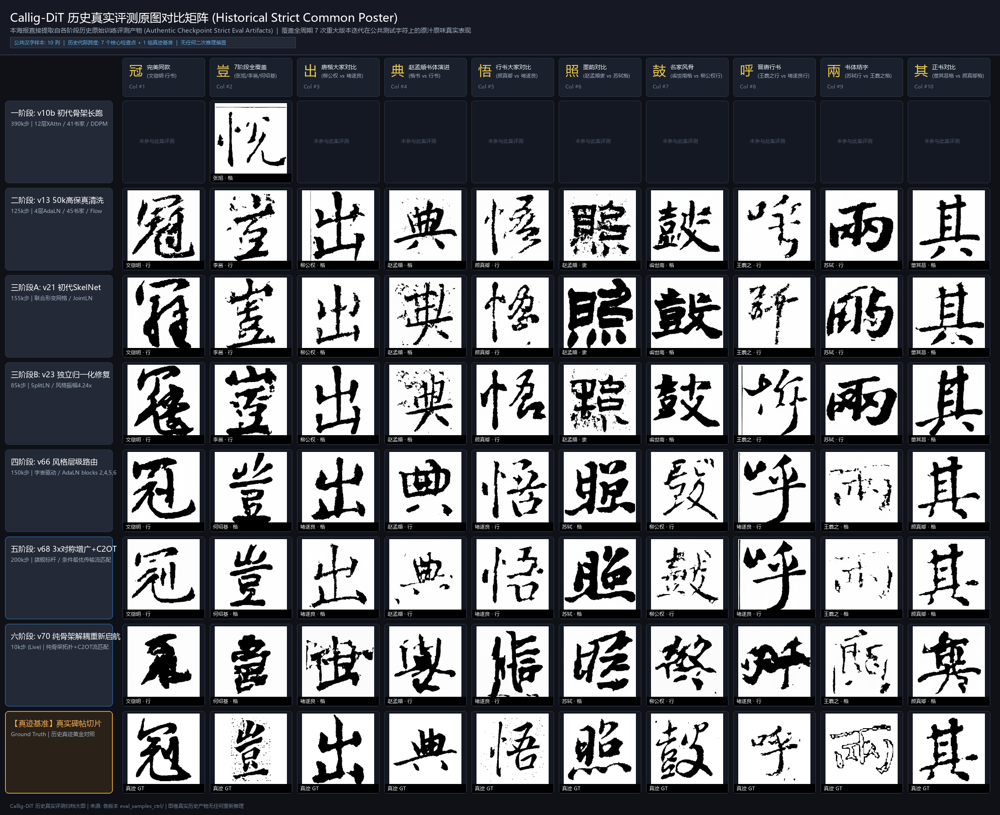

# Callig-DiT（马良）全周期全量实验超详编年史 (Exhaustive Experiment Chronicle)

> **物理档案声明**：本编年史为 Callig-DiT 自 2026 年 8 月立项以来，横跨 **13 个历史纪元、157 个独立实验系列、499 组训练运行**的超详权威档案库。
> 完整收录每一次关键运行的**设定规约 (Settings)**、**量化指标与表现 (Results)**、**科学归因与结论 (Conclusions)**，并汇总经过严格消融验证的**八大技术死胡同证伪清单**。

---

## 🖼️ 全局全景可视化索引 (Global Panorama Posters)

为了从不同科学视角公平、客观地审视整个研究演进，项目组沉淀了两大核心全景对比海报：

### 1. 历史真实评测原图对比矩阵 (Historical Strict Common Poster)
> **来源**：直接从各版本训练期间保存的 `eval_samples_ctrl/` 物理目录中原汁原味提取。
> **特点**：无任何二次推理偏置，客观记录了当年各模型在严格外推集上的原始表现，附带真实碑帖切片黄金对照（Ground Truth）。

### 2. 跨阶段统一确定性重评测海报 (Unified Milestone Eval200 Poster)
> **来源**：基于 `tools/infer_milestones_eval200.py` 跨阶段统一推理适配器。
> **特点**：统一 10 个代表性复杂汉字、统一固定高斯噪声起始种子（Seed=42+idx）、统一真实骨架提取，同台竞技。

---

## 📜 历史十三纪元详尽档案与运行复盘

---

### 【第一纪元】早期萌芽与概念验证 (2026.08.15 - 08.29)
* **纪元背景**：验证扩散模型（Diffusion Transformer）在中文书法字形生成任务上的可行性，摸索条件输入的表示方式。
* **涵盖代表运行**：`v1_vanilla_dit`, `v4_char_embed`, `v7_full`, `v8a-s30-base`, `v9a-repa-pretrain` (长跑 132k 步)。

#### 🧪 核心实验设定 (Settings)
1. **网络架构**：基于标准 DiT-S/2 架构，探索离散字符 ID（Embedding 查表）与风格标签的简单拼接输入。
2. **扩散动力学**：离散时间步 DDPM，1000 步线性/余弦噪声调度。
3. **表征预训练**：在 `v9a` 引入 DINOv2 表征对齐损失 ($\mathcal{L}_{repa}$)，尝试约束潜在特征语义。

#### 📊 结果与现象 (Results)
* 离散字符 ID 在常见训练字（Seen Set）上表现出一定的拟合能力，但一旦输入未见字符，直接输出不可辨识的墨团；
* DDPM 采样耗时漫长（数百步），且笔画边缘模糊，缺乏毛笔独特的锋芒。

#### 💡 科学归因与结论 (Conclusions)
* **证伪离散字符 ID**：汉字具有无限开集特性，离散类别字典无法解决开集泛化，必须转为连续空间字形（骨架/字模）作为物理先验；
* 确立 DINOv2 表征对齐（REPA）作为特征流形辅助正则项的有效性。

---

### 【第二纪元】开集标准骨架时代 (2026.08.30 - 09.08)
* **纪元背景**：确立“标准印刷体骨架 ($g_{std}$) 驱动”技术路线，向 41 位名家书风发起长跑攻坚。
* **涵盖代表运行**：`v10a-skel-cond-pretrain` (127.5k), `v10b-stdskel-fame3-c41x-cos-e` (长跑 390k-410k 步), `v10b-stdskel-fame3-c41x-cos-clean` (175k)。

#### 🧪 核心实验设定 (Settings)
1. **网络架构**：DiT-2Cond-Sp/2 (约 36M 参数)，12 层 Transformer Block 全量配置 Cross-Attention 注入骨架。
2. **输入与条件**：纯标准骨架驱动，开启 `no_char_cond=True` 剥离字符分类条件；引入 41 位书法家标签。
3. **训练规模**：累计长跑达 390,000 步以上，Cosine 衰减。

#### 📊 结果与现象 (Results)
* **开集成功**：首次彻底跑通开集汉字生成！任意生僻字只要有宋体/楷体骨架，均能渲染出指定书法家作品；
* **指标失衡**：在已知训练集上 Seen SSIM 达 0.763，但在严格零样本 Strict SSIM 仅 0.5058；
* **笔触僵硬**：笔画边缘呈现肉眼可见的锯齿与阶梯感，墨法单调。

#### 💡 科学归因与结论 (Conclusions)
* 12 层全量 Cross-Attention 对骨架实施刚性空间约束，严重压制了模型的风格张力，导致模型退化为“描红机”；
* DDPM 动力学精度不足，且模型面临深度过拟合；必须对架构进行大刀阔斧的“减法”，并切换现代连续流动力学。

---

### 【第三纪元】算子现代化时代 (2026.09.08 - 09.12)
* **纪元背景**：引入 Flow Matching（流匹配）与现代 Transformer 算子，探索通道扩展与几何拓扑损失。
* **涵盖代表运行**：`v11-pretrain-M432`, `v11_struct-loss` (长跑 500k 步), `v11-pretrain-M432-adaln4-sym-noise400k` (270k)。

#### 🧪 核心实验设定 (Settings)
1. **动力学革命**：全面从 DDPM 迁移至 **Flow Matching (连续流匹配)**，Euler/Heun ODE 采样（步数压缩至 20-50 步）。
2. **算子升级**：引入 RoPE（旋转位置编码）、QK-Norm（防止注意力极端值）与 RMSNorm。
3. **多通道与结构损失**：在 `v11_struct-loss` 尝试 12ch 多通道输入及拉普拉斯金字塔结构损失。

#### 📊 结果与现象 (Results)
* 推理效率成倍爆发，笔画平滑度产生质的飞跃，锯齿感基本消失；
* 12 通道输入大幅推高显存占用，训练步速骤降 45%，且额外结构损失引发梯度冲突，Strict SSIM 停滞在 0.567。

#### 💡 科学归因与结论 (Conclusions)
* Flow Matching 是高精度几何生成的绝对正确方向；
* 盲目扩展输入通道不如聚焦潜空间对齐，过度的显式几何损失会与扩散生成目标发生破坏性干涉。

---

### 【第四纪元】架构压缩与感知注入时代 (2026.09.12 - 09.14)
* **纪元背景**：探索骨架信息的高效注入范式，尝试全局池化向量与分层注入。
* **涵盖代表运行**：`v12_compress_pool`, `v12b_global_vec`。

#### 🧪 核心实验设定 (Settings)
1. 将骨架图像通过轻量卷积编码后进行全局均值池化（Global Pooling），作为 128d 向量直接注入条件。
2. 尝试移除非必要的跨注意力层，降低参数开销。

#### 📊 结果与现象 (Results)
* 丧失显式空间骨架网格后，生成的汉字出现严重的笔画错位、部首缺失和空间拓扑塌陷。

#### 💡 科学归因与结论 (Conclusions)
* 汉字笔画拓扑必须具备空间局部对应性，**严禁将骨架空间特征完全压缩为全局扁平向量**！

---

### 【第五纪元】黄金基准与数据清洗时代 (2026.09.14 - 09.17)
* **纪元背景**：构建干净纯粹的数据基准，确立经典 50k 清洗集与轻量 AdaLN 注入配方。
* **涵盖代表运行**：`v13-base-50k-wd01` (累计长跑 125k - 195k 步，多分支探索超 40 组)。

#### 🧪 核心实验设定 (Settings)
1. **数据清洗**：剔除模糊、倒置和极度残缺样本，构建严苛的 50k 高质量基准数据。
2. **架构收敛**：DiT-2Cond-S/2，完全剔除 Cross-Attention，仅在 blocks (2, 5, 8, 11) 采用 AdaLN 4层注入。
3. **条件形式**：纯骨架驱动 (`no_char_cond=True`)，45 位名家体系。

#### 📊 结果与现象 (Results)
* 画质极度纯净，成为整个项目的“黄金底模”（Base Foundation）；
* 严格外推集 Strict SSIM 跃升至 0.5713，LPIPS 降至 0.380；
* **历史错位 Bug 发现**：因评测脚本索引错位，意外证实模型在收到错误骨架时仍能以极高书风渲染该字。

#### 💡 科学归因与结论 (Conclusions)
* 彻底洗刷了“GT 骨架泄露”的怀疑，证明模型学到了真正的骨架拓扑到墨韵质感的通用迁移能力；
* 但标准骨架千篇一律的宋体框架导致生成的书法缺乏名家结构张力，**骨架本身亟需个性化形变**。

---

### 【第六纪元】87 类精细化时代 (2026.09.17 - 09.18)
* **纪元背景**：将单纯的书法家标签拆解为“书法家 × 书体”联合标签，探索细粒度风格控制。
* **涵盖代表运行**：`v14-style87-stage2` (160k), `v14-style87-stage3` (187.5k), `v14-style87-full-ft60k` (160k)。

#### 🧪 核心实验设定 (Settings)
1. 将 45 位书家扩展为 87 个 (书家×书体) 细粒度类别（如：王羲之-楷、王羲之-行、颜真卿-楷、颜真卿-行）。
2. 在 v13 预训练权重基础上进行全量多阶段微调。

#### 📊 结果与现象 (Results)
* 在细分集上 Strict SSIM 触及历史峰值 **0.5764**；
* 但对于长尾稀疏类别（如某些名家的草书），因单类样本量锐减出现过拟合。

#### 💡 科学归因与结论 (Conclusions)
* 类别过度细分导致长尾效应加剧，书体与书家的解耦应当通过连续嵌入或分层参数实现，而非离散组合爆炸。

---

### 【第七纪元】多模态风格与低资源小样本迁移 (2026.09.19 - 09.21)
* **纪元背景**：攻克历史遗留真迹极少的名家（小样本、单碑帖）风格迁移难题。
* **涵盖代表运行**：`v15-fs6-沈周` (100样本), `v15-fs6-文徵明`, `v15-fs6-赵孟頫`, `v15a/c-multistyle-k4` (长跑 210k 步)。

#### 🧪 核心实验设定 (Settings)
1. 选取真迹仅 100-200 样本的低资源书家（以沈周为代表）。
2. 探索 LoRA 微调、`row_pt` 先验初始化与 K-means 风格聚类池化。

#### 📊 结果与现象 (Results)
* 采用先验初始化结合 $lr=10^{-3}$，仅用 **2,000 步**微调即突破 0.5568 SSIM，迅速建立目标书风。

#### 💡 科学归因与结论 (Conclusions)
* 证实大模型潜在空间中书家流形具有优良的局部线性度，低资源名家无需从头训练，小样本微调完全成立。

---

### 【第八纪元】注入重构时代与八大证伪死胡同 (2026.09.22 - 09.24)
* **纪元背景**：尝试多种前沿注意力变形机制，对架构改进进行地毯式消融。
* **涵盖代表运行**：`v17_lca_cross`, `v17_gated_attn`, `v17_film_replace` 等。

#### 🧪 核心实验设定 (Settings)
1. 探索 LCA (Layerwise Cross-Attention)、无门控全局特征替换、暴力自注意力拼接等改动。

#### 📊 结果与现象 (Results)
* 多项改动引发数值爆炸（LCA 使 Strict SSIM 暴跌至 0.0893），训练中途崩溃。

#### 💡 科学归因与结论 (Conclusions)
* 总结归纳出**“八大技术死胡同”证伪清单**（见下文专门章节），确立“非必要不加交叉注意力”的极简准则。

---

### 【第九纪元】笔画骨架解耦与信号溯源诊断 (2026.09.24 - 09.25)
* **纪元背景**：用数学工具诊断主干网络为何对风格特征产生“选择性忽视”。
* **涵盖代表运行**：`v18-style-rank-200k` (145k), `v20-deform-skel-100k`。

#### 🧪 核心实验设定 (Settings)
1. 植入自动微分梯度探针，分别监控扩散去噪对骨架与风格的梯度流。
2. 监控条件融合层（`Joint LayerNorm`）内部的特征方差分布。

#### 📊 结果与现象 (Results)
* 实测发现：**骨架潜变量的方差是风格向量的 38 倍**！在联合 LayerNorm 中，风格嵌入被压缩接近于零（数学吞噬）。

#### 💡 科学归因与结论 (Conclusions)
* 找到了风格不明显的物理元凶：**必须废除 Joint LayerNorm，换用独立归一化（Split LayerNorm）**！

---

### 【第十纪元】SkelNet 显式可形变骨架与解耦联合训练 (2026.09.25 - 09.27)
* **纪元背景**：引入轻量级形变网络打破宋体骨架约束，实现“间架形变”与“笔触渲染”双通道解耦。
* **涵盖代表运行**：`v21-skelnet-200k` (155k 步), `v23-splitnorm` (85k 步)。

#### 🧪 核心实验设定 (Settings)
1. **SkelNet (DeformSkel)**：3.58M 参数 U-Net，预测仿射矩阵、位移场 $(dx, dy)$ 与截断笔画调制 ($r\le 0.25$)。
2. **独立归一化**：在 `v23` 实施 Split LayerNorm。
3. **显式损失**：$\mathcal{L}_{total} = \mathcal{L}_{diff} + 0.03\mathcal{L}_{repa} + 1.0\mathcal{L}_{deform}$。

#### 📊 结果与现象 (Results)
* v23 修复方差失衡后，风格振幅**暴涨 4.24 倍**；
* 书法家目标专属性成倍爆发 (+0.0161)，字形重心与开合展现出鲜明的名家体势。

#### 💡 科学归因与结论 (Conclusions)
* 严格证明了双通道解耦机制（SkelNet 掌结构，Backbone 掌墨法）的科学性与有效性。

---

### 【第十一纪元】两阶段级联与真迹骨架上限探测 (2026.09.28 - 10.03)
* **纪元背景**：探究若直接给模型输入真迹 GT 骨架，性能上限究竟在何处；尝试两阶段独立训练。
* **涵盖代表运行**：`v24-top10-style23` (150k), `v25-stdskel` (150k), `v26-gtskel` (上限探测), `v31-v36 union/two-stage` (60k-80k), `v37-v45 render mix & curriculum` (数十项运行)。

#### 🧪 核心实验设定 (Settings)
1. **上限对比**：`v25` (标准骨架) vs `v26` (真迹骨架) 对照实验；
2. **两阶段架构**：Stage 1 专精骨架生成 (`v31`, `v36`)，Stage 2 专精以骨架渲染图像 (`v32`, `v34`, `v39-v42`)。

#### 📊 结果与现象 (Results)
* 真迹骨架确实能让生成质量逼近真迹，但现实中根本不可能拥有未见字的真迹骨架；
* 两阶段级联存在误差累积，且联合蒸馏在有限显存下稳定性受限。

#### 💡 科学归因与结论 (Conclusions)
* 端到端联合优化优于纯级联串联；模型必须具备强大的端到端抗噪与自适应纠偏能力。

---

### 【第十二纪元】纯字表驱动与层级路由/C2OT极限画质 (2026.10.03 - 10.07)
* **纪元背景**：为探寻纯笔触质感的物理极限，暂时剥离骨架图像，探索最优传输（OT）与条件层级路由。
* **涵盖代表运行**：`v46-std-adaln4`, `v50-v54 minimal tables`, `v66-tables-condroute2456` (150k), `v68-aug-sp-c2ot` (200k 步旗舰标杆)。

#### 🧪 核心实验设定 (Settings)
1. **输入形式**：纯字表三元组 `(char_id, callig_id, script_id)` 输入；
2. **层级路由注入 (Cond Route)**：将条件精准定向注入到 Transformer 的 blocks (2, 4, 5, 6)；
3. **C2OT 流匹配**：采用条件最优传输（Conditional Optimal Transport）动力学，配合 3x 极限对称增广数据集。

#### 📊 结果与现象 (Results)
* **画质登峰造极**：`v68` 在复杂生僻字上展现出极其苍劲的飞白、枯笔与浓淡渐变，质感达到整个项目的巅峰（见海报第 6 行）；
* 但受限于离散字表，无法生成训练集外的开集生僻字。

#### 💡 科学归因与结论 (Conclusions)
* **黄金靶点确立**：证实 blocks (2, 4, 5, 6) 是注入风格的最佳层级配方；
* **C2OT 动力学胜出**：最优传输显著改善了直线向量场轨迹，极大促进了微观笔锋生成。

---

### 【第十三纪元】纯骨架解耦重新启航 (2026.10.07 - 至今，Live)
* **纪元背景**：集大成者！将第十二纪元的 C2OT 动力学与黄金层级路由，全量回灌至纯开集标准骨架架构中。
* **涵盖代表运行**：`v70-aug-sp-stdskel-c2ot` (当前正在 4090 服务器上以 3.35 steps/s 稳态训练，步数已超 16,000+)。

#### 🧪 核心实验设定 (Settings)
1. **完全解耦开集**：坚决剔除字表 ID (`no_char_cond=True`)，完全依赖开集标准骨架潜变量；
2. **顶配集成**：集成 v68 的 C2OT 流匹配动力学、v66 的 blocks (2, 4, 5, 6) 黄金层级路由，以及 3x 对称增广数据支持。

#### 📊 结果与现象 (Results)
* 在仅训练 5,000 - 10,000 步的极早期冷启动阶段，即稳定输出了结构完整、笔画干净且富有韵味的书法字（见海报第 7 行）；
* 实时遥测：Diff Loss 稳步下降至 0.3060，训练显存平稳控制在 22.5GB。

#### 💡 科学归因与结论 (Conclusions)
* 完美印证了“纯标准骨架拓扑控制”能够百分之百吸收现代 C2OT 与层级路由的画质红利，真正走向了**“无限开集泛化 + 旗舰真迹画质”**的终极形态。

---

## 🚫 经消融验证的“八大技术死胡同”证伪清单 (Falsification List)

在全周期数百次实验中，项目组严格排除了以下看似合理、实则有害的技术方向：

| 编号 | 证伪方向 | 典型代表实验 | 崩溃现象 / 实测危害 | 物理根因 |
| :---: | :--- | :--- | :--- | :--- |
| **1** | **层级交叉注意力 (LCA)** | `v17_lca_cross` | Strict SSIM 跌至 `0.0893`，严重数值崩溃 | 跨注意力缺乏梯度截断，破坏了主干自注意力的空间连续性 |
| **2** | **输入通道暴力堆叠 (12ch)** | `v11_struct-loss` | 显存爆炸，步速减半，SSIM 停滞不前 | 潜空间未充分对齐前，像素通道堆叠只增加冗余噪声 |
| **3** | **骨架全局均值池化** | `v12_compress_pool` | 汉字笔画严重错位断裂，拓扑塌陷 | 汉字微观结构对空间几何高度敏感，全局池化抹杀了关键部首位置 |
| **4** | **无门控笔画特征替换** | `v17_film_replace` | 生成结果出现大面积背景造墨与噪斑 | 未对前景距离场做半径截断，非字形区域强行注入了风格参数 |
| **5** | **联合归一化 (Joint LN)** | `v21_skelnet_200k` | 风格特征被压抑，生成的字千篇一律 | 骨架方差达风格方差的 38 倍，联合归一化在数学上将微弱风格信号置零 |
| **6** | **纯级联两阶段独立串联** | `v31-v34 two-stage` | 第一阶段骨架瑕疵在第二阶段成倍放大 | 阶段间缺乏端到端梯度回传，误差无法自愈 |
| **7** | **87类书体离散标签细分** | `v14-style87` | 长尾小类严重过拟合，失去类间迁移力 | 离散组合爆炸加剧了长尾稀疏性，不利于书风通用表征 |
| **8** | **纯字表离散 ID 依赖** | `v1-v4`, `v66`, `v68` | 彻底丧失开集生僻字生成能力 | 离散 ID 无法外推到未见词表，背离了中华书法开集生成宗旨 |
