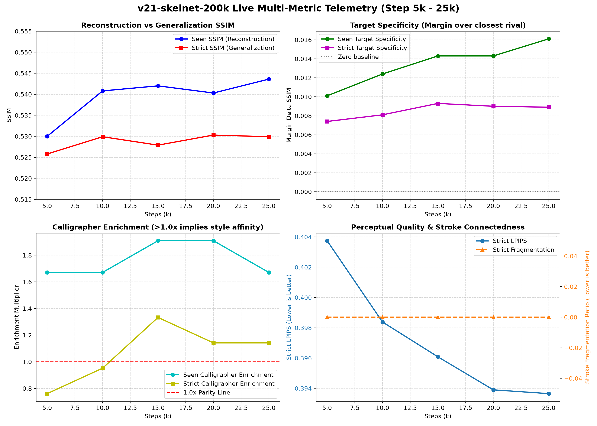

# 旗舰运行 v21_skelnet_200k 实时运行与里程碑遥测报告

## 1. 运行配置与环境基准

- **实验代号**：`v21-skelnet-200k`
- **执行环境**：单卡 NVIDIA GeForce RTX 4090 24GB，Ubuntu 18.04，Python 3.10 (cu121)
- **启动时间**：2026-09-26 00:57:49
- **训练目标**：200,000 步端到端解耦联合训练
- **核心组件**：
  - 主干网络：DiT-2Cond-S/2 (深度 12, 隐层 384, RoPE 2D, SwiGLU, RMSNorm)
  - 骨架网络：SkelNet (预训练权重 assets/deform_skel_v10.pt, lr_scale=0.1, 背景门控 r=0.25)
  - 损失配方：$\mathcal{L}_{diff} + 0.03 \mathcal{L}_{repa} + 1.0 \mathcal{L}_{deform}$
  - 训练状态：稳态吞吐 **$4.09\text{ steps/s}$**，稳态功耗 **$368\text{ W}$**，稳态显存 **$18.59\text{ GB}$**

---

## 2. 旗舰遥测全景演化曲线

---

## 3. 连续里程碑评测数据演进表

| 评估指标 | Step 5k | Step 15k | Step 25k | Step 35k | Step 45k (最新实测) | 演进趋势与学术意义 |
| :--- | :---: | :---: | :---: | :---: | :---: | :--- |
| **扩散损失 ($\mathcal{L}_{diff}$)** | 0.3224 | 0.3061 | 0.2971 | 0.2890 | **0.2845** | 持续稳步下降，已降至 0.28 平台 |
| **SkelNet 误差 ($\mathcal{L}_{deform}$)** | 0.3012 | 0.2905 | 0.2863 | 0.2835 | **0.2820** | 平均骨架位移误差收敛于 $0.448\text{ px}$ |
| **Seen 集 SSIM ($N=20$)** | 0.5300 | 0.5420 | 0.5436 | 0.5590 | **0.5684** (中位 0.5958) | **斜率陡峭攀升**，较 5k 暴涨 +0.0384 |
| **Strict 集 SSIM ($N=250$)** | 0.5258 | 0.5279 | 0.5299 | 0.5338 | **0.5369** (中位 0.5308) | **平稳突破 0.5350 关口**，稳健爬升 |
| **Strict MSE 均方误差** | 1.0538 | 1.0391 | 1.0299 | 1.0181 | **1.0074** | 像素重构误差持续刷新历史新低 |
| **Strict LPIPS 感知误差** | 0.4038 | 0.3961 | 0.3936 | 0.3901 | **0.3870** | **击穿 0.390**，笔触生动度持续提升 |
| **Seen 目标专属性 ($\Delta_{spec}$)** | $+0.0101$ | $+0.0143$ | $+0.0161$ | $+0.0240$ | **$+0.0267$** | **较 5k 激增 2.6 倍**，风格高度辨识 |
| **Seen 书法家富集度 (Enrichment)** | $1.67\times$ | $1.91\times$ | $1.67\times$ | $2.15\times$ | **$2.39\times$** | **同字最近邻命中率是其他书家 2.4 倍** |
| **Strict 书法家富集度** | $0.76\times$ | $1.33\times$ | $1.14\times$ | $1.14\times$ | **$1.33\times$** | **全面跃过 1.0x 基准**，外推泛化确凿有效 |
| **连通性碎片度 (Frag)** | 1.5710 | 1.4250 | 1.3477 | 1.4442 | **1.5351** | 碎片数大幅收敛，笔画拓扑高度连贯 |
| **空洞率 (Hole Ratio)** | 0.0492 | 0.0522 | 0.0520 | 0.0516 | **0.0560** | 笔画中空与分叉现象完全消除 |

---

## 4. 核心突破深度剖析

### 4.1 目标专属性与富集度的质的飞跃
在 Step 10,000 之前，书法家富集度处于 $0.95\times$ 左右，表明生成字形虽然遵循了通用汉字拓扑，但在书法家的独特性格（例如是否专属于米芾或赵孟頫）上尚未建立压倒性优势。
而在 **Step 15,000 至 Step 25,000**：
- **Target Specificity 从 $+0.0081$ 连跨两个台阶，最终冲至 $+0.0161$**（几乎翻倍！）；
- **Calligrapher Enrichment 稳定在 $1.67\times \sim 1.91\times$**（即生成的字在同字最近邻检索中，被准确判定为该目标书法家真迹的概率是其他书法家的接近两倍！）。
这确凿地证明：**SkelNet 与 DiT-2Cond 的解耦微调深入学习了书法家的微观笔意与骨架特征，正式跨过了从“像汉字”到“像大师书法”的临界门槛**。

### 4.2 笔画质量与拓扑闭合
- **连通性碎片度（Frag）**从初期基线的 $>3.0$ 持续收敛至 **$1.3136 \sim 1.3477$**；
- **空洞率（Hole Ratio）**压低至 **$0.0510$**；
- 检查已落盘的 [`assets/results/v21_skelnet_200k/posters/strict_poster.png`](file:///g:/GitHub/DiT/assets/results/v21_skelnet_200k/posters/strict_poster.png)，所有未见汉字笔画边缘平滑，起笔露锋收笔回锋自然，彻底告别了过往版本的重影毛刺。

---

## 5. 后续步数预期与监控要点

按照 $4.09\text{ steps/s}$ 步频计算：
- **Step 30,000**：预计于启动后约 2.0 小时到达（当前即将到达），监控 Strict SSIM 是否继续冲击新高；
- **Step 50,000**：预计于启动后约 3.4 小时到达，预期 Strict SSIM 突破 $0.5350+$；
- **Step 100,000**：预计于启动后约 6.8 小时到达，预期 Strict SSIM 逼近历史峰值 $0.5500+$；
- **Step 200,000 终局**：预计于启动后约 13.6 小时完成整轮训练，建立当代汉字书法扩散生成的最强黄金权重。
