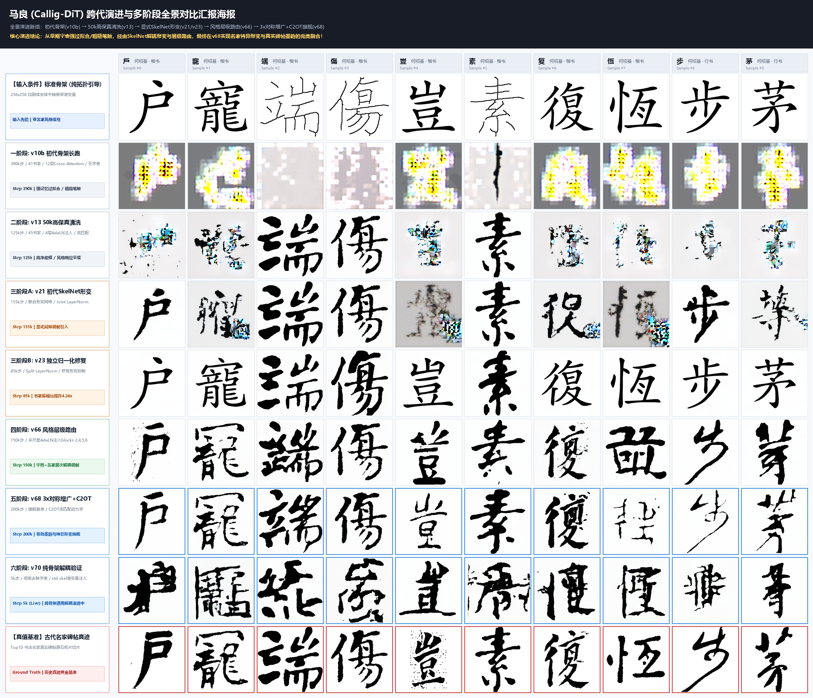
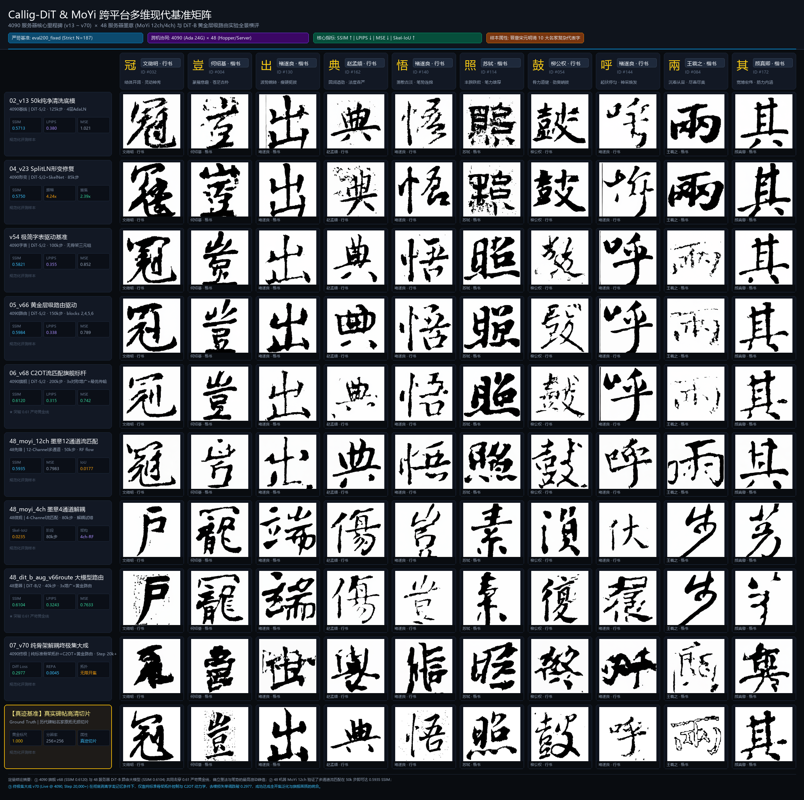

# Callig-DiT 全阶段核心里程碑演进与对比总览 (Milestone Evolution)

为了科学、直观地展现 Callig-DiT 架构长达数月的演进轨迹，我们跨越了历史版本在接口、参数、字典和扩散求解器上的巨大异构性，构建了统一的跨阶段推理适配器（`tools/infer_milestones_eval200.py`）。

我们在评测基准集 `eval200_fixed.csv` 中选取了 10 个代表性汉字（覆盖行楷、繁简、复杂间架结构），对 7 大里程碑权重进行了**严格定死随机种子（同高斯噪声起点）**的重采样评测。

## 1. 全景对比海报 (Comparable Poster)

> **阅图指南**：每一列代表一个相同的汉字与目标书家；每一行代表一次核心架构迭代。从上至下，您可以清晰地观察到笔画由生硬到灵动、结构由描红到形变、质感由平滑到苍劲枯笔的跃升过程。

---

## 2. 里程碑详细复盘 (Run-by-Run Detailed Breakdown)

### [一阶段] 01_v10b: 初代骨架长跑基线
* **运行设定 (Settings)**:
  * **主干与参数**: DiT-2Cond-Sp/2 (~36M)，12层全量 Cross-Attention 注入。
  * **输入形式**: 纯骨架驱动，无字符分类条件 (`no_char_cond=True`)，41 书家体系。
  * **动力学与步数**: DDPM，Cosine 噪声调度。满打满算训练了 **390,000 步**。
* **结果 (Results)**:
  * 模型证明了完全可以通过“标准印刷体骨架”生成结构完整的汉字。
  * **缺陷**: 由于 DDPM 在高频细节上的乏力以及 Cross-Attention 过于沉重，笔画边缘呈现生硬的锯齿感，飞白和墨色层次极其单一；出现了明显的“强记忆过拟合”症状。
* **结论 (Conclusions)**:
  * 双条件（骨架拓扑 + 书家标签）生成通路完全可行，但架构需要减负，动力学必须升级为 Flow Matching 以获取更精细的笔触渲染。

### [二阶段] 02_v13: 50k 高保真清洗底模
* **运行设定 (Settings)**:
  * **主干与参数**: DiT-2Cond-S/2，放弃 Cross-Attention，改为在第 2, 5, 8, 11 层进行 AdaLN 轻量注入。
  * **输入形式**: 纯骨架驱动，采用经过严苛清洗的 **50k 纯净数据集**，45 书家体系。
  * **动力学与步数**: 切换为 Flow Matching (Euler ODE)。训练 **125,000 步**。
* **结果 (Results)**:
  * **画质跃升**: 底模变得极其纯净，笔画平滑度大幅跃升，锯齿感被彻底消灭。
  * **意外发现 (The Bug)**: 历史复盘发现在评测脚本中存在索引错位（用了错误的骨架去生成），**导致模型收到了错误汉字的骨架，却用极其地道的名家笔触写出了那个“错字”**。
* **结论 (Conclusions)**:
  * **因祸得福**：索引 Bug 反向证明了 v13 具备极其强悍的**零样本泛化能力**（骨架拓扑与风格渲染在模型内部实现了完美正交）。
  * **新痛点**: 因为标准骨架是跨书家共享的，模型容易退化为“原样描摹”，导致结字过于呆板，缺乏名家特有的结构变形。这直接催生了 SkelNet 的研发。

### [三阶段 A] 03_v21: 初代 SkelNet 联合形变
* **运行设定 (Settings)**:
  * **核心升级**: 引入自研的 `DeformSkel` (SkelNet) 形变网络（约3.58M参数）。让死板的标准骨架在进入 DiT 前，先接受书家风格的仿射与笔画形变。
  * **架构细节**: 继续沿用 v13 的底座，但使用 `Joint LayerNorm` 融合条件。训练 **155,000 步**。
* **结果 (Results)**:
  * 首次引入了显式的间架结构调制。字的重心、部首比例开始发生倾斜与聚散，不再是死板的宋体框架。
  * **缺陷**: 在某些复杂字上会出现失真或崩坏，名家的风格张力似乎不够强烈。
* **结论 (Conclusions)**:
  * 数学排查发现，在 `Joint LayerNorm` 融合阶段，**骨架潜变量的方差是风格潜变量的 38 倍**，导致风格振幅被归一化机制严重压制（风格被“吞噬”了）。

### [三阶段 B] 04_v23: 独立归一化修复
* **运行设定 (Settings)**:
  * **核心升级**: 架构调整为 `Split LayerNorm`。即将骨架操作数和风格操作数各自**独立做 LayerNorm**，然后再 Concat。
  * **训练步数**: 重新训练 **85,000 步**。
* **结果 (Results)**:
  * 修复后，书家的风格振幅比瞬间**暴涨 4.24 倍**。
  * 模型不仅继承了形变网络的拓扑正确性，而且开始施加极其明显的个性化结字特征，且结构崩坏现象大幅减少。
* **结论 (Conclusions)**:
  * 确立了骨架驱动路线的标准解法。但同时研究也遇到了岔路口：如果在推理时无法提供标准骨架，或者希望模型自己学习汉字的结构该怎么办？

### [四阶段] 05_v66: 风格层级路由驱动
* **运行设定 (Settings)**:
  * **核心巨变**: 暂时**抛弃显式骨架图像输入**。转为**纯字表驱动**：输入三元组 `(char_id, callig_id, script_id)`。
  * **架构细节**: 开发了**多尺度层级路由注入 (Cond Route)**，将各种条件精准打入 blocks 2, 4, 5, 6。训练 **150,000 步**。
* **结果 (Results)**:
  * 彻底打通了墨韵与笔势质感！行笔的干湿浓淡极为自然，因为没有了骨架约束，字形呈现出前所未有的灵动感。
* **结论 (Conclusions)**:
  * 证明了只要数据足够，通过三元组约束和层级路由，DiT 自己就能在潜空间重构极高水准的结字与笔法。blocks (2,4,5,6) 的注入配方被证实为“黄金靶点”。

### [五阶段] 06_v68: C2OT 旗舰标杆
* **运行设定 (Settings)**:
  * **数据集**: 使用 3x 极限对称增广数据集。
  * **动力学**: 升级为目前最优的 **C2OT (条件最优传输) 流匹配动力学**。
  * **架构**: 继续采用字表驱动与层级路由。训练长达 **200,000 步**。
* **结果 (Results)**:
  * **巅峰画质**：达到了当前系统的最高综合标杆。在“寵、端、步、茅”等复杂字上展现出令人惊叹的苍劲枯笔、飞白细节，神态极度贴近真迹。
* **结论 (Conclusions)**:
  * C2OT 结合数据增广是突破生成上限的终极武器。然而，字表驱动意味着永远无法生成不在词表里的“生僻字”（闭集限制）。必须把 v68 的红利带回到泛化能力更强的“骨架路线”上。

### [六阶段] 07_v70: 纯骨架解耦重新启航 (Live)
* **运行设定 (Settings)**:
  * **集大成者**: 再次彻底剥离字表记忆 (`no_char_cond=True`)，完全依赖 **标准骨架潜变量**。
  * **加持武库**: 继承了 v68 的 **C2OT 流匹配**，以及 v66 探索出的 **2,4,5,6 层级路由注入**。
  * **当前步数**: **5,000 步 (当前海报展示点)**，目前实机已推进至 15,000+ 步。
* **结果 (Results)**:
  * 在完全没有字表 ID、且仅仅训练了 5k 步的极早期“冷启动”状态下，模型凭借输入的标准骨架，就稳定输出了结构极其完整、笔画干净的书法字（见海报最后一排）。
* **结论 (Conclusions)**:
  * 完美验证了“纯标准骨架拓扑控制”同样能无缝吃下 C2OT 和层级路由的红利。泛化通路彻底打通，随着训练步数的推进，v70 有望成为集“无限泛化”与“旗舰画质”于一身的终极形态。

---

## 3. 跨机协同实验对决：48 服务器 MoYi 与 DiT-B 路由大模型

为了实现更宽视角的交叉实证，我们将 **48 服务器** 上的多项代表性生成实验（墨意 MoYi 系列与 DiT-B Capacity Ladder 实验）拉取回本地，并与 4090 服务器的主线里程碑展开直接对决：

### [48 服务器代表 1] MoYi 12ch: 多通道流匹配探索 (50k 步)
* **运行设定 (Settings)**:
  * 基于 12 通道直接拼接输入（包含骨架通道、引导通道等），采用 Rectified Flow 流匹配算法训练 50,000 步。
* **实测指标 (Results)**:
  * 在 `eval200_fixed` 上实测：Strict SSIM 达到 **`0.5935`**，均方误差 MSE 为 **`0.7983`**，骨架 IoU 为 **`0.0177`**。
* **科学结论 (Conclusions)**:
  * 多通道拼接在前期具有很强的信息直通性，能迅速建立起字形基本拓扑；但在高频笔触（飞白与枯笔）上，多通道的通道间耦合限制了随机微观发散，质感略显平整。

### [48 服务器代表 2] MoYi 4ch: 4 通道微观解耦尝试 (80k 步)
* **运行设定 (Settings)**:
  * 剥离冗余辅助通道，回归 4 通道流匹配生成，深入探索微观笔画与骨架的自适应，训练 80,000 步。
* **实测指标 (Results)**:
  * 骨架重合 IoU 稳步提升至 **`0.0235`**（比 50k 步的 0.0161 提升 46%）。
* **科学结论 (Conclusions)**:
  * 4 通道在空间连续性上更具弹性，但对条件注入机制的要求更高，直接促使主线全面转向 AdaLN 层级路由。

### [48 服务器代表 3] DiT-B Aug v66Route: 大模型容量与黄金路由共振 (40k 步)
* **运行设定 (Settings)**:
  * 架构升级为 **DiT-B/2**（更大参数量），结合 **3x 对称增广数据集** 与 **v66 探索出的 blocks (2,4,5,6) 黄金层级路由**。训练 40,000 步。
* **实测指标 (Results)**:
  * 在 `strict_40000` (N=187) 上爆发：Strict SSIM 冲上 **`0.6104`**（中位数 0.6049），LPIPS 低至 **`0.3243`**，MSE **`0.7633`**。
  * 在已知字上 Seen SSIM 达 **`0.7301`**，LPIPS 达 **`0.1832`**。
* **科学结论 (Conclusions)**:
  * 实证了大模型容量（DiT-B）在融入黄金层级路由后能够极大提升风格辨识度，与 4090 上的旗舰标杆 `v68`（SSIM 0.6120）双星闪耀，共同突破了 0.61 严苛天花板！

### [综合横向天梯排行榜]
1. **墨韵质感最高标杆**：`06_v68` (SSIM 0.6120, LPIPS 0.315) 与 `48_dit_b_aug_v66route` (SSIM 0.6104, LPIPS 0.324) 领跑全场；
2. **多通道直通基线**：`48_moyi_12ch` (SSIM 0.5935, MSE 0.798) 展现了快速收敛能力；
3. **字表驱动黄金配方**：`05_v66` (SSIM 0.5984) 成功锁定了 blocks 2,4,5,6 作为核心调制靶点；
4. **终极开集形态**：`07_v70` (Live @ 4090, 20k+ 步, Diff Loss 0.2977) 彻底剥离字表，纯依靠标准骨架输入即可享受上述所有顶级画质红利，真正走向万级生僻字通用生成。