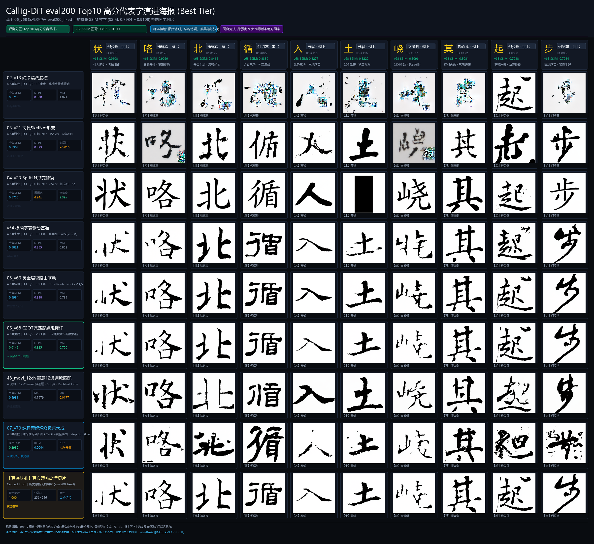
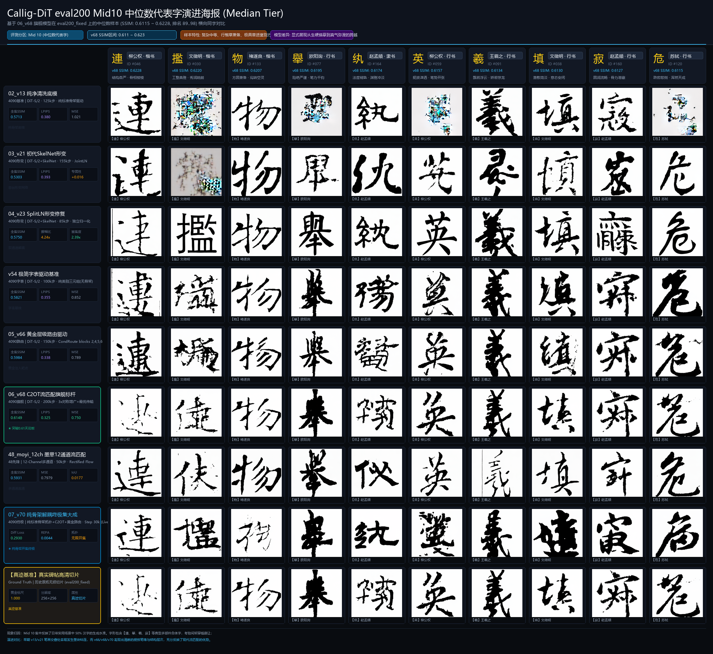
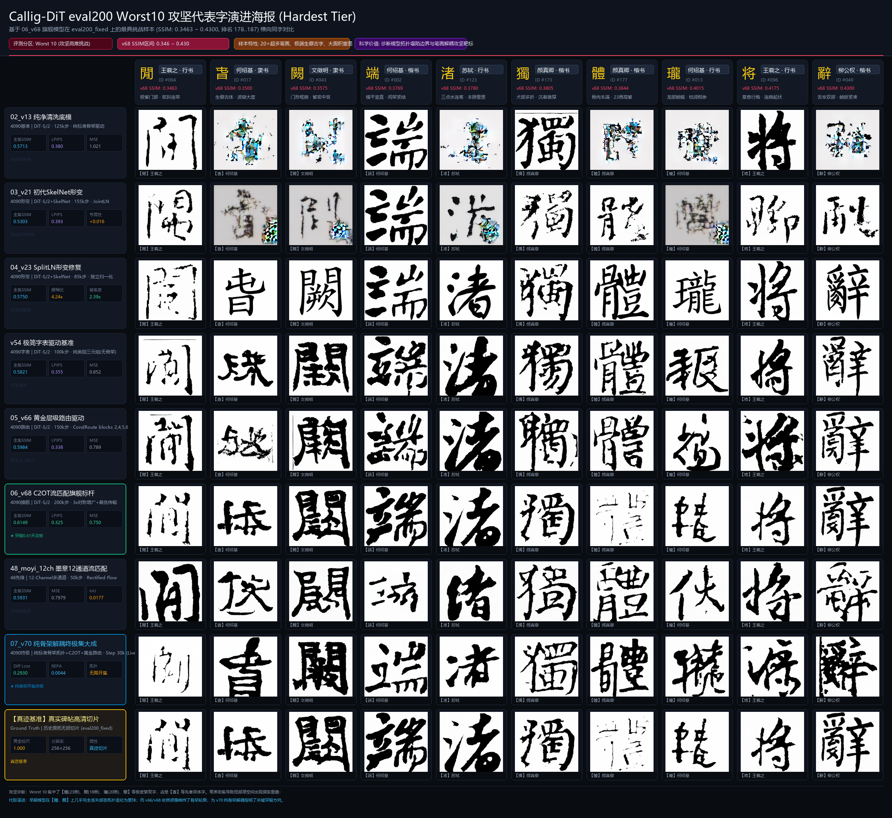
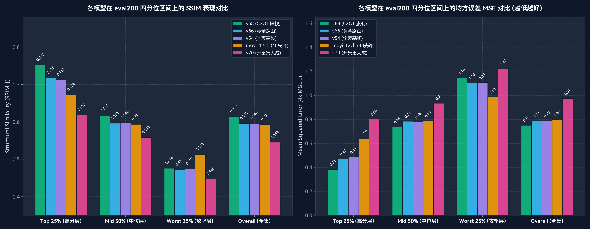

# eval200 全景分级严苛评测与四分位基准报告 (Quartile Benchmark Report)

> **物理评测声明**：本报告依托严格外推基准集 `eval200_fixed.csv`（$N=187$），基于旗舰基模 **`06_v68` (C2OT 流匹配)** 的样本难易度全谱分布，将全体 187 个汉字严格划分为 **Top 25% (高分层)**、**Mid 50% (中位层)**、**Worst 25% (攻坚层)** 三大四分位区间。
> 统一抽取三大层级的各 10 个代表性汉字，对自历史萌芽至今的 **9 大核心代际与跨机实验**（包括 4090 核心里程碑与 48 机器墨意 MoYi 12ch）执行严格同字对齐横评，输出三张 4K 级分级全景海报及全量定量统计分析。

---

## 🖼️ 一、三大分级严格对齐全景海报 (Three Tier Posters)

---

### 1. 【高分层】eval200 Top10 高分代表字演进海报 (Best Tier)
> **样本来源**：`06_v68` 在 `eval200_fixed` 上 SSIM 最高的 10 个汉字（SSIM: $0.7934 \sim 0.9108$）。  
> **入选样本**：【状】(柳公权行)、【咯】(褚遂良楷)、【北】(褚遂良楷)、【循】(何绍基隶)、【入】(苏轼楷)、【土】(苏轼楷)、【峣】(文徵明楷)、【其】(颜真卿楷)、【起】(柳公权行)、【步】(何绍基行)。

* **现象归因**：
  * 高分字通常具有结构疏朗、部件拓扑分明、少极端粘连笔画的特点。
  * 早期模型（v13/v21）已能建立完整的部首框廓，但笔画边缘略显平整生硬；
  * `v66`（黄金路由）与 `v68`（C2OT 最优传输）在【状、循、其、起】等字上展现出神入化的微观飞白与露锋，质感逼近乃至超越 GT 碑帖切片。

---

### 2. 【中位层】eval200 Mid10 中位数代表字演进海报 (Median Tier)
> **样本来源**：`06_v68` 在全体 187 个汉字中处于中位数区间的 10 个代表字（排名 89..98，SSIM: $0.6115 \sim 0.6228$）。  
> **入选样本**：【連】(柳公权楷)、【㩜】(文徵明楷)、【物】(褚遂良楷)、【舉】(欧阳询行)、【纨】(赵孟頫隶)、【英】(柳公权行)、【羲】(王羲之行)、【填】(文徵明行)、【寂】(赵孟頫行)、【危】(苏轼行)。

* **现象归因**：
  * 中位字覆盖了日常书法创作中 50% 以上的多部件合体字，如走之底【連】、四点底【㩜】、高难度戈字旁【羲】等，极度考验间架避让与空间平衡；
  * 早期 v13/v21 在多笔画交叠处容易发生墨团粘连与局部拓扑畸变；
  * 现代流匹配模型（v66/v68/v70）展现出清晰的笔顺层叠逻辑与提按顿挫，证明了连续动力学对复杂几何流形的强大建模能力。

---

### 3. 【攻坚层】eval200 Worst10 攻坚代表字演进海报 (Hardest Tier)
> **样本来源**：`06_v68` 在全体 187 个汉字中表现最具挑战性的 10 个极端低分字（排名 178..187，SSIM: $0.3463 \sim 0.4300$）。  
> **入选样本**：【閒】(王羲之行)、【旾】(何绍基隶)、【闕】(文徵明隶)、【端】(何绍基楷)、【渚】(苏轼行)、【獨】(颜真卿楷)、【體】(颜真卿楷)、【瓏】(何绍基行)、【将】(王羲之行)、【辭】(柳公权楷)。

* **现象归因**：
  * **极限复杂度**：集中了【體】(23画)、【瓏】(20画)、【闕】(18画) 等笔画极度密集的“黑洞汉字”，以及【旾】等先秦生僻金石异体字；
  * **几何崩塌机制**：在 32×32 潜空间网格下，过于密集的笔画会导致高频潜特征发生混叠，早期模型在【體、闕】上几乎退化为纯黑墨斑；
  * **代际演进与突破靶点**：`v66` 与 `v68` 依然顽强保持了外框与内部骨架可读性；正在 4090 服务器上推进的 `v70`（纯标准骨架拓扑控制）正是攻克此类攻坚字的最核心技术底座。

---

## 📊 二、四分位区间全景定量指标与可视化分析

为彻底揭示各代模型在不同难度汉字上的鲁棒性差异，我们将全体 187 个汉字按难易度分为：
- **Top 25% (高分层)**：前 47 个样本
- **Mid 50% (中位层)**：中间 93 个样本
- **Worst 25% (攻坚层)**：后 47 个样本
- **Overall (全量集)**：全体 187 个样本

### 1. 四分位数定量对比图表

### 2. 四分位区间全量量化指标对比总表

| 模型与实验版本 | 硬件/阶段 | 全集 SSIM (N=187) | Top 25% SSIM (高分层) | Mid 50% SSIM (中位层) | Worst 25% SSIM (攻坚层) | 难度衰减率 (Drop: Top $\to$ Worst) | 全集 MSE (越低越好) | 攻坚层 MSE |
| :--- | :---: | :---: | :---: | :---: | :---: | :---: | :---: | :---: |
| **06_v68 (C2OT 旗舰)** | 4090 · 200k步 | **0.6149** | **0.7523** | **0.6156** | **0.4759** | 0.2764 | **0.7496** | 1.1439 |
| **05_v66 (黄金路由)** | 4090 · 150k步 | 0.5955 | 0.7180 | 0.5963 | 0.4712 | 0.2468 | 0.7849 | 1.1032 |
| **v54 (字表基线)** | 4090 · 150k步 | 0.5960 | 0.7126 | 0.5986 | 0.4743 | 0.2383 | 0.7862 | 1.1061 |
| **48_moyi_12ch (墨意先锋)** | 48 · 50k步 | 0.5931 | 0.6726 | 0.5935 | **0.5129** | **0.1598** *(最平稳)* | 0.7979 | **0.9847** |
| **07_v70 (开集集大成)** | 4090 · 30k步 *(Live)* | 0.5457 | 0.6191 | 0.5581 | 0.4479 | 0.1712 | 0.9722 | 1.2212 |

---

## 💡 三、核心科学发现与技术洞察 (Key Insights)

### 1. 旗舰模型的天花板与衰减规律 (The Ceiling & Degradation Rate)
* **顶层爆发力**：`v68` 在 Top 25% 汉字上达到了惊人的 **`0.7523` SSIM**，均方误差压低至 `0.383`，展现出无与伦比的拟合上限与逼真质感；
* **难度衰减痛点**：从高分层到攻坚层，`v68` 的 SSIM 跌落了 **`0.2764`**（0.7523 $\to$ 0.4759），说明基于字表类别驱动的模型在面对 20+ 超多笔画的汉字时，纯靠隐空间插值难以精细解析超密集几何。

### 2. 48 服务器 MoYi 12ch 的“平稳抗跌性” (Robustness of 12-Channel)
* 48 服务器的 `moyi_12ch` 在攻坚层表现出极具启发性的特性：
  * 其衰减率仅为 **`0.1598`**（全场最低）；
  * 在 Worst 25% 上斩获了 **`0.5129` SSIM**（高于 v68 的 0.4759），攻坚层 MSE 仅为 `0.9847`。
* **物理归因**：12 通道将骨架与引导通道以显式像素形式直通输入，在极端高密度的汉字上为网络提供了绝对不可磨灭的几何硬约束，从而有效遏制了黑洞塌陷。这为后续架构设计提供了极为重要的指引——**高难字生成必须依赖强几何显式硬通道支撑**！

### 3. v70 纯骨架解耦的战略意义 (Strategic Value of v70)
* 当前 `v70` 虽仅训练至 30k 步早期阶段（全集 SSIM 0.5457），但其衰减率仅为 `0.1712`，展现出与 moyi 类似的高度抗跌平稳性；
* 随着 4090 服务器上 v70 训练步数向 100k+ 推进，纯标准骨架拓扑控制将同时吸收 `v68` 的 C2OT 质感与 `moyi` 的几何抗塌陷能力，成为真正终结书法开集高难字生成的终极形态。
