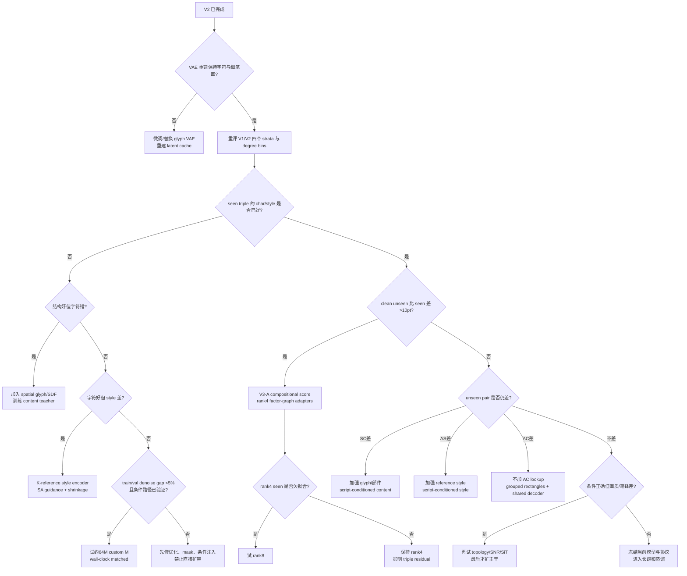

# 稀疏三因子书法生成：可辨识性、模型设计与实验决策方案

> 日期：2026-08-15  
> 状态：V1/V2 已完成，V3-A 二因子版实施中（从头训练）  
> 目标模型：`calligrapher × glyph(=script×character)` 条件的 latent DiT  
> 原则：事实、论文证据和工程推断分开陈述；不把完整笛卡尔积的空白误当成普通插值。

## 0. 结论摘要

当前失败的第一原因不是 DiT-S/2 只有约 34M 参数，而是条件在统计上不可辨识、在网络中又过早坍缩成一个全局向量：

1. 训练集只有 93,738 个唯一三元组，占配置空间的 0.2639%，且 81.98% 的 observed triples 只有一张图。
2. 实际活跃类别只有 1004 个书家和 7011 个字；7 个书家、15 个字完全没有训练样本。书家样本中位数只有 5，字符中位数只有 10。
3. 79.28% 的书家只出现在一种书体中。`calligrapher` 与 `script` 严重混杂，不能把 script 当作与书家、字符平级的第三个独立 lookup。
4. 3 因子 `factorized_add` 只是把三个 embedding 相加后交给非线性 DiT；不同三元组的和几乎必然仍是唯一编码，因此它没有从函数上禁止 triple memorization，且 script 与书家混杂（`I=1.527 bits`）使 script 这条边提供的是重复而非独立信息。
5. V2 的 latent Canny/Skeleton 微调到 24k 后，MSE 仅改善约 0.28%，SSIM 反而从 0.45762 降到 0.4503。几何正则不能回答“是不是指定的字”。

推荐路线不是直接上 B/2 或 XL，而是分四步：

- **V3-A：二因子可组合 score，不增参数。** 把 `script×character` 合并为一个 glyph 类（`glyph_id = script_id×7026+character_id`，35130 类），任务降为 `calligrapher × glyph` 二因子；显式训练 `full`、`callig-only`、`glyph-only`、`unconditional` 四种条件 mask（`60/15/15/10`），用 product-of-experts / Möbius 分解组合 content 与 style score。
- **V3-B：条件图 adapter。** 把条件图固定为 `character ↔ script ↔ calligrapher`，分别注入 content/style 的低秩 AdaLN residual；rank 从 4 开始，最多先试 8。
- **V4：空间字形 + 参考风格。** 字符用 raster/SDF/skeleton 或低秩空间字形码；书家风格由同一 `(calligrapher,script)` 的其他字符参考图聚合，ID 仅作受收缩约束的 residual。
- **容量分叉。** 只有当 seen 与 unseen 都同样差、条件 adherence 已经正确、且训练/验证去噪 gap 很小，才把主干升级到 `D=512,L=12` 的约 59–64M 中间档。

建议最终主模型控制在约 **40M 总参数**；条件 encoder 冻结并缓存后，实际可训练参数约 36–40M。自然图 ImageNet DiT-XL 只做修正 PEFT 后的短 pilot，不作为默认方案。

---

## 1. 数据事实：问题应当看成三部超图，不是连续坐标插值

记书家、书体、字符分别为 (A,S,C)，唯一 GT 三元组集合为

\[
E\subseteq A\times S\times C.
\]

三个 ID 轴都是类别轴。任意重排 ID 会改变散点图的距离、凸包和条纹位置，却不会改变学习问题。因而散点图适合展示稀疏程度；真正决定组合可学性的是节点度、pair edge、连通分量、矩形闭环和缺失机制。

### 1.1 基本规模

| 项目 | 数值 |
|---|---:|
| rows | 147,841 |
| unique triples | 93,738 |
| 配置空间 | `1011 × 5 × 7026 = 35,516,430` |
| observed triple coverage | 0.2639% |
| 每个 unique triple 平均图片 | 1.577 |
| singleton triples | 81.98% |
| active/config calligraphers | 1004 / 1011 |
| active/config scripts | 5 / 5 |
| active/config characters | 7011 / 7026 |

扩散噪声可以为同一张图产生无穷多个 `(t, ε)` 训练对，但这些监督都位于同一个已见图像及其噪声邻域；它们不会增加任何缺失条件组合的语义证据。

### 1.2 长尾与混杂

| 因子 | min | median | p90 | p99 | max | singleton | `≤5` rows |
|---|---:|---:|---:|---:|---:|---:|---:|
| calligrapher | 1 | 5 | 177 | 2061 | 21416 | 258 | 505 |
| character | 1 | 10 | 56 | 124 | 276 | 572 | 2233 |
| script | 21918 | 24667 | 51028 | 51028 | 51028 | 0 | 0 |

- 最大书家占 14.49% rows，top-10 书家占 49.93%。书家频率的 HHI effective categories 只有 22.6，而不是名义上的 1004。
- 书家按出现书体数 `1/2/3/4/5 = 796/143/46/12/7`；79.28% 书家只有一种书体。
- 字符按出现书体数 `1/2/3/4/5 = 1738/1276/922/936/2139`。
- `I(calligrapher; script)=1.527 bits`，约解释 68.3% 的 script 熵。书家与书体不是近似独立因素。
- 82,262 个 `(calligrapher,character)` pair 中，88.15% 只在一种 script 中出现。

因此，singleton/零样本书家的“跨字符风格”不能由一个自由 128-D ID 向量从数据中识别出来；增加主干参数也不会产生缺失的反事实。

### 1.3 pair coverage 与可要求的外推层级

| pair | observed | full | density |
|---|---:|---:|---:|
| calligrapher-script | 1,303 | 5,055 | 25.78% |
| script-character | 21,495 | 35,130 | 61.19% |
| calligrapher-character | 82,262 | 7,103,286 | 1.158% |

将未见组合分成四个等级：

| 等级 | 定义 | cell 数 | 本项目中的含义 |
|---|---|---:|---|
| L0 | observed triple | 93,738 | 拟合/重现 |
| L1 | triple 未见，但三条 pair edge 全见 | 104,010 | **首要组合泛化目标** |
| L2 | `(A,S)`、`(S,C)` 已见，但 `(A,C)` 未见 | 5,450,929 | 需要更强 factor/content/style 先验 |
| L3 | 缺关键 pair，或 factor 本身零样本 | 29,867,753 | 纯 ID 模型下不可辨识，必须有侧信息 |

L0+L1 一共只有 197,748 个 cell，占完整空间 0.5568%。所以“做好完整 35.5M 空间”必须先明确是否允许标准字形、参考图、部件/笔画等侧信息；没有这些信息时，绝大部分空间不是普通组合插值。

### 1.4 图并未整体断裂，但当前训练没有利用闭环

各 script 的 `calligrapher-character` 二部图巨型连通分量覆盖超过 99.9% observed edges，89.9%–95.3% observed edges 至少属于一个同 script 的 `2×2` 矩形；五种 script 合计约 28.56M 个矩形。核心区域存在足够的局部反事实证据。

当前 factor-balanced batch=224 的模拟结果却是：

- 平均仅 10.94/224 个样本在同 batch 内有“同字、不同书家”伙伴；
- 平均 162.77/224 有“同书家、不同字”伙伴；
- 仅 0.1% batch 含同 script 的完整 `2×2` 矩形。

仅把 paired samples 放入同一 batch 不会改变独立 diffusion MSE 的期望；必须同时加入 content/style invariance、swap、contrastive 或 ANOVA consistency loss。

### 1.5 当前 split 有组合泄漏

condition probe 的 row-random 5% validation 中，47.23% val rows 的同一个 triple 仍出现在 train；20 个 seed 的泄漏范围为 46.52%–48.40%。远端真实 test 也混合了：

| stratum | rows | ratio |
|---|---:|---:|
| seen triple | 2214 | 47.58% |
| clean unseen triple | 499 | 10.72% |
| unseen pair | 1917 | 41.20% |
| unseen factor | 23 | 0.49% |

后续所有报告必须分开 `seen / clean unseen triple / unseen pair / unseen factor`，并在 clean stratum 内再按 factor/pair degree 分层。不能再给一个混合平均分。

---

## 2. V1/V2 告诉了我们什么

### 2.1 参数口径纠正

用户此前记录的 36.16M trainable 对应 legacy concat S/2，不是 compact V2：

| 模型 | total | trainable |
|---|---:|---:|
| legacy concat S/2 | 36,258,848 | 36,160,544 |
| V2 compact factorized S/2 | 34,194,912 | 34,096,608 |

V2 的 98,304 非 trainable 参数是固定位置编码。compact conditioning 共 1,615,936，仅占 trainable 的 4.74%；主干 blocks 有 31,919,616 参数。问题不是 embedding 表占满模型，而是尾部 ID 对应的自由向量缺乏数据约束。

### 2.2 V1 终点

- checkpoint：V1 step 20k
- 所有训练 row 至少出现一次；约 30.3 dataset-equivalent draws
- clean unseen triple：MSE 1.00497，SSIM 0.45762
- 18k SSIM 0.45779，与 20k 的差异可忽略
- 视觉上仍有缺笔、墨块和字符结构错误

### 2.3 V2 终点

V2 从 V1 20k 继续 4k，使用 latent Canny 0.05、latent Skeleton 0.005、`t≤500`；训练于 step 24k 自然、干净退出：

| step | MSE | SSIM |
|---:|---:|---:|
| 21k | 1.00425 | 0.4545 |
| 22k | 1.00262 | 0.4533 |
| 23k | 1.00426 | 0.4509 |
| 24k | 1.00220 | 0.4503 |

相对 V1 20k，MSE 只改善约 0.28%，SSIM 连续退化约 1.6%。这不是“结构 loss 永远无用”的证明，但足以说明它不应继续作为主攻方向：Canny/Skeleton 能约束边缘和连通性，不能识别 7,026 个字符的语义身份，也不能建立书家/书体的反事实。

V3 应从 V1 20k 作为主基线开始；V2 24k 保留为“latent structure fine-tune”对照，而不是继续叠加结构权重。

---

## 3. 数学诊断

### 3.1 Off-support 不可辨识：loss 无法定义未见组合

标准噪声预测目标为

\[
\mathcal L_{\mathrm{diff}}=
\mathbb E_{(x,a,s,c)\sim p_{\mathrm{data}},t,\epsilon}
\left[\|\epsilon-\epsilon_\theta(x_t,t,a,s,c)\|_2^2\right].
\]

若 ((a,s,c)\notin\operatorname{supp}(p_{\mathrm{data}}))，该条件在经验风险中权重为零。总能构造两个模型 (f,g)，使它们在所有 observed triples 上完全相同、在某个未见 triple 上任意不同；两者训练 loss 相同。

因此：

- 再训练更久不能创造缺失组合的信息；
- Canny、Skeleton、OCR 或 style loss 若仍只作用于 observed GT，也不能单独消除不可辨识性；
- 泛化必须来自明确的函数限制、共享侧信息、分组监督或预训练先验。

这是本方案中所有结构选择的出发点。

### 3.2 为什么 `factorized_add` 不是真正的函数因子化

当前实现为

\[
z=P_Ae_a+P_Se_s+P_Ce_c,\qquad
\epsilon_\theta=F_\theta(x_t,t,z).
\]

对连续随机初始化的 embedding，有限个不同三元组的 (z) 几乎必然互不相同。于是 (z) 仍可充当 triple key，后续非线性 (F_\theta) 可以记忆 observed triples。

只有当 (F) 对条件严格线性时，加法才等价于 (f_A(a)+f_S(s)+f_C(c))。所以当前设计是“参数压缩和软共享”，不是组合泛化的数学保证。

### 3.3 从函数 ANOVA 到任务条件图

一般三因子函数可写成

\[
f=f_0+f_A+f_S+f_C+f_{AS}+f_{SC}+f_{AC}+f_{ASC}.
\]

本任务更合理的归纳偏置是

\[
C\longleftrightarrow S\longleftrightarrow A,
\]

其中：

- (f_{SC})：某字符在某书体下的形态与结构；
- (f_{AS})：某书家在某书体下的用笔与风格；
- 不建立自由的 (A\times C) lookup；
- 不建立 triple table；
- 局部“风格如何作用于具体笔画”由共享图像 decoder 根据空间 content 与 style code 计算。

这不是声称真实数据严格满足该因果图，而是有意选择一个能在 L1/L2 上外推、又不会轻易记完整三元组的假设。

### 3.4 Product-of-experts score 组合

若采用近似条件独立假设 (A\perp C\mid X,S)，则忽略与 (x) 无关的归一化常数，有

\[
p(x\mid a,s,c)\propto
\frac{p(x\mid s,c)p(x\mid s,a)}{p(x\mid s)}.
\]

因此 score 可组合为

\[
\nabla_x\log p(x\mid a,s,c)
\approx s_{SC}(x)+s_{SA}(x)-s_S(x).
\]

在固定 timestep 下，score 与 epsilon 只相差已知标量，所以相同线性组合可用于 epsilon prediction。定义三阶 Möbius residual：

\[
\Delta_{ASC}=\epsilon_{ASC}-\epsilon_{SC}-\epsilon_{SA}+\epsilon_S.
\]

最终多轴 CFG 写成：

\[
\begin{aligned}
\epsilon_{\mathrm{guided}}={}&\epsilon_\emptyset
+w_S(\epsilon_S-\epsilon_\emptyset)\\
&+w_C(\epsilon_{SC}-\epsilon_S)
+w_A(\epsilon_{SA}-\epsilon_S)\\
&+w_I(\epsilon_{ASC}-\epsilon_{SC}-\epsilon_{SA}+\epsilon_S).
\end{aligned}
\]

- (w_S=w_C=w_A=1,w_I=0) 时得到 pair-composed score；
- 再令 (w_I=1) 时严格恢复 full score；
- 在 unseen triple 上减小 (w_I) 可抑制 triple-specific residual；
- (|\Delta_{ASC}|/\|\epsilon_{ASC}\|) 本身就是“模型有多依赖三阶记忆”的诊断指标。

训练只需每个样本随机选一种 mask，不增加训练前向次数；推理需要 3–5 个分支，但可以沿 batch 维拼接，确认有效后再做 guidance distillation。

### 3.5 低秩上限的数量级

把 `(calligrapher,script)` 合并为 5055 行、character 为 7026 列，rank-(r) 矩阵自由度约为

\[
d_r=r(5055+7026-r).
\]

| rank | 自由度 |
|---:|---:|
| 4 | 48,308 |
| 8 | 96,584 |
| 16 | 193,040 |
| 32 | 385,568 |

unique observed cells 只有 93,738；裸 rank-8 矩阵的自由度已经略高于观测数。真实图像生成共享了大量视觉结构，不能把这张表当作严格样本复杂度界；但它是很好的容量警告。矩阵/张量补全理论还要求近似随机采样和 incoherence，而本数据明显是条带状、长尾、MNAR。

所以显式 interaction rank 从 **4** 开始，必要时试 **8**；只有 rank-8 明确表现为 train/seen 同时欠拟合时才试 16，不应直接用 32/64。

### 3.6 长尾 embedding 应当做层次化收缩

对第 (i) 个 ID 使用

\[
e_i=e_i^{\mathrm{prior}}+\alpha(n_i)\Delta e_i,
\qquad
\alpha(n)=\sqrt{\frac{n}{n+\tau}}.
\]

- `prior` 来自 canonical glyph、style reference encoder 或 script/global mean；
- (Delta e_i) 是低维 ID residual；
- 零样本和 singleton 自动依赖 prior，而不是一条几乎无约束的随机向量；
- `tau` 在 `{4,16,64}` 中通过 degree-stratified validation 选择。

### 3.7 为什么“再多跑几遍”可能只改善局部，不改善整字

Favero et al. (ICML 2025) 在层次组合生成的理论模型与实验中发现：diffusion model 会按上下文相似性逐层聚类特征；更高层、依赖更长上下文的组合规则需要更多数据，有限数据或训练量常先得到局部 coherence，而缺少全局 coherence。

这不是对本数据的直接定理，但与当前现象一致：模型较早学到“像毛笔笔画、像某种书体”的局部统计，V2 又进一步奖励边缘和骨架；它仍可能没有足够信号把局部笔画组织成指定字符的全局结构。空间 glyph condition 的价值正是把高层结构作为已知输入，而不是继续等待 diffusion loss 自行发现一套 7,026 类的书写语法。

---

## 4. 相关工作与可迁移结论

| 工作 | 论文证据 | 对本项目的直接启示 |
|---|---|---|
| Matrix/tensor completion | Candès & Recht 2009；Jain & Oh 2014；Kolda & Bader 2009 | 低秩可以补全，但随机缺失/incoherence 条件不满足；rank 必须保守 |
| Bilinear style/content | Tenenbaum & Freeman 2000 | 乘性低秩 style-content factor 比 triple lookup 更适合未见组合 |
| Disentanglement identifiability | Locatello et al. 2019 | 仅 reconstruction/diffusion loss 不会自动得到可辨识的内容/风格分解 |
| Weak paired supervision | Locatello et al. 2020 | 共享一个潜因子的 image pairs 能提供有效弱监督；支持 grouped/paired batch + invariance loss |
| Classifier-Free Guidance | Ho & Salimans 2022 | 同一网络训练 conditional/unconditional score，可推广到多个条件子集 |
| Composable Diffusion | Liu et al. 2022 | energy/score 加法可以组合训练时未共同出现的概念 |
| Composer | Huang et al. 2023 | 分解条件并随机 dropout，支持组合控制；mask 必须匹配目标条件图 |
| DM-Font | Cha et al. 2020 | 部件级 memory 与 compositional sharing 对复杂字符和少样本有价值 |
| LF-Font | Park et al. 2021 | 中文局部 component style 可分解为 component factor × style factor |
| MX-Font | Park et al. 2021 | localized experts、content-style adversarial/independence loss 支持因子分离 |
| Diff-Font | He et al. 2024 | stroke-wise 数据/目标直接改善复杂汉字完整性 |
| FontDiffuser | Yang et al. 2024 | multi-scale content aggregation + style contrastive refinement 分别处理字形与风格 |
| GlyphControl | Yang et al. 2023 | 精确视觉文字依赖 raster glyph 空间条件，不宜只给全局 character token |
| DiT | Peebles & Xie 2023 | 在 ImageNet 上增加 GFLOPs 改善 FID，但不能推出稀疏条件组合会因扩容自动泛化 |
| Min-SNR | Hang et al. 2023 | timestep 之间存在梯度冲突；可在结构正确后改善训练效率 |
| REPA | Yu et al. 2025 | 外部视觉表征可显著加速 DiT/SiT；本任务应优先使用 glyph-domain teacher |

相关论文与正式链接见文末参考资料。论文结果都不是对本书法数据的直接保证；本文中的 `C-S-A` 条件图和具体阈值属于工程假设，必须用消融验证。

---

## 5. 目标模型

### 5.1 V3-A：先验证二因子可组合 score，参数量不变

沿用用户判断：**script 不是与书家、字符平级的第三因子**——88.15% 的 `(calligrapher,character)` pair 只出现在一种 script 中，script 信息应并入内容条件而不是单独 lookup。因此把 `script×character` 合并为 glyph 类，任务降为 `calligrapher × glyph` 二因子，在 `DiT-2Cond-S/2` 上保持 V1 的 factorized_add 投影结构（callig 128 + glyph 192 → 384），从头训练。

推荐 mask 概率（4-way）：

| mask | 概率 | 学到的 score |
|---|---:|---|
| `full`（callig+glyph） | 60% | joint score（含 interaction） |
| `callig-only`（drop glyph） | 15% | style score `s_A` |
| `glyph-only`（drop callig） | 15% | content score `s_G` |
| unconditional | 10% | global base / CFG |

实现：`cond_drop_all_prob=0.10, cond_drop_one_prob=0.30`，drop-one 时 `which∈{0,1}` 等概率决定 drop callig 还是 drop glyph。

理由：V1/V2 的 3 因子相加已证明单靠微调/结构损失不够；二因子化把条件图从 3 节点降到 2 节点，去掉了 script 这条与书家严重混杂（`I=1.527 bits`）的边，使每个未见的 `(callig,glyph)` 组合只需组合两个各自训练充分的边际 score。若 full fidelity 明显回退，再改为 `70/10/10/10`。

评估时同时输出：

1. `full CFG`（`eps_uncond + cfg×(eps_full − eps_uncond)`）；
2. `s_A + s_G − s_0` pair-composed（Möbius 组合，`s_0`=uncond）；
3. `w_I∈{0,0.25,0.5,1}` 的 interaction sweep；
4. 按 timestep 的 normalized `Δ_{AG}` norm。

该实验不增加模型参数，只换 mask scheduler 和采样公式，最便宜地回答：当前网络是否已经学到可用的 marginal score，以及 triple residual 是否正在损害 unseen 组合。

### 5.2 V3-B：条件图低秩 adapter

如果 V3-A 的 pair-composed score 优于 full score，但仍不够好，就把 content/style 在网络中物理分开。

先构造 script-conditioned 因子：

\[
h_{SC}=h_C+U_{SC}\left[(V_Ch_C)\odot q_s\right],
\]

\[
h_{AS}=h_A+U_{AS}\left[(V_Ah_A)\odot r_s\right].
\]

每个 block 的调制改为：

\[
m_l=m_l^t(t)+B_l^C A_l^C h_{SC}+B_l^A A_l^A h_{AS}
+g_lB_l^I\left[(U_lh_{SC})\odot(V_lh_{AS})\right].
\]

- content、style 使用独立低秩 residual；
- script 同时路由两条支路，而不是成为第三个平级相加的 embedding；
- interaction gate (g_l) 零初始化并强正则；
- 不增加 `(A,C)` 或 `(A,S,C)` lookup；
- rank 依次试 4、8；16 仅在 underfit 分叉使用。

在 `D=384,L=12` 下，rank-8 的三条 block residual 约增加 0.77M；加上投影、gate 后仍应把 V3-B 控制在约 **35–37M**。

### 5.3 V4：字符必须成为空间条件

让一个全局 192-D char ID 指挥 16×16 latent patch tokens 生成 7,026 种复杂拓扑，样本效率很低。优先级从高到低的 content source：

1. licensed standard-font raster / SDF / skeleton；
2. 只由 training split 构建的 `(character,script)` medoid 或聚合 skeleton；
3. Unicode IDS、部件、偏旁、stroke sequence；
4. 低秩学习式空间 char code，作为无外部字体时的 fallback。

学习式空间码可用 CP 分解：

\[
P_c[p,d]=\sum_{r=1}^{R}
A_C[c,r]B_P[p,r]B_D[d,r],
\]

其中 (p=1\ldots256) 对应 16×16 patches。取 (R=32) 时约需

\[
7027\times32+256\times32+384\times32\approx0.245\text{M}
\]

参数，比为每个字符建立完整空间 feature map 小得多。建议把 content feature 在 stem 和每三个 block 的零初始化 residual 处注入，而不是复制一套完整 ControlNet。

### 5.4 V4：风格必须主要来自参考图，而不是稀疏 ID

为目标 `(a,s,c)` 从 training split 选择 (K=1\ldots4) 张相同 `(a,s)`、不同 character 的参考图：

\[
z_{AS}=\operatorname{Aggregate}_{k}
E_{\mathrm{style}}(x_{a,s,c_k}),\qquad c_k\ne c.
\]

- 参考 feature 可离线缓存，主训练不必保留 style encoder 激活；
- calligrapher ID 只保留 32-D residual，并使用 count-dependent shrinkage；
- 对没有不同字符参考的 singleton `(a,s)`，回退到单样本 feature + script/global prior，并显式标记低置信度；
- 评估时 reference bank 只能来自 train，绝不能取目标 test 图或同一 triple。

这一步把任务从“靠 ID 猜风格”改成标准 few-shot font/calligraphy generation，更符合数据实际能提供的信息。

### 5.5 约 40M 的推荐预算

| 组件 | 参数预算 |
|---|---:|
| S/2 backbone（移除现有大条件表后的主体） | 32.48M |
| multi-scale glyph/SDF encoder | 0.5–0.8M |
| K-reference style encoder | 3–4M |
| content/style 低秩 AdaLN residual | 1–2M |
| 四阶段空间 residual injection | 约 0.59M |
| `SC`、`AS` 低秩 interaction | 0.1–0.45M |
| 32-D char/callig residual ID tables | 约 0.26M |
| projections / gates | 约 0.2M |
| **总计** | **约 39.8–40.5M** |

若 glyph/style encoder 预训练后冻结并缓存，generator 训练时的 trainable 参数可控制在约 36–40M，单步开销预计是当前的 1.05–1.15×，而不是 B/2 的约 3.8×。

---

## 6. Loss、SNR 与 sampler

### 6.1 总目标

\[
\mathcal L=
\mathcal L_{\mathrm{diff}}
+\lambda_Cw(t)\mathcal L_{\mathrm{content}}
+\lambda_Aw(t)\mathcal L_{\mathrm{style}}
+\lambda_Tw(t)\mathcal L_{\mathrm{topology}}
+\lambda_I\mathcal L_{\mathrm{ANOVA}}.
\]

建议按阶段加入，而不是一次全开：

- V3-A：只有 diffusion loss，先验证 mask/score 组合；
- V3-B：加入低权重 content/style feature loss；
- V4：加入空间 glyph condition 和 reference style；
- topology loss 仅在“字符身份已正确但断笔仍明显”时重新启用。

### 6.2 content/style teacher

本地预训练两个小网络：

- (E_C(z))：same-character、跨 calligrapher/script 为 positives；预测 character/部件，并用 gradient reversal 或 covariance penalty 去除 style；
- (E_{AS}(z))：same `(calligrapher,script)`、不同 character 为 positives；预测 writer/script，并去除 character 信息。

当前 condition probe 的 char top-1 仅 53.7%，只能用于相对诊断，不能直接当强 teacher。teacher 必须在 triple-disjoint、degree-stratified split 上校准。

### 6.3 为什么 auxiliary loss 必须做 SNR weighting

epsilon prediction 得到

\[
\hat x_0=
\frac{x_t-\sqrt{1-\bar\alpha_t}\hat\epsilon}
{\sqrt{\bar\alpha_t}}.
\]

其对 epsilon error 的放大系数为

\[
\sqrt{\frac{1-\bar\alpha_t}{\bar\alpha_t}}
=\frac{1}{\sqrt{\mathrm{SNR}(t)}}.
\]

所以高噪声时直接对 (hat x_0) 加结构/识别 loss 会放大梯度。推荐

\[
w(t)=\min\left(1,\frac{\mathrm{SNR}(t)}{\kappa}\right)
\]

并保留低/中噪声 gate；`t≤500` 只是粗截断，SNR 权重更连续。基础 diffusion loss 是否改为 Min-SNR-γ，要在条件结构确定后单独 A/B，避免同时改变太多变量。

### 6.4 grouped/rectangle sampler

保持 effective batch 224，建议一半 content groups、一半 style groups：

- 16 个 character group × 7 张 = 112；
- 16 个 `(calligrapher,script)` group × 7 张 = 112。

每个数据 epoch 所有 rows 先无放回做 anchor，partner 仅用于组内监督，避免当前 weighted replacement 长时间漏掉某些高频/低权重 rows。

组内目标：

- same char 跨 style：content feature invariance；
- same `(A,S)` 跨 char：style feature invariance；
- 从训练集中真实存在的同 script `2×2` rectangle 抽取四边，做 feature swap/cycle consistency；
- 按 hub degree 降权，避免 28.56M rectangles 被少数大节点主导。

---

## 7. VAE 与预训练路线

### 7.1 先测 VAE 上限

当前使用自然图像 Stable Diffusion VAE。必须对 stratified GT 做 `encode→decode`，分别统计五种 script 和 degree bins：

- raw-GT 与 recon 的 character accuracy retention；
- skeleton F1/IoU、Chamfer 或 clDice；
- 细笔画断裂率；
- 人工检查至少 500 张困难字符。

建议 gate：recon 相对 raw GT 的 char accuracy 下降超过 2 个百分点、skeleton 指标下降超过 0.02，或人工错字/关键断笔超过 1%，则先做 glyph-domain VAE fine-tune，再重建 latent cache。阈值是工程门槛，需要由更可靠 OCR/人工标注校准。

### 7.2 首选预训练：稠密字形矩阵

构建 licensed synthetic font matrix，例如

\[
7026\ \text{characters}\times200\ \text{fonts}
\approx1.4\text{M glyphs}.
\]

先从 32/64 fonts 做 scaling pilot，再决定是否扩到 200。训练目标：

- content encoder：同字符跨字体为 positives；
- style encoder：同字体跨字符为 positives；
- content-style cross-covariance/adversarial 去耦；
- raster/SDF/skeleton 多尺度 content condition；
- reference glyph set 作为 style condition；
- 可选 Unicode IDS/部件作为第二内容通道。

这类预训练真正增加了未见 style-character 组合，而在同一 147k GT 上再过几十遍没有增加组合证据。

### 7.3 真实书法阶段的 warm start

优先顺序：

1. 从 V1 20k 的 S/2 body warm-start；
2. 新增条件模块全部零初始化，使 step 0 保持原输出；
3. glyph/style encoder 先冻结、feature 离线缓存；
4. backbone LR `1e-5`，新 adapter/head LR `1e-4`，embedding/residual LR `3e-5`；
5. 4k fine-tune 的 EMA 用 `0.999–0.9995` 并同时评估 online/EMA。`0.9999` 的半衰期约 6931 updates，对 4k 新模块适应太慢。

可使用 FontDiffuser/LF-Font/MX-Font 的公开模型作为 reference-conditioned baseline 或 content/style encoder 蒸馏源；它们不能直接初始化 DiT blocks，但比自然图 DINO 更贴合字形任务。

### 7.4 SiT、REPA 与自然图 XL

- **SiT**：同结构/参数量下可能改善优化与采样，但不解决条件不可辨识；在 V4 条件固定后做等算力 A/B。
- **REPA**：优先用 glyph-domain content encoder 对齐 noisy hidden；自然图 DINOv2 可能忽略形近汉字的细微差异。
- **ImageNet DiT-XL**：只做备选 pilot。它可能提供通用视觉/优化先验，但不提供汉字拓扑和书家-书体分解。

当前 XL+LoRA 代码还有一个容量陷阱：`train_cond_head=true` 会训练全部 AdaLN/final layer，约 225.84M；加 LoRA r8 和 compact cond 后实际约 231.9M trainable，并不是 PEFT。若试 XL，必须：

- 不 reset、冻结原 full AdaLN；
- 用低秩 residual modulation 适配新条件；
- EMA 只维护 delta；
- gradient checkpointing；
- microbatch 4–8，累积到 effective batch 224；
- 只跑 1k–2k wall-clock matched pilot。

若 XL 明显领先，可把 score/velocity 蒸馏回结构化 S/M，而不是直接部署 XL。

---

## 8. 参数、算力与“多大才会过拟合”

现代深网的参数数目不是有效容量的充分统计量；过参数化网络可以泛化，也可以记忆随机标签。Zhang et al. (2017) 直接展示了标准网络拟合随机标签的能力，Belkin et al. (2019) 则说明测试风险随容量可能出现 double descent。这里应以 seen/unseen gap、degree-tail gap、权重范数和条件 adherence 判断，而不是用单一 `parameters / images` 比例。

当前 V2 已有约 230.6 trainable parameters / row、363.7 parameters / unique triple，足以记忆训练支持集。扩大主干不会为 singleton/zero-shot ID 增加证据。

### 8.1 当前 block 参数公式

隐藏宽度 (D)、层数 (L)、MLP ratio 4 时，每个当前 DiT block 约为

\[
P_{\mathrm{block}}=
(4D^2+4D)_{\mathrm{attn}}
+(8D^2+5D)_{\mathrm{MLP}}
+(6D^2+6D)_{\mathrm{adaLN}}
=18D^2+15D.
\]

compact condition 为

\[
P_{\mathrm{cond}}=
\sum_f(N_f+1)d_f+
\sum_f(d_fD+D+2d_f).
\]

### 8.2 候选模型

| 方案 | 参数 | 相对前向算力 | 24GB 建议 microbatch | 决策 |
|---|---:|---:|---:|---|
| legacy S/2 | 36.16M trainable | 约 1.0× | 224 | 历史基线 |
| current V2 compact S/2 | 34.10M trainable | 1.0× | 224 | 已完成 |
| V3-A 二因子 score composition | 39.58M | 训练 1.0×；采样 3–5 passes | 224 | **第一优先级（实施中）** |
| V3-B factor-graph adapters | 约 35–37M | 1.02–1.08× | 192–224 | 第二优先级 |
| V4 structured S | 约 39.8–40.5M total | 1.05–1.15× | 192–224 | 推荐最终档 |
| custom M `D=512,L=12` | 当前 compact 59.32M；结构化约 64M | 约 1.8× | 128–160 | S 确认欠拟合后 |
| structured B | 约 136M | 约 3.8× | 64–96 | 需大量领域预训练后 |
| ImageNet XL PEFT | 675.6M total / 目标 10–15M trainable delta | 约 19.8× | 4–8 | 仅短 pilot |

### 8.3 判断欠拟合还是记忆

- train/seen 与 clean-unseen 都差，denoise train/val gap `<5%`，条件 probe/ablation 已证明条件有效：可以升到 M。
- seen 持续变好，clean-unseen 或 unseen-pair 停滞/回退，gap `>10%`：这是组合记忆，禁止扩容。
- head 与 tail adherence 差 `>15` 个百分点：样本/先验问题，增加 reference encoder 和 shrinkage。
- raw GT 经 VAE 已错字/断笔：先修 VAE。
- char/style 都正确，仅纹理、笔锋细节差：才考虑增加 backbone 或更好的生成 objective。

---

## 9. 实验矩阵

所有实验使用固定 seed、固定 eval rows、online/EMA 双报告和分 stratum/degree 指标。一次只改变一个主要假设。

| ID | 实验 | 起点 | 主要变化 | steps | 成功标准 |
|---|---|---|---|---:|---|
| E00 | VAE ceiling | GT | encode/decode 分层评估 | 0 | 达到 §7.1 gate |
| E01 | V1/V2 公平重评 | V1-20k/V2-24k | seen/clean/pair/factor + degree bins | 0 | 建立可信基线 |
| E10 | V3-A 二因子 masks | 从头（无 warm start） | `60/15/15/10` 4-way masks，glyph=script×char 合并 | 39.6k | pair-composed clean adherence 优于 full |
| E11 | interaction sweep | E10 | `wI=0/.25/.5/1` | 0 | 找到 seen/clean Pareto 点 |
| E20 | rank-4 adapters | V1-20k | separate content/style modulation | 4k | clean gap 下降且 seen 不退化 >2pt |
| E21 | rank-8 adapters | E20 对照 | rank 8 | 4k | 仅在 rank-4 seen underfit 时运行 |
| E30 | spatial glyph only | 最佳 V3 | glyph/SDF spatial condition | 4–8k | char adherence、复杂字/尾部显著改善 |
| E31 | reference style only | 最佳 V3 | cached K-reference style | 4–8k | style retrieval、尾部 writer 改善 |
| E40 | full structured S | 最佳单项 | glyph + ref style + rank4/8 | 8–20k | seen/clean/pair 综合最佳 |
| E50 | custom M | E40 recipe | `D=512,L=12` | wall-clock matched | seen/clean 同时提升 ≥5%，否则回退 |
| E60 | SiT/Min-SNR | 最佳结构 | objective A/B | wall-clock matched | 收敛速度/最终质量有稳定收益 |
| E70 | XL corrected PEFT | official XL | 真正 10–15M delta | 1–2k | 相同墙钟显著超过 S/M，否则停止 |

### 9.1 核心指标

- character top-1/top-5 与 prototype retrieval；
- calligrapher/style retrieval、script accuracy；
- skeleton F1/clDice、edge F1、SSIM、LPIPS；
- `seen / clean unseen triple / unseen pair / unseen factor`；
- factor/pair degree bins；
- normalized (Delta_{ASC}) norm；
- 条件消融敏感度：drop/swap 一个因子后，相应 feature 应变化、其他 feature 应稳定；
- 最近训练样本 LPIPS/feature distance，检查 memorization。

SSIM/MSE 只能衡量与单个 GT 的像素相似度；自由生成可能存在多个合理书写，因此最终判断必须同时看字符身份、风格 adherence、结构和人工检查。

---

## 10. 结果驱动决策树



---

## 11. 实施顺序与代码边界

### Phase 0：评估与数据协议

1. 建立 immutable split manifest：seen、clean、unseen-pair、unseen-factor；记录 train support hash。
2. 在 clean 内记录 factor/pair degree，禁止 image-level 平均掩盖泄漏。
3. 完成 VAE ceiling、V1/V2 全 stratum 重评。
4. 训练更可靠的 content/style evaluator；现有 probe 保留作 lower-bound diagnostic。

### Phase 1：V3-A

- `models.py`：forward 接受显式 condition mask，不在模型内部随机决定；保持旧 checkpoint 兼容。
- `train.py`：实现可复现 subset-mask scheduler；保存每种 mask 的实际计数。
- `eval_gen.py`：实现 `S/SC/SA/SAC/uncond` batched CFG 和 interaction sweep。
- 新测试：所有 mask、batch>1 CFG、`wI=1` 恢复 full score 的代数恒等式。

### Phase 2：V3-B

- 新建独立 `condition_graph.py`，避免继续把复杂条件逻辑塞入 `models.py`。
- content/style low-rank adapter 零初始化；rank 和 gate 写入 checkpoint args。
- optimizer 使用 backbone/new-head 分组 LR。
- checkpoint 保存 model/EMA 的新模块并验证无 missing/unexpected keys。

### Phase 3：V4

- `glyph_condition.py`：train-only prototype bank、SDF/skeleton、CP fallback。
- `style_memory.py`：reference selection、target exclusion、cache version/hash。
- `samplers.py`：anchor-coverage + grouped partners + rectangle sampling。
- `latent_factor_encoder.py`：content/style teacher 与冻结 feature cache。
- 任何 target-derived side information 都必须在 eval 前做 leakage test。

### 实验目录命名

建议：

```text
5script/results/compositional/
  20260815-v3a-s2-subset-score-poe-from-v1-20k/
  20260815-v3b-s2-factorgraph-r4-from-v1-20k/
  20260815-v4-s2-r4-glyph-sdf-refstyle-k4/
```

每个目录保存 resolved config、source manifest/hash、split manifest hash、参数量、峰值显存、吞吐、在线/EMA 指标和固定样例。

---

## 12. 需要明确接受的边界

1. **零样本 factor 无法由纯 ID 学会。** 7 个零样本书家和 15 个零样本字符必须删除、补数据，或依赖 reference/glyph side information。
2. **singleton writer 的跨字符风格不可辨识。** 一张图同时包含字符内容和风格；没有共享先验或参考式模型，无法唯一拆分。
3. **L1 与完整 35.5M 空间不是同一目标。** 先把三条 pair 都见过的 104,010 个 clean cells 做好，再讨论 L2；L3 必须另立 side-information 协议。
4. **结构 loss 不是 OCR。** V2 已给出直接反例：边缘目标的优化不等于字符身份提高。
5. **更大模型只能在证据充分时扩展已有规律。** 它不能创造缺失 factor/pair 的信息，反而可能更快记忆 triple key。

---

## 参考资料

1. Candès & Recht, 2009, *Exact Matrix Completion via Convex Optimization*. https://doi.org/10.1007/s10208-009-9045-5
2. Jain & Oh, 2014, *Provable Tensor Factorization with Missing Data*. https://arxiv.org/abs/1406.2784
3. Kolda & Bader, 2009, *Tensor Decompositions and Applications*. https://doi.org/10.1137/07070111X
4. Tenenbaum & Freeman, 2000, *Separating Style and Content with Bilinear Models*. https://doi.org/10.1162/089976600300015349
5. Locatello et al., 2019, *Challenging Common Assumptions in the Unsupervised Learning of Disentangled Representations*. https://proceedings.mlr.press/v97/locatello19a.html
6. Locatello et al., 2020, *Weakly-Supervised Disentanglement Without Compromises*. https://proceedings.mlr.press/v119/locatello20a.html
7. Ho & Salimans, 2022, *Classifier-Free Diffusion Guidance*. https://arxiv.org/abs/2207.12598
8. Liu et al., 2022, *Compositional Visual Generation with Composable Diffusion Models*. https://arxiv.org/abs/2206.01714
9. Huang et al., 2023, *Composer: Creative and Controllable Image Synthesis with Composable Conditions*. https://proceedings.mlr.press/v202/huang23b.html
10. Cha et al., 2020, *Few-shot Compositional Font Generation with Dual Memory*. https://doi.org/10.1007/978-3-030-58529-7_43
11. Park et al., 2021, *Few-shot Font Generation with Localized Style Representations and Factorization*. https://doi.org/10.1609/aaai.v35i3.16340
12. Park et al., 2021, *MX-Font: Multiple Localized Experts for Few-shot Font Generation*. https://arxiv.org/abs/2104.00887
13. He et al., 2024, *Diff-Font: Diffusion Model for Robust One-Shot Font Generation*. https://arxiv.org/abs/2212.05895
14. Yang et al., 2024, *FontDiffuser: One-Shot Font Generation via Denoising Diffusion with Multi-Scale Content Aggregation and Style Contrastive Learning*. https://arxiv.org/abs/2312.12142
15. Yang et al., 2023, *GlyphControl: Glyph Conditional Control for Visual Text Generation*. https://arxiv.org/abs/2305.18259
16. Peebles & Xie, 2023, *Scalable Diffusion Models with Transformers*. https://arxiv.org/abs/2212.09748
17. Hang et al., 2023, *Efficient Diffusion Training via Min-SNR Weighting Strategy*. https://arxiv.org/abs/2303.09556
18. Yu et al., 2025, *Representation Alignment for Generation: Training Diffusion Transformers Is Easier Than You Think*. https://arxiv.org/abs/2410.06940
19. Favero et al., 2025, *How Compositional Generalization and Creativity Improve as Diffusion Models are Trained*. https://proceedings.mlr.press/v267/favero25a.html
20. Rombach et al., 2022, *High-Resolution Image Synthesis with Latent Diffusion Models*. https://arxiv.org/abs/2112.10752
21. Hu et al., 2021, *LoRA: Low-Rank Adaptation of Large Language Models*. https://arxiv.org/abs/2106.09685
22. Wang et al., 2023, *Concept Algebra for (Score-Based) Text-Controlled Generative Models*. https://arxiv.org/abs/2302.03693
23. Zhang et al., 2017, *Understanding Deep Learning Requires Rethinking Generalization*. https://arxiv.org/abs/1611.03530
24. Belkin et al., 2019, *Reconciling Modern Machine-Learning Practice and the Classical Bias–Variance Trade-Off*. https://arxiv.org/abs/1812.11118
