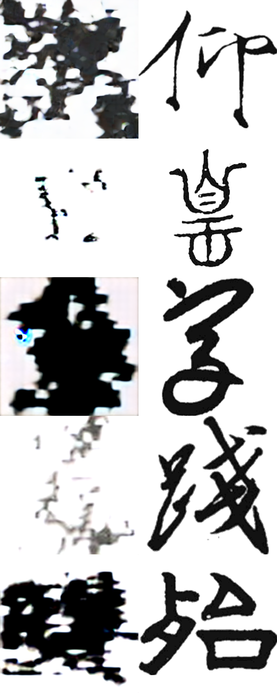
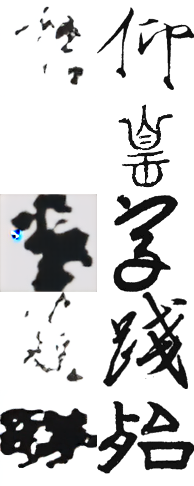
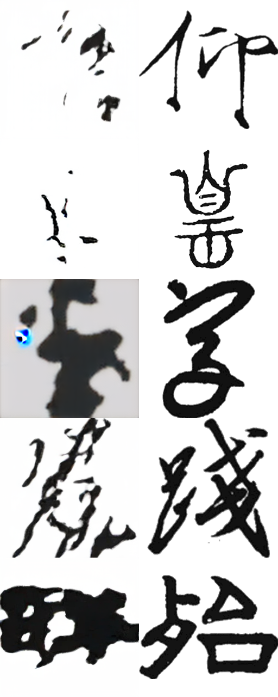
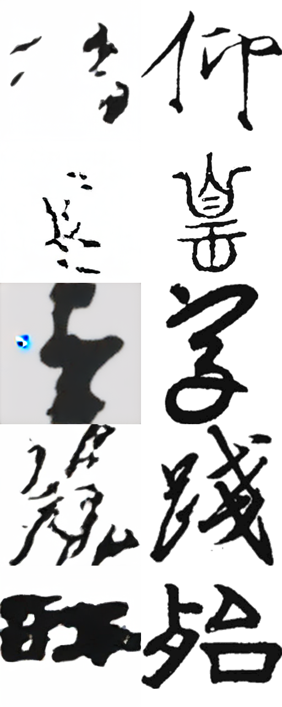
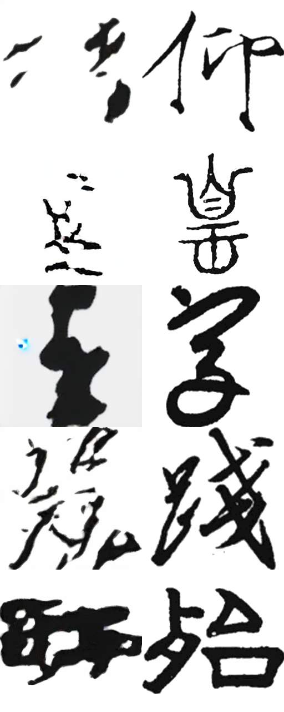
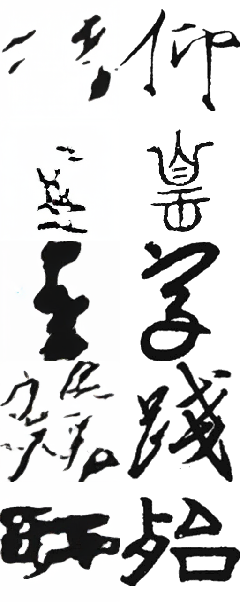
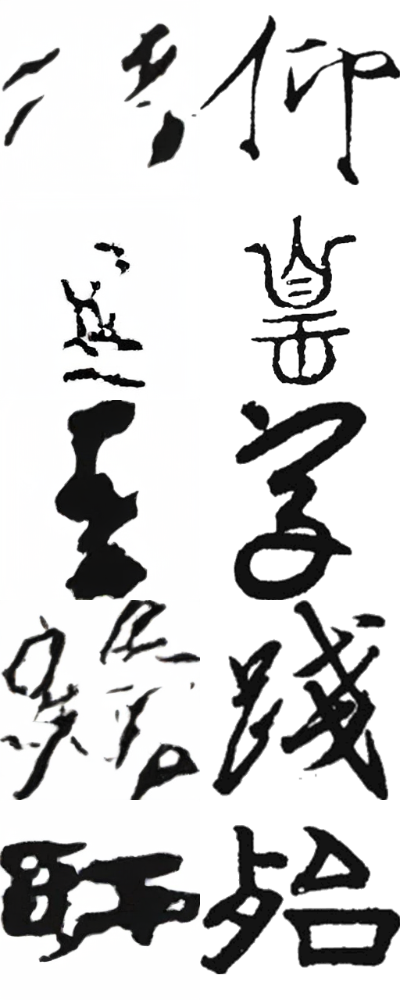
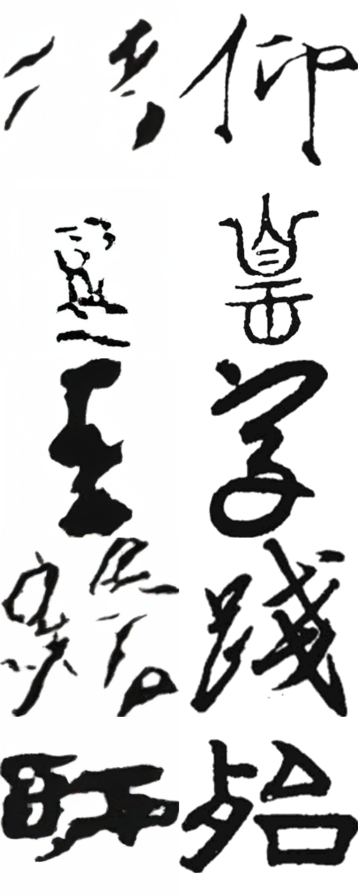
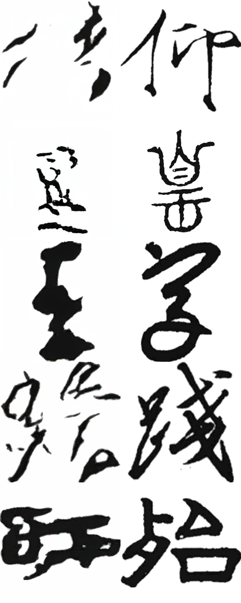
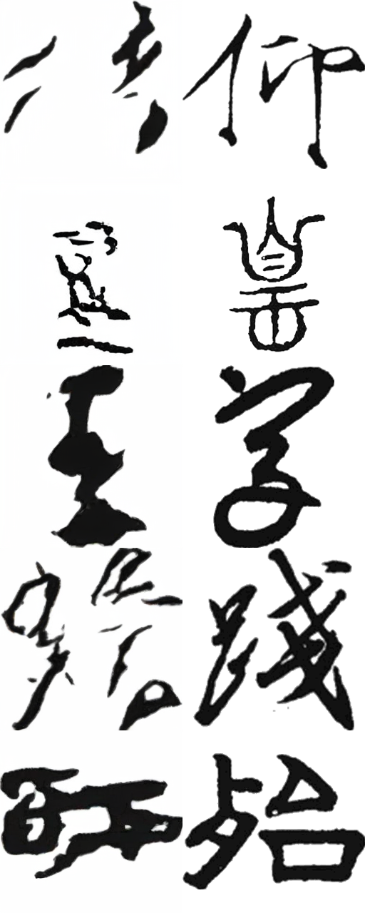

# 5-script factorized 3-condition experiment

## Objective

Improve generalization to unseen `(calligrapher, script, character)` triples when
the individual factors and pairwise relations were all observed in training.

## Baseline stopped

- Config: `exp_s_5script.json`
- Directory: `5script/results/exp_s_5script/20260815-131017-DiT-3Cond-S-2`
- Stopped cleanly with SIGTERM on 2026-08-15 at approximately step 25,760,
  epoch 39. The last complete checkpoint is `0025000.pt`.
- Model: legacy concatenation MLP, 36.16M trainable parameters, random sampler,
  no EMA, no structural losses.
- Best recorded free-sampling checkpoint before stop was around 10k--15k;
  20k regressed on the 100-sample mixed evaluation set.

## Data coverage

- 147,841 rows and 93,738 unique triples.
- Unique triple coverage is 0.264% of the configured 35,516,430-cell space.
- 81.98% of observed triples have one image.
- The clean composition test stratum requires an unseen triple with all factors
  and all three pairwise edges present in training.

## V1 design

- Keep the DiT-S/2 latent backbone.
- Replace the joint nonlinear condition MLP with independent compact embeddings
  and additive projections: calligrapher 128, script 32, character 192 -> hidden 384.
- Controlled condition masks: 75% full, 10% all-null, 15% exactly one factor null.
- Tempered factor-balanced sampling: character exponent 0.35 and calligrapher 0.15.
  The initial 0.5/0.25 proposal produced a 33.2x maximum row weight and only
  54.9% unique-row coverage per sampled epoch. The selected milder setting caps
  the maximum at 10.3x and covers 59.7%, while raising median sampled exposure
  from 10 to 15 per character and from 5 to 13 per calligrapher.
- AdamW weight decay 0.02.
- 500-step warmup followed by cosine decay to 10% of the initial learning rate.
- Full-model EMA with decay 0.9999; evaluation uses EMA weights.
- EMA uses update-count warmup before reaching the 0.9999 cap, preventing the
  early checkpoints from retaining mostly random initialization.
- Batch 224 for the no-structural-loss run.

## Structural-loss decision protocol

Canny and skeleton losses require differentiable VAE decode of predicted `x0`.
They will only be enabled if a short probe demonstrates safe peak VRAM and useful
throughput. They sharpen observed target geometry but do not themselves identify
factor composition, so the primary V1 run keeps them off unless the probe is
clearly cheap. Probe results are appended below before the formal launch.

## Execution log

- 2026-08-15: inspected remote process tree, log and checkpoints.
- 2026-08-15: stopped only PID 295381 and its eight DataLoader children; verified
  that no `exp_s_5script.json` training process remained.
- 2026-08-15: confirmed local and remote core-file SHA-256 hashes matched before
  applying the new patches; preserved all pre-existing dirty-worktree changes.

## Results

### Validation and memory probes

- Four unit tests pass: factorized forward/CFG shapes, explicit all-null masking,
  sampler determinism/tail weighting, and non-preload latent lookup.
- The latter test exposed and fixed a pre-existing missing `_get_latent` method;
  the formal run still uses preload.
- Canny+Skeleton, batch 64: OOM during differentiable VAE decode backward after
  22.43 GiB was allocated.
- Canny+Skeleton, batch 32: still OOM during VAE decode backward after 21.30 GiB
  was allocated (22.89 GiB reserved).
- No structural losses, batch 224, EMA enabled: 3.54 steps/s after warm-up and
  19.20 GiB peak reserved memory. This matches the legacy throughput closely.

Decision: keep Canny/Skeleton off in V1. They would require batch approximately
16 plus at least 14-way accumulation to recover the effective batch, while they
supervise observed target geometry rather than factor composition.

### End-to-end smoke

- Batch-224 training, EMA update, cosine scheduler, checkpoint serialization,
  automatic free-sampling evaluation, resolved config and source manifest all ran.
- Standalone `eval_gen.py` reconstructed the factorized architecture from saved
  checkpoint arguments and loaded EMA with zero missing or unexpected keys.

### Formal V1

- Launched directory:
  `5script/results/compositional/20260815-155912-s2-factorized-add-balanced-ema-no-struct-v1`
- Planned stop: 20,000 optimizer steps; checkpoint/eval every 2,000 steps.
- Clean composition auto-eval: 100 unseen triples, 20 per script, with every
  factor and pairwise edge observed in training.

Checkpoint results pending.

#### Step 2,000 (EMA warmup run)

- Online diffusion loss: 0.0958.
- Effective EMA decay: 0.995520.
- Clean unseen-triple free-sampling evaluation (100 fixed examples, 20 per
  script, DDIM-50, CFG 4.0, seed 0): MSE 1.49122, SSIM 0.31829.
- Runtime remained stable at about 3.52 steps/s and 19.20 GiB peak reserved
  VRAM. The checkpoint is 522 MiB.
- The fixed-EMA diagnostic at the same step gave MSE 3.2513 / SSIM 0.0302;
  this is evidence that the EMA warmup correction works, not a model ablation.
- Visual inspection shows some recognizable stroke/character structure but
  still substantial block-like and ink-blob artifacts. This checkpoint is too
  early to claim successful compositional generalization.

Visual sheet (prediction on the left, GT on the right):

#### Step 4,000

- Online diffusion loss: 0.0885; effective EMA decay: 0.997755.
- Clean unseen-triple: MSE 1.09868, SSIM 0.43136.
- Relative to step 2,000, MSE improved by 26.3% and SSIM by 35.5% under the
  identical fixed-sample/free-sampling protocol.
- The held-out composition metric is still improving, so there is no evidence
  for early stopping or composition overfit at this point. Visuals remain
  imperfect: block artifacts are reduced overall, but several samples have
  missing strokes or ink blobs.

#### Step 6,000

- This is approximately 9.1 dataset-equivalent draws at batch 224. Because the
  balanced sampler draws with replacement, it is not a literal nine complete
  scans, but continued training to 20k makes even minimum-weight rows very
  unlikely to remain unseen.
- Clean unseen-triple: MSE 1.06167, SSIM 0.43805.
- Improvement over 4k continues but is slower: MSE -3.4%, SSIM +1.6%. Continue
  the planned run rather than early-stop before all rows have been revisited.

#### Step 8,000

- Approximately 12.1 dataset-equivalent draws.
- Clean unseen-triple: MSE 1.03357, SSIM 0.44684.
- The curve continues to improve over 6k (MSE -2.6%, SSIM +2.0%) without a
  reversal, although visual inspection still finds missing strokes on difficult
  clean-unseen examples.

#### Step 10,000

- Approximately 15.2 dataset-equivalent draws.
- Clean unseen-triple: MSE 1.02764, SSIM 0.45251.
- The curve remains monotonic but is nearing a plateau: versus 8k, MSE improves
  only 0.57% while SSIM improves 1.27%. Continue through 20k to distinguish a
  plateau from a later reversal.

#### Step 12,000

- Approximately 18.2 dataset-equivalent draws; exact cumulative coverage is
  147,832 / 147,841 rows (nine not yet sampled).
- Clean unseen-triple: MSE 1.01722, SSIM 0.45602.
- Relative to 10k: MSE -1.0%, SSIM +0.8%. The curve has not reversed but is in
  a clear plateau region. Visuals still contain missing-stroke failures, which
  motivates the decoder-free structural V2 after V1 reaches full coverage.

#### Step 14,000

- Approximately 21.2 dataset-equivalent draws; exact cumulative coverage is
  147,840 / 147,841 rows.
- Clean unseen-triple: MSE 1.01751, SSIM 0.45607.
- This is statistically a plateau versus 12k (MSE +0.03%, SSIM +0.01%), not a
  meaningful regression. Continue at least through 16k full-row coverage.

#### Step 16,000

- Approximately 24.2 dataset-equivalent draws. Exact replay confirms that all
  147,841 training rows have now appeared at least once.
- Clean unseen-triple: MSE 1.01425, SSIM 0.45655, the best result so far but
  only marginally ahead of the 12k--14k plateau.
- Visual inspection still shows missing strokes and an occasional solid ink
  blob, so further diffusion-only optimization is not solving all structural
  failures. Complete the planned 20k V1, then test latent structural V2.

#### Step 18,000

- Approximately 27.3 dataset-equivalent draws.
- Clean unseen-triple: MSE 1.00873, SSIM 0.45779, a small new best.
- Relative to 16k: MSE -0.54%, SSIM +0.27%. Pixel metrics still move in the
  right direction, but visual structural failures remain and marginal returns
  are low.

#### Step 20,000 / V1 complete

- V1 stopped cleanly at its configured maximum with no NaN or OOM.
- Approximately 30.3 dataset-equivalent draws; every row has appeared, with
  1st/10th/median exposure counts of 9/15/26.
- Clean unseen-triple: MSE 1.00497 (best), SSIM 0.45762. The SSIM-only best is
  18k at 0.45779, a negligible 0.04% difference.
- Select 20k as the V2 base because it has the best MSE, complete planned
  training/coverage, and statistically tied SSIM.

### Decoder-free condition evaluator

The repository's image-space evaluator has no remote checkpoint and is sized
for the obsolete 7,765/2,243/12 categories. A separate local latent condition
probe was therefore trained only for evaluation using the compact
7,026/1,011/5 label spaces and a deterministic 5% validation holdout.

- 2,794,730 parameters; eight epochs; 0.172 GiB peak CUDA reserved.
- Character: top-1 53.67%, top-5 76.76%.
- Calligrapher: top-1 57.60%, top-5 78.76%.
- Script: top-1 86.58%.

These accuracies are sufficient for relative checkpoint/stratum diagnostics,
especially top-5, but not for an absolute OCR claim. Final conclusions retain
pixel metrics and visual inspection and label probe accuracy as a lower-bound
relative evaluator.

#### Exact cumulative sampler coverage

The deterministic sampler sequence (seed 0, batch 224) was replayed exactly.
At 10k, 147,825 / 147,841 rows have appeared; only 16 have not. At 14k only one
row is unseen, and at 16k all rows have appeared. At the planned 20k stop:

- all 147,841 rows have appeared at least once;
- minimum exposure is 1 (one high-frequency/minimum-weight outlier);
- 1st percentile exposure is 9;
- 10th percentile exposure is 15;
- median exposure is 26.

Thus the corpus is repeatedly sampled in aggregate and for 99% of rows, while
the with-replacement balanced sampler does not strictly guarantee multiple
visits for every single high-frequency row. A future strict-coverage sampler
can concatenate one no-replacement pass with one balanced pass per super-epoch.

### Latent-space structural-loss diagnostic

To avoid the VAE-decoder backward memory cost, 512 deterministic training
examples were used to compare spatial gradient energy in the cached 32x32 GT
latents with max-pooled structural maps:

- Canny: pooled Pearson 0.5452, mean per-image Pearson 0.5197, equal-density IoU
  0.5558.
- Skeleton: pooled Pearson 0.3542, mean per-image Pearson 0.3341, equal-density
  IoU 0.2092.

Decision for V2: Canny can use an inexpensive edge-weighted latent-gradient
consistency loss between predicted and GT `x0`. A raw latent-gradient skeleton
loss is not justified by the diagnostic; skeleton supervision should use a
small pretrained/frozen latent-to-skeleton probe, or remain disabled. V1 is not
changed mid-run.

#### Local CUDA structure probe

- Cache: 147,841 row-aligned fp16 latents plus bit-packed 32x32 Canny/Skeleton
  targets, 1.16 GiB. No 256x256 source images were copied locally.
- Experiment: `20260815-latent32-canny-skel-width32-depth2-v1`.
- Hardware: local RTX 4070 Laptop 8 GiB; batch 64; five epochs.
- Probe: 38,562 parameters; 0.143 GiB peak CUDA reserved; about 62 seconds total.
- Deterministic 5% validation: Canny IoU 0.97649, Skeleton IoU 0.89444 at the
  best (epoch 5) checkpoint.

The high held-out skeleton IoU confirms that skeleton geometry is recoverable
from the cached VAE latent. V2 can therefore freeze this probe and backpropagate
through it to `pred_xstart`, avoiding the full VAE decoder. The probe remains
frozen so it cannot adapt to or conceal poor DiT predictions.

The default-off V2 implementation adds:

- Canny-weighted gradient consistency between predicted and GT `x0` latents.
- Frozen-probe BCE+Dice skeleton supervision.
- A configurable maximum diffusion timestep (initially 500) so very noisy
  `x0` estimates are not forced through the structure objective.
- 32x32 max-pooled map preload rather than retaining/transferring full 256x256
  maps during training.
- Separate raw/contribution logging for latent Canny and latent Skeleton losses.

All seven unit tests pass after this addition. The implementation remained local
until V1 finished, so the V1 experiment's captured source hashes and in-memory
code were unchanged.

#### Remote batch-224 latent-structure probe

- Directory: `20260815-174444-s2-factorized-latent-struct-b224-probe-from20k`.
- Resumed V1 step 20k with zero missing/unexpected model keys and restored EMA.
- 32x32 Canny+Skeleton preload adds only about 0.2 GiB host RAM (2.5 GiB total
  cached data versus 2.3 GiB for V1).
- Stable batch 224: 19.47 GiB peak GPU memory and 3.44 steps/s, versus 19.20 GiB
  and 3.52 steps/s for V1.
- Typical contributions: latent Canny 0.0086--0.0090 and latent Skeleton
  0.0024--0.0029, together about 15% of the diffusion loss.
- No OOM/NaN; stopped cleanly after 20 configured probe steps.

Decision: use batch 224, weights 0.05/0.005 and `max_t=500` for a 4k-step V2
fine-tune from V1 step 20k. Keep LR constant at 1e-5 and evaluate every 1k.

### V1 launch correction

The first launch reached step 2,000 with healthy online diffusion loss (about
0.096), but its fixed 0.9999 EMA still contained approximately 81.9% initial
weights and produced an invalid early EMA evaluation (MSE 3.2513, SSIM 0.0302).
It was stopped cleanly and its checkpoint retained as a diagnostic. The formal
run is restarted from zero with update-count EMA warmup; this is a training
infrastructure correction, not a result comparison.
