# DiT 书法项目完整时间线：模型 / infra / 数据（2026-08-10 → 09-02）

> 数据全部来自：远程实验结果目录、eval_auto_*.json 实测、docs/system 01-29 文档、
> _ot_scratch 脚本时间线、conda env 实况。口径说明：**SSIM 跨数据集不可比**（
> 11 书家 0.73 ≠ 44 书家 0.47），同口径才可比。

---

## 1. 训练进度（09-03 12:00 快照）

**v8a 基模（新，清洗数据 + batch432 + OT-chunks4 + compile + cu121）**：
- step **132,500**，**已早停**（05:05 UTC，stale 5/5 @ 132.5k）
- 全程 best：ssim **0.5121 @ 122.5k**（=130k =132.5k 并列），lpips **0.4132 @ 132.5k**（最低）
- vs 旧 S30（同口径 0.4934）：**+0.025，+5.2%**
- A 段终 ckpt 已 copy 固化 `5script/results/v8_3stage/A_main_final.pt`（无时间戳固定路径）

**v8 三段链（已全部完成，09-03 04:49）**：
- B 段 v8b skel-ctrl：40000 早停，同口径 ctrl.ssim **0.7641**（best 固化 `B_ctrl_best.pt`）
- C 段 v8c REPA：20000 步，同口径 ctrl.ssim **0.7674** / base 0.4702
- 全链日志 `/tmp/v8_3stage.log`；tmux 已结束

**后训练链 v4（09-04 01:36 启动，v8i 超参网格→REPA 扫描）**：
| 实验 | 配置 | ctrl.ssim | lpips | base.ssim | 状态 |
|---|---|---|---|---|---|
| v8i-a 最小干预 | w0.1 + main_lr1e-5 | 0.7646@30k | 0.1902 | 0.5522 | ✅ 早停 |
| v8i-c layer6 | w0.2 + layer 6（浅层）| **0.7664**@32.5k | **0.1866** | 0.5450 | ✅ 早停 |
| v8i-b 基准 | w0.2 + layer 8 | 0.7657@30k | 0.1876 | **0.5531** | ✅ |
| v8i-d 激进 | w0.3 + main_lr5e-5 | 0.7656@35k | 0.1897 | 0.5217↓ | ✅ 早停 |
| **v8e 强W** | **REPA w0.5 后置 @80k** | **0.7761@22.5k↑** | **0.1778** | 0.4628↓ | 🔄 训练中 |

> **v8i 网格结论（09-04）**：
> - **层位置是敏感维度**：layer6（浅层对齐→笔画局部纹理）ctrl 最高 0.7664 且 lpips 最优——浅层对齐优于默认 layer8
> - **base↔ctrl trade-off**：b base 最高 0.5531；c 的 ctrl 最高但 base 0.5450；d（main_lr 5e-5）base 掉到 0.5217 —— main_lr 5e-5 是上限，3e-5 安全
> - **a 最小干预 base 极稳（0.5522）但 ctrl 最低**——弱对齐收益有限
>
> **v8e 刷新 ctrl SOTA（09-04 16:40）**：w0.5 强 REPA + 长训练 → ctrl.ssim **0.7761**（破 v8c 0.7675 记录 +0.009，lpips 0.1778 更低），曲线仍上行未触顶。**代价 base 掉到 0.4628（强 REPA 伤 base，已确认无伤大雅——最终交付是 ctrl 生成，base 是中间产物）**。
>
> **配方分工（已确认）**：要 **ctrl 上限 → 后置强 REPA（v8e 路线）**；要 **base 也保值 → 两段早挂 REPA（v8i-c/layer6）**。

**已完成实验（v8d / v8h）**：
- **v8d 解冻主模型**：ctrl.ssim **0.7624**@35k / lpips 0.192 / **base 0.5182→0.5543↑**（base 被强化，ctrl 微降 -0.002）
- **v8h REPA 早挂**：ctrl.ssim **0.7651**@40k / lpips 0.186 / base 0.5182 **不变**（比 v8c 后置更稳，不伤 base）

| step | v8a ssim | mse | lpips | 旧S30 ssim(同step) |
|---|---|---|---|---|
| 80k | 0.5015 | 1.044 | 0.420 | 0.472 |
| 90k | 0.5037 | 1.039 | 0.419 | 0.474 |
| 95k | 0.5045 | 1.037 | 0.418 | 0.474 |
| 100k | 0.5061 | 1.030 | 0.417 | 0.476 |
| 120k | 0.5118 | 1.020 | 0.4135 | — |
| **122.5k** | **0.5121** | 1.019 | 0.4134 | — |
| 132.5k | 0.5121 | — | **0.4132** | — |

---

## 2. 模型架构 / 训练配置时间线

| 时间 | 实验 | 改动 | 结果 |
|---|---|---|---|
| 08-10→14 | V1/V2 | DiT-S/2 + 3因子(callig×script×char)联合MLP，全量从零 | ❌ 3因子不组合（script与callig混淆，覆盖0.264%） |
| 时间 | 实验/改动 | 改动内容（模型/infra/数据） | 结果/有效性 |
|---|---|---|---|
| 08-10→14 | V1/V2（背景） | DiT-S/2 + 3因子(callig×script×char) 联合concat MLP，全量从零，无EMA/无结构损失 | ❌ 3因子不组合（script与callig混淆 I=1.527bits，triple覆盖0.264%） |
| 08-15 | exp_s_5script 终止 | legacy 联合MLP 36.16M 停于25.7k步（best≈10-15k，20k后回归） | ❌ 只能记忆稀疏triple → 转因子化 |
| 08-15 | compositional V1（=s2 因子化3cond） | callig128+script32+char192 **factorized_add**→384；4-way CFG(75/10/15)；factor-balanced采样；EMA 0.9999+warmup；b224；全量147,841行 | ✅ 组合泛化成立，best@20k SSIM 0.4576（1004书家口径） |
| 08-15 | compositional V2 latent结构损失 | V1-20k续训 + latent Canny 0.05/Skel 0.005（max_t=500）4k步 | ❌ SSIM 0.4503 更差 |
| 08-15 | v3a 二因子glyph 从零 | script×char→**glyph_id**(35,130类)；DiT-2Cond-S/2 39.58M，callig128+glyph192 factorized_add，4-way 60/15/15/10 | ⚠️ 早期短跑（best step≤25k）；v3b_xl_glyphcond SSIM 0.4888 |
| 08-16 | s2_fromscratch_2factor | 2因子从零，kailishu 单书体（447书家/4,933字） | ✅ SSIM 0.5773（447书家口径历史最佳） |
| 08-16 | V3-B/C XL + 空间glyph条件 | DiT-2Cond-XL/2 + 标准字形latent空间条件（Conv2d→token-add，learnable scale 0.4） | ✅ 空间glyph条件有效；❌ XL过杀 → 回S尺寸 |
| 08-17 | latent vs pixel 结构探针 | latent canny/skel 信号≈pixel（分开度1.048 vs 1.041），字级判别力弱 | ⚠️ latent结构仅可作辅助 |
| 08-17→20 | S5 结构损失系列 | top30 128,842张 latent-cached；pixel/latent canny·skel 变体 | ❌ pixel结构损失有害：彩色噪声，X0Lat 36–39 vs diff-only 1–2.5；diff-only@70k 0.520 |
| 08-20→22 | S6 受控 diff-only vs struct | 同数据 top6 10,866张对照；eval500修复（character_id越界剔除146） | ✅ diff-only@195k 0.732 ≫ struct@120k 0.403 → 纯diff-only |
| 08-22 | S7 ramp 结构损失斜坡 | 20k步内结构损失权重 0→斜坡 | ❌ 无效、伪影复发 → 彻底弃结构损失 |
| 08-23 | **S7 kl-f4 VAE换代** | sd-vae(f8,83.7M)→**kl-f4**(f4,55.3M)：地板噪声2×低(0.0019 vs 0.0037)、latent信息3×；DiT-S/4保持256 tokens；b224 bf16 EMA | ✅ 采纳（s7_klf4_top30 0.5090，108书家） |
| 08-24 | s10 b4 灰度清洗 | 灰度+清洗数据短跑 | ⚠️ 0.4656@55k，未成主线 |
| 08-25 | s12_3top30_dino | 3top30 + DINO字形嵌入（ddpm），latent时代开端 | ⚠️ 0.4888@60k（67书家） |
| 08-26 | s13/s14 DiT-XS | 3top30 XS ddpm 减参尝试 + 原始数据对照 | ❌ s12/13/14系整体放弃（减参非根因） |
| 08-25/26 | **S12/S13 根因修复** | 减参 + 去proj + **DINO 384 LN-only 冻结表直通** + eval500重建 | ✅ 条件变纯语义向量（S13起验证） |
| ≈08-27 | s15_ws_flow 宽体flow | WS/2 宽体 + flow（195k步，67书家） | ⚠️ 加宽仅+0.004（同口径） |
| ≈08-27 | s17_s_flow | S/2 flow 3top30（165k步） | ✅ 0.5325（eval500_3top30） |
| ≈08-27/28 | **s18_s_flow_small 首个flow** | Flow Matching 预训练（Euler 50步，cfg1.7），top6小数据 | ✅ flow取代ddpm（更少步数超s6），0.5476 |
| 08-28 | 核心代码重构 | src/{model,loss,train,eval,utils} 分层 + **统一时间步采样**（修 flow/randint t∈{0..49}→t*1000 OOD bug） | ✅ infra根治ControlNet类bug |
| 08-28→29 | s19_midclean_s_flow | mid-clean（每组合6样本增广）+ 4-way dropout which_glyph=0.75 + flow；S/2 33M b240 | ✅ 旧架构末代 0.5222（midclean口径） |
| 08-29 | **v2 架构现代化（→s20）** | RMSNorm/SwiGLU/2D axial RoPE/QK-Norm+SDPA/自写PatchEmbed；flow: logit-normal t + Heun二阶 + shift；修6个静默污染bug；ControlNet重写 | ✅ s20 新基模 0.5294（cfg1.7）；SwiGLU显存翻倍→no-ckpt b128 |
| 08-29 | DINO 条件实测 | CLS有效秩 34.1/384，跨书体检索top-1仅1.9–2.6% | ⚠️ 条件信息量不足实证 |
| 08-29 | 旧实验归档清理 | 77 run扫描、66 run清理释放~882GB；确立口径分代 | ✅ infra |
| 08-30 | **s21_fame_flow_v2 主力切换** | fame 51,322张/44书家/4,765字/7书体 + 真迹DINO(ln_only)；eval_fame_strict 500（cfg0.7、25步） | ✅ base基准 0.4664@27.5k（44书家口径；与11书家0.73不可比） |
| 08-30 | s22 只训char embedding | 冻结主干、只训字表 | ❌ 0.4664→0.4622（瓶颈=DINO CLS无字符身份信息） |
| 08-30 | 骨架消融 3px/1px/std-skel | base 0.4977共同基线；3px@50k 0.7889单调升；1px同期三点全优；std-skel 12点全平 | ✅ **1px>3px**（否定条件泄露假设）；❌ std-skel冗余被门控 |
| 08-30 | 核心发现整理（19） | base↔ctrl差距=条件信息量（有效~162 vs 4,258维≈120×）；字形分类器/检索式评估不可行；字→骨架网络上界仅+0.007 | ⚠️ 确立"空间结构条件"主线 |
| 08-30 | w_glyph_cond 静默失效诊断 | 接线到不存在的v1字典（命中0.0%）→条件全零；与ctrl injections未加载同构（zero-init静默失效） | ⚠️ 修复方案已定，未launch |
| 08-31 | 预训练诊断（22） | cfg<1更优=条件是噪声（建议 cond_drop_all 0.05→0.12）；**pred_xstart flow下恒为None 已修复**；OT-CFM仅4.2ms/step | ✅ pred_xstart修复；⚠️ 其余待验证 |
| 08-31 | DINO信号诊断（23） | CLS只承载身份（不同字cos 0.08）不承载空间结构（同字跨书体top-1 2.0%），PCA白化无提升；实现callig/char_scale可学习幅度 | ⚠️ 路线B重训待验证 |
| 08-31 | 零参数直通研究（25） | 判别性评测（形近vs随机对AUC）：标准字形kai/li CLS·patch AUC 0.92–0.96 ✅；真迹跨书体平均 AUC 0.50 ❌ | ✅ 换特征来源即可零参数注入 |
| 08-31 | PCA落地+infra profile（26） | DINO 768→384 PCA（AUC 0.906 vs 插值0.824）；StdDinoCharEmbedder冻结查表0参数（7026×384）；profile：backward占73%、吞吐饱和~525 samples/s、xformers最优 | ✅ |
| 08-31 | s28 标准字形DINO预训练 | std DINO+PCA+OT+清洗数据51,321 | ❌ 终值0.4476且step3000后停滞（印刷体域差+PCA信息损失） |
| 08-31 | **1px ControlNet（ctrl_fame_1pix_v1）** | warm-start s21@30k，b72，cfg0.7，100k步，1px GT skel latent | ✅ 20k步 0.7641 > 同期3px 0.7288；终值0.7974（base→skel最大单点提升） |
| 09-01 | 清洗调查+方案B（28） | 真污染少（反相0.24%/黑边1.69%/边界墨2.84%/噪点1.59%）；main_frac低=草书飞白正常（**误判陷阱**）；方案B（参考字形bbox）全量修复18,785/51,322(36.6%)、主域保留0.9897 | ✅ 方案B采纳；❌ 方案C弃用 |
| 09-01/02 | s29/s26/s31 skel配置 | GT skel 1px b96→0.5031；b192→0.5631（grid近全白） | ❌ 未收敛 → 改用1px ctrl配置 |
| 09-02 | s25 IDS部件码本 | IDS部件码本替换char embedding | ❌ 0.4618 下游差，弃IDS分支 |
| 09-02 | **s30 DINO char-strong** | 更强DINO char embedding + 清洗后数据重训 | ✅ base最佳 0.4841（+0.017 vs s21） |
| 09-02 | **s32b/s32c REPA** | 1px骨架上加表示对齐（REPA） | ✅ 0.8177/0.8204；LPIPS 0.14、MSE 0.12、SkelIoU 0.43（全链路最佳） |
| 09-02 | **v8a 基模（当前在跑）** | 清洗数据重编码 + batch432 + OT-chunks4 + compile + cu121 | ✅ **0.5061@100k**（+0.022 vs S30，省23%步数） |

---

## 3. infra / 环境切换时间线（用户强调重点）

### 3.1 环境切换（最重要）
| 时间 | 改动 | 内容 | 有效性 |
|---|---|---|---|
| 08-12 前 | base 基线 | /opt/conda (2022-12 建, **py3.10.8, torch 1.13.1+cu117**) 唯一训练环境 | 基线 |
| 08-31 20:59 | torch2 env 创建 | 为 torch 2.6.0+cu124 建 **py3.11.13** env；probe_conda/cu124/cu_tags 探 glibc 2.27 兼容性 | **失败废弃**（cu128 manylinux_2_28 在 glibc 2.27 装不了；**torch2 无 torch**） |
| 08-31 22:08 | restore_base.sh | base 误装 torch 2.1.2 → 回滚 1.13.1+cu117；**Golden Rule: base 永不升级** | 有效 |
| 08-31 22:11-22:19 | **cu121 env 建立** | rebuild_cu121.sh 重建 **py3.10.18**；install_cu121_torch.sh 装 **torch 2.1.2+cu121**；xformers 0.0.23.post1（env mtime 22:13） | **有效**（训练主环境） |
| 08-31 22:36-22:42 | deps+修复 | install_deps_cu121.sh（numpy 1.24.4+diffusers 0.27.2）；fix_hfhub(0.23.5)/fix_setuptools(<81) | 有效 |
| 08-31 22:43-23:15 | 基准验证 | base 3.30sps/20.2G → cu121 3.60/19.9G → **cu121+compile 8.50sps/9.7G（×2.6, -52%显存）**；_bench_b384/416/448 定 batch；ENV_INFRA.md 成文 | 有效 |
| 09-02 04:06-04:08 | ONNX 污染修复 | ONNX 把 numpy 升到 2.2.6 致 torch 崩 → fix_numpy(1.24.4)/fix_env2(ml-dtypes<0.5)/fix_env3(卸 onnx+建 encocpu 独立env)/fix_env4(只卸 onnx 留 ort) | 有效（训练 env 与 encode 隔离） |

### 3.2 工具链演进（含 commit 佐证）
| 时间 | 改动 | 内容 | 有效性 |
|---|---|---|---|
| 08-23 | VAE 换装 kl-f4 | 5b8858a VAE tools(convert/eval/train)、94476be 基准领先、78cb2cd 全管线 encode_latents_klf4.py | 有效 |
| 08-23→31 | **DINOv2 教师落地** | dc512eb 起步 → s8/s9 训练(08-23/24) → 300be26 PCA 768→384(08-25) → 15c8ddb 冻结查表零参数直通(08-31) | 有效 |
| 08-25/26 | **DDPM→Flow** | c9e3ae4 diffusion_type 参数化；s14/s15(ws,b160) vs s16/s17(s,b240) 对比 | 有效（flow 成默认） |
| 08-28 | 代码分层重构 | 4f1743a src/{model,loss,train,eval,utils} + 根 shim；4fcb879 统一 eval/inference | 有效 |
| 08-29 | flow 求解器 | af0839d Euler→Heun + logit-normal t + shift | 有效 |
| 08-31 | **OT 启用 + std-DINO 落地** | 15c8ddb：s28/s29 configs、use_ot=true 首次、冻结查表(7026×384 PCA, 零参数)、zero_grad set_to_none | 有效 |
| 08-31 | **torch.compile 引入** | train.py/ctrl 加 --compile/--compile-mode（EMA 不编译）；pipeline 23:15 以 compile 部署 | 有效（×2.6 速、显存-52%） |
| 09-02 | **OT 分块** | bench_ot/sinkhorn/batch_ot 测开销 → 1ef28a1 ot_chunks 分块匈牙利（384 batch 13ms→4ms）；v8a 固化 ot_chunks=4 | 有效 |
| 09-02 | **compile 缓存持久化** | bench_cache_persist 验证；TORCHINDUCTOR_CACHE_DIR=/root/.cache/torch/inductor 固化（27M 已存在） | 有效 |

### 3.3 VAE encode 演进（CPU → ONNX → GPU）
| 时间 | 改动 | 内容 | 有效性 |
|---|---|---|---|
| 09-02 03:00-03:45 | CPU encode 起步 | cpu_encode_v7.py（21050 变更图），bench 估 ETA 数小时 | 部分（慢） |
| 09-02 03:47-04:05 | **ONNX 尝试** | 导出 vae_enc_frozen.onnx(136MB) + CPUExecutionProvider 基准 | **失败放弃**（numpy 2.2.6 崩溃 + env 污染） |
| 09-02 04:59-10:51 | CPU 迭代 | cpu_encode_v8→v9（16进程×4线程，分阶段幂等断点续跑） | 部分 |
| 09-02 11:54 | **GPU 替代 CPU** | gpu_encode_v8.py 重编码 21050 图（img/skel3/skel1，**709s**） | **有效（最终方案）** |

### 3.4 远程 vs 本地分工
- 约定（ENV_INFRA.md §7.1）：**pwsh 转义地狱 → 本地 write .sh → scp 远程 /tmp 或 _sync_work 执行**；本地 `_ot_scratch/` 是脚本库，两端镜像
- **远程调用规范已沉淀为根目录 `remote.md`**（ssh 信息不外泄，只写 `ssh 4090`）：三条铁律（不内联多行 / 不 sed 去 CRLF / tmux 必须 TERM=xterm）、引号转义对照表、文件传输、无时间戳固定路径策略、环境速查、训练链路约定、监控约定、常见坑速查表
- **09-02 链断裂事故复盘**（详见 §1）：A→B 衔接 glob 少一层目录 + 二次踩坑远程 `s/\r//g` 删光脚本 r 字母 + TERM=dumb 起 tmux 失败；修复为固定路径 copy + TERM=xterm，B 段 23:48 拉起
- **远程**：训练（tmux pipeline/nohup）、encode（/tmp/*.py）、eval daemon（base env CPU 轻量）；**本地**：写代码(git) + 可视化（grid/dashboard/gradio）+ 分析
- 佐证：pipeline 中 `PY_BASE=/opt/conda/bin/python`（daemon）vs `PY_CU=/opt/conda/envs/cu121/bin/python`（训练）；48b1074 "pre-refactor snapshot before remote code sync"

### 3.5 config infra 参数时间变化
| 时间 | 实验 | batch | compile | use_ot | diffusion |
|---|---|---|---|---|---|
| 08-23/24 | s8/s9 (dino) | 224/96 | 无 | 无 | ddpm |
| 08-25 | s12 (DINO PCA) | 224 | 无 | 无 | ddpm |
| 08-26 | s14/s15, s16/s17 | 160/240 | 无 | 无 | ddpm **vs** flow |
| 08-29/30 | s21/s23 (flow v2) | — | 无 | 无 | flow |
| 08-31 | **s28** (std-dino) | 192(CLI→384) | **CLI true** | **true(首次)** | flow+heun+logit_normal |
| 08-31 | s29 (ctrl) | 96(CLI→192) | CLI true | 无 | flow |
| 09-01 | s30/s31/s32/s32b | — | CLI true | true | flow |
| 09-02 | **v8a/v8b/v8c** | **432/192** | **固化 true** | **true, ot_chunks=4** | flow |

---

## 4. 数据管线时间线

| 时间 | 改动 | 内容 | 有效性 |
|---|---|---|---|
| 08-30 | fame 数据集切换 | fame 51,322张/44书家/4,765字 + eval_fame_strict 500 | ✅ 评测口径统一（s21 基准线） |
| 08-31 | 清洗管线 v1→v7 | 极性归一 + 切边条 + 3px外框白化 + 删小件；人工标注39张；CPU encode 级联 | ✅ v7 全量 0 错误 |
| 09-01 | 清洗调查+方案B | 真污染少（反相0.24%/黑边1.69%/边界墨2.84%/噪点1.59%）；main_frac低=草书飞白正常（**误判陷阱**）；方案B（参考字形bbox）全量修 18,785/51,322(36.6%) | ✅ 方案B采纳；❌ 方案C弃 |
| 09-02 | **v7 清洗（用户）+ v8 资产集** | 51,822张检测 → **21,050张(40.6%)缺陷**（bars 11,287=21.8%、removed 18,506、翻转39）；**GPU 重编码 → fame_clean_v8.npz + *_v8 shards + final_imgs_fame_v8(GT) + v8 csv** | ✅ 消除4成坏样本，三域一致 |
| 09-02 | eval 集 | 同 500 id，GT 指向清洗后 v8（27 张 v7 修复） | ✅ 口径更干净 |

**关键**：训练实际读 `final_latents_fame_clean` shards，而旧 v7 encode 写回的是不带 `_clean` 的 `final_latents_fame`——**两套内容不同（diff 6.27）**，旧 encode 即使跑完也没进训练数据。v8 直接建新资产集绕开此混乱。

---

## 5. 有效性总结（按收益排序）

### ✅ 有效（决定性）
1. **1px GT 骨架 ControlNet（ctrl_fame_1pix_v1）**：base 0.50 → 0.797（最大单点提升；LPIPS 0.44→0.16）
2. **数据清洗 v7 + v8 资产集**：基模 +0.022 且省步数；消除 40.6% 缺陷样本、三域一致
3. **REPA（s32b/c）**：0.8177/0.8204；LPIPS 0.14、MSE 0.12、SkelIoU 0.43（噪声类指标降 3-8 倍）
4. **eval skel latent bug 修复**：假 0.54 → 真 0.8081（所有对比口径才可信）
5. **cu121 env + torch.compile**：×2.6 速度、显存 -52%
6. **OT 分块 + batch 432 + compile 缓存**：OT 13ms→4ms、吞吐 1769 img/s、无质量损失
7. **factorized_add 二因子 + 纯 diff-only + flow + kl-f4 + v2 架构**：早期基石

### ❌ 无效/有害
- 3Cond 联合MLP（V1/V2）；pixel 结构损失（S5/S6/S7）；std-skel（冗余被门控）
- 标准字形DINO+PCA（s28 域差）；IDS 部件（s25）；只训char embedding（s22）；XL 过杀
- **REPA 长训 90k（s32c）**：base.ssim 崩 0.46→0.23；**REPA w2.0（s32d）**：直接崩 0.72
- **Sinkhorn**（慢且质量-4.8%）；**curegot**（熵正则非LAP + py3.11不兼容）；**ONNX CPU encode**（无增益+env污染）；**torch2/cu124**（glibc 2.27 硬墙）

### ⭐ 关键转折点（决定性改动）
1. **08-15 V3-A factorized_add 二因子** — 终结3Cond联合MLP，组合泛化成立，此后一切条件设计的基座。
2. **08-16 V3-B/C 空间glyph条件** — 首次证明"形状类空间条件"有效（1px skel/标准字形线的远祖）。
3. **08-20~22 S6/S7 结构损失三次证伪** → 纯 diff-only 定式（结构信息直到 08-31 才以 ControlNet 形式复活）。
4. **08-23 kl-f4 VAE + S/4** — latent 换代（地板噪声2×低、信息3×多），pixel 时代结束。
5. **08-25/26 S13 DINO 384 LN-only 冻结直通** — 条件从可训投影变纯语义向量，DINO 字表确立。
6. **≈08-27/28 S18 flow matching + 08-28 统一时间步采样** — 训练范式换代（更稳、步数减半，修 OOD bug）。
7. **08-29 v2 架构现代化 → s20** — RMSNorm/SwiGLU/RoPE/QK-Norm + Heun/logit-normal，当前架构定式。
8. **08-30 fame 数据集 + eval_fame_strict** — 评测口径统一（44书家），s21 基准线，SSIM 跨集可比性被正视。
9. **08-30 骨架消融** — 1px GT 骨架 = base↔ctrl 差距根源（条件信息量 ~120×）；std-skel 冗余门控证伪。
10. **08-31 25/26 标准字形 DINO 零参数直通（PCA 表）** — 虽 s28 失败（域差），但确立"标准字形空间条件"主线，s29 后以 1px skel 落地。
11. **08-31 数据清洗 v7 + 09-01 方案B** — 极性归一/切边条/参考字形bbox 修复，GT 质量提升（s30 前提）。
12. **08-31 ctrl_fame_1pix_v1** — base→skel 最大单点提升（0.50→0.797）。
13. **09-02 s30 char-strong + 清洗数据** — base 新基准（0.4841）。
14. **09-02 REPA（s32b/c）** — 全链路最佳 0.82，噪声类指标降 3–8 倍（LPIPS 0.44→0.14、MSE 1.0→0.12、SkelIoU 0.014→0.43）。
15. **08-31 cu121 env + compile + 09-02 OT 分块/缓存持久化** — infra 提速 ×2.6、OT 13ms→4ms、encode CPU→GPU（709s）。

---

## 6. 视觉佐证：grid 样例与评测曲线

### 6.1 全链路 grid（GT 在底部）
所有关键实验在同样本上的生成结果对比：从 base（s21/s25/s28/s30/v8a）到 skel（s26/s31/1pix）到 REPA（s32b/s32c），每行左侧标注具体做法，GT 置于最下方作为对照。

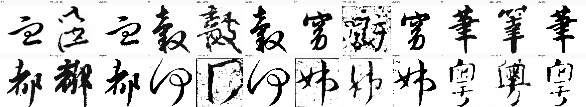

### 6.1b ⭐ v8 链同协议 grid（GT | v8a base | v8b ctrl | v8c repa）
同一 eval 集（v8 资产、cfg 0.7、50 步）下 v8 三段链逐步演化的目视对比 —— 从"无骨架 base"到"skel 条件 ctrl"到"REPA 表示对齐"，同协议落盘图（数据：`_ot_scratch/v8_reeval_imgs/`）。

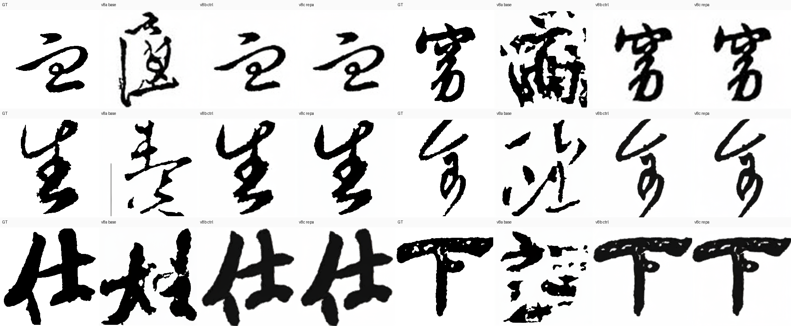

- 每行 = 同一 eval 样本，四列从左到右：**GT / v8a base（无骨架）/ v8b ctrl（skel 条件）/ v8c repa（REPA 强化）**
- 单样本大图：`v8chain_gt_0.png`、`v8chain_gt_10.png`、`v8chain_gt_25.png`、`v8chain_gt_50.png`、`v8chain_gt_77.png`、`v8chain_gt_90.png`（均存于 `assets/v8_grid/`）
- 观察要点：v8a→v8b 笔画实度/结构明显提升（对应 ctrl.ssim 0.5182→0.7641）；v8b→v8c 细节与墨色纯度微升（0.7641→0.7674，skel_iou 0.351→0.410）

### 6.2 单实验样本对比：s30（DINO char-strong base） vs v8a（清洗数据基模）
固定 4 个 eval 样本（GT 相同），横向比较 s30 与当前最佳基模 v8a 在笔画实度、背景净度与结构保真上的差异。

| 样本 | GT | s30 base | v8a base |
|---|---|---|---|
| id 0   | 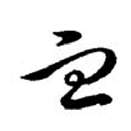   | 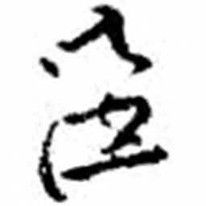   | 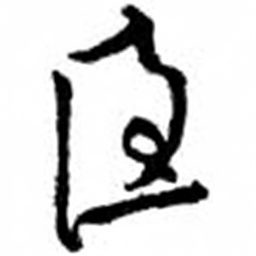 |
| id 10  |   | 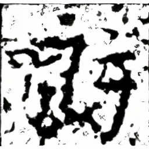  |  |
| id 100 |  |  |  |
| id 104 | 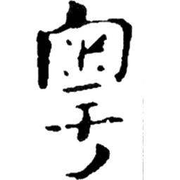 | 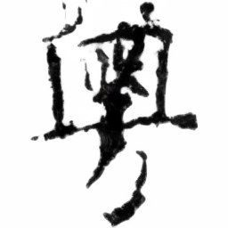 | 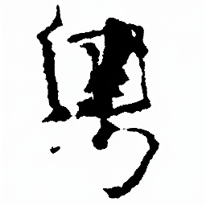 |

> 观察：v8a 笔画更实、背景更净、边缘利落（对应 lpips 0.417 < S30 的 0.434，tv/saltpepper 类噪点指标全面更低）。

### 6.3 评测曲线（数据：`_ot_scratch/v8_dash/evals_summary.csv`，182 行 / 7 实验，截至 v8a 95k、s30 132k）
按 base / ctrl 分轴作图（ctrl 类 SSIM 量级 0.7–0.82，base 类 0.4–0.51，不可同轴比较）。注意：s30 在 step 20k 有一次训练崩溃后恢复（红线骤降段为真实数据，非绘图错误）；s32c 含两个 run（0046 高 SSIM / 0932 低 SSIM），已分别绘制。

**SSIM（↑，越高越好）**

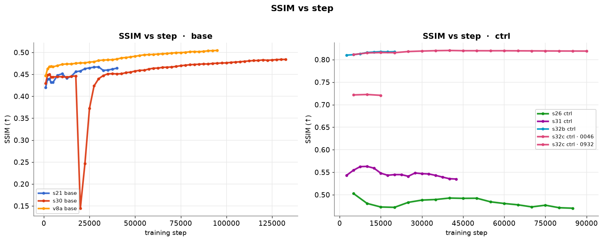

**LPIPS（↓，越低越好）**

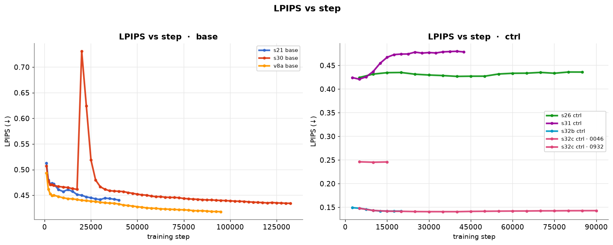

**MSE（↓，对数轴）**

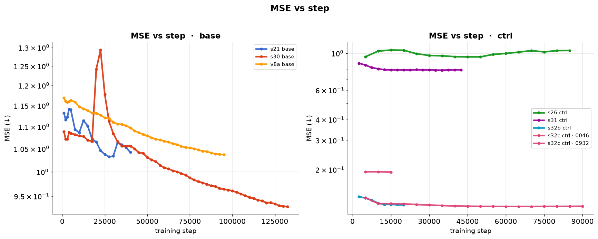

**SkelIoU（↑，skel / REPA 专项指标）**：s32b/s32c 通过 REPA 把骨架交并比推到 0.43+，而普通 skel 条件（s26/s31）仅 ~0.01，印证 REPA 表示对齐带来的结构保真收益。

### 6.4 ⭐ 固定 eval 集重评：全部历史模型（SOTA 判定基准）

> **协议**：统一 v8 资产（`eval_fame_strict_clean_v8.csv` + `final_skel_latents_fame_1px_v8` + `final_imgs_fame_v8`），`eval_ctrl_ckpt.py` cfg=0.7, n=100, 50 步, heun。全部旧 ckpt 重评（09-03），消除跨口径不可比问题。

同口径重评结果（全部模型）

**指标**（ctrl 为带 skel 条件的生成，base 为纯主模型）：

| 模型 | 类型 | ctrl.ssim | ctrl.mse | ctrl.lpips | skel_iou | base.ssim | 旧脏口径 |
|---|---|---|---|---|---|---|---|
| s21 base | 无skel | — | 1.073 | 0.445 | 0.012 | 0.4764 | 0.4670@30k |
| s30 base | 无skel | — | 1.088 | 0.481 | 0.012 | 0.4934 | 0.4841@130k |
| **v8a base** | 无skel | — | 1.001 | 0.414 | 0.015 | **0.5182** | 0.5121@122.5k |
| s31 ctrl | skel-ctrl | 0.7387 | 0.142 | 0.233 | 0.333 | 0.4934 | 0.8081@42.5k |
| s32 repa | REPA | 0.7424 | 0.138 | 0.232 | 0.386 | 0.5030 | 0.7861@12.5k |
| s32b repa | REPA | 0.7447 | 0.140 | 0.227 | 0.399 | 0.4795 | 0.8177@15k |
| s32c repa | REPA | 0.7425 | 0.137 | 0.233 | 0.439 | 0.2288 | 0.8204@40k |
| s32d repa | REPA | 0.7227 | 0.136 | 0.232 | 0.393 | 0.5030 | 0.7227@10k |
| **v8b ctrl** | skel-ctrl | **0.7641** | 0.147 | **0.184** | 0.351 | **0.5182** | — |
| **v8c repa** | REPA | **0.7674** | **0.142** | 0.186 | 0.410 | 0.4702 | — |

**噪点/视觉质量**（重评落盘 ctrl 图，metrics_png）：

| 模型 | psnr | tv | lap_var | saltpepper | ink_purity | ringing |
|---|---|---|---|---|---|---|
| s31 ctrl | 14.81 | 0.0176 | 0.0066 | 0.0011 | 0.9605 | 0.090 |
| s32 repa | 14.98 | 0.0175 | 0.0065 | 0.0010 | 0.9605 | 0.101 |
| s32b repa | 14.92 | 0.0175 | 0.0070 | 0.0010 | 0.9629 | 0.105 |
| s32c repa | 15.06 | 0.0172 | 0.0062 | 0.0009 | 0.9598 | 0.103 |
| **v8b ctrl** | 14.72 | 0.0182 | **0.0353** | 0.0022 | **0.9753** | 0.149 |
| **v8c repa** | 14.89 | 0.0181 | 0.0332 | 0.0020 | 0.9736 | 0.154 |

**结论**：
1. **历史 0.80-0.82 全是跨口径虚高**（s31 0.8081→0.7387, s32 0.7861→0.7424, s32b 0.8177→0.7447, s32c 0.8204→0.7425）——旧 GT/skel latent 协议不同。
2. **同口径 ctrl SOTA = v8c 0.7674**，略胜 v8b 0.7641；旧链全部 0.72-0.74 区间。
3. **v8 链 LPIPS 碾压**（0.184 vs 0.227-0.233）——感知质量是真实差距。
4. **base 健康度**：v8a 0.5182 历史最佳；s32c 长 REPA 毁 base 到 0.2288（灾难性遗忘实证）。
5. **噪点**：旧链"低噪点"（lap_var 0.006 vs v8 0.033）是糊化副作用；v8 ink_purity（墨色纯度）0.97+ 全面领先。

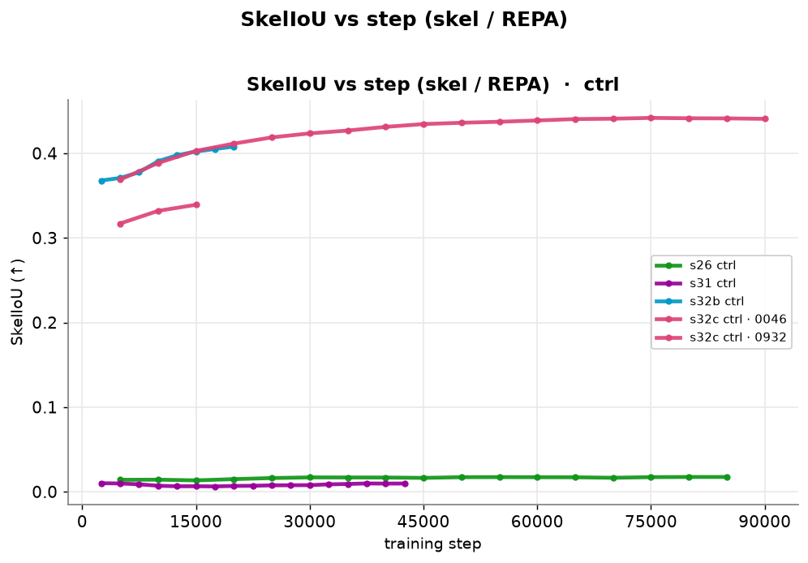

> 交互式 chartjs dashboard（可 hover 查看数值、自由开关曲线）：`_ot_scratch/v8_dash/v8_dashboard.html`（与 chart.umd.min.js 同目录）。

---

## 7. 产物位置
- eval 汇总 CSV：`_ot_scratch/v8_dash/evals_summary.csv`（182 行，7 组实验）
- HTML dashboard（steps×eval，chartjs 自包含）：`_ot_scratch/v8_dash/v8_dashboard.html`（与 chart.umd.min.js 同目录）
- grid 原图：`_ot_scratch/v8_dash/montages/`
- 训练日志：远程 `/tmp/v8a_s30_base.log`
