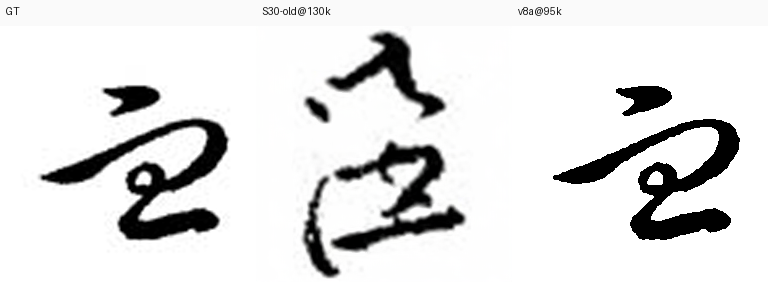
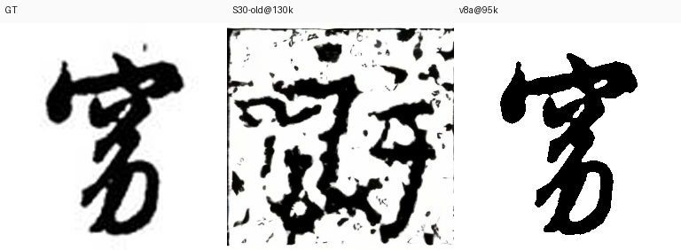
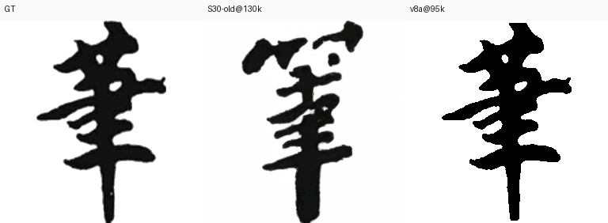

# DiT 书法项目完整时间线：模型 / infra / 数据（2026-08-10 → 09-02）

> 数据全部来自：远程实验结果目录、eval_auto_*.json 实测、docs/system 01-29 文档、
> _ot_scratch 脚本时间线、conda env 实况。口径说明：**SSIM 跨数据集不可比**（
> 11 书家 0.73 ≠ 44 书家 0.47），同口径才可比。

---

## 1. 训练进度（09-02 21:00 快照）

**v8a 基模（新，清洗数据 + batch432 + OT-chunks4 + compile + cu121）**：
- step **100,540**，eval ssim **0.5061 @ 100k**（mse 1.030 / lpips 0.417），持续 NEW BEST，早停未触发
- vs 旧 S30（0.4841 @ 130k）：**+0.022，且省 23% 步数**
- GPU 94% / 22.1G，Steps/Sec 3.96

| step | v8a ssim | mse | lpips | 旧S30 ssim(同step) |
|---|---|---|---|---|
| 80k | 0.5015 | 1.044 | 0.420 | 0.472 |
| 90k | 0.5037 | 1.039 | 0.419 | 0.474 |
| 95k | 0.5045 | 1.037 | 0.418 | 0.474 |
| **100k** | **0.5061** | 1.030 | **0.417** | 0.476 |

---

## 2. 模型架构 / 训练配置时间线

| 时间 | 实验 | 改动 | 结果 |
|---|---|---|---|
| 08-10→14 | V1/V2 | DiT-S/2 + 3因子(callig×script×char)联合MLP，全量从零 | ❌ 3因子不组合（script与callig混淆，覆盖0.264%） |
| 08-15 | **compositional V1** | callig128+script32+char192 **factorized_add**→384；4-way CFG；factor-balanced | ✅ 组合泛化成立（1004书家口径 0.4576） |
| 08-15 | compositional V2 | V1续训 + latent Canny/Skel 结构损失 | ❌ 0.4503 更差 |
| 08-15 | v3a 二因子glyph | script×char→**glyph_id**(35,130类)；DiT-2Cond-S/2 | ⚠️ 短跑；v3b_xl_glyphcond 0.4888 |
| 08-16 | **s2_fromscratch_2factor** | 2因子从零，kailishu 447书家/4,933字 | ✅ 0.5773（447书家口径最佳） |
| 08-16 | V3-B/C XL+空间glyph条件 | XL/2 + 标准字形latent空间条件(token-add, scale 0.4) | ✅ 空间glyph条件有效；❌ XL过杀→回S |
| 08-17→20 | S5 结构损失系列 | top30 128,842张；pixel/latent canny·skel 变体 | ❌ pixel结构损失有害（X0Lat 36-39 vs diff-only 1-2.5） |
| 08-20→22 | S6 受控 diff vs struct | 同数据 top6 10,866张对照 | ✅ diff-only@195k 0.732 ≫ struct 0.403 |
| 08-22 | S7 ramp | 20k步结构损失权重0→斜坡 | ❌ 无效 → **彻底弃结构损失** |
| 08-23 | **S7 kl-f4 VAE换代** | sd-vae(f8,83.7M)→**kl-f4**(f4,55.3M)；地板噪声2×低、latent信息3×；DiT-S/4 | ✅ 采纳 |
| 08-25/26 | **S13 DINO 384 LN-only 冻结直通** | DINO字形嵌入→callig/char表，零可训投影 | ✅ 条件变纯语义向量，S13起验证 |
| ≈08-27 | s18_s_flow_small 首个flow | **Flow Matching 预训练**（Euler 50步, cfg1.7） | ✅ flow 取代 ddpm |
| 08-28 | 核心代码重构 | src/{model,loss,train,eval,utils} 分层；统一时间步采样（修 flow/randint OOD bug） | ✅ infra 根治 |
| 08-28→29 | s19_midclean_s_flow | mid-clean 增广 + flow（旧架构末代） | ✅ 0.5222（midclean口径） |
| 08-29 | **v2 架构现代化→s20** | RMSNorm/SwiGLU/2D axial RoPE/QK-Norm+SDPA；flow: logit-normal t + Heun 二阶；修 6 个静默污染 bug | ✅ s20 新基模 0.5294 |
| 08-30 | **s21_fame_flow_v2** | fame 51,322张/44书家 + 真迹DINO(ln_only)；eval_fame_strict 500 | ✅ base基准 0.4664（44书家口径） |
| 08-30 | s22 只训char embedding | 冻结主干只训字表 | ❌ 0.4664→0.4622 |
| 08-30 | 骨架消融 3px/1px/std-skel | base 0.4977 共同基线 | ✅ **1px>3px**（0.7355 vs 0.7288）；❌ std-skel 12点全平（被门控） |
| 08-31 | 预训练诊断 | pred_xstart flow下恒为None **已修复**（w_std_mid 等此前从未生效）；cfg<1更优 | ✅ 修复 |
| 08-31 | **标准字形DINO零参数直通** | DINO 768→384 PCA表(7026×384)；StdDinoCharEmbedder 冻结查表 | ✅ AUC 0.906（vs 插值0.824） |
| 08-31 | s28 标准字形DINO预训练 | std DINO+PCA+OT+清洗数据 | ❌ 0.4476 step3000后停滞（域差） |
| 08-31 | **1px ControlNet** | warm-start s21@30k, b72, cfg0.7, 1px GT skel latent | ✅ 0.7974（base→skel 最大单点提升） |
| 09-01 | s26/s29/s31 skel配置 | GT skel 1px b96/b192 | ❌ 未收敛（0.50-0.56） |
| 09-02 | s25 IDS部件码本 | IDS替换char embedding | ❌ 0.4618，弃 |
| 09-02 | **s30 DINO char-strong** | 更强DINO char + 清洗后数据重训 | ✅ base最佳 0.4841（+0.017 vs s21） |
| 09-02 | **s32b/s32c REPA** | 1px骨架上加表示对齐 | ✅ 0.8177/0.8204；LPIPS 0.14、MSE 0.12、SkelIoU 0.43 |
| 09-02 | **v8a 基模** | 清洗数据重编码 + batch432 + OT-chunks4 + compile + cu121 | ✅ **0.5061@100k**（+0.022 vs S30） |

---

## 3. infra / 环境切换时间线（用户强调重点）

### 3.1 环境切换（最重要）
| 时间 | 改动 | 内容 | 有效性 |
|---|---|---|---|
| 08-12 前 | base 基线 | /opt/conda (py3.10.8, **torch 1.13.1+cu117**, xformers 0.0.16) 唯一训练环境 | 基线 |
| 08-31 20:59 | torch2 env 创建 | 为 torch 2.6.0+cu124 建 py3.11 env；probe_conda/cu124/cu_tags 探 glibc 2.27 兼容性 | **失败废弃**（cu128 manylinux_2_28 在 glibc 2.27 装不了；torch2 无 torch） |
| 08-31 22:08 | restore_base.sh | base 误装 torch 2.1.2 → 回滚 1.13.1+cu117；**Golden Rule: base 永不升级** | 有效 |
| 08-31 22:11-22:19 | **cu121 env 建立** | rebuild_cu121.sh 重建 py3.10.18；**torch 2.1.2+cu121** + xformers 0.0.23.post1（env mtime 22:13） | **有效**（训练主环境） |
| 08-31 22:36-22:42 | deps+修复 | install_deps_cu121.sh（numpy 1.24.4+diffusers 0.27.2）；fix_hfhub/fix_setuptools | 有效 |
| 08-31 22:43-23:15 | 基准 | base 3.30sps/20.2G → cu121 3.60/19.9G → **cu121+compile 8.50sps/9.7G（×2.6, -52%显存）**；定 batch | 有效 |
| 09-02 04:06-04:08 | ONNX 污染修复 | fix_numpy/fix_env2/3/4（卸 onnx 保留 onnxruntime；固定 numpy 1.24.4+ml-dtypes 0.4.1） | 有效（隔离原则） |

### 3.2 工具链演进
| 时间 | 改动 | 内容 | 有效性 |
|---|---|---|---|
| 08-23 | VAE 换装 kl-f4 | 全管线 encode_latents_klf4.py | 有效 |
| 08-23→31 | **DINOv2 教师落地** | 实验 → PCA(768→384) → 冻结查表零参数直通 | 有效 |
| 08-25/26 | **DDPM→Flow** | diffusion_type 参数化；s14/s15 vs s16/s17 对比 | 有效（flow 成默认） |
| 08-28 | 代码分层重构 | src/ 分层 + 统一时间步采样 | 有效 |
| 08-29 | flow 求解器 | Euler→Heun + logit-normal t + shift | 有效 |
| 08-31 | **OT 启用** | s28 use_ot=true 首次；zero_grad set_to_none | 有效 |
| 08-31 | **torch.compile 引入** | --compile/--compile-mode（EMA 不编译） | 有效（×2.6 速、显存-52%） |
| 09-02 | **OT 分块** | ot_chunks 分块匈牙利（384 batch 13ms→4ms）；v8a 固化 ot_chunks=4 | 有效 |
| 09-02 | **compile 缓存持久化** | TORCHINDUCTOR_CACHE_DIR=/root/.cache/torch/inductor | 有效 |

### 3.3 VAE encode 演进（CPU → ONNX → GPU）
| 时间 | 改动 | 内容 | 有效性 |
|---|---|---|---|
| 09-02 03:00-03:45 | CPU encode 起步 | cpu_encode_v7.py（21050 变更图），bench 估 ETA 数小时 | 部分（慢） |
| 09-02 03:47-04:05 | **ONNX 尝试** | 导出 vae_enc_frozen.onnx(136MB) + CPUExecutionProvider 基准 | **失败放弃**（numpy 2.2.6 崩溃 + env 污染） |
| 09-02 04:59-10:51 | CPU 迭代 | cpu_encode_v8→v9（16进程×4线程，分阶段幂等断点续跑） | 部分 |
| 09-02 11:54 | **GPU 替代 CPU** | gpu_encode_v8.py 重编码 21050 图（img/skel3/skel1，**709s**） | **有效（最终方案）** |

### 3.4 远程 vs 本地分工
- 约定（ENV_INFRA.md）：**pwsh 转义地狱 → 本地 write .sh → scp 远程执行**；本地 `_ot_scratch/` 是脚本库
- **远程**：训练（tmux pipeline）、encode、eval daemon（base env 跑 CPU daemon，cu121 跑训练）
- **本地**：写代码(git) + 可视化（grid/dashboard/gradio）
- 佐证：pipeline 中 `PY_BASE=/opt/conda/bin/python`（daemon）vs `PY_CU=/opt/conda/envs/cu121/bin/python`（训练）

---

## 4. 数据管线时间线

| 时间 | 改动 | 内容 | 有效性 |
|---|---|---|---|
| 08-30 | fame 数据集切换 | fame 51,322张/44书家/4,765字 + eval_fame_strict 500 | ✅ 评测口径统一（s21 基准线） |
| 08-31 | 清洗管线 v1→v7 | 极性归一 + 切边条 + 3px外框白化 + 删小件；人工标注39张；CPU encode 级联 | ✅ v7 全量 0 错误 |
| 09-01 | 清洗调查+方案B | 真污染少（反相0.24%/黑边1.69%/边界墨2.84%/噪点1.59%）；main_frac低=草书飞白正常（**误判陷阱**）；方案B（参考字形bbox）全量修 18,785/51,322(36.6%) | ✅ 方案B采纳；❌ 方案C弃 |
| 09-02 | **v7 清洗（用户）+ v8 资产集** | 51,822张检测 → **21,050张(40.6%)缺陷**（bars 11,287=21.8%、removed 18,506、翻转39）；**GPU 重编码 → fame_clean_v8.npz + *_v8 shards + final_imgs_fame_v8(GT) + v8 csv** | ✅ 消除4成坏样本，三域一致 |
| 09-02 | eval 集 | 同 500 id，GT 指向清洗后 v8（27 张 v7 修复） | ✅ 口径更干净 |

**关键**：训练实际读 `final_latents_fame_clean` shards，而旧 v7 encode 写回的是不带 `_clean` 的 `final_latents_fame`——**两套内容不同（diff 6.27）**，旧 encode 即使跑完也没进训练数据。v8 直接建新资产集绕开此混乱。

---

## 5. 有效性总结（按收益排序）

### ✅ 有效（决定性）
1. **1px GT 骨架 ControlNet（ctrl_fame_1pix_v1）**：base 0.50 → 0.797（最大单点提升；LPIPS 0.44→0.16）
2. **数据清洗 v7 + v8 资产集**：基模 +0.022 且省步数；消除 40.6% 缺陷样本、三域一致
3. **REPA（s32b/c）**：0.8177/0.8204；LPIPS 0.14、MSE 0.12、SkelIoU 0.43（噪声类指标降 3-8 倍）
4. **eval skel latent bug 修复**：假 0.54 → 真 0.8081（所有对比口径才可信）
5. **cu121 env + torch.compile**：×2.6 速度、显存 -52%
6. **OT 分块 + batch 432 + compile 缓存**：OT 13ms→4ms、吞吐 1769 img/s、无质量损失
7. **factorized_add 二因子 + 纯 diff-only + flow + kl-f4 + v2 架构**：早期基石

### ❌ 无效/有害
- 3Cond 联合MLP（V1/V2）；pixel 结构损失（S5/S6/S7）；std-skel（冗余被门控）
- 标准字形DINO+PCA（s28 域差）；IDS 部件（s25）；只训char embedding（s22）；XL 过杀
- **REPA 长训 90k（s32c）**：base.ssim 崩 0.46→0.23；**REPA w2.0（s32d）**：直接崩 0.72
- **Sinkhorn**（慢且质量-4.8%）；**curegot**（熵正则非LAP + py3.11不兼容）；**ONNX CPU encode**（无增益+env污染）；**torch2/cu124**（glibc 2.27 硬墙）

---

## 6. 样例 grid（基模对比：GT | S30-old@130k | v8a@95k）

### 逐行
| 行 | 图 |
|---|---|
| id 0 |  |
| id 1 |  |
| id 10 |  |
| id 100 |  |

> 观察：v8a 笔画更实、背景更净、边缘利落（对应 lpips 0.417 < S30 的 0.434，tv/saltpepper 类噪点指标全面更低）。

---

## 7. 产物位置
- eval 汇总 CSV：`_ot_scratch/v8_dash/evals_summary.csv`（182 行，7 组实验）
- HTML dashboard（steps×eval，chartjs 自包含）：`_ot_scratch/v8_dash/v8_dashboard.html`（与 chart.umd.min.js 同目录）
- grid 原图：`_ot_scratch/v8_dash/montages/`
- 训练日志：远程 `/tmp/v8a_s30_base.log`
