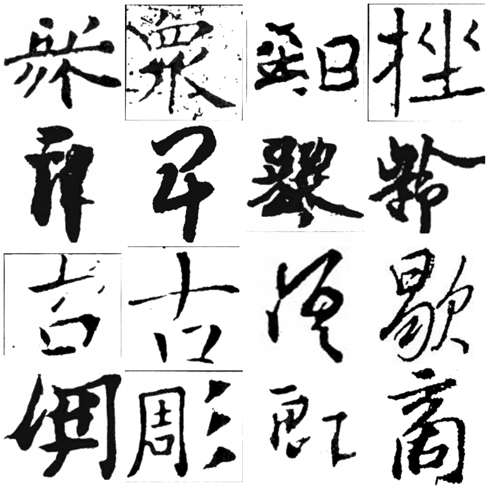

# 字符条件探测：DINO glyph 表的判别力与「只训字 embedding」诊断实验（2026-08-30）

## 0. 背景与要回答的问题

s21 fame 预训练（从零、`freeze_char_table=true`）early-stop @27.5k，best SSIM
**0.4664**（eval_fame_strict, n=500, cfg=0.7, steps=25）。fame-ctrl 加了 GT 骨架后
达到 0.8045，但那是「复刻」指标（骨架从目标图抽取，等于泄题）。

真正的泛化基准是 **base 的 0.50**，而换用「他人同字书法骨架」只带来 **+0.007**
（0.5007 → 0.5074）。这个对照基本给「字→骨架预测网络」定了上界。

于是问题变成：**base 为什么只有 0.50？瓶颈在哪？**

s21 是从零训练的、除 char embedding 外**所有参数都可训练**（`use_lora=false`、
无 `pretrained`，因此 train.py 的白名单冻结分支不生效）。也就是说
`y_char_embedder` 那张 DINO 表是**唯一被冻结**的参数——它是头号嫌疑。

## 1. 方法：用现成 DINOv2 做检索式字形评估（无需训练分类器）

### 为什么不用分类器

fame 只有 4,765 字 / 51,322 样本，**每字平均 10.77 个样本**；16.5% 的字只出现
1 次，17.5% 的字只有 1 位书家写过。在这个稀疏度上训练判别器必然欠拟合，实测
很差，此路不通。

### 替代方案

直接用预训练 DINOv2（本地 `dinov2_vits14_pretrain.safetensors`）的 CLS 特征做
最近邻检索，**不训练任何东西**：

- 建库：`train_fame` 的图 → 每个 `(script, character)` 一个类中心
- query：图 → DINO CLS → 在**同 script 组内**检索最近类中心
- 指标：top-1 / top-5 字符准确率

按 script 分组是必须的：已有实测表明 DINO CLS 被「书体」主导（83% 最近邻是
同一书体），书体是混淆变量，先组内消除，剩下的才是纯字符身份判别力。

脚本：`tools/eval_glyph_retrieval.py`（支持 raw / per-script-centered 两种模式）。

### 校准先行

先用**真实图**做 query（eval_fame_strict 的 500 张真实图，均不在库里），得到
该方法的准确率上界。只有这个数够高，用它测生成图才可信。

## 2. 结果：一个断崖式对比

| query 来源 | top-1 | top-5 | 说明 |
|---|---|---|---|
| **库内**样本（query 自身在库中） | **84.0%** | 100.0% | sanity check：实现无误 |
| **库外**真实图（同字、不同书家） | **4.0%** | 6.0% | 随机基线 ≈1.5% / 7.7% |

（smoke test 规模：建库 2,000 张 / 391 类，query 50）

两个数字放在一起才有意义：

- 库内 84% 证明**流程正确**——特征提取得对、检索逻辑没写错；
- 库外 4% 则证明 **DINO CLS 不具备跨书家的字符判别力**。

top-5 的 6.0% 甚至**低于**随机基线 7.7%，即「在书体内找出正确的字」这件事，
DINO CLS 提供的信息不如瞎猜。

`per_script_center`（去书体均值）在本测试上没有带来改善（同为 4%），说明
书体不是唯一的问题——特征本身就是「外观摘要」而非「字符身份」。

## 3. 结论

### 3.1 方法论：基于 DINO CLS 的字形准确率评估不可行

不能用它判断「base 生成的字对不对」。需要另找方法（目检 / 其他度量）。

### 3.2 模型：DINO CLS 编码的是「这张图长什么样」，不是「这个字是什么字」

84% → 4% 的崩塌发生在「同字、换书家」这一处，说明特征高度依赖具体样本的
低级外观，而没有抽象出字符身份。

而模型的 char 条件**正是**这种特征（glyph 内所有书写样本的 CLS 平均 + L2 归一化，
有效秩仅 34.1/384）。模型拿到的「要写哪个字」的信号极弱，base 卡在 0.50 就不奇怪。

### 3.3 目检佐证：base 生成确实有字形错误

`s21 best@27500` 的 eval 样例（左=生成，右=GT）：



8 对样本判读（快速目检）：

- **字形明显对**：众、鉛、巨、铃（约 4/8）
- **结构接近但风格不像**：吉 vs 草书吉、商（约 2/8）
- **明显字形错误或结构混乱**：左图像「用/周」而 GT 是「雕」（至少 2/8）

失败率约 25%（8 样本）与整体失败率 15%（75/500）同量级，说明 **base 0.50
不仅损失风格细节，也确实存在字形错误**。这是 char 条件判别力不足的直接后果，
而非单纯的风格/纹理损失。

### 3.4 对「骨架网络」路线的含义

骨架提供的是**空间结构**，而 DINO CLS 恰恰丢失了空间结构（全局摘要）。
这解释了指标分布：

| 条件 | SSIM | 解读 |
|---|---|---|
| 无骨架 | 0.5007 | 拿不到结构 |
| 他人/标准骨架 | 0.507–0.520 | 有结构，但不是目标的结构 |
| 自己的 GT 骨架 | 0.8202 | 有结构且正是目标结构 |

**结构信息是决定性的**——但必须是「目标的结构」。预测出来的骨架属于中间那档，
所以上界就是 ~0.52。

## 4. 顺带修掉的 bug

`src/loss/losses.py::_default_dino_ckpt()` 的路径层数算错：文件在 `src/loss/`，
却只向上两级（得到 `src/`），注释写的是「项目根」但少算一级。后果是
**本地 DINO ckpt 永远找不到，静默回退到 `torch.hub`**（需访问 github）。
即 `w_repa` 若启用过，实际走的都是被墙的那条路径。

已改为向上逐层搜索 `pretrained_models/`，兼容 `src/loss/` 与 `src/` 两种布局。

## 5. 诊断实验 s22：冻结主干，只训字 embedding

### 设计

`--train-only-char-embed`（新增开关）+ `--resume-full` 从 s21 best@27500 继续。
除 `y_char_embedder.embedding_table` + `char_proj` + CFG null token 外全部冻结
（可训练 13,787,136 / 总 46.5M ≈ 29.6%）。

**因为主干完全不动，指标的任何变化都可直接归因到字条件**，不会被「主干也顺便
多训了一会儿」污染——这是本实验相对「直接解冻重训」的核心优势。

### 配置要点

- `src/train/configs/s22_char_embed_only.json`
- `freeze_char_table` 必须保持 **true**：s21 ckpt 是在 freeze=true 下训的，模型
  里有独立的 `y_char_embedder.null_embed`；改成 false 会让该参数从结构中消失，
  导致 resume/EMA 加载 unexpected key 而失败。解表由 `train_only_char_embed`
  负责。
- `weight_decay=0`：DINO 注入时已 L2 归一化，decay 会缩小其范数。
- `lr=5e-4`、`warmup=500`、`fresh_scheduler=true`、`max_steps=47500`（续跑 20k）
- eval 口径与 s21 完全一致（eval_fame_strict / n=500 / cfg 0.7 / steps 25），
  可直接与基线 0.4664 对比。

### 判读标准

- **SSIM 明显提升** → 瓶颈确认在 char embedding，且可解 → 下一步全量解冻重训
- **train loss 降但 eval 不升** → 过拟合（每字仅 10.8 样本、384 维），说明需要
  换条件形式而不是解冻 → 转向空间化条件（见 §6）
- **基本不动** → 瓶颈不在字条件，需重新定位

## 6. 关于「DINO 直通」（未实施，待 s22 结果）

值得区分两种「直通」：

- **CLS 直通**：无效。§2 已证明 CLS 本身字符判别力崩塌，直通只是把一个弱信号
  原样送入，等于把 `char_proj` 的可学习容量也去掉（历史上有 `ln_only` 模式，
  后因容量不足改为 `mlp`）。
- **patch tokens 直通**：这才是真正有潜力的版本。DINOv2 vits14 输出
  16×16=256 个 patch token × 384 维，是**保留空间结构的特征图**，与骨架互补
  （骨架只有拓扑细线，patch tokens 含笔画粗细与墨色分布）。可通过
  cross-attention 注入，且与骨架不冲突——骨架给拓扑，patch tokens 给外观。

代价是架构改动 + 需要重新训练，且要防止「抄参考图」导致书家风格趋同。

## 7. 文件索引

- 评估脚本：`tools/eval_glyph_retrieval.py`
- 数据探查：`_probe_fame.py`（组合覆盖密度 / eval 可见性）
- 配置：`src/train/configs/s22_char_embed_only.json`
- 代码改动：`src/train/train.py`（`--train-only-char-embed`）、
  `src/loss/losses.py`（DINO 路径修复）
- 结果：`5script/glyph_retrieval_calib.json`、`5script/results/s22_char_embed_only/`

## 8. 附：fame 数据分布（_probe_fame.py）

```
书家 44   字 4,765   样本 51,322
理论组合 209,660   实际组合 36,512   覆盖率 17.41%
eval 字未见 0/500   书家未见 0/500   组合泄漏 0
eval 每个字在 train 中被 ~17 位书家写过
每字平均 10.77 样本；仅 1 次的字 784 (16.5%)；仅 1 位书家写过的字 836 (17.5%)
```

注意：eval 是**字与书家都 100% 见过**的最温和场景，只测组合泛化；未见字能力
完全未被评估（这是「骨架网络」唯一尚未证伪的价值场景）。
