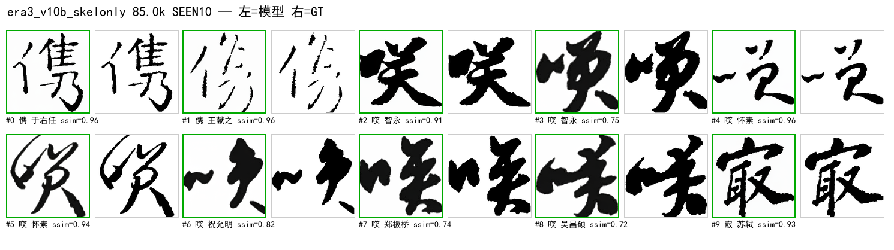

# 50. 演进复盘（2026-08-12 ~ 09-10）：从 XL 到风格 token（详解版）

状态: 覆盖全程 6 纪元；**45 张里程碑 poster**（`imgs/retro/`）+ 早期 s 系图表全编入。
本文详细记录：**训练/调度器改动史、条件注入方式改动史、当前 attention 的逐行实现、失败尝试全集**。
图例: 单张=左模型右 GT；有严格集 poster 的 run 均已出 5 张（正文列 p0，其余见目录）。

---

## 0. 总览时间轴

| 纪元 | 时间 | 代号 | 骨干 | 条件 | 数据 | 里程碑结果 |
|---|---|---|---|---|---|---|
| 0 | 08-12~08-31 | **XL / 3Cond**（已删） | DiT-XL/2 (675M) | `xl_highdim` | top6/top30 | v3b 0.4888；overfit 0.0005 |
| 1 | 08-16~08-25 | s2~s11 / **fame-ctrl** | pixel S/B → latent S | 结构损失/ControlNet GT-3px | top30/5书体 | **ctrl 0.8045**；cfg1.7→0.8237 |
| 2 | 08-25~09-04 | s12~s21 / **v8-chain** | S/2 latent flow | DINO / 1px GT skel / REPA | 3top30→fame v8 | s21 0.5121；**v8e 0.7761** |
| 3 | 09-04~09-07 | **v9 / v10a / v10b** | S/2（skel 作字条件） | skel-latent = char cond | fame v8 | v10a 0.8476；手写 IoU3 0.554 vs 0.194 |
| 4 | 09-07~09-09 | **fame3 / Sp / c41 / c41x** | **Sp/2 (59M)** | 41 冻结表 + xattn×12 | fame3 28k | **0.7638 / IoU 0.2227**（n=10）|
| 5 | 09-09~09-10 | **c41x_cos / cos_e** | Sp/2 | cosine 修正/增强/外挂证伪 | +85k 增强 | strict **0.568**；CFG 口径修正 |
| 6 | 09-10~ | **sty16 / sty32** | Sp/2 | **风格 token 每层注入** | 同纪元5 | sty32 strict 0.529@70k ↑（进行中）|

---

## 1. 纪元 0：XL / 3Cond（代码已删除，08-12~08-16）

**设计**：直接沿用 DiT-XL/2（hidden 1152 / depth 28 / heads 16，~675M）；
条件走 `xl_highdim`：callig(384) + glyph(768) → cond_fusion MLP → hidden 1152，
`c = t_emb + y_emb` 交给 adaLN——即"保留预训练分类→调制耦合"的最初形态。
同期实验：2Cond LoRA / 3Cond（canny+skel 结构损失）/ V3B 标准字形（楷/隶）条件 /
MIDSTEP_STD（标准字形作为去噪中线目标，v3c）。

| 实验 | 结果 | 判读 |
|---|---|---|
| v3b_xl_glyphcond | ssim **0.4888** @30k | XL 条件融合可行但 ~8× S/2 成本 |
| exp_xl_head r8/32/64 | ~0.90（**像素重建口径**） | "重建 ≠ 生成" 首次踩坑 |
| 3Cond overfit | diff 0.0005 | 结构损失 + lr 3e-3 + 重init adaLN 的组合 |

08-31 `8802e8f` 删除 XL/LoRA/3Cond 全部死代码，只保 S/2 主干。**无产物留存，无海报。**

---

## 2. 纪元 1：S 系 + 结构损失 + ControlNet 首胜（08-16~08-25）


**cfg 扫描视觉对照（base 无骨架 vs ctrl 有骨架，0.50→1.00）**：

| base（无骨架） | ctrl（GT 3px 骨架） |
|---|---|
|  |  |
|  |  |
|  |  |
|  |  |


**设计变化**：pixel DDPM（S/B）→ latent（VAE 8×, 32×32）→ ControlNet（ZeroAdaLN modulate, GT 3px 骨架）。

**ControlNet 三定理（实证）**：
1. 条件域匹配：训练/推理骨架风格必须同源，跨域即失效；
2. cfg≤1：骨架条件下 CFG>1 单调劣化（1.7→0.7: 0.683→0.752）；
3. 冗余条件被门控忽略：骨架信息可由字 ID 推出时注入分支学不到（stdskel Δ+0.0015）。

---

## 3. 纪元 2：v2 架构 + v8 三阶段链 + REPA（08-25~09-04）

| 图 | 内容 |
|---|---|
|  | 统一模型谱系 |
|  | s20 曲线（v2 架构 +0.013，步数减半） |
|  | 条件价值分解 |
|  | 设计轴（容量/条件/数据） |
|  | 实验全景 |
|  | 各代最优对照 |
|  | 像素时代回顾 |


**架构变化（v2 现代化）**：RMSNorm + SwiGLU + QK-Norm + 2D axial RoPE（替换 LayerNorm/GELU/固定 sin-cos）。
**扩散变化**：DDPM(eps) → Flow Matching（Heun 采样、logit-normal t、timestep shift；OT 分块匈牙利加速）。
**v8 三阶段链**：v8a base(132.5k) → v8b ctrl(1px) → v8c/v8e REPA（中间层特征对齐 DINO）。
**关键数字**：s21 0.5121 → v8b Δ+0.2997@50k → v8c 0.7674 → **v8e 0.7761**；v8i grid layer6 0.7664。

---

## 4. 纪元 3：字条件之争 → skel 作为条件（v10a / v10b，09-04~09-07）




**设计变化**：DiT-1CondSkel（v10a：skel 8ch concat 输入 + callig adaLN）→
v10b 两因子极简（callig + skel-g，**移除 char 向量条件 -13.8M**）。

| 对比 | 结果 |
|---|---|
| v10a GT 协议曲线 | **0.8476 @127.5k**（40 点入册）|
| 手写新字遵循 IoU3 | **v10b 0.554 / v8e 0.194**（2.8×）|
| n=30 遵循矩阵 | v10a 0.578 ≈ v10b 0.570（char drop 无提升）|
| v10a-dino（冻结 DINO 表） | 系统性低于随机可训练表 → 净负，仅留开集查表价值 |

---

## 5. 纪元 4：fame3 / Sp / 41 冻结书家表 / xattn 12 层（09-07~09-09）

**训练配方演进（同源样本视觉对照）**：


**主线 c41x（Sp/2 + 41 冻结表 + xattn×12）**：


**四件套设计变化**：
1. **数据 fame3**：书家 1013 → **41**（精选 ~700 样本/家，28,386 张）；
2. **std skel latent** 替代 GT 实例骨架（`cos(std,GT)=0.902`，`nmse 0.197`）——推理可得；
3. **Sp/2 加宽**：h512/d12（59M vs S/2 32.7M）——S/2 全系平台 0.61-0.62 的容量瓶颈结论；
4. **书家表**：SupCon 预训练（同书家正对 + temp 0.07 + DINO 质心锚定）+ **冻结**，
   pairwise cos 0.323→0.024 防塌缩；cond_drop 0.5→0.1（闭集先学会）。

---

## 6. 纪元 5：LR 修正 + 增强数据 + CFG 口径（09-09~09-10）


**strict n=237 曲线**：fame3 0.5059 → Sp 0.5178 → LR 修正 0.535 → **增强+机制 0.568@390k**。
详见 §7（LR）与 §9（数据）与 §11（CFG）。

---

## 7. 训练 / LR 改动全史（重点）

### 7.1 三代调度器

| 代 | 配置 | 行为 | 问题 |
|---|---|---|---|
| 恒定 LR | `lr=1.5e-4`（c41x），`3e-4`（v8b） | 全程不变 | 无退火，后期抖动；resume 后续跑不衰减被误当中性 |
| cosine（相对步） | `resume + max_steps` | **resume 时 LR 从中段重排**（warm restart），实际等效 LR 抬升 | 曲线口径不定 |
| **绝对步数 cosine（现行）** | `total=max_steps`，`_step_offset=resume_start_step` | resume 点落在**同一条**从 0 开始的 cosine 中段，无 warm restart | 需配合下面两个 base 修复 |

现行实现（`src/train/train.py`）：
```python
total_planned_steps = args.max_steps
_step_offset = resume_start_step if fresh_scheduler else 0
def _lr_scale(step):
    step = step + _step_offset                      # 绝对步
    if step < warmup_steps: return (step+1)/warmup  # 线性 warmup
    progress = (step - warmup) / (total - warmup)
    return min_ratio + (1-min_ratio)*0.5*(1+cos(pi*progress))
scheduler = LambdaLR(opt, lr_lambda=_lr_scale)
```

### 7.2 三个 base lr 修复（全实测）

1. **旧 `initial_lr` 劫持**（09-09）：ckpt 的 optimizer state 里带旧 `initial_lr`，
   LambdaLR setdefault 后 `--resume-lr` 失效 → 修复：fresh-scheduler 分支 `_pg.pop('initial_lr')`。
   实证日志：`starting from base lr 5.00e-05`。
2. **恒定 LR bug**（09-09）：老调度器 resume 后 LR 不再衰减（c41x 300k 曲线平尾的原因之一）→
   绝对步数 cosine 上线，strict 一次性 +0.006（0.529→0.535 段）。
3. **fresh base 取错源**（09-10，本日）：`pop initial_lr` 后 LambdaLR 拿
   **ckpt 恢复的 `param_group['lr']`**（旧曲线尾值 1.01e-5）当 base →
   12h 重启实测 LR 只有 **8.2e-6（应为 4.2e-5）**。
   修复：`_pg['lr'] = float(getattr(args,'resume_lr',None) or args.lr)`。
   实证：`base lr set to 5.00e-05 (config/--resume-lr, not ckpt-restored)`。

### 7.3 LR 取值的科学估算（`_sync_work/lr_analyze.py`，09-09）

用户裁定不再做实跑 sweep（range test 半途被叫停：5e-6/-0.0048、1.5e-5/-0.0076、5e-5/-0.0101），
改用解析法：

| 方法 | 量 | 结论 |
|---|---|---|
| UWR（更新/权重比） | RMS(w)=5.68e-2，mean\|m̂/√v̂\|=0.183 | lr=5e-5 时单步位移/RMS(w)=**1.61e-4**（1.5e-4 时 4.83e-4 噪声主导） |
| GNS（梯度噪声尺度） | B_crit≈1409 ≫ batch 128；cos(g_j,ḡ)=0.276 | 噪声主导区 → 提高 batch 无用，**降 lr + 长 cosine** |
| 综合 | — | **base 5e-5 + 绝对步数 cosine**（min_ratio 0.1，warmup 3000） |

### 7.4 常用 horizon / ETA 表

| run | 起 | 止 | 说明 |
|---|---|---|---|
| c41x | 0 | 300k | 恒定 lr 1.5e-4 |
| c41x_cos_e | 175k | 400k | 5e-5 cosine，增强数据 |
| sty32 | 0→72.5k | 250k | 从零→12h ETA（本日 22:47 起，LR 4.17e-5） |

---

## 8. 条件注入方式改动史（g 骨架通路）

| 代 | 机制 | 公式（代码对应） | 结果/教训 |
|---|---|---|---|
| 无 | s2x 期 char id 条件 | `c = t_emb + y_emb` | 结构不可控 |
| 输入层 token-add | glyph_embedder(g) → g_tok；`x = x + glyph_scale*g_tok` | `learned glyph_scale`（init 0.6 → 学到 **0.19**） | **骨架主通路**（置零即崩，D1 撤回） |
| adaLN 逐层注入 | ZeroAdaLNInjection：`x = x*(1+s)+t`，s/t 由 g 经 zero-init Linear 产出 | 固定 1:1 位置调制 | 表达力不足（4 层） |
| **xattn 逐层注入（现行）** | **ZeroCrossAttention**：Q=x，K/V=g_tok(+16×16 sincos) | `x = x + out_proj(sdpa(q,k,v))`，out 零初始化 | 12 层全开，四通路之一（置零 −0.24） |
| ~~外挂 callig_spatial~~（已删） | 书家向量→固定 16×16 空间模板加 g_tok | Linear(128→4D)→SiLU→Linear(→256*D) | **死重**（strict ±0.002，4.2M 白训） |
| 风格 token（现行） | **GlyphStyleCrossAttn**：context=[骨架+pos; style+role] | 见 §9 | 从零训练验证中 |

**诊断证据链**（41/48 号）：
- `learned glyph_scale=0.1896`（init 0.6）→ 曾误判"输入 add 无关紧要"→ D1 置零实测 **崩**（ssim −0.28）→ 撤回；
- REPA 劫持：梯度占比 158%（余弦 vs MSE 量纲错配）→ w_repa 0.03 校准；
- callig 链弱梯度（rel 0.0013）→ callig_proj_mode=mlp / 冻结表解决；
- GPU 推理时消融：骨架 g −0.35 / 输入 add −0.28 / xattn −0.24 / 书家 −0.22 —— **四通路全必需**。

---

## 9. 当前 attention 实现（逐行，重点）

### 9.1 三套 cross-attn 的分工

```
① 输入层风格化 (v2, callig_style_attn, 目前关闭):
   e_callig(128) ─style_proj→ n_style 个 style token
   g_tok(256) 作 Q, K/V=style tokens → g_tok' = g_tok + out_proj(attn)
   ※ 只在输入端做一次; 深层靠 g_tok' 携带 → 风格会被稀释

② 骨架逐层注入 (ZeroCrossAttention):
   Q = x(latent 256 token), K/V = g_tok + sincos2D(16×16)
   每个 x 位置动态聚合全部骨架 token → 空间寻址注入 (12 层)

③ 风格 token 每层注入 (v3, GlyphStyleCrossAttn, 当前实验):
   Q = x(latent 256), K/V = [ g_tok + sincos2D ; style_tokens + style_role ]
   → 每个位置按"自身内容+空间位置"同时寻址 局部字形 + 全局书家风格
   → 同一书家不同位置吸收不同风格分量 = 风格局部化(结体差异)
```

### 9.2 代码级实现（`src/model/dit.py`）

**A. style token 生成**（DiT_2Cond.__init__，`style_token_n>0` 时）：
```python
self.style_proj = nn.Sequential(            # 共享投影 (各层复用)
    nn.LayerNorm(callig_embed_dim),
    nn.Linear(callig_embed_dim, n_style * hidden_size))
self.style_role = nn.Parameter(             # 可学习角色向量, 促 N 个 token 分化
    torch.randn(n_style, hidden_size) * style_role_init)   # init 0.02
self.ctx_pos_g  = 2D-sincos buffer (1,256,hidden)  # 骨架 token 的空间位置
```

**B. 每层注入的 context 拼接**（forward）：
```python
inject_ctx = g_tok
if style_proj is not None and g_tok is not None:
    _style = self.style_proj(e_callig).view(B, n_style, D) + self.style_role
    inject_ctx = torch.cat([g_tok + self.ctx_pos_g, _style], dim=1)  # 256+n_style 个 K/V
...
for i, block in enumerate(blocks):
    x = block(x, c, rope=rope)
    if i in _inj:                            # 12 层均匀注入
        x = self.glyph_injections[_inj[i]](x, inject_ctx)
```

**C. GlyphStyleCrossAttn 模块本体**（无内部位置编码——位置已在外层显式加好）：
```python
q = q_proj(norm_x(x)).view(B,N,h,hd).transpose(1,2)      # Q = 画布
ctx = norm_c(context)                                     # [骨架(+pos); style(+role)]
k = k_proj(ctx).view(B,Nc,h,hd).transpose(1,2)            # K/V = 拼接 context
v = v_proj(ctx).view(B,Nc,h,hd).transpose(1,2)
out = F.scaled_dot_product_attention(q, k, v)             # flash/sdpa
return x + out_proj(out)                                  # out_proj 零初始化
```
- 对比 **ZeroCrossAttention**（style_token_n=0 回退路径）：context 只有 g_tok，
  **位置在模块内部**加（`context + self.ctx_pos`）——两条路径完全兼容（旧 ckpt 不变）。

**D. drop 语义（两个历史 bug 及修复，09-10）**：
```python
# bug1: g 被 drop 后 g_tok=0, 但风格注入会给零骨架加非零输出
#       → uncond-g 分支被污染。修复: 风格调制后重新置零:
g_tok = self.callig_style_ca(g_tok, e_c_ca)   # 或 style context 注入
if keep is not None:
    g_tok = g_tok * keep.view(-1,1,1)         # drop 样本精确归零 (T1 实测 diff=0.0)
# bug2: callig drop mask 在 g 路径之后才 roll → drop-callig 样本的骨架通路仍带真实风格
#       → adaLN(null) 与骨架(真风格) 两分支矛盾。修复: mask 提到 forward 顶部共享
callig_drop = r < (all + one)                 # v10b 单因子
y_callig_in = where(callig_drop, num_classes, y_callig)
e_c_ca = self.y_callig_embedder(y_callig_in, False)   # 风格注入也用 drop 后向量
```

**E. 参数与初始化**：
- `CalligStyleCrossAttn`（v2）= 1.58M；`GlyphStyleCrossAttn`（v3, n=32, 12 层）≈ +1.6M；
- `out_proj` **零初始化**（残差注入平滑启动；注意 initialize_weights 会重新置零，
  resume 场景下 load 后不会自动保持 —— 见 §12.9 的 resume 教训）；
- 冒烟判定：style token intra-cos 0.064（<0.3 不塌缩）、**有效秩 27/32**、inter-cos 0.149（书家可分）。

**F. 为什么"从零训练"**（46 号实测）：
resume 旧 ckpt 时形状全兼容、missing 仅 5 个新参数（strict=False 静默通过），
但 load 后 `out_proj` |mean| = 3.398e-2（**非零**）——随机 style token 经已训练的非零
`out_proj` 直接给残差流灌随机噪声。**结构改动后不能盲目 resume**。

---

## 10. 数据演进

| 阶段 | 规模 | 变化 | 结果 |
|---|---|---|---|
| 原始 MCCD | 51,322 | — | 噪声基线 |
| **fame v8** | 51,822 | 清洗（去小连通域/贴边块），笔画 100% 完整 | v9c/v10 系列训练底座 |
| **fame3** | 28,386 | **书家 1013→41** 精选；std skel latent（`cos=0.902`） | v10b 主线 |
| ~~v9 去噪~~ | 51,321 | 8 轮去噪迭代 | **失败**：5414 张骨架丢>5%，已隔离 REJECTED |
| **增强 v3.3** | +85,155 → 113,540 | 二值形态学**宽度收敛**（粗>9→细/细<4.5→粗，朝 6.75 收敛），b1/b2/b3 三档，不动骨架拓扑 | strict +0.033 的重要成分 |

---

## 11. 评测口径演进

| 事项 | 历史 | 修正 |
|---|---|---|
| CFG | 全程 0.7 | **seen 峰值 2.0**（IoU 0.223→0.352，+58%）；**strict 不受救**（0.0158→0.0182）；c41x 在 2.0 下未平台 |
| strict 集 | n=237 新字精确骨架 IoU ~0.016 | 泛化遵循无 cheat 可走 |
| IoU | 精确 1px（严苛） | 另有 IoU3（3px 容差）：Sp 0.289 / c41x_cos 0.299 / cos_e 0.209（cfg_g2 0.261） |
| 样本量 | n=10（±0.01 噪声带） | 结论需 strict n=237 复核 |
| eval 引擎 | GPU 批量 vs CPU daemon 混用 | **协议冻结**（Heun50、seed 0、同 cache）保证跨实验可比 |

---

## 12. 失败尝试全集（按性质分组）

### 12.1 模型/架构
| 尝试 | 结果 | 教训 |
|---|---|---|
| XL/3Cond/LoRA（纪元 0） | 整体删除 | 起点最大模型 ≠ 最好；先修数据/条件 |
| 结构损失（canny/skel, s2-s9） | **削笔画/反向毁图**（3 个致命缺陷修复后仍无净益） | 像素级结构监督与生成目标冲突 |
| 像素扩散（exp_px_s_scratch） | 废弃 | latent 更优（显存/质量） |
| skel-head 重建（exp_xl_head） | ~0.90 重建分 | 重建口径≠生成，口径陷阱 |
| S/2 容量（0.61-0.62 平台） | 转为 Sp | 欠拟合=逐 token 带宽不足 |
| Muon 优化器 | 2k/5k 全落后 AdamW（0.385 vs 0.404） | 冷启动 19M 尖峰；归档 |
| v9 去噪线 | 5414 张骨架断裂 | 毛刺与细笔画尺度重叠，无参考形态学必两难 |

### 12.2 条件设计
| 尝试 | 结果 | 教训 |
|---|---|---|
| stdskel ControlNet | Δ+0.0015 | 冗余条件被门控忽略 |
| DINO 表字条件 | 中段 −0.012~−0.014 | 外观嵌入 SNR 1.09 硬天花板 |
| IDS 码本 / contrastive finetune v1+v2 | 检索 0%、sep −0.19 | 同 上 |
| callig_spatial 外挂 | strict ±0.002（死重） | 与字无关的常数模板无效 |
| REPA w0.1 | 梯度劫持 158% | 校准 w0.03（量纲错配） |
| 风格 token resume | out_proj 非零化 → 随机噪声 | **结构改动从头训** |

### 12.3 训练/调度器
| 尝试 | 结果 | 教训 |
|---|---|---|
| range test 实跑 sweep | 被叫停（用户判定不科学） | 改解析法（UWR+GNS）估 lr |
| 恒定 LR | 后期不适配 | 绝对步数 cosine |
| resume 旧 initial_lr | --resume-lr 失效 | pop initial_lr |
| fresh base 取 ckpt 旧 lr | LR 差 5×（8.2e-6 vs 4.2e-5） | 显式 base=config/override |

### 12.4 评测/基础设施
| 问题 | 表现 | 修复 |
|---|---|---|
| callig_spatial 漏传 eval | 13h eval 全崩（unexpected=5） | 各构建器透传 + F5 明细 |
| style_token 漏传 | eval 全崩 | 透传修复 |
| 陈旧 lock | step 永久跳过 | F4 >45min 自动清理 |
| `.part` 残留 | 失败评测误判成功 | 启动清理 |
| D3 后 None 字段 | int(None) 崩 | None-safe 默认 |
| 静默 30 分钟 | 误判 eval 死了 | chunk 级进度日志 + eval_ctl status |
| CFG 用错 | 历史 seen 低估 +58% | E4a/E4b 复核 |

---

## 13. 六条硬教训

1. **先数据后模型**：XL→S 降级 + fame3 41 家升级，瓶颈都在数据/条件密度。
2. **冗余条件必被忽略**：stdskel-ctrl、callig_spatial、DINO char 三连证。
3. **零初始化新通路在收敛模型上高概率变死重**：从零训或显式 re-zero。
4. **口径不统一，一切对比作废**：重建/生成、seen/strict、cfg、IoU/IoU3、样本量。
5. **"参数小" ≠ 不重要**：输入层 token-add（scale 0.19）是骨架主通路。
6. **评测基础设施要当产品做**：eval_ctl + 进度日志 + 自动 poster。

---

## 14. 资产索引

| 类型 | 路径 |
|---|---|
| **本复盘 poster（45 张）** | `docs/system/imgs/retro/`（17 run × seen + 5 run × strict×5 + sty32 live）|
| 早期 s 系图表 | `docs/system/imgs/fig1~fig7`、`poster_base/ctrl_cfg*`、`s21_base_grid` |
| poster 生成器 | `src/eval/posters.py`（daemon 自动 + CLI 回填，支持 `--prefix`）|
| eval 托管 | `tools/eval/eval_ctl.sh`（tmux 单实例 + 进度 + status）|
| LR 解析估算 | `_sync_work/lr_analyze.py` |
| 历史详解 | 12 / 17 / 35~38 / 44 / 45~47 / 48~49 |
