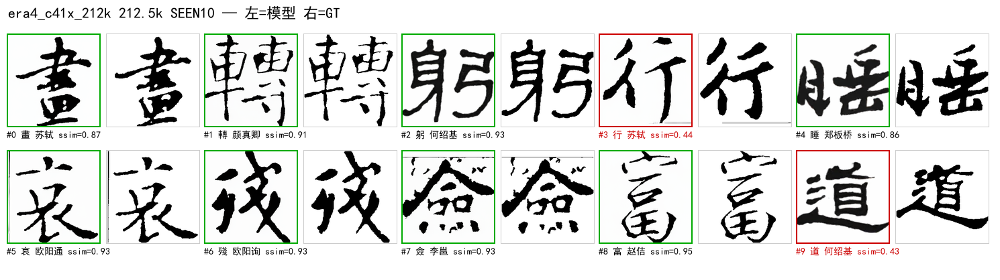
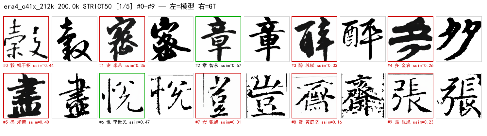
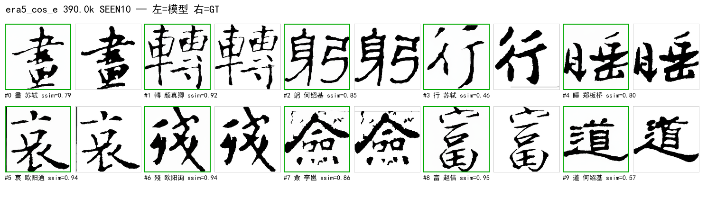
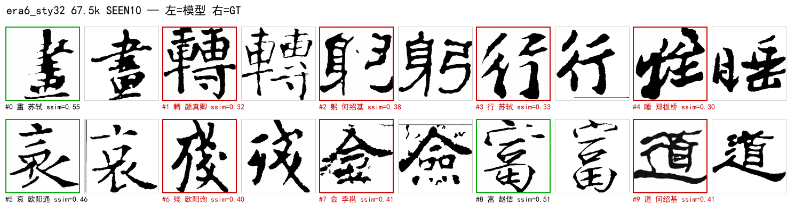
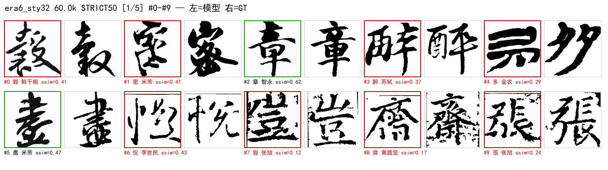

# 50. 演进复盘（2026-08-12 ~ 09-10）：从 XL 到风格 token

状态: 本复盘覆盖项目全程 6 个纪元。图例统一为 **左=模型 / 右=GT**（单列海报除外）。
所有历史数字**保留各自评测口径**，跨纪元不可直接比较（见 §8）。
前置: 50 号为此前 12~49 号文档的横向汇编；细节出处见文末索引。

---

## 0. 总览时间轴

| 纪元 | 时间 | 代号 | 骨干 | 条件 | 数据 | 里程碑结果 |
|---|---|---|---|---|---|---|
| 0 | 08-12~08-31 | **XL / 3Cond**（已删） | DiT-XL/2 (675M) | `xl_highdim`：callig384+glyph768→MLP→1152 | top6/top30 原始 | v3b 0.4888；3Cond overfit diff 0.0005 |
| 1 | 08-16~08-25 | s2~s11 / **fame-ctrl** | pixel S/B → latent S | 结构损失 / ControlNet GT-3px | top30/5书体 | **ctrl 0.8045**；cfg 1.7 → 0.8237 |
| 2 | 08-25~09-04 | s12~s21 / **v8-chain** | S/2 latent flow（v2 架构） | DINO char / 1px GT skel / REPA | 3top30 → fame v8 | s21 0.5121；**v8e ctrl 0.7761** |
| 3 | 09-04~09-07 | **v9 / v10a / v10b** | S/2（skel 作字条件） | skel-latent = char cond | fame v8 | v10a 0.8476（GT协议）；手写 IoU3 0.554 vs 0.194 |
| 4 | 09-07~09-09 | **c41 / Sp / c41x** | **Sp/2 (59M)** | fame3 41书家 + 冻结表 + xattn×12 | fame3 28k | **0.7638 / IoU 0.2227**（n=10）；仍升 |
| 5 | 09-09~09-10 | **c41x_cos / cos_e** | Sp/2 | + cosine 修正 / 增强 b1-b3 / 外挂证伪 | +85k 增强 | strict **0.568**；CFG 口径修正 |
| 6 | 09-10~ | **sty32（进行中）** | Sp/2 | **风格 token 每层注入**（GlyphStyleCrossAttn） | 同 纪元5 | 从零训练，strict 0.529@60k ↑ |

---

## 1. 纪元 0：XL / 3Cond —— 起点（代码已删除）

**是什么**：直接沿用 facebookresearch/DiT 的 **DiT-XL/2**（hidden 1152 / depth 28 / heads 16，~675M），
条件用 `xl_highdim` 融合：callig(384) + glyph(768) → MLP → hidden，`c = t_emb + y_emb` 交给 adaLN——
即"保留预训练分类→调制耦合"的最初形态。同时期做了 2Cond LoRA / 3Cond（canny+skel 结构损失）/
V3B 标准字形（楷/隶）条件 / MIDSTEP_STD（标准字形作为去噪中线目标，v3c）。

**结果与结论**（`docs/system/12`、`docs/system/17` 登记表）：

| 实验 | 口径 | 结果 | 判读 |
|---|---|---|---|
| v3b_xl_glyphcond | pretrain | ssim **0.4888** @30k | XL 条件融合可行但昂贵 |
| exp_xl_head r8/32/64 |像素重建口径 | ssim ~0.90 | **重建 ≠ 生成**，口径陷阱首次出现 |
| 3Cond overfit | 单图过拟合 | diff **0.0005** | 结构损失 + lr 3e-3 + 重init adaLN 的组合 |

**为什么被放弃**：XL 训练成本 ~8× S/2，而当时瓶颈根本不在容量（数据/条件设计更差）；
3Cond 多条件相互劫持。08-31 `8802e8f` **删除 XL/LoRA/3Cond 全部死代码**，
只保留 S/2 ControlNet 主干——**模型文件与产物均无留存，本纪元无海报**。

> 教训：**起点最大模型 ≠ 最好模型**；先修数据与条件，再谈容量。

---

## 2. 纪元 1：S 系 + 结构损失 + ControlNet 首胜（08-16~08-25）

**设计变化**
- **pixel DDPM S/B**（s2~s11）：top6/top30；**结构损失（canny/skel）经实测有害**（削笔画）→ 删除。
- **latent 化**（s12 起）：VAE 8× 压缩，图像 256→latent 32×32。
- **ControlNet 首胜**（fame-ctrl）：ZeroAdaLN modulate 注入，**GT 3px 骨架**条件，ΔSSIM +0.304。
- **cfg 扫描**：ctrl s6_v2 在 **cfg 1.7** 最优（0.8237@15k）——"骨架条件也要 CFG 放大"的最早信号。

**里程碑海报**（base vs ctrl，2026-08-29 资产）：

**ControlNet 三定理（当时实证）**：① 条件域匹配（训练/推理骨架风格必须一致）；
② 冗余条件会被门控忽略（std 骨架 Δ+0.0015 ≈ 0）；③ cfg 口径敏感。

---

## 3. 纪元 2：v2 架构 + v8 三阶段链 + REPA（08-25~09-04）

**设计变化**
- **架构现代化**（v2，`b1e5ead`）：RMSNorm + SwiGLU + QK-Norm + 2D axial RoPE；
  同口径 +0.013 且步数减半（s20 0.5294 vs s19 0.5222）。
- **flow matching**（Heun + logit-normal t + shift）替代 DDPM；OT 分块匈牙利加速。
- **v8 资产集**：清洗后 51,822 张（fame v8），三段链 **v8a base → v8b ctrl(1px) → v8c/v8e REPA**。
- **char 条件两条封死路线**：DINO 表（09-04 系统证伪：检索 0%、SNR 1.09 天花板）
  与 IDS 组件码本——**"外观嵌入做字条件"整条线关闭**，为纪元 3 的 skel 条件让路。

**里程碑结果**：v8a base 0.5121 → **v8b Δ+0.2997@50k** → v8c 0.7674 → **v8e 0.7761**（ctrl 协议）。

---

## 4. 纪元 3：字条件之争 → skel 作为条件（09-04~09-07）

**核心问题**：字条件用什么？（char 嵌入已全线证伪）
**答案**：**骨架 latent 直接作字条件**——DiT-1CondSkel（v10a：skel 8ch concat 输入）
与 v10b（callig + skel-g 两因子极简，移除 char 向量 -13.8M）。

| 对比 | 结果 |
|---|---|
| v10a GT 协议曲线 | **0.8476 @127.5k**（best，40 点入册） |
| 手写新字遵循 IoU3 | **v10b 0.554 / v8e 0.194**（2.8×，两阶段新字失灵是 v8e 的结构性缺陷） |
| n=30 遵循矩阵 | v10a 0.578 ≈ v10b 0.570（char 因子 drop 无提升 → v10b 极简胜出） |

---

## 5. 纪元 4：fame3 + Sp + 41 冻结书家表 + xattn（09-07~09-09）

**设计变化（四件套）**
1. **数据 fame3**：书家 1013 → **41**（精选，~700 样本/家），28,386 张；
2. **std skel latent** 替代 GT 骨架（`cos(std, GT)=0.90`）——**推理可得**，遵循通路第一次可部署；
3. **Sp/2 加宽**：h512/d12（59M vs S/2 32.7M）——S/2 全系平台 0.61-0.62，容量瓶颈确认；
4. **书家表两件套**：SupCon 预训练 + 冻结（pairwise cos 0.323→0.024 防塌缩）；
   **g 注入升级 xattn 全 12 层**（ZeroCrossAttention，Q=画布 K/V=骨架+16×16 sincos）。

**里程碑结果**（n=10 协议）：c41x **0.7638 / skel_iou 0.2227 / lpips 0.1778 @212.5k，仍在升**。

---

## 6. 纪元 5：LR 修正 + 增强 + CFG 口径（09-09~09-10）

**四件事**
1. **恒定 LR bug 修复**：原调度器 resume 后 LR 不再衰减 → 改 **绝对步数 cosine**（`_step_offset`）+
   `--resume-lr` 生效（清 ckpt 旧 `initial_lr`）。strict 一次性 +0.006。
2. **数据增强 v3.3**：二值形态学**宽度收敛**（粗>9→细 / 细<4.5→粗，朝 6.75 收敛），
   b1/b2/b3 三档，85,155 张；训练集 28k → **113,540**。原则：不动骨架拓扑。
3. **callig_spatial 外挂证伪**：书家→16×16 固定模板，strict/IoU ±0.002，**4.2M 参数死重，已删**。
4. **CFG 口径修正**（48/49 号）：**seen 峰值 cfg≈2.0**（skel_iou 0.223→0.352，+58%）；
   **strict 不受救**（0.0158→0.0182，泛化遵循是能力问题）。
   → 历史 seen 曲线在新口径下**未平台**（0.8261/0.3517@212.5k 仍升）。

**strict 曲线（n=237，累积杠杆）**：fame3 0.5059 → Sp 0.5178 → **LR 修正 0.535** →
**增强+机制 0.568@390k**。IoU3：Sp 0.289 → pre-spatial 0.299 → post 0.209（cfg_g=2 0.261）。

---

## 7. 纪元 6：风格 token 每层注入，从零训练（09-10~，进行中）

**设计变化**
- 外挂删除后，风格走**正确形态**：`GlyphStyleCrossAttn` —— 每层 xattn 的 context =
  `[书家化骨架+2D sincos ; N 个风格 token + 可学习 role]`，Q = 画布 token。
  **每个位置依据自身内容/空间独立寻址风格** → 风格调制有局部性、随字形变形（结体）。
- **drop 语义修复**（从零训练前发现）：callig drop mask 与 g 路径共享；
  g-drop 样本在风格调制后重新置零（uncond 分支纯净）。判定性 smoke T1-T4 全过。
- 起点：**从零训练**（不 resume——旧模型 adaLN 已解释风格方差，零初始化新通路会被冗余抑制成死重）。

**当前（12h ETA run，eval_cfg=2.0）**：strict 0.5109@10k → 0.5205@20k → 0.5276@40k →
**0.5293@60k**（稳步上行）；style token 有效秩 27/32（不塌缩）。

---

## 8. 口径警示（跨纪元比较的红线）

| 口径 | 用于 | 特征 | 不可与谁比 |
|---|---|---|---|
| pixel 重建 | exp_xl_head ~0.90 | 重建非生成 | 一切生成口径 |
| ctrl 协议 | v8b/v8c/v8e 0.76-0.78 | GT 1px 骨架 + cfg≤1 | pretrain_g |
| pretrain_g / GT 协议 | v10a 0.8476 | GT 实例骨架条件 | ctrl |
| n=10 eval_auto | c41x 0.7638 | seen 记忆集 | strict |
| strict n=237 | 0.5059→0.568 | 新字泛化 | n=10 |
| skill_iou（精确1px） | 0.016~0.35 | 骨架逐像素 | IoU3（3px 容差） |

**CFG 也是口径的一部分**：cfg 0.7 vs 2.0 在 seen 上差 +58% IoU——凡"模块是否有收益"的结论，
必须同 cfg 复测（49 号已做 c41x 历史重测）。

---

## 9. 六条硬教训（跨纪元）

1. **先数据后模型**：XL→S 的降级与 fame3 41 家的升级，都说明瓶颈在数据/条件密度。
2. **冗余条件必被忽略**：stdskel-ctrl Δ+0.0015、callig_spatial ±0.002、DINO char 净负——
   条件必须"不可从别的输入推出"才值得加。
3. **零初始化新通路在收敛模型上高概率变死重**：结构改动要**从零**或显式 re-zero（46 号）。
4. **口径不統一，一切对比作废**：重建 vs 生成、seen vs strict、cfg 0.7 vs 2.0、
   IoU vs IoU3；本项目踩了至少 5 次。
5. **"参数小/初始化弱" ≠ 不重要**：输入层 token-add（learned scale 0.19）是骨架主通路，
   置零即崩（48 号 D1 撤回）。
6. **评测基础设施要当产品做**：静默 30 分钟的 strict、锁残留跳过、style_token 漏传全崩——
   eval_ctl + 进度日志 + 自动 poster（49 号起）是"能看见"才"能迭代"。

---

## 10. 资产索引

| 类型 | 路径 |
|---|---|
| 本复盘海报 | `docs/system/imgs/retro/`（22 张：7 里程碑 seen + 4 组 strict） |
| 早期海报 | `docs/system/imgs/poster_fame_{base,ctrl}_final.png` |
| 曲线/图表 | `docs/system/imgs/fig_1px_trajectory.png` 等 |
| poster 生成器 | `src/eval/posters.py`（daemon 自动出图 + CLI 可回填） |
| eval 托管 | `tools/eval/eval_ctl.sh`（tmux 单实例 + 进度 + 状态） |
| 历史详解 | 12（XL 归档）/17（代际）/35~38（v10a/b）/44（fame3+Sp）/45~47（c41x+风格）/48~49（消融+CFG） |
