# 50. 演进复盘（2026-08-12 ~ 09-10）：时间线详解版

状态: 覆盖全程 6 纪元；**106 张里程碑 poster**（`imgs/retro/`，seen + strict 对照）+ 早期 s 系图表全编入。
本文按**时间线**记录所有改动（模型/注入/LR/数据/评测/失败），最后一次注入改动（风格 token）
在 T8 详述"具体怎么改、为什么能实现局部化调制"。文末附：当前 attention 速查、失败汇总、口径警示。

图例: 单张=左模型右 GT；**每个里程碑均给 seen + strict50 对照**（strict 为前 50 新字样本，同协议 cfg；
p1-p4 见目录）。strict 为后补生成的用 strict50 协议（前 50 行），历史已评的用原 strict 目录。

---

## T0 · 2026-08-12 ~ 08-16：起点 XL / 3Cond / 标准字形

**模型改动**：直接沿用 DiT-XL/2（hidden 1152 / depth 28 / heads 16，~675M），
条件 `xl_highdim`：callig(384)+glyph(768) → MLP → 1152，`c = t_emb + y_emb` 走 adaLN。
2Cond LoRA → 3Cond（canny+skel 结构损失，lr 3e-3 + 重init adaLN → overfit diff 0.0005）。
随后 V3B 标准字形（楷/隶）条件、MIDSTEP_STD（标准字形作去噪中线目标，v3c）。

**结果**：v3b_xl_glyphcond 0.4888@30k；exp_xl_head ~0.90（**像素重建口径**）。

**失败**：XL 训练成本 ~8× S/2，3Cond 条件互相劫持。08-31 `8802e8f` **删除 XL/LoRA/3Cond 全部死代码**
（无产物、无海报）。教训：起点最大模型 ≠ 最好模型。

---

## T1 · 2026-08-16 ~ 08-25：S 系 + 结构损失 + ControlNet 首胜

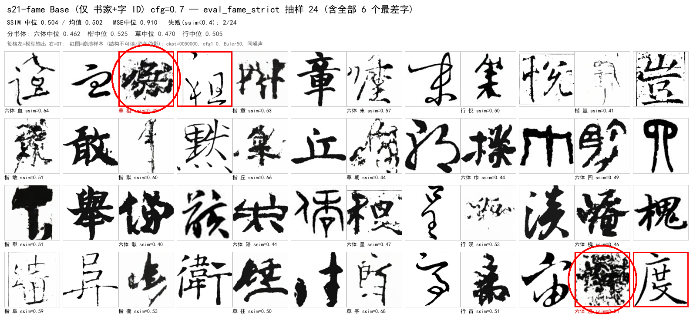

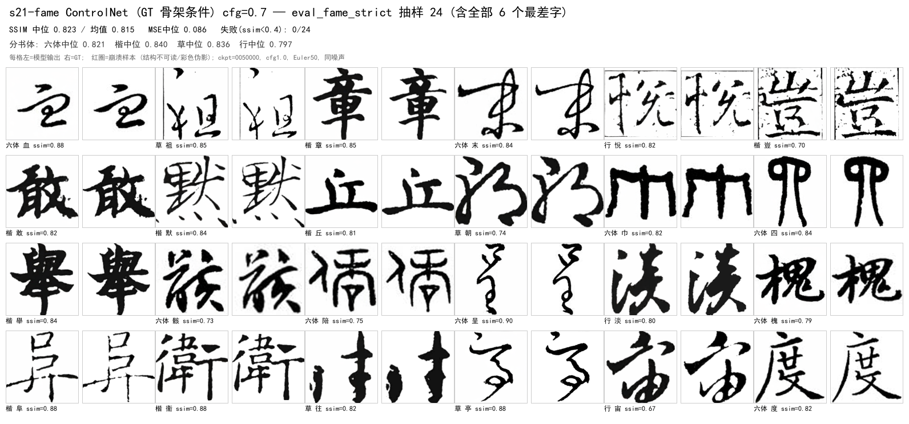

**模型改动**：pixel DDPM（S/B）→ **latent 化**（VAE 8×，32×32）→ **ControlNet**
（ZeroAdaLN modulate 注入，GT 3px 骨架条件）。数据：top30 → 5 书体（楷篆草行隶）。

**失败（两条）**：
- **结构损失（canny/skel）有害**：修 3 个致命缺陷后仍削细笔画/反向毁图 → 删除（`895aba0`）；
- 纯二因子 S（无 GT 泄露）与 B-latent-struct 均被后续 v2 架构取代。

**cfg 扫描视觉对照（base 无骨架 vs ctrl 有骨架，0.50→1.00）**：

| base（无骨架） | ctrl（GT 3px 骨架） |
|---|---|
| 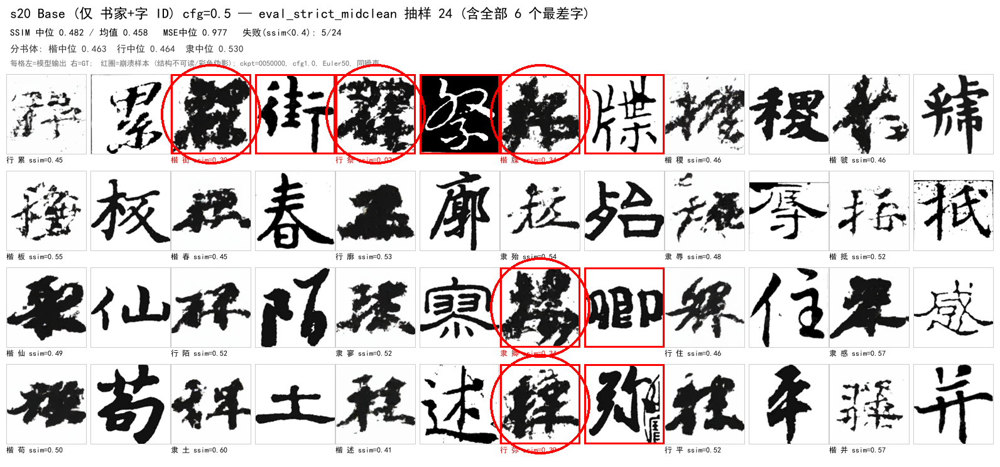 | 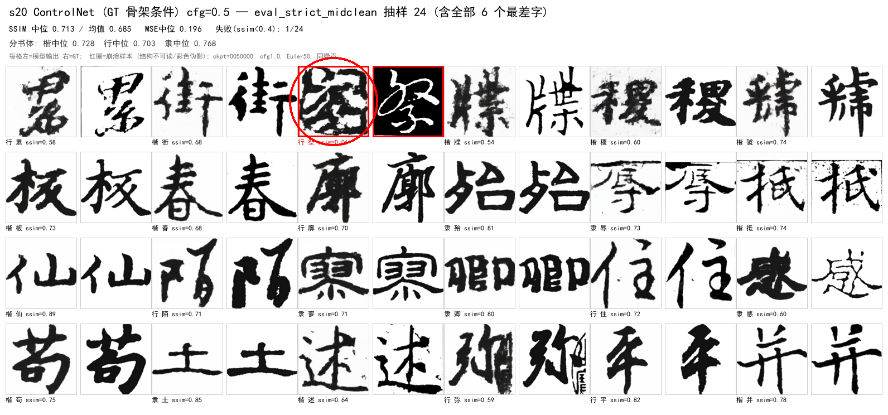 |
| 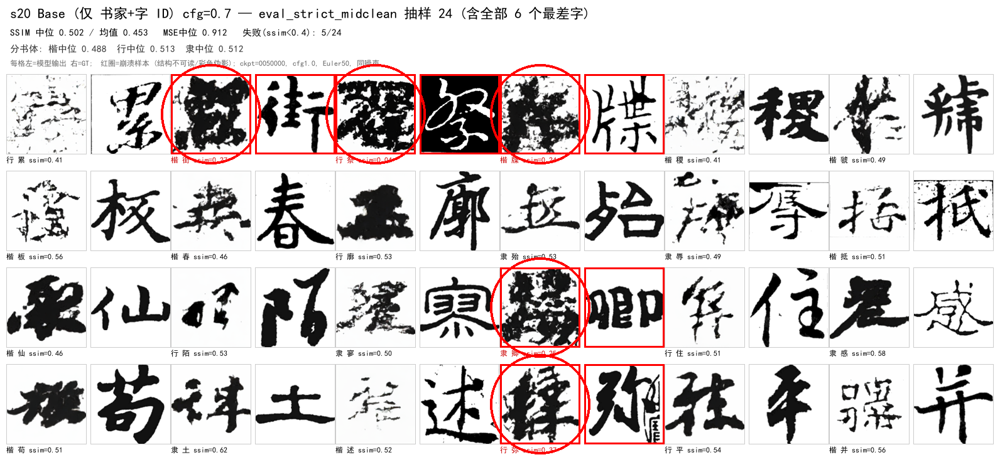 | 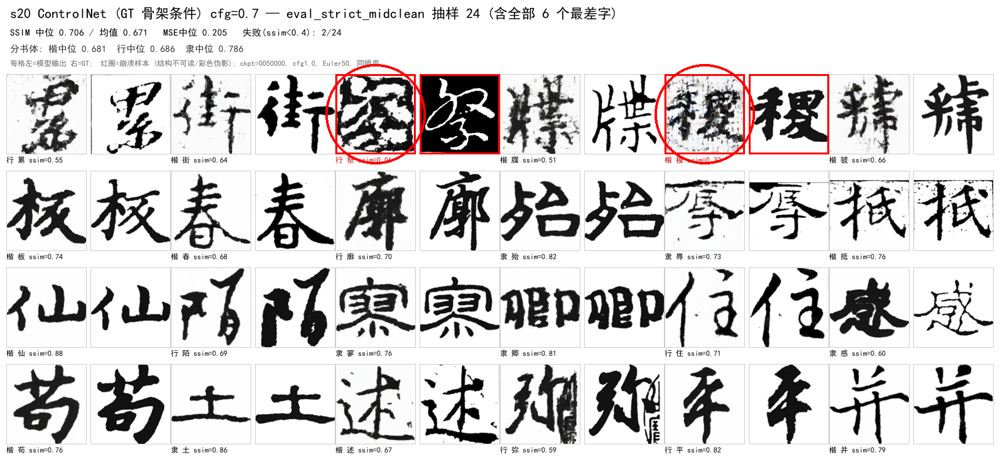 |
| 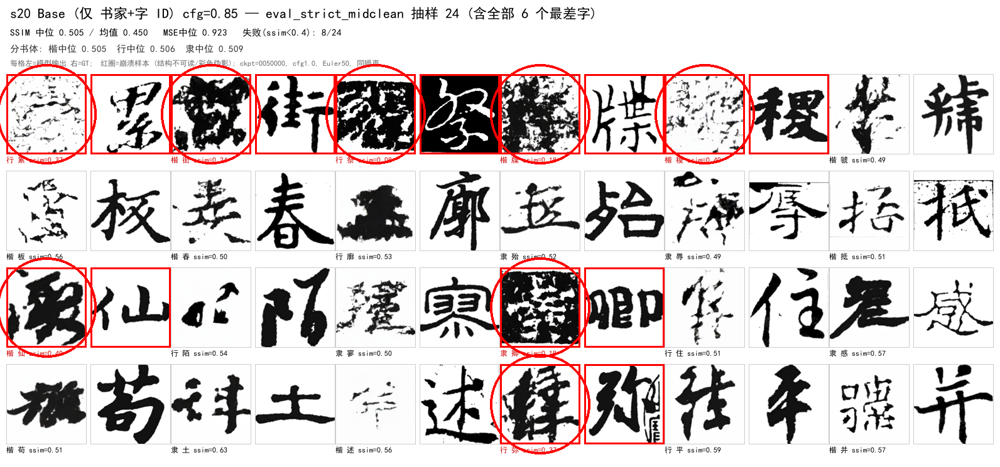 | 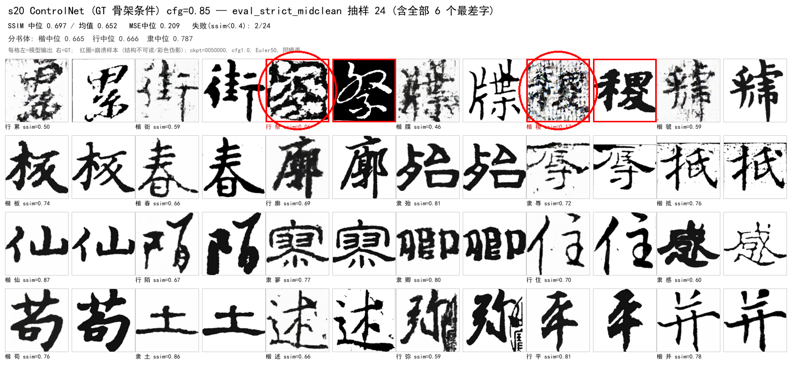 |
| 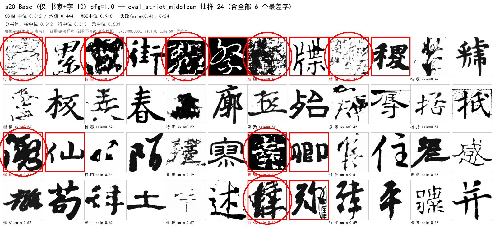 | 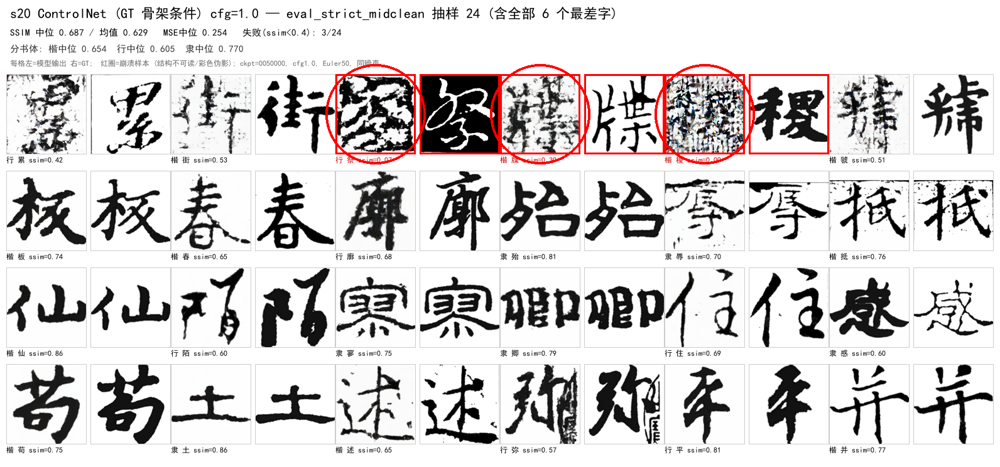 |


**里程碑**：ctrl **0.8045**（GT 3px），cfg 扫描最优 **1.7**（0.8237@15k）。
**ControlNet 三定理**：① 条件域匹配；② cfg≤1（1.7→0.7: 0.683→0.752）；③ 冗余条件被门控忽略
（stdskel Δ+0.0015 —— 该失败直接引出 T4 的 skel 条件路线）。

---

## T2 · 2026-08-25 ~ 08-31：latent flow + v2 架构 + DINO 条件探索

| 图 | 内容 |
|---|---|
| 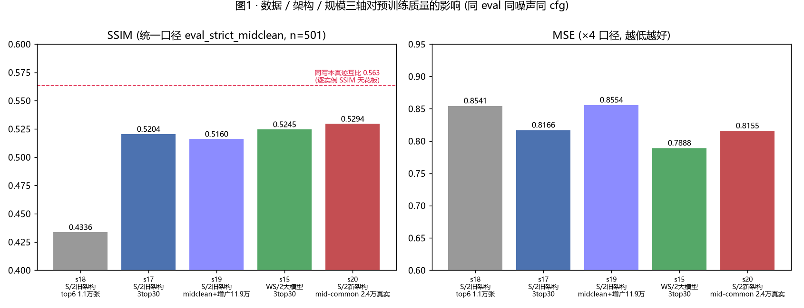 | 统一模型谱系 |
| 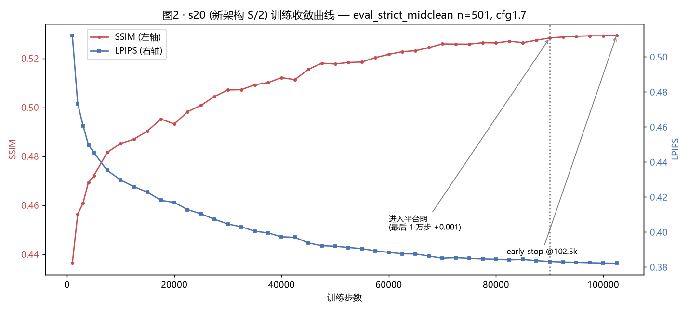 | s20 曲线（v2 架构 +0.013，步数减半） |
| 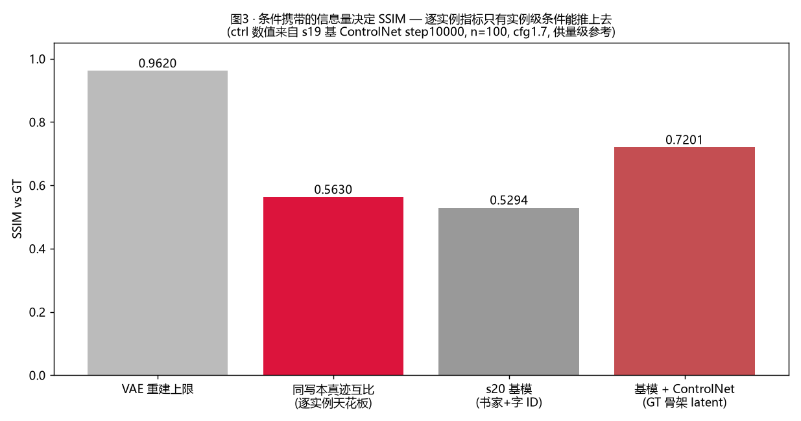 | 条件价值分解 |
| 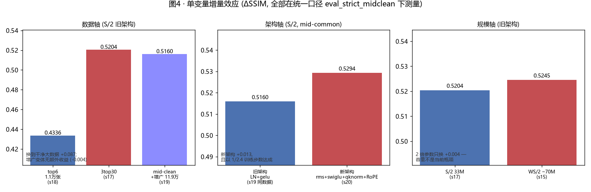 | 设计轴（容量/条件/数据） |
| 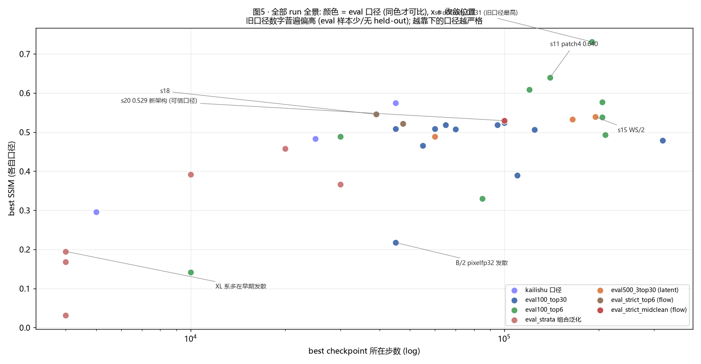 | 实验全景 |
| 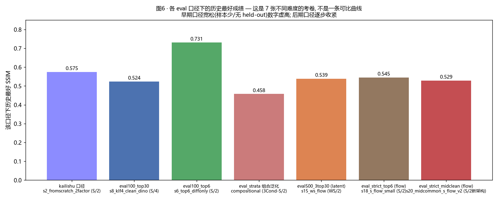 | 各代最优对照 |
| 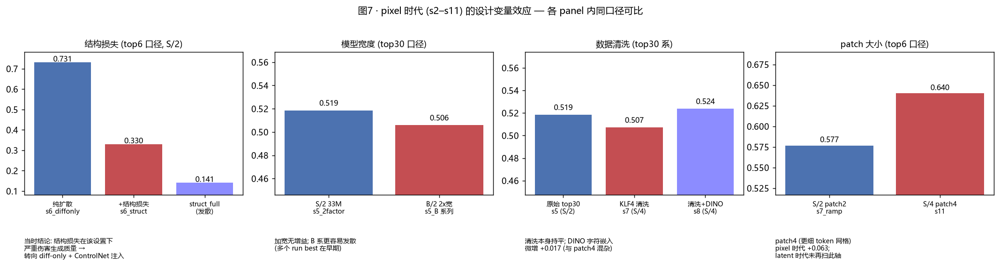 | 像素时代回顾 |

**模型/训练改动**：
- **v2 架构现代化**：RMSNorm + SwiGLU + QK-Norm + 2D axial RoPE（替换 LayerNorm/GELU/固定 sin-cos），
  同口径 +0.013 且步数减半（s20 0.5294 vs s19 0.5222）；
- **扩散**：DDPM(eps) → **Flow Matching**（Heun 采样 + logit-normal t + shift），OT 分块匈牙利（13ms→4ms）；
- 数据：3-top30（楷行隶）→ s19 mid-clean → s20 mid-common / fame；DINO 768→384 PCA。

**失败**：DINO CLS 字嵌入在 s22/s28 系统证伪（只训字 embedding 无益、ln_only 直通 −8.2%）。

---

## T3 · 2026-09-01 ~ 09-04：v8 三阶段链 + REPA + char 条件证伪

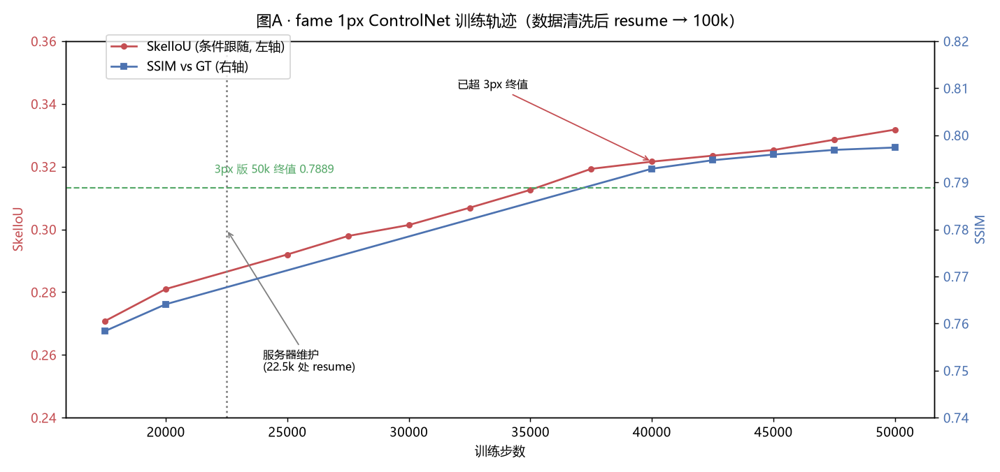

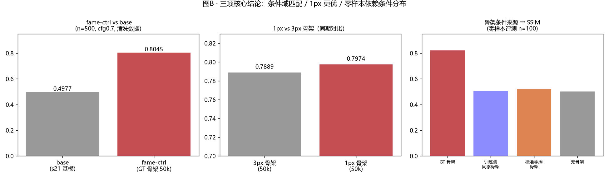

**训练改动**：v8 资产集（fame v8, 51,822 张）→ 三段链 **v8a base → v8b ctrl(1px) → v8c/v8e REPA**；
unified REPA（多中间层 + warmup）+ unified eval facade；OT chunks / compile / 显存优化。

**char 条件证伪（决定性）**：DINO 表（检索 0%、SNR 1.09 天花板）、IDS 码本、contrastive finetune v1+v2
（sep −0.19）——**"外观嵌入做字条件"整条线关闭**，为 T4 的 skel 条件让路。

**失败**：Muon 优化器（5k tail 0.385 vs AdamW 0.404，冷启动 19M 尖峰）→ 归档。

**里程碑**：s21 0.5121（base）→ v8b Δ+0.2997@50k → v8c 0.7674 → **v8e 0.7761**；v8i grid layer6 0.7664。

---

## T4 · 2026-09-04 ~ 09-06：skel 作字条件（v10a / v10b）

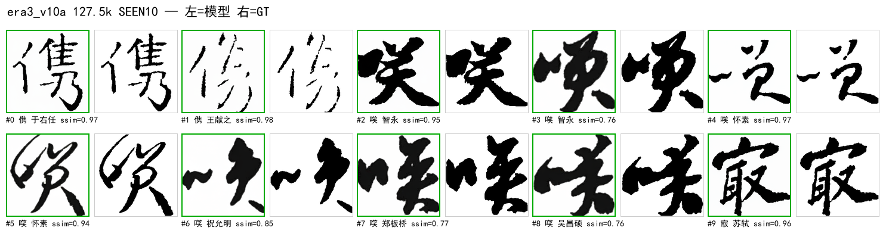

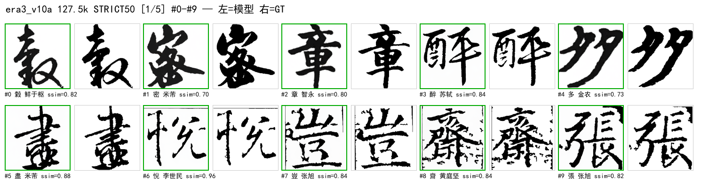

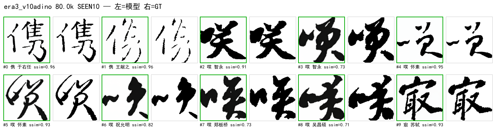

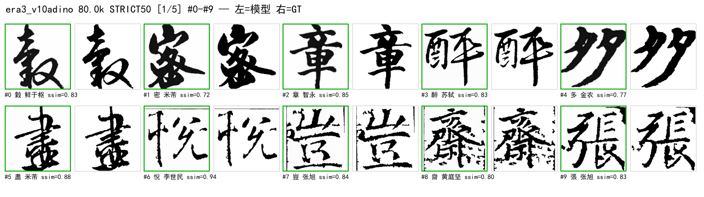


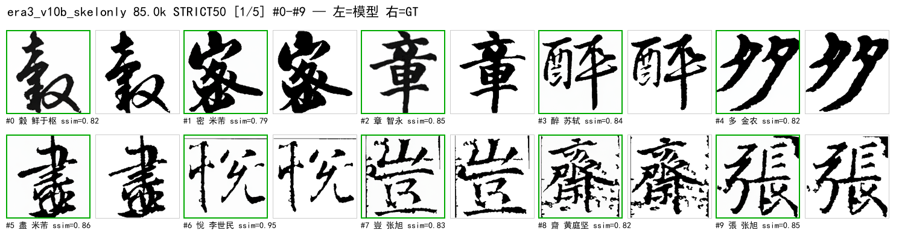

**模型改动**：DiT-1CondSkel（v10a：skel latent 8ch concat 输入 + callig adaLN）→
v10b 两因子极简（callig + skel-g，**移除 char 向量条件 −13.8M**，`use_char_cond=False`）。

**评测协议修正（同日）**：有 char 因子的模型必须 `y_char=null`（而非随机 id）——
修正后 v10a 0.578 ≈ v10b 0.570（旧"v10b 略优"结论推翻）；手写新字遵循 IoU3 **v10b 0.554 / v8e 0.194**。

**结果**：v10a GT 协议曲线 **0.8476@127.5k**；v10a-dino 净负（−0.012~−0.014）。

---

## T5 · 2026-09-06 ~ 09-08：fame3 + std skel + Sp + 41 冻结表 + **注入方式改动①**

**数据改动**：fame3（书家 1013→41 精选，28,386 张）；**std skel latent**替代 GT 实例骨架
（`cos(std,GT)=0.902, nmse 0.197`）——骨架条件**推理可得**。

**容量改动**：S/2（32.7M）在 fame3 全 t 桶欠拟合、平台 0.61-0.62 → **Sp/2（h512/d12, 59M）**。

**书家条件改动**：SupCon 预训练书家表（同书家正对 + temp 0.07 + DINO 质心锚定，pairwise cos 0.323→0.024）
+ **冻结表**（null token 拆独立 Parameter）；cond_drop 0.5→0.1。

**注入方式改动①（09-07~08）：adaLN 4 层 → xattn 全 12 层**

| 前 | 后 |
|---|---|
| `ZeroAdaLNInjection`: `x = x*(1+s)+t`，s/t 由 g 经 zero-init Linear 产出；**固定 1:1 位置调制** | **`ZeroCrossAttention`**: Q=x，**K/V=g_tok + 16×16 sincos 位置**；每个 x 位置**动态聚合全部 256 骨架 token**（内容寻址），out_proj 零初始化 |

动机：adaLN 的固定位置调制表达力不足；xattn 让"哪个骨架位置影响哪个画布位置"由注意力学出来。
**输入层 token-add 保持**（`x = x + glyph_scale*g_tok`，learned glyph_scale）。

**结果/证据**：c41x 0.6216@105k（旧口径）仍升；**四通路消融全必需**（g −0.35 / 输入 add −0.28 /
xattn −0.24 / 书家 −0.22）；`learned glyph_scale=0.1896` 曾诱使误删输入 add（D1，置零即崩后撤回）。

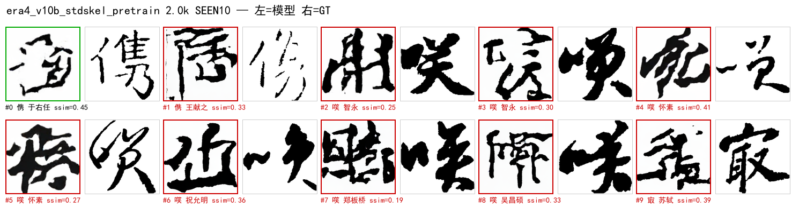

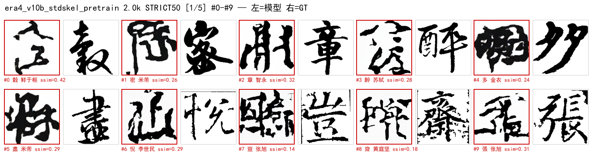

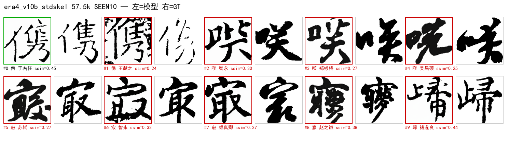

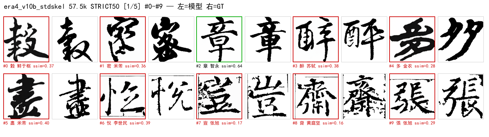

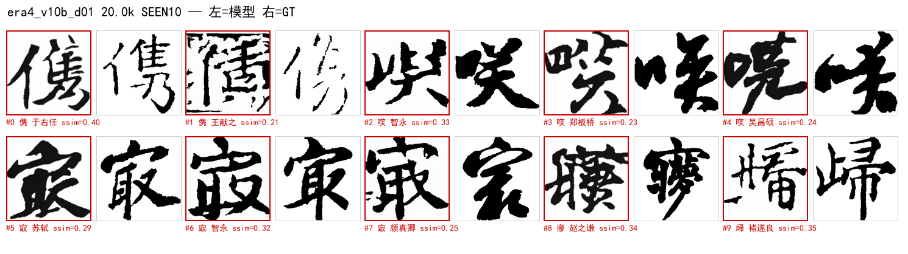

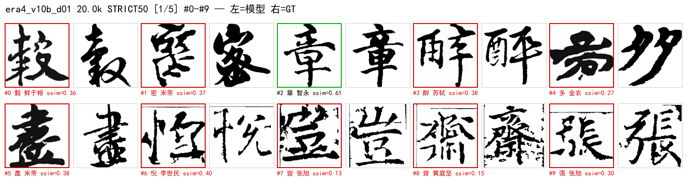

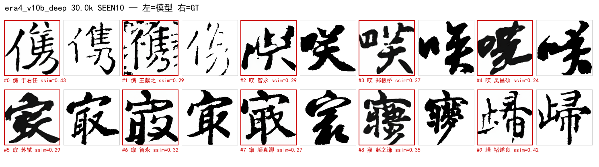

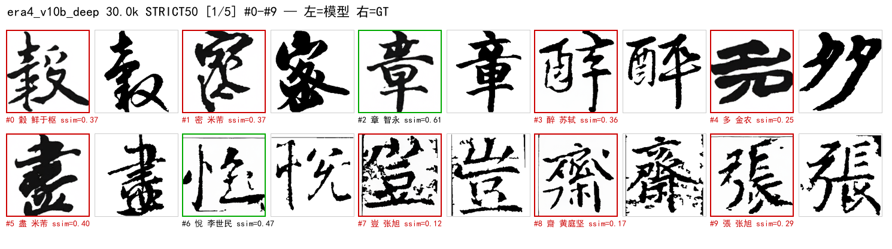

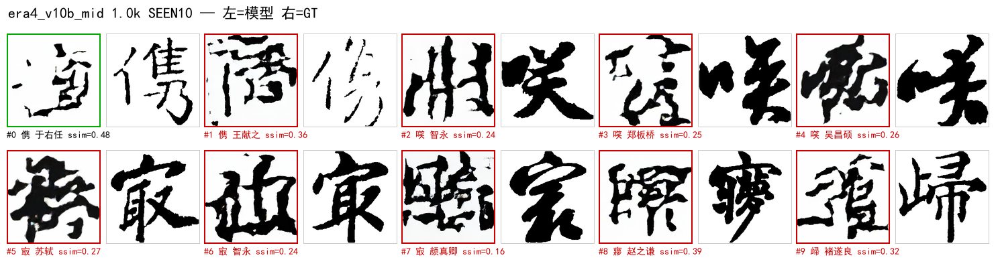

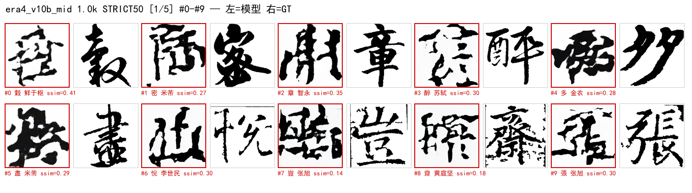

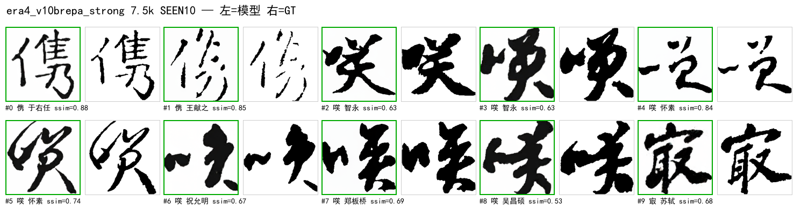

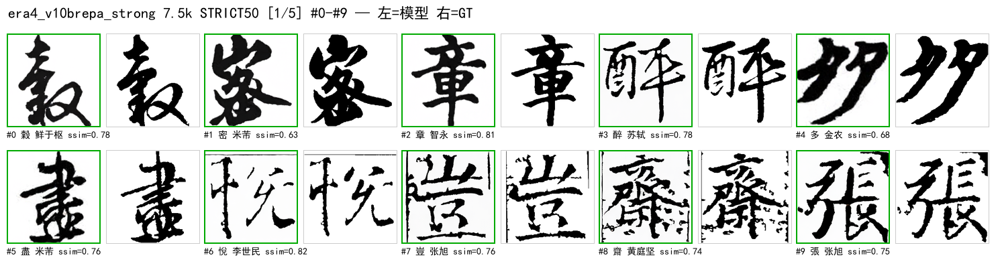

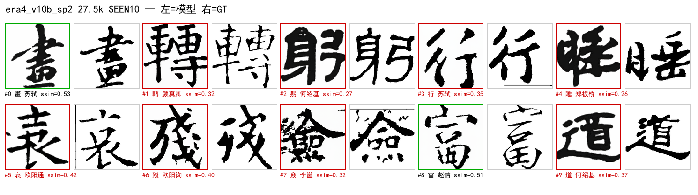

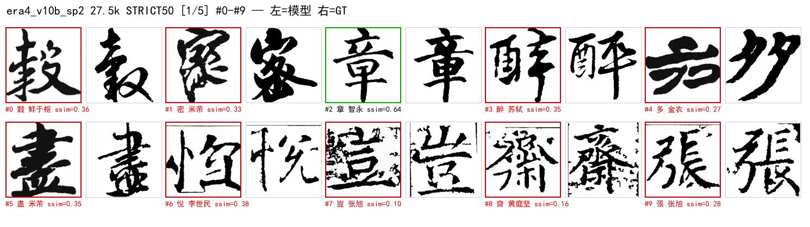

**里程碑（c41x）**：seen n=10 **0.7638 / IoU 0.2227 / lpips 0.1778 @212.5k，仍升**。

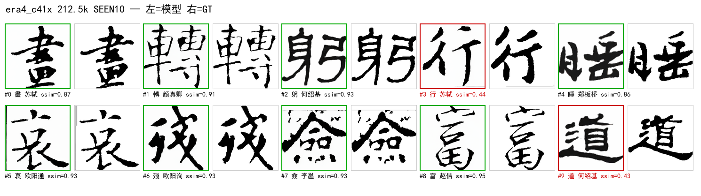


---

## T6 · 2026-09-08 ~ 09-09 上午：v10b 五实验链 + 恒定 LR 问题暴露

**训练改动/问题**：5 实验串行链（repa(0.5,8,11) / inject(4层,scale0.6) / callig(dim256+MLP+scale1.5) /
norepa / shallow）；**恒定 LR 问题暴露**——c41x 300k 配方用 `lr=1.5e-4` 全程恒定，
resume 后 LR 不再衰减，曲线平尾被误读。

**诊断改动**：梯度探针发现 **REPA 劫持**（梯度占比 158%、余弦 vs MSE 量纲错配）+ callig 链弱梯度
（rel 0.0013）→ w_repa 校准 0.03、callig_proj_mode=mlp、冻结表。

---

## T7 · 2026-09-09：LR 修正 + 增强数据 + **注入方式改动②（外挂，后被证伪）**

**LR 改动（两连击）**：
1. **恒定 LR bug → 绝对步数 cosine**：`total=max_steps`，`_step_offset=resume_start_step`，
   resume 点落在同一条从 0 开始的 cosine 中段（无 warm restart）；strict 一次性 +0.006；
2. **旧 `initial_lr` 劫持**：ckpt opt state 里的旧 `initial_lr` 使 `--resume-lr` 失效 →
   fresh-scheduler 分支 `_pg.pop('initial_lr')`；实证 `starting from base lr 5.00e-05`。

**LR 取值（解析法替代实跑 sweep）**：UWR（RMS(w)=5.68e-2，mean|m̂/√v̂|=0.183 → lr=5e-5 时
单步位移/RMS=1.61e-4）+ GNS（B_crit≈1409 ≫ batch128，cos=0.276 噪声主导）→ **base 5e-5 + cosine**。

**数据改动**：增强 v3.3 —— 二值形态学**宽度收敛**（粗>9→细 / 细<4.5→粗，朝 6.75 收敛），
b1/b2/b3 三档，85,155 张（28k→113,540）；原则：**不动骨架拓扑**。

**注入方式改动②（外挂 callig_spatial，09-09 加在 175k resume）**：书家向量 → LayerNorm+Linear(128→4D)
+SiLU+Linear(→256*D) 得固定 16×16 空间模板，加到 g_tok。**动机**：让书家风格空间化。
**结果（09-10 证伪）**：strict ±0.002、IoU3 ±0.002、seen 仅 +0.032（记忆化）→ **4.2M 参数死重，已删**。
教训：与字无关的常数模板无法产生"书家×字"交互。

**里程碑**：c41x_cos @172.5k（LR 修正后 strict 0.535 段）；cos_e 跑至 390k，strict 曲线
fame3 0.5059 → Sp 0.5178 → LR 0.535 → **增强+机制 0.568@390k**。

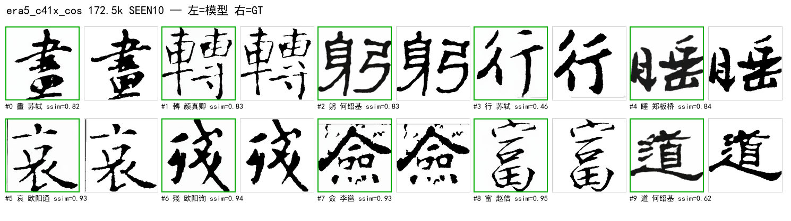

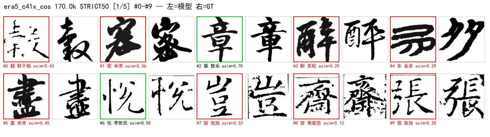

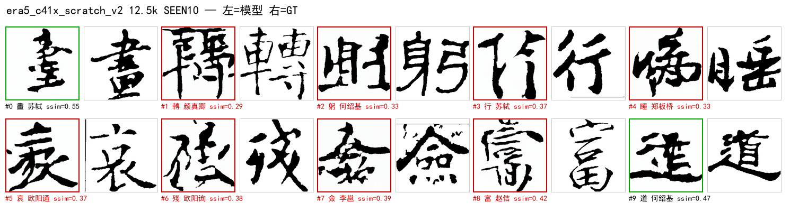

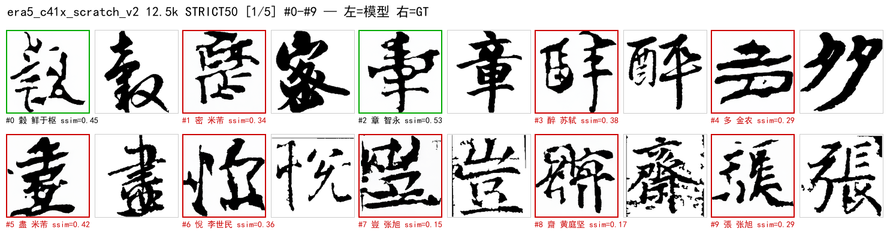

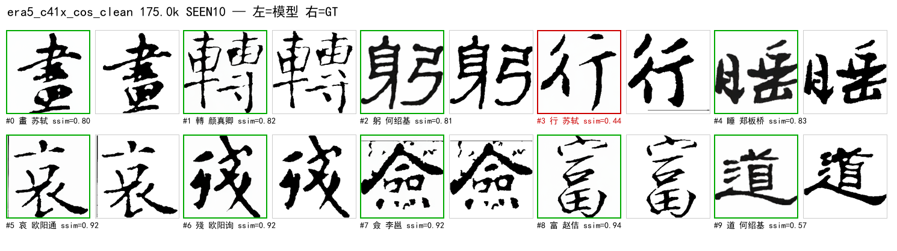

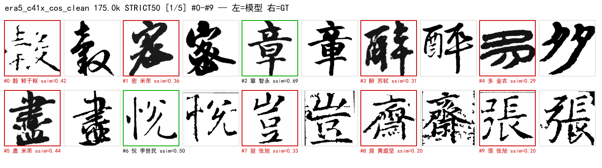


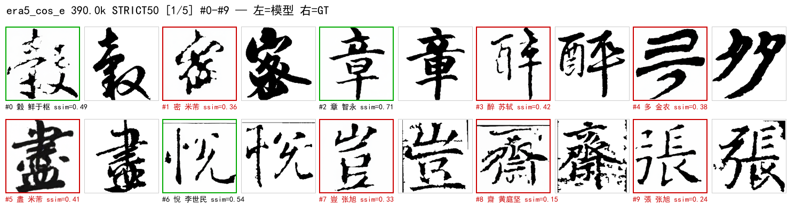

---

## T8 · 2026-09-10：CFG 口径 + 外挂删除 + **注入方式改动③（最后一次：风格 token 每层注入）**

### 8.1 上午~下午：消融与口径

- **GPU 推理时消融**（48 号）：四通路全必需；D1（输入 add）/D2（重复）撤回；
- **CFG 口径修正**（E4a/E4b）：seen 峰值 **cfg≈2.0**（skel_iou 0.223→0.352，+58%）；
  **strict 不受救**（0.0158→0.0182）；c41x 在 2.0 下**未平台**（0.8261/0.3517@212.5k 仍升）。
  历史 seen 曲线需按 2.0 重测，strict 结论不受影响。

### 8.2 注入方式改动③：GlyphStyleCrossAttn（风格 token 每层注入）

**改之前的问题（v2 路径 callig_style_attn）**：风格走"输入端一次性"——g_tok 作 Q 寻址风格 token，
`g_tok' = g_tok + out_proj(attn)`，然后只有 g_tok' 进入主干。
**交互只发生一次**，风格要经过全部 28 层残差流才能到达深层，会被稀释；
它与 adaLN 的全局 callig 表达高度冗余（后者已解释大部分风格方差）。

**改动内容（commit `0ec546e`）**：新增 `GlyphStyleCrossAttn`，并把每层注入的 context 从
"仅骨架"扩展为 **"骨架 + 风格 token"**：

```
改动前 (ZeroCrossAttention, 12 层):
  Q = x(256 画布 token)      K/V = g_tok + sincos2D         ← 256 个 K/V

改动后 (GlyphStyleCrossAttn, 12 层, style_token_n=N):
  ① 风格 token 生成 (共享投影, 各层复用):
     e_callig(128, drop-masked) ─LayerNorm→Linear(128 → N*D)→ reshape → N 个 style token
     style_token += style_role   (可学习角色向量, 每 token 一个, init N(0, 0.02) → 促分化)
  ② context 拼接 (K/V, 共 256+N 个):
     ctx = torch.cat([ g_tok + ctx_pos_g ,  style_tokens + style_role ], dim=1)
                                              ↑ 骨架带 2D sincos 位置   ↑ 风格带 role
  ③ 每层注入 (模块内部不再加位置编码):
     q = W_q · norm_x(x)                    # Q = 画布, 每层都算
     k = W_k · norm_c(ctx) ;  v = W_v · norm_c(ctx)
     out = F.scaled_dot_product_attention(q, k, v)
     x = x + out_proj(out)                  # out_proj 零初始化 → 初始恒等
```

**为什么这样能实现"局部化调制"（机理）**：

1. **调制权重是逐位置、逐层计算的注意力**：`A = softmax(q_p · kᵀ / √d)`。
   q_p 是**第 p 个画布位置**在**第 l 层**的查询向量——它既含该位置的内容（残差流中累积的
   笔迹与字形信息），又含其空间位置（RoPE）。因此同一书家的 N 个风格 token，
   在不同位置被读出**不同的混合比例**：
   `风格_p = Σ_j A_{p, style_j} · v_style_j` ——每个位置拿到的是**定制化的风格组合**，
   而不是全局同一个常数。这就是"局部化"：风格调制随空间位置变化（如颜体宽博的横与紧凑的钩，
   在不同位置吸收不同风格分量）。
2. **为什么"根据字形"**：q_p 的内容来自残差流，而残差流在每个位置都被**同网格对齐的骨架信息**
   锚定——输入层 `x += glyph_scale · g_tok`，以及此前每一层注入的 `[g_tok+pos]` K/V
   （骨架与画布同为 16×16 网格，空间一一对应）。于是"这个位置在写什么笔画结构"已经进入 q_p，
   风格寻址因此**以局部字形为条件**：横画位置与钩画位置提出不同的 q，寻址出不同风格维度组合
   → 结体按"这个字×这个书家"变形，而不是常数模板。
3. **为什么要每层都有**：风格信息不再只靠 g_tok 一路携带到深层；每一层的 x 都能**重新寻址**
   原始风格 token（浅层用于结构、深层用于笔法肌理），避免 28 层残差传播中的稀释；
   与旧路径**完全兼容**（`style_token_n=0` 时回退 ZeroCrossAttention，context=骨架，位置在模块内加）。
4. **参数**：`style_proj = LayerNorm+Linear(128→N·512)`；n=32、12 层时增加约 1.6M 参数。
   冒烟验证：style token intra-cos 0.064（不塌缩）、**有效秩 27/32**、inter-cos 0.149（书家可分）。

### 8.3 同日修复的 drop 语义（与新注入配套，两个 bug）

```python
# bug1: g 被整样本 drop 后 g_tok≈0, 但风格注入会给零骨架加非零输出 → uncond-g 分支被污染。
#       修复: 风格调制后把被 drop 样本重新置零:
g_tok = self.callig_style_ca(g_tok, e_c_ca)
if keep is not None:
    g_tok = g_tok * keep.view(-1,1,1)      # 判定性 smoke T1: diff=0.0
# bug2: callig drop mask 原先在 g 路径之后才 roll → drop-callig 样本的骨架通路仍带真实风格，
#       与 adaLN(已置 null) 矛盾。修复: mask 提到 forward 顶部, 全程共享:
callig_drop = r < (cond_drop_all + cond_drop_one)      # v10b 单因子
y_callig_in = where(callig_drop, num_classes, y_callig)
e_c_ca = self.y_callig_embedder(y_callig_in, False)     # 风格注入与 adaLN 用同一份
```

### 8.4 为什么这次注入改动必须从零训练

- **resume 语义不安全**（46 号实测）：形状全兼容、missing 仅 5 个新参数（strict=False 静默通过），
  但 load 后 `out_proj` |mean|=3.398e-2（**非零**）——随机初始化的风格 token 经已训练的非零
  out_proj 直接给残差流灌噪声；
- **冗余抑制**：收敛模型中 adaLN 已解释风格方差，零初始化的新通路在 step 0 对 q/k/v 梯度为 0，
  无梯度压力被"启用"→ 高概率变死重（外挂就是先例）。
  **结论：结构改动从零训练**。

### 8.5 本日运行（时间顺序）

- 17:38 启动 **sty32 从零 4h run**（60k，cosine）；
- 20:58 扩到 12h（230k）resume——**发现 LR 不对**（见 T9）；
- 22:47 修复后再次 resume（250k horizon，12h ETA，LR 4.17e-5）。

**注入改动③的验证进度**：sty16（n=16，30k）与 sty32（进行中）。sty32 至 202k：
strict 0.5109@10k → **0.5518@190k**（缓升）；seen 0.6690@197.5k（140k 后陡涨，记忆化）；
风格分化是否转化为生成上的书家差异，待最终 eval。

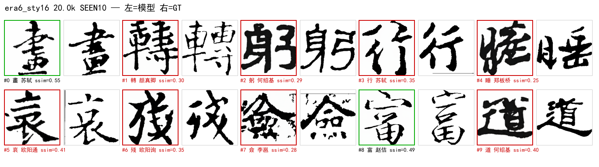

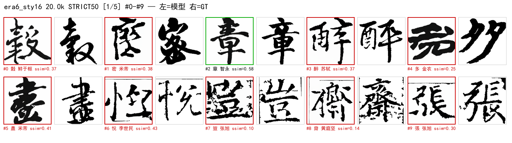


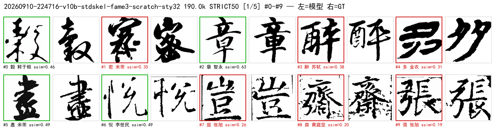

**当前实验实时总集**（每行一个 ckpt，末行 GT；训练推进中持续刷新）：

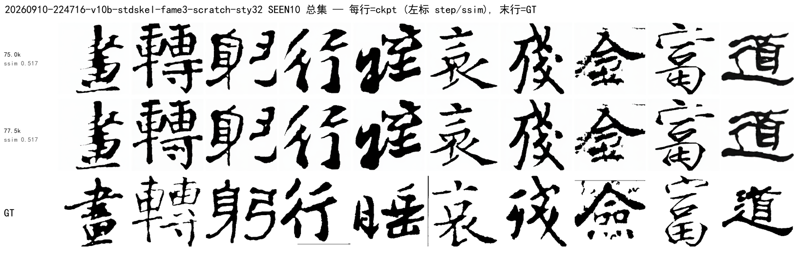

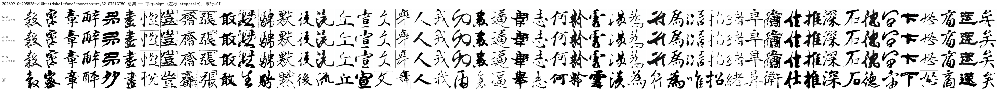

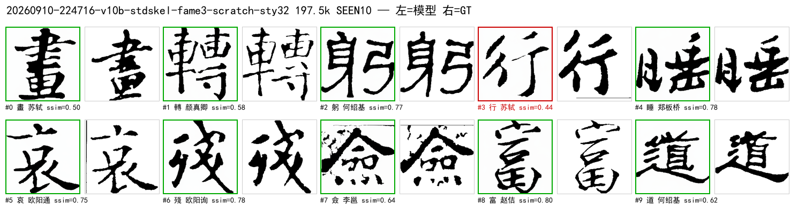

---

## T9 · 2026-09-10 夜：12h 重启与 fresh-scheduler base lr 修复

**LR 修复（第三个 base bug）**：12h 重启后核对 LR 发现只有 **8.2e-6**（应为 ~4.2e-5）。
根因：fresh-scheduler 分支 pop 掉旧 `initial_lr` 后，LambdaLR 拿 **ckpt 恢复的
`param_group['lr']`**（旧曲线尾值 1.01e-5）当 base → 从旧曲线尾部继续衰减。
修复：`_pg['lr'] = float(resume_lr or args.lr)`（显式 config/override）。
实证：`base lr set to 5.00e-05 (config/--resume-lr, not ckpt-restored)`，
起步 4.18e-5，step 72800 实测 4.17e-5。250k horizon，~12h ETA。

---

## 附 A · 当前 attention 实现速查（与 T8 一致）

```
① 输入层:  x = x + glyph_scale * g_tok            (glyph_scale 可学习, init 0.6 → 0.19)
② 每层:    ctx = [ g_tok + ctx_pos_g ; style_proj(e_callig) + style_role ]
           x = x + out_proj( SDPA( W_q·norm(x) , W_k·norm(ctx) , W_v·norm(ctx) ) )
③ 回退:    style_token_n=0 → ZeroCrossAttention (ctx=g_tok, 位置模块内加)
④ drop:    callig drop mask 顶部共享; g drop 后风格调制再置零
⑤ 初始化:  所有注入 out_proj 零初始化 → 恒等起点
⑥ 从零训:  style token + out_proj 随机初始化与旧权重不兼容语义
```

## 附 B · 失败尝试汇总（按类别）

| 类别 | 尝试 | 结果 |
|---|---|---|
| 架构 | XL/3Cond/LoRA | 整体删除 |
| 架构 | 结构损失（canny/skel） | 削笔画，删除 |
| 架构 | 像素扩散 / skel-head 重建 | 废弃 / 口径陷阱 |
| 架构 | S/2 容量 | 平台 0.61-0.62 → Sp |
| 优化 | Muon | 落后 AdamW，归档 |
| 数据 | v9 去噪线 | 5414 张骨架断裂，隔离 |
| 条件 | stdskel ControlNet | Δ+0.0015 |
| 条件 | DINO 表 / IDS / contrastive | 全部证伪 |
| 条件 | callig_spatial 外挂 | ±0.002 死重，删除 |
| 调度 | 恒定 LR / range test / 2 个 resume bug | 绝对步数 cosine + 显式 base |
| 评测 | 漏传参数/锁残留/静默/CFG 用错 | eval_ctl + 自动 poster + E4a/b |

## 附 C · 口径警示

| 口径 | 用于 | 不可与谁比 |
|---|---|---|
| pixel 重建 | exp_xl_head ~0.90 | 生成口径 |
| ctrl（GT 1px, cfg≤1） | v8b/c/e 0.76-0.78 | pretrain_g |
| pretrain_g / GT | v10a 0.8476 | ctrl |
| n=10 seen | c41x 0.7638 | strict |
| strict n=237 | 0.5059→0.568 | n=10 |
| skel_iou(1px) vs IoU3(3px) | 0.016 vs 0.2-0.3 | 互换 |
| cfg 0.7 vs 2.0 | seen 差 +58% | 必须同 cfg |

## 附 D · 资产索引

| 类型 | 路径 |
|---|---|
| poster（106 张: seen+strict 对照） | `docs/system/imgs/retro/` |
| 早期 s 系图表 | `docs/system/imgs/fig1~fig7`、`poster_base/ctrl_cfg*`、`s21_base_grid` |
| poster 生成器 | `src/eval/posters.py`（daemon 自动 + CLI 回填，`--prefix` 防撞名）|
| eval 托管 | `tools/eval/eval_ctl.sh` |
| LR 解析估算 | `_sync_work/lr_analyze.py` |
| 历史详解 | 12 / 17 / 35~38 / 44 / 45~47 / 48~49 |
