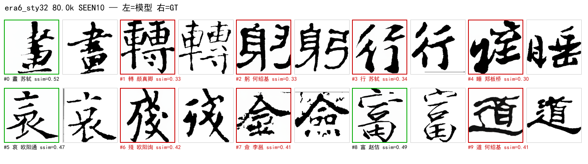
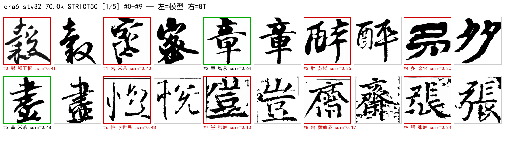
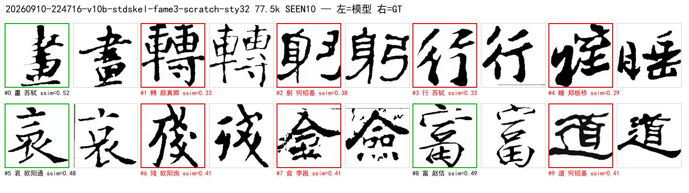

# 50. 演进复盘（2026-08-12 ~ 09-10）：从 XL 到风格 token（全面版）

状态: 覆盖项目全程 6 个纪元；**45 张里程碑 poster**（`imgs/retro/`）+ 早期 s 系图表全部编入。
图例: 单张=左模型右 GT；有严格集 poster 的 run 均已出 5 张（本文档列 p0，其余见目录）。

---

## 0. 总览时间轴

| 纪元 | 时间 | 代号 | 骨干 | 条件 | 数据 | 里程碑结果 |
|---|---|---|---|---|---|---|
| 0 | 08-12~08-31 | **XL / 3Cond**（已删） | DiT-XL/2 (675M) | `xl_highdim` | top6/top30 | v3b 0.4888；overfit 0.0005 |
| 1 | 08-16~08-25 | s2~s11 / **fame-ctrl** | pixel S/B → latent S | 结构损失/ControlNet GT-3px | top30/5书体 | **ctrl 0.8045**；cfg1.7→0.8237 |
| 2 | 08-25~09-04 | s12~s21 / **v8-chain** | S/2 latent flow | DINO / 1px GT skel / REPA | 3top30→fame v8 | s21 0.5121；**v8e 0.7761** |
| 3 | 09-04~09-07 | **v9 / v10a / v10b** | S/2（skel 作字条件） | skel-latent = char cond | fame v8 | v10a 0.8476；手写 IoU3 0.554 vs 0.194 |
| 4 | 09-07~09-09 | **fame3 / Sp / c41 / c41x** | **Sp/2 (59M)** | 41 冻结表 + xattn×12 | fame3 28k | **0.7638 / IoU 0.2227**（n=10）|
| 5 | 09-09~09-10 | **c41x_cos / cos_e** | Sp/2 | cosine 修正/增强/外挂证伪 | +85k 增强 | strict **0.568**；CFG 口径修正 |
| 6 | 09-10~ | **sty16 / sty32** | Sp/2 | **风格 token 每层注入** | 同纪元5 | sty32 strict 0.529@70k ↑（进行中）|

---

## 1. 纪元 0：XL / 3Cond（代码已删除）

**设计**：直接沿用 DiT-XL/2（hidden 1152 / depth 28 / heads 16，~675M），`xl_highdim`：
callig(384)+glyph(768) → MLP → 1152 → `c = t_emb + y_emb` 走 adaLN。同期：2Cond LoRA /
3Cond（canny+skel 结构损失）/ V3B 标准字形条件 / MIDSTEP_STD（v3c）。

| 实验 | 结果 | 判读 |
|---|---|---|
| v3b_xl_glyphcond | ssim **0.4888** @30k | XL 条件融合可行但 8× 成本 |
| exp_xl_head r8/32/64 | ~0.90（**像素重建口径**） | "重建 ≠ 生成" 首次踩坑 |
| 3Cond overfit | diff 0.0005 | 结构损失+lr3e-3+重init adaLN |

08-31 `8802e8f` 删除全部死代码（XL/LoRA/3Cond），**无产物留存，无海报**。

---

## 2. 纪元 1：S 系 + 结构损失 + ControlNet 首胜

**cfg 扫描视觉对照（base 无骨架 vs ctrl 有骨架，0.50→1.00）**：

| base（无骨架） | ctrl（GT 3px 骨架） |
|---|---|
|  |  |
|  |  |
|  |  |
|  |  |

**ControlNet 三定理**：① 条件域匹配（train/infer 骨架同源）；② cfg≤1（1.7→0.7 时 0.683→0.752）；
③ 冗余条件被门控忽略（std 骨架 Δ+0.0015）。

---

## 3. 纪元 2：v2 架构 + v8 三阶段链 + REPA

| 图 | 内容 |
|---|---|
|  | 统一模型谱系 |
|  | s20 曲线（v2 架构 +0.013） |
|  | 条件价值分解 |
|  | 设计轴（容量/条件/数据） |
|  | 实验全景 |
|  | 各代最优对照 |
|  | 像素时代回顾 |

**关键数字**：s21 0.5121（base）→ v8b ctrl Δ+0.2997@50k → v8c 0.7674 → **v8e 0.7761**；
char 条件两线（DINO 表 / IDS 码本）在此纪元被系统证伪。

---

## 4. 纪元 3：字条件之争 → skel 作为条件（v10a / v10b）

| 对比 | 结果 |
|---|---|
| v10a GT 协议曲线 | **0.8476 @127.5k**（40 点入册）|
| 手写新字遵循 IoU3 | **v10b 0.554 / v8e 0.194** |
| n=30 遵循矩阵 | v10a 0.578 ≈ v10b 0.570（char drop 无提升）|
| v10a-dino（冻结 DINO 表） | 系统性低于随机可训练表 → 净负 |

---

## 5. 纪元 4：fame3 / Sp / 41 冻结书家表 / xattn 12 层

**训练配方演进（同源样本视觉对照）**：

**主线 c41x（Sp/2 + 41 冻结表 + xattn×12）**：

---

## 6. 纪元 5：LR 修正 + 增强数据 + CFG 口径

**strict n=237 曲线**：fame3 0.5059 → Sp 0.5178 → LR 修正 0.535 → **增强+机制 0.568@390k**；
**CFG 口径**：seen 峰值 2.0（IoU 0.223→0.352，+58%），strict 不受救（0.0158→0.0182）；
c41x 在 cfg2.0 下**未平台**（0.8261/0.3517@212.5k 仍升）。callig_spatial 外挂证伪删除。

---

## 7. 纪元 6：风格 token 每层注入（sty16 / sty32，进行中）

**sty16（n=16，30k 从零）**：

**sty32（当前主线，12h run 进行中）**：

**当前实验实时总集**（每行一个 ckpt，末行 GT；训练推进中会持续刷新）：

**当前状态**：从零训练，strict 0.5109@10k → 0.5276@40k → **0.5293@70k** 上行；
风格 token 有效秩 27/32 不塌缩；LR base bug 修复后按 250k horizon / 12h ETA 运行。

---

## 8. 口径警示（跨纪元比较红线）

| 口径 | 用于 | 不可与谁比 |
|---|---|---|
| pixel 重建 | exp_xl_head ~0.90 | 一切生成口径 |
| ctrl 协议（GT 1px, cfg≤1） | v8b/v8c/v8e 0.76-0.78 | pretrain_g |
| pretrain_g / GT 协议 | v10a 0.8476 | ctrl |
| n=10 eval_auto（seen） | c41x 0.7638 | strict |
| strict n=237（新字） | 0.5059→0.568 | n=10 |
| skel_iou（精确1px） vs **IoU3**（3px） | 0.016 vs 0.2-0.3 | 两者互换 |
| **cfg 0.7 vs 2.0** | seen 差 +58% | 必须同 cfg 复测 |

---

## 9. 六条硬教训

1. **先数据后模型**：XL→S 降级 + fame3 41 家升级，瓶颈都在数据/条件密度。
2. **冗余条件必被忽略**：stdskel-ctrl +0.0015、callig_spatial ±0.002、DINO char 净负。
3. **零初始化新通路在收敛模型上高概率变死重**：结构改动要**从零**或显式 re-zero。
4. **口径不统一，一切对比作废**：重建/生成、seen/strict、cfg、IoU/IoU3 至少踩坑 5 次。
5. **"参数小" ≠ 不重要**：输入层 token-add（scale 0.19）是骨架主通路，置零即崩。
6. **评测基础设施要当产品做**：eval_ctl + 进度日志 + 自动 poster（本目录即产物）。

---

## 10. 资产索引

| 类型 | 路径 |
|---|---|
| **本复盘 poster（45 张）** | `docs/system/imgs/retro/`（17 个 run × seen + 5 run × strict×5 + sty32 live）|
| 早期 s 系图表 | `docs/system/imgs/fig1~fig7`、`poster_base/ctrl_cfg*`、`s21_base_grid` |
| poster 生成器 | `src/eval/posters.py`（daemon 自动 + CLI 回填，支持 `--prefix` 防撞名）|
| eval 托管 | `tools/eval/eval_ctl.sh`（tmux 单实例 + 进度 + status）|
| 历史详解 | 12 / 17 / 35~38 / 44 / 45~47 / 48~49 |
